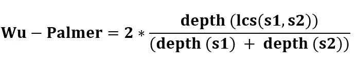

# WordNet:英语词汇分类法

> 原文：<https://towardsdatascience.com/%EF%B8%8Fwordnet-a-lexical-taxonomy-of-english-words-4373b541cfff?source=collection_archive---------10----------------------->

[梁杰森](https://unsplash.com/@ninjason)在 [Unsplash](https://unsplash.com/photos/ncLdDcvrcfw) 上的照片

## 什么是 WordNet，为什么有用？

# 介绍

就自然语言处理(NLP)而言，自动理解和分析单词的含义以及预处理文本数据可能是一项具有挑战性的任务。为了支持这一点，我们经常使用词典。词典、词库、单词本或词库是个人、语言或知识分支的词汇。我们经常将数据中的文本映射到词典，这反过来帮助我们理解这些单词之间的关系。

一个真正有用的词汇资源是 [WordNet](https://wordnet.princeton.edu/) 。它独特的语义网络帮助我们找到单词关系、同义词、语法等。这有助于支持 NLP 任务，如情感分析、自动语言翻译、文本相似性等。

这篇文章旨在展示 WordNet 的一些特性，并讨论如何获得关于语言数据的新见解。

# WORDNET

WordNet 是一个大型的英语词汇数据库。名词、动词、形容词和副词被分成称为“同义词集”的认知同义词集，每个同义词集表达一个不同的概念。同素集使用概念语义和词汇关系，如上下义关系和反义词来相互联系。

搜索单词‘书’时的 WordNet 网络— [OpenScience](https://openscience.com/wordnet-open-access-data-in-linguistics/)

在 WordNet 术语中，每组同义词都是一个同义词集，构成同义词集一部分的同义词是同一概念的词汇变体。比如上面的网络中，*神的话语，字，经文，圣令状，圣典，好书，基督教圣经*和*圣经*组成了与概念*圣经*相对应的 synset，这些形式中的每一种都是词汇变体。

WordNet 表面上看起来像一本同义词词典，它根据单词的意思将单词分组。然而，有一些重要的区别。

*   首先，WordNet 链接的不仅仅是单词形式——字母串——还有单词的特定含义。结果，在网络中发现的彼此接近的单词在语义上被消除了歧义。
*   第二，WordNet 标记单词之间的语义关系，而词库中的单词分组除了意义相似之外不遵循任何明确的模式。

# 荒野中的 WORDNET

自然语言工具包( [NLTK](https://www.nltk.org/data.html) )是一个用于 NLP 的开源 Python 库。它的伟大之处在于它附带了几个语料库、玩具语法、训练过的模型，以及这个博客感兴趣的主题 WordNet。NLTK 模块包括具有 155，287 个单词和 117，659 个同义词集的英语 WordNet。

## 导入

WordNet 可以通过以下方式从 NLTK 导入:

## 话

我们可以使用`synset()`和`synsets()`功能查找 WordNet 词典中的单词。

可以用以下形式的三部分名称定义一个 synset:

> synset = WORD。位置 NN

其中:

*   单词—您要搜索的单词。
*   词类(POS) —特定的词类(名词、动词、形容词、副词、代词、介词、连词、感叹词、数词、冠词或限定词)，单词根据其定义和上下文与之对应。
*   NN —一个感应键。一个词可以有多种含义或定义。所以“cake.n.03”是“cake”这个词的第三个名词意义。

POS 和 NN 参数是可选的。

## **定义和示例**

从前面的例子中，我们可以看到`dog`和`run`有几种可能的上下文。为了帮助理解每个词的意思，我们可以使用`definition()`函数查看它们的定义。

同样，如果我们需要在上下文中澄清一些名词`dog`和动词`run`的例子，我们可以使用`examples()`函数。

## 类似

我们还可以确定单词之间的相似度。`path_similarity()`函数通过遍历 WordNet 网络中连接两个单词的路径，返回一个表示这两个单词相似程度的分数。

WordNet 包括几种不同的相似性度量。例如，Wu & Palmer 的 similarity 通过考虑网络中两个同素集的深度以及它们最具体的祖先节点(最小公共包含器(LCS))来计算相似性。

相似性得分在 0

例如，让我们考虑动词`run`和`sprint`与名词`ship`和`boat`之间的相似性。0.86 和 0.91 的高分表明它们确实彼此相似。注意，当比较单词`ship`和`sprint`之间的相似性时，输出是 None。这意味着无法找到这些单词之间的路径。

> 为什么这在 NLP 中有用？
> 
> 语言是灵活的，人们会用各种不同的词语来描述同一件事情。因此，如果您有一个大型客户评论数据集，并且您想要提取那些讨论产品相同方面的评论，找到相似的评论将有助于缩小搜索范围。

## 上位词和下位词

上下义关系编码一个更一般的术语和它的具体实例之间的词汇关系。

一个*上位词*被描述为一个比给定单词更通用的单词。即它的上位词:如果 X 是 Y 的上位词，那么所有 Y 都是 X，比如*动物*是*狗的上位词。*

而*上下义关系*是两个概念之间的关系，其中概念 B 是概念 a 的一种类型，例如*牛肉*是*肉的下义关系。*

> 为什么这在 NLP 中有用？
> 
> 上下义关系的知识对于诸如问题回答之类的任务是有用的，其中可以建立模型来理解非常一般的概念，但是被询问特定的问题。

## 同义词和反义词

以编程方式识别准确的同义词和反义词比它应该的要困难得多。然而，WordNet 很好地解决了这个问题。

同义词是同一种语言中在某些或所有意义上具有相同或非常相似的意思的单词或表达。例如，WordNet 网络中围绕单词 *car* 的同义词有 *automobile、machine、motorcar 等。*

反义关系可以定义为表示“对立”的词汇关系。此外，直接反义词对的每个成员都与一些语义相似的形容词相关联。例如*胖*是*瘦*的反义词；*肥胖*的反义词也是*瘦*因为*肥胖*和*胖*属于同一个 synset。自然，有些词没有反义词，其他词如*推荐*只是在 WordNet 中没有足够的信息。

> 为什么这在 NLP 中有用？
> 
> 还是那句话，语言是灵活的。同义词和反义词有助于缩小相似和相反文本的搜索范围。

## 部分名和全名

*部分转喻*表达‘成分-of’关系。即两个概念之间的关系，其中概念 A 构成概念 b 的一部分。对于部分名称，我们可以利用两个 NLTK 函数:`part_meronyms()`和`susbstance_meronyms()`。例如，名词*的部分名词包括*冠*和物质名词*水*的部分名词包括*氢。**

*全同词*表示“隶属”关系，即两个概念之间的关系，其中概念 B 是概念 a 的成员。我们可以利用两个 NLTK 函数:`part_holonyms()`和`susbstance_holonyms()`。例如，名词*车*的部分全词包括*轮*和名词*木*的实体全词包括*棍。*

## 限定继承

*蕴涵*是两个动词之间的语义关系。如果 B 的意义符合逻辑并且严格地包含在 C 的意义中，则动词 C 必然包含动词 B。这种关系是单向的。比如*打鼾*需要*睡觉*，但是*睡觉*不需要*打鼾*。

## 多语言 WordNet

WordNet 也是一个非常重要的翻译资源，因为就语言数量和涵盖的单词和概念数量而言，它是当今最大的多语言词典之一。它甚至被 Google Translate 用作拥有 WordNets 的语言之间翻译过程的一部分。

目前，对于大量的语言，WordNet 有不同开发阶段的版本。这不仅包括最广泛和最著名的语言，如法语、德语、汉语、西班牙语或葡萄牙语，还包括不太知名的少数民族语言，如阿尔巴尼亚语、卡纳达语、克罗地亚语、巴斯克语、加泰罗尼亚语、加利西亚语和威尔士语。

我们可以使用`langs()`函数返回 NLTK 的 WordNet 版本中所有可用语言的列表，并搜索意大利语单词 *dog。*

> 为什么这在 NLP 中有用？
> 
> WordNet 可用于执行(粗略的)语言翻译。

# 结论

这篇文章涵盖了 WordNet 必须提供的一些主要特性，以及它独特的语义网络如何帮助支持 NLP。

关于 WordNet 特性的更多信息，请点击这里:

[https://globalwordnet.github.io/gwadoc](https://globalwordnet.github.io/gwadoc/#meronym)

[https://www.nltk.org/howto/wordnet.html](https://www.nltk.org/howto/wordnet.html)