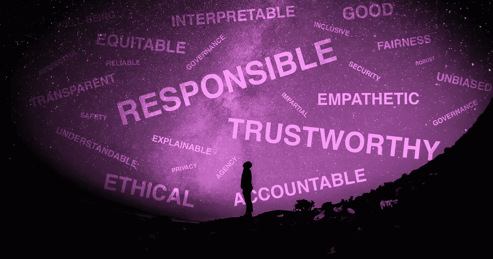
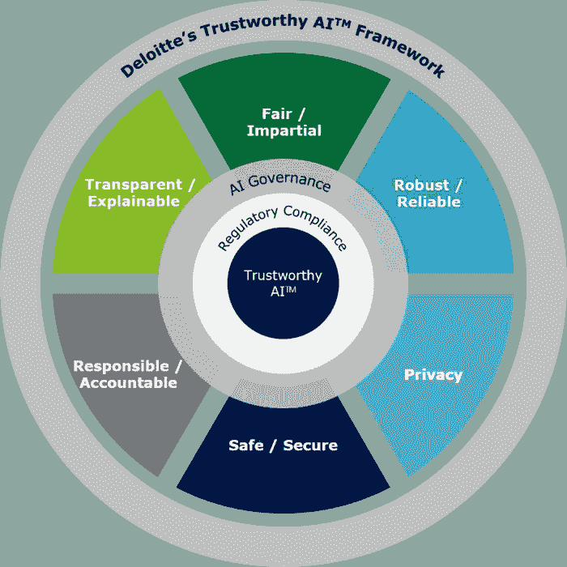

# 1001 条提高人工智能的条款不会让我们有任何进展

> 原文：<https://towardsdatascience.com/1-001-terms-for-improving-ai-wont-get-us-anywhere-8d0e433405bb?source=collection_archive---------28----------------------->

## 应对人工智能挑战的竞争性定义概述

格雷格·拉科齐在 [Unsplash](https://unsplash.com/s/photos/meditation?utm_source=unsplash&utm_medium=referral&utm_content=creditCopyText) 上的照片。作者的修改。

有很多人在努力让人工智能和机器学习变得不那么糟糕。事实上，今年早些时候，我加入了一家初创公司，该公司希望帮助人们与人工智能建立更深层次的联系，为他们提供一种更直接的方式来控制算法能为他们做什么。我们称它为“[移情人工智能](https://financialpost.com/technology/empathetic-ai-element-ai-co-founder-launching-new-platform-to-deliver-curated-online-content)”。当我们试图给这个新术语赋予意义时，我开始好奇其他团体是如何称呼他们自己提出的算法解决方案的，这些算法对我们有利而不是不利。以下是我发现的概述。

# 移情人工智能

对于我们 Waverly 来说，同理心是指让用户控制他们的算法，并帮助他们实现自己的愿望。我只找到了一家公司使用相同术语的另一个例子，但方式不同。2019 年，Pega 使用了术语[同理心 AI](https://www.pega.com/insights/articles/potential-empathetic-ai) 来销售其客户同理心顾问(Customer Empathy Advisor)解决方案，该解决方案可以帮助企业在提供销售报价之前收集客户输入。这与电子商务网站基于用户行为进行推荐的传统方法形成了对比。

尽管 Waverly 和 Pega 都认为同理心是倾听人们，而不是基于大数据集主动推荐结果，但他们方法的关键区别是谁与人工智能交互。在 Waverly，我们开发的工具旨在供用户直接使用，而 Pega 则为企业提供工具，为用户创建和调整推荐。

*N.B .同理心 AI 不应该与* [*人工同理心(AE)*](https://en.wikipedia.org/wiki/Artificial_empathy) *混淆，人工同理心是一种旨在检测和响应人类情绪的技术，最常用于机器人和虚拟助手等系统中。今天这方面的实际例子并不多，但一些值得注意的尝试是具有有限模拟情感范围的机器人宠物，如* [*Pleo*](https://www.pleoworld.com/pleo_rb/eng/index.php) *、* [*艾博*](https://us.aibo.com) *和*[*Cozmo*](https://www.digitaldreamlabs.com/pages/cozmo)*。在软件方面，有人试图根据你的* [*打字行为*](https://www.typingdna.com/focus) *或* [*语调*](https://www.bloomberg.com/news/newsletters/2020-08-31/amazon-s-halo-wearable-can-read-emotions-is-that-too-weird) *等信号来推断人类的情绪。*

# 负责任的 AI

这是投入巨资改善人工智能技术的大型组织最常用的术语。埃森哲、[微软](https://www.microsoft.com/en-us/ai/responsible-ai?activetab=pivot1%3aprimaryr6)、[谷歌](https://ai.google/responsibilities/responsible-ai-practices/)和[普华永道](https://www.pwc.com/gx/en/issues/data-and-analytics/artificial-intelligence/what-is-responsible-ai.html)都有他们定义的负责任人工智能的某种框架或原则。(有趣的是，谷歌对这个术语的解释在他们自己的搜索引擎上排在第三位。)

作者截图

以下是这些公司如何诠释负责任的人工智能概念的概述:

*   埃森哲:在人工智能解决方案中建立信任的框架。这是为了帮助防止使用有偏见的数据和算法，确保自动化决策是合理的和可解释的，并帮助维护用户信任和个人隐私。
*   **微软**:以人为本的道德原则，包括公平、可靠&安全、隐私&安全、包容、透明和责任。
*   **谷歌**:在公平、可解释、隐私和安全的原则下，指导人工智能在研究和产品中的开发和使用的道德宪章。
*   **普华永道**:一个解决责任五个维度(治理、可解释性&可解释性、偏见&公平性、稳健性&安全性、道德规范&监管)的工具包。

虽然很难从每家公司提取一个简明的定义，但结合他们在人工智能中谈论“责任”时使用的不同术语，可以让我们了解这些公司关心什么——或者至少是他们认为可以卖给客户的东西。

# 人工智能公平

你可能已经注意到，公平作为负责任的人工智能的子集反复出现，但是 IBM 有最大的资源专门用于这个概念，他们有[人工智能公平 360](https://aif360.mybluemix.net) 开源工具包。公平的定义通常是指避免系统和数据集中不必要的偏差。

鉴于公众越来越关注与偏见和包容性相关的系统性问题，公平是创造更好的人工智能最相关的概念之一也就不足为奇了。尽管对这个术语的理解似乎很广泛，但围绕公平的影响仍有很多必要的对话。最近一篇关于 HBR 的文章试图证明公平不仅仅是道德的；这也将使公司更有利可图，生产率更高。为了更好地了解人工智能编程中最微小的决定如何能够在社会中引起巨大的涟漪，请查看 Nicky Case 的精彩互动演示[多边形的寓言](https://ncase.me/polygons/)。

# 值得信赖的人工智能

2018 年，欧盟组建了一个关于人工智能的高级别专家组，通过四个交付品为其人工智能战略提供建议。2019 年 4 月，欧盟公布了第一个可交付成果，即一套[可信人工智能](https://digital-strategy.ec.europa.eu/en/library/ethics-guidelines-trustworthy-ai)的道德准则，该准则声称这项技术应该:

1.  合法——遵守所有适用的法律法规
2.  道德——尊重道德原则和价值观
3.  稳健——既从技术角度出发，又考虑到其社会环境

该指导方针进一步细分为 7 个关键要求，涵盖了机构、透明度和隐私等主题。

几乎整整一年后，德勤发布了商标为 [的*可信人工智能框架*](https://www2.deloitte.com/us/en/pages/deloitte-analytics/solutions/ethics-of-ai-framework.html)。令人失望的是，他们甚至没有提及欧盟在声称对该术语拥有所有权之前所做的大量工作。然后他们重新利用它来创造他们自己的六个维度，看起来很像其他人所说的负责任的人工智能。对他们来说，Trustworthy AI 公平公正、透明可解释、负责任、稳健可靠、尊重隐私、安全可靠。该框架甚至附带了一个图表，可以轻松添加到任何高管的 PowerPoint 演示文稿中。

图片来源:[德勤](https://www2.deloitte.com/us/en/pages/deloitte-analytics/solutions/ethics-of-ai-framework.html)

最后，在 2020 年末，Mozilla 发布了他们关于[可信人工智能](https://foundation.mozilla.org/en/insights/trustworthy-ai-whitepaper/)的白皮书，其中有他们自己的定义。

> Mozilla 将可信赖的人工智能定义为明显值得信任的人工智能，考虑责任、代理以及个人和集体福祉的技术。

尽管他们承认这是欧盟在可信度方面工作的延伸，但与 EU-建立的对可信人工智能的理解的偏离，延续了公司在沟通上不结盟的趋势。

# 可解释的人工智能(XAI)和可解释的人工智能

如果技术最终隐藏在一个黑盒子里，无法理解，那么所有这些不同的框架和原则都没有任何意义。这就是为什么上面讨论的许多框架都提到了可解释的人工智能。

这些术语指的是一个算法的代码能被理解到什么程度，以及可以用什么工具来理解它。它们经常被互换使用，比如在维基百科的页面上，可解释性被列为可解释性的一个子集。其他人有不同的观点，比如本文的作者，他讨论了两者之间的差异，并在一个光谱上提出了这些术语。

归功于[康纳·奥沙利文](https://medium.com/u/4ae48256fb37?source=post_page-----8d0e433405bb--------------------------------)

由于这些术语的技术性质，我对它们的区别的理解是有限的。然而，似乎需要在“可解释的人工智能”(XAI)和“可解释的模型”之间进行区分。上面的图表描述了算法可以基于的不同模型，而维基百科页面谈论的是更广泛的 XAI 概念。在这一点上，它感觉像是吹毛求疵，而不是为大多数人提供澄清，所以我将把这场辩论留给专家。

# 竞争的定义会让我们付出代价

当我评估所有这些术语时，我发现自己困惑多于放心。该行业正在使用在日常语言中具有相当分量的词汇，但在人工智能的背景下以相对任意的方式重新定义它们。虽然有一些共同的努力来创造共同的理解，最明显的是围绕欧盟准则，每个公司的定义的范围和重点是不同的，这可能会导致沟通和公众理解的问题。

作为一个社会，我们似乎同意我们需要符合人类最大利益的人工智能系统，但我们仍然找到了一种方法，让它成为一场比赛，看谁因这个想法而不是解决方案而获得荣誉。事实上，人工智能研究和部署公司 OpenAI(其使命是确保人工智能造福全人类)的一项分析表明，竞争压力实际上可能会推动公司在安全方面[*投资*不足，并导致集体行动问题。](https://openai.com/blog/cooperation-on-safety/)

虽然结盟是理想的，但在这个早期阶段的多样性是走向集体理解的自然一步。当务之急是，我们不要陷入试图找到让我们的公司听起来不错的术语，而是采取必要的步骤来创建为我们所有人提供有利结果的人工智能系统。

*如果你想直接在你的收件箱里收到我写的东西，* [*点击这里*💌](https://www.charliegedeon.com/)T10。