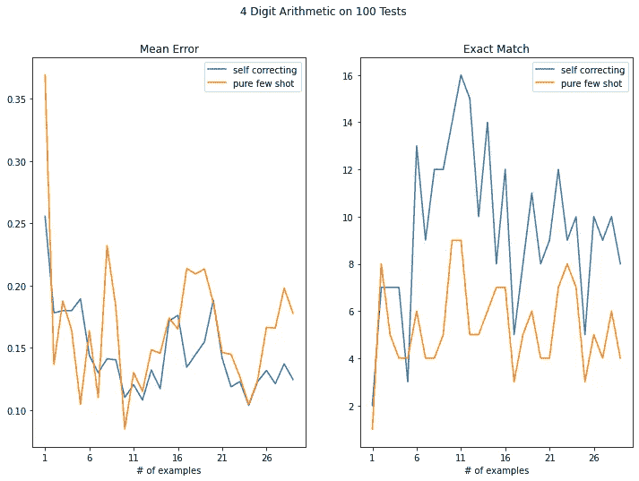
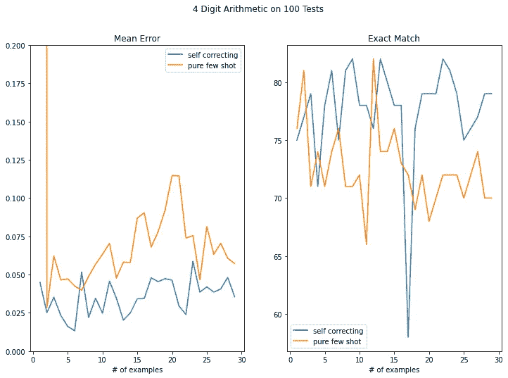

# 1+1=3.等等，不，1+1=2。如何让 GPT 自我检查？

> 原文：<https://towardsdatascience.com/1-1-3-wait-no-1-1-2-how-to-have-gpt-sanity-check-itself-136e846987bf?source=collection_archive---------31----------------------->

## *在 Colab 中使用 GPT-J 使用 GPT 仔细检查其答案的 Python 演练*

大型语言模型有一个问题，他们往往只是编造东西。这可能是因为训练数据、提示或者甚至仅仅是歧义。这可以通过设计让 GPT 健全检查其输出的提示来缓解，它可以与 GPT3 和 GPT-J 一起工作(后者可以免费使用)。

我所说的健全检查是什么意思？嗯，通过设置您的提示来仔细检查输出，结果是这样的:

```
Initial Answer: 6394 + 250 = 6643
Double Checking: 6643 looks wrong. 6394 + 250 = 6644Initial Answer: {a} + {b} =
```

与使用类似于以下内容的传统提示符相比，您可以提高性能:

```
6394 + 250 = 6644
{a} + {b}=
```

此外，对于像我一样不擅长阅读的人，你可以跳过这篇文章，只需[使用链接的 colab](https://colab.research.google.com/github/matthewlouisbrockman/LearnGPT3/blob/main/GPT_J_6B_planning_sharable1.ipynb) 使用 GPT-J 自己运行代码。

作为背景，还有一些其他方法可以用来缓解这类问题。最流行的是手动筛选你喜欢的答案。这很无聊，而且如果您试图自动化流程，这也没有什么帮助。还有另一种方法，让一个模型通过[中间步骤](http://gptprompts.wikidot.com/linguistics:word-in-context)展示它的工作，这可以[提高推理能力](https://blog.andrewcantino.com/blog/2021/05/28/how-to-dramatically-improve-the-reasoning-ability-of-GPT-3/)，这很酷。然而，我认为值得看一看自我纠正，看看 GPT 能在多大程度上审视它所发表的内容，并决定它是否需要改进，因为人们似乎没有深入研究它(尽管去年有一些有趣的关于猜测和检查随机代数解决方案的很酷的推文)。

举个玩具例子，我用算术。为什么是算术？首先，我们可以衡量一个答案是否正确，知道这一点是有好处的。第二，虽然有一种说法认为语言模型在算术上表现不佳的原因是由于 GPT 令牌的编码方式，但我怀疑多位算术存在搜索问题，你必须从右到左进行加法才能携带数字，当你只是提前预测时，很难猜测数字会被携带到哪里。GPT 不擅长这种类型的搜索，如果搜索导致了这个问题，那么做双重检查应该会有所帮助。

总之，在这篇文章中，我将向您展示如何生成包含 1-30 个示例的上下文，使用标准的少数镜头和改进的自检少数镜头运行它们的完成，然后我们将绘制错误(图 1)并看到，与传统的少数镜头相比，自检提示确实具有更低的错误和更高的精确匹配。下面是图表的样子(注意，对于精确匹配，我们获得了 16%的最高准确率，而使用逗号的 GPT3 可以获得超过 90%的最高准确率，所以可能会有很大的差异)。



图 1:在使用 GPT-J 的 4 位数算术中，与常规的少量尝试相比，自校正提示具有更低的平均绝对百分比误差(左)和更高的精确匹配(右)

## 设置查询功能

这适用于 GPT-J 和 GPT-3 模型，您只需以不同的方式设置您的查询函数，这就是我们将要开始的地方。当我们查询这类任务的完成情况时，我们希望使用 0 temperature，因为我们希望获得最有可能的令牌，而不是随机加入其他数字。下面是我在 J 中的查询函数的样子(借用了 [GPT-J 演示笔记本](https://colab.research.google.com/github/kingoflolz/mesh-transformer-jax/blob/master/colab_demo.ipynb)中的 infer 函数，这个函数很酷):

```
def query(context, top_p=0, temp=0, gen_len=50):
  tokens = tokenizer.encode(context)
  provided_ctx = len(tokens)
  pad_amount = seq - provided_ctx
  padded_tokens = np.pad(tokens, ((pad_amount, 0),)).astype(np.uint32)
  batched_tokens = np.array([padded_tokens] * total_batch)
  length = np.ones(total_batch, dtype=np.uint32) * len(tokens)
  output = network.generate(batched_tokens, length, gen_len, {"top_p": np.ones(total_batch) * top_p, "temp": np.ones(total_batch) * temp})
  samples = []
  decoded_tokens = output[1][0]
  for o in decoded_tokens[:, :, 0]:
    samples.append(tokenizer.decode(o))
  return samples[0]
```

**设置提示**

现在，我们将继续设置我们的提示。我们将随机创建 30 个例子作为提示，100 个例子作为测试集。

```
import pandas as pd, json, randomrandom.seed(42)fourDigitDict = []
fourDigitTest = []for i in range(30):
  a = int(random.random()*10**4)
  b = int(random.random()*10**4)
  fourDigitDict.append({'first': a, "second": b, 'sum': a+b})
fourDigitTrainDF = pd.DataFrame(fourDigitDict)for i in range(100):
  a = int(random.random()*10**4)
  b = int(random.random()*10**4)
  fourDigitTest.append({'first': a, "second": b, 'sum': a+b})
fourDigitTestDF = pd.DataFrame(fourDigitTest)
```

对于纯/传统的情况，我们只是让所有的例子都按照提示排列起来，但是我们在这里要做的自我纠正是随机设置一些错误的例子。我们将错误的答案(或正确的答案)称为*原始总和*，这样我们可以告诉模型稍后将其纠正为正确的答案。

```
fourDigitTrainDF['randomlyWrong'] = fourDigitTrainDF['sum'].apply(lambda x: random.random() < .5)fourDigitTrainDF['offset'] = fourDigitTrainDF['randomlyWrong'].apply(lambda x: .5-random.random() if x==True else 0)fourDigitTrainDF['offset'] = fourDigitTrainDF['offset'] * 2000fourDigitTrainDF['originalSum'] = fourDigitTrainDF['sum'] + fourDigitTrainDF['offset']
```

接下来，我们只需创建我们的提示。我们将有一组提示，一组是关于纯粹的几个镜头，另一组是关于修正后的镜头。为了了解我们需要多少个示例，我们将进行网格搜索，并从 1 到 30 个示例中尝试运行。

```
correctionPrompts = {}
purePrompts = {}for i in range(1,30):
  correctionPrompt = ""
  purePrompt = ""
  for row in fourDigitTrainDF[:i].iterrows():
    correctionPrompt += 'Initial Answer: {} + {} = {}'.format(row[1]['first'], row[1]['second'], int(row[1]['originalSum']))
    correctionPrompt += '\n'
    interjection = 'looks correct.' if not row[1]['randomlyWrong'] else 'looks off by a bit.'
    correctionPrompt += 'Double Checking: {} {} {} + {} = {}'.format(int(row[1]['originalSum']), interjection, row[1]['first'], row[1]['second'], row[1]['sum'])
    correctionPrompt += '\n\n' purePrompt += '{} + {} = {}'.format(row[1]['first'], row[1]['second'], row[1]['sum']) + '\n'

  correctionPrompt += 'Initial Answer: '
  correctionPrompts[i] = correctionPrompt
  purePrompts[i] = purePrompt
```

现在我们已经设置好了所有的提示，是时候对照测试集来试试了！

**运行测试**

为了运行测试，我们将开始设置实际的查询(a + b =)，然后将它添加到每个提示的末尾(有无自我纠正)。然后，我们将运行整个程序，并在它执行 6000 次查询时袖手旁观。我们还会在每次检查测试集时将它转储到 JSON，以防出现问题，以便我们可以恢复。

```
import json
fourDigitTestDF['formatted'] = fourDigitTestDF.apply(lambda x: "{} + {} =".format(x['first'], x['second']), axis=1)correctionResults = {}
pureResults = {}#for each size of example length in 1-30, run on the test set
for trainSize in range(1,30):
  if trainSize not in correctionResults:
  print(trainSize)
  correctionResults[trainSize] = []
  pureResults[trainSize] = []
  for example in fourDigitTestDF.formatted:
    correctionResults[trainSize].append( query(correctionPrompts[trainSize]+example, gen_len=50))
  pureResults[trainSize].append(
query(purePrompts[trainSize]+example, gen_len=50))
  with open('correctionResults.json', 'w') as fh:
    json.dump(correctionResults, fh)
  with open('pureResults.json', 'w') as fh:
    json.dump(pureResults, fh)
```

**评估**

好，现在我们有了 6000 份文件，我们将对其进行评估。我首先将测试集重命名为 *test* ，因为……为什么不呢。由于我还不知道如何用 GPT J 做一个停止序列(我的学位是新闻学，数学很难)，我们必须解析出我们想要的答案。对于传统的方法，这只是出门的第一个“字”。对于自校正方法，它是第一组输出的最后一个“单词”。

```
def parsePureInt(x):
  base = x.split('\n')[0]
  try:
    return int(base)
  except:
    return 0def parseCorrectedInt(x):
  base = x.split('\n\n')[0].split(' ')[-1]
  try:
    return int(base)
  except:
    return 0
```

现在我们将把它应用到我们所有的结果中，并计算误差。

```
for key in pureResults.keys():
  test[key] = pureResults[key]
  test[key] = test[key].apply(lambda x: parsePureInt(x))pureMape = pd.DataFrame()
  for col in test.columns[3:]:
  pureMape[col] = (abs(test[col] - test['sum']))/test['sum']pureEM = pd.DataFrame()
for col in test.columns[3:]:
  pureEM[col] = test[col] == test['sum']for key in correctionResults.keys():
  test[key] = correctionResults[key]
  test[key] = test[key].apply(lambda x: parseCorrectedInt(x))correctedMape = pd.DataFrame()
for col in test.columns[3:]:
  correctedMape[col] = (abs(test[col] - test['sum']))/test['sum']correctedeEM = pd.DataFrame()
  for col in test.columns[3:]:
  correctedeEM[col] = test[col] == test['sum']
```

现在我们只是绘制结果

```
fig, axs = plt.subplots(ncols=2, nrows=1, figsize=(12,8), facecolor='white')
correctedMape.mean().plot(label='self correcting', ax=axs[0])
pureMape.mean().plot(ax=axs[0], label='pure few shot')
axs[0].legend()
axs[0].set_xlabel('# of examples')
axs[0].set_title('Mean Error')correctedeEM.sum().plot(label='self correcting', ax=axs[1])pureEM.sum().plot(ax=axs[1], label='pure few shot')
axs[1].legend()
axs[1].set_xlabel('# of examples')
axs[1].set_title('Exact Match')
fig.suptitle('4 Digit Arithmetic on 100 Tests')
```


图二。等等，不对，还是图 1。

**在关闭**

你可以用 GPT3 和 J 运行上面的代码，你会得到同样的改进。我把它作为一个练习留给读者，让他们也用逗号来做这件事(您可以只使用 f " { x:} "来格式化带有逗号的内容)。不过，它能工作真的很酷。



同样，如果你在 GPT3 中使用逗号，你会得到更多类似的东西，这取决于模型大小/微调。虽然不确定在 17 个例子中发生了什么。

我认为这里发生的事情是，因为它不能提前预测，有时它开始制造随机数字，直到它到达末尾，然后这给了它检查下一次应该是什么前几个数字的上下文。虽然我不完全确定。这些模型很奇怪。