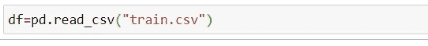
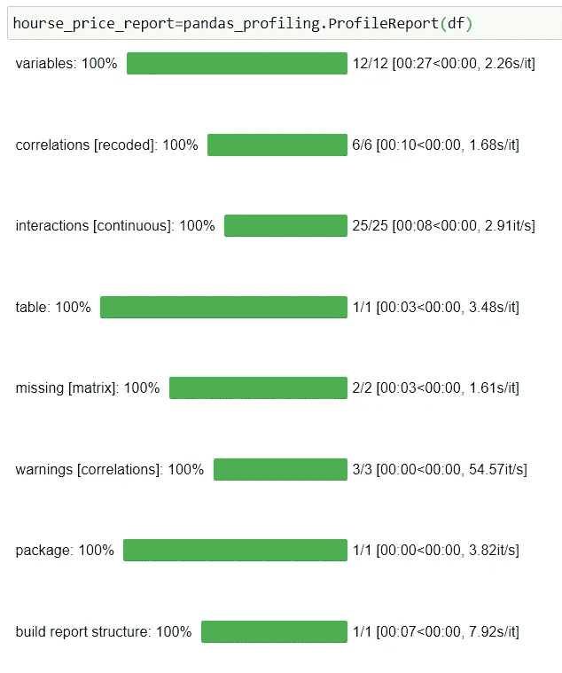
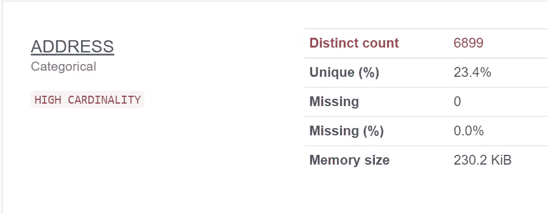
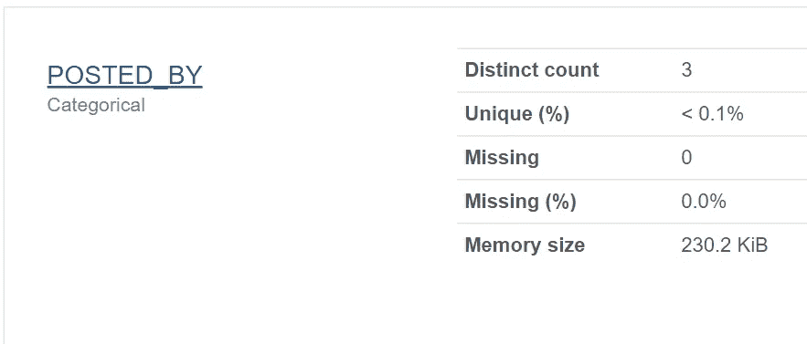
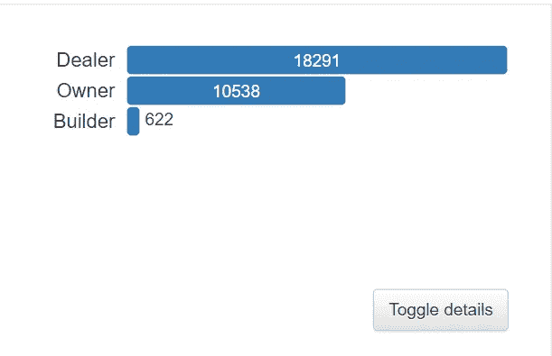
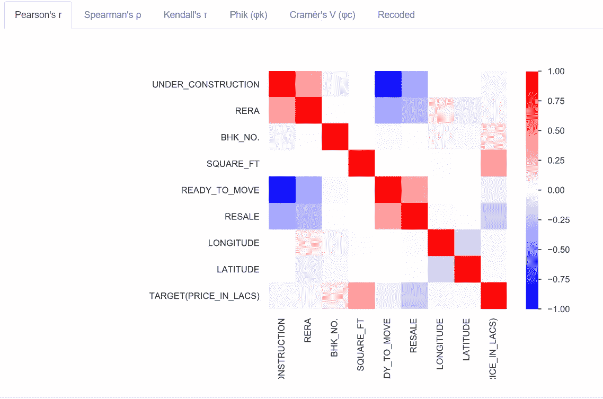
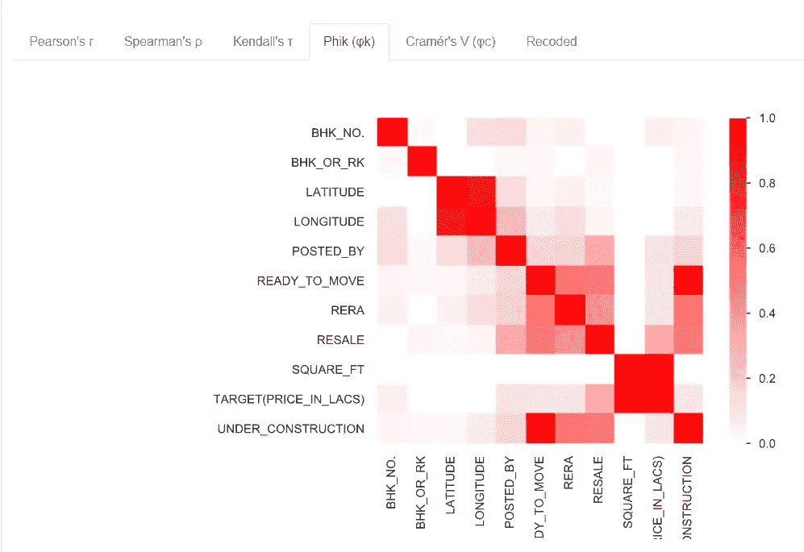
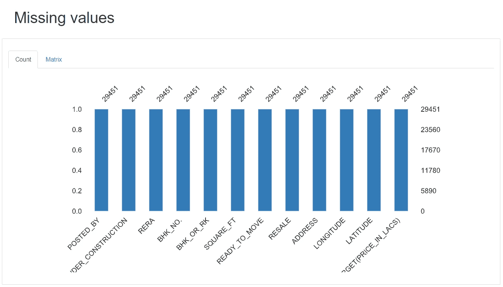
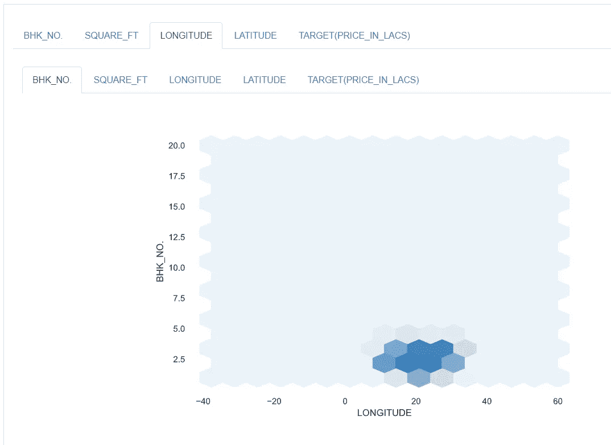

# 一行用于数据分析的 Python 代码

> 原文：<https://towardsdatascience.com/1-line-of-python-code-for-data-profiling-660496883d8f?source=collection_archive---------7----------------------->

## 现在，您不需要编写数百行代码


[米米·蒂安](https://unsplash.com/@mimithian?utm_source=medium&utm_medium=referral)在 [Unsplash](https://unsplash.com?utm_source=medium&utm_medium=referral) 上的照片

Python 是程序员和数据科学家最常用的编程语言之一。程序员喜欢 Python，因为它的程序员友好的行为。数据科学家热爱 Python，因为大多数机器学习和深度学习库都有 Python 版本。

当我们谈论程序员或数据科学家时，在现实世界中，当我们为任何项目或客户工作时，我们都需要理解数据。数据是每个行业的决定性因素。我们需要应用不同的编程逻辑、分析和进一步的建模练习来了解数据。

分析数据并使数据适合您的任务花费了大量时间。在 python 中，我们有一个库，可以在一行 python 代码中创建端到端的数据分析报告。

本文将介绍这个库，它可以在一行代码中为我们提供详细的数据分析报告。你唯一需要的就是数据！

# 熊猫 _ 简介

`pandas_profiling`是最著名的 python 库之一，程序员可以用一行 python 代码立即获得数据分析报告。

## 装置

要安装该库，可以使用 pip 命令，如下所示。

```
pip install pandas_profiling
```

## 导入库

一旦安装了`pandas_profiling`,我们可以使用下面的 import 命令导入这个库。

```
import pandas_profiling
import pandas as pd
```

我们将使用[熊猫](https://pandas.pydata.org/)来导入数据集。

## 关于数据

在这篇文章中，我们将使用开源房价数据。数据可以从[这里](https://www.kaggle.com/anmolkumar/house-price-prediction-challenge/tasks?taskId=2304)下载。



导入数据集


数据快照

## 获取数据分析报告

一旦我们准备好数据，我们就可以使用一行 python 代码来生成数据分析报告，如下所示。

```
hourse_price_report=pandas_profiling.ProfileReport(df)
```

运行下面的命令后，您将看到进度条根据特定参数生成数据分析报告。



生成数据分析报告

# 将报告保存为 HTML 格式

成功生成报告后，我们可以将报告保存为 HTML 文件并与其他人共享。

您可以使用下面一行代码将报告保存为 HTML 格式。

```
hourse_price_report.to_file('house_report.html')
```

# 您可以从数据分析报告中获得什么

> 总体数据摘要


作者截图

> 每个变量的详细信息



作者截图



作者截图

> 变量之间每个相关性的详细可视化



作者截图



作者截图

> 缺失值计数



作者截图

> 不同种类的互动



作者截图

以及更多关于数据理解的激动人心的细节。

# 最终结束点

我们已经看到了一行 python 代码如何帮助我们提供详细的数据分析报告。

性能分析报告可以为我们提供数据的总体摘要、关于每个特性的详细信息、组件之间关系的可视化表示、关于缺失数据的详细信息，以及许多有助于我们更好地理解数据的有趣见解。

更多精彩文章敬请期待。我通常写编程和数据科学的实践方面。

> 感谢您的阅读！

> *在你走之前……*

如果你喜欢这篇文章，并希望**继续关注**更多关于 **Python &数据科学**的**精彩文章**——请点击这里[https://pranjalai.medium.com/membership](https://pranjalai.medium.com/membership)考虑成为一名中级会员。

请考虑使用[我的推荐链接](https://pranjalai.medium.com/membership)注册。通过这种方式，会员费的一部分归我，这激励我写更多关于 Python 和数据科学的令人兴奋的东西。

还有，可以随时订阅我的免费简讯: [**Pranjal 的简讯**](https://pranjalai.medium.com/subscribe) 。