# 创建黑仔视觉效果必须知道的 10 个高级 Matplotlib 概念

> 原文：<https://towardsdatascience.com/10-advanced-matplotlib-concepts-you-must-know-to-create-killer-visuals-9a32d241e31d?source=collection_archive---------1----------------------->

## [窍门和技巧](https://towardsdatascience.com/tagged/tips-and-tricks)

## 成为 Matplotlib 忍者


**拍照由** [**Joycoast Wood 手表&太阳镜**](https://unsplash.com/@joycoast?utm_source=unsplash&utm_medium=referral&utm_content=creditCopyText) **上** [**防溅**](https://unsplash.com/s/photos/men%20in%20suit?utm_source=unsplash&utm_medium=referral&utm_content=creditCopyText) **。除非另有说明，所有图片均为作者所有。**

其实根本没有什么*高级* Matplotlib 用户。问题只是谁在文档上花了更多的时间，并且实践了他们所阅读的内容。

所以，如果你的目标是成为一名“高级 Matplotlib 用户”，那么在你的道路上只有两个障碍。第一——花几个小时沉浸在 Matplotlib 文档中，第二——接触每一个遇到的代码块。我的工作是通过教授一些你只会在 10 分钟内看到专业人士使用的关键概念，让你跳过第一个障碍。

# 1️⃣.rcParams

让我们从最高层的概念开始。

我们清单上的第一个是字典。它包含所有用于创建图形默认样式的 Matplotlib 设置。您直接从`matplotlib`名称空间导入它:

在处理不同的项目时，您将不得不在不同的环境中为不同的受众呈现图表。基于这一点，你必须事先修改这本字典，这样你未来的视觉效果才会有一致的主题和风格。这也将节省时间，因为您可以避免每次创建新的绘图时调用相同的参数。

如果你搞砸了什么或者想回到默认状态，你可以调用 PyPlot 的`rcdefaults`函数，它会重置一切。

```
>>> plt.rcdefaults()
```

[](https://ibexorigin.medium.com/membership) [## 通过我的推荐链接加入 Medium-BEXGBoost

### 获得独家访问我的所有⚡premium⚡内容和所有媒体没有限制。支持我的工作，给我买一个…

ibexorigin.medium.com](https://ibexorigin.medium.com/membership) 

获得由强大的 AI-Alpha 信号选择和总结的最佳和最新的 ML 和 AI 论文:

[](https://alphasignal.ai/?referrer=Bex) [## 阿尔法信号|机器学习的极品。艾总结的。

### 留在循环中，不用花无数时间浏览下一个突破；我们的算法识别…

alphasignal.ai](https://alphasignal.ai/?referrer=Bex) 

# 2️⃣.Get_*函数

实际上，Matplotlib 是完全面向对象的。

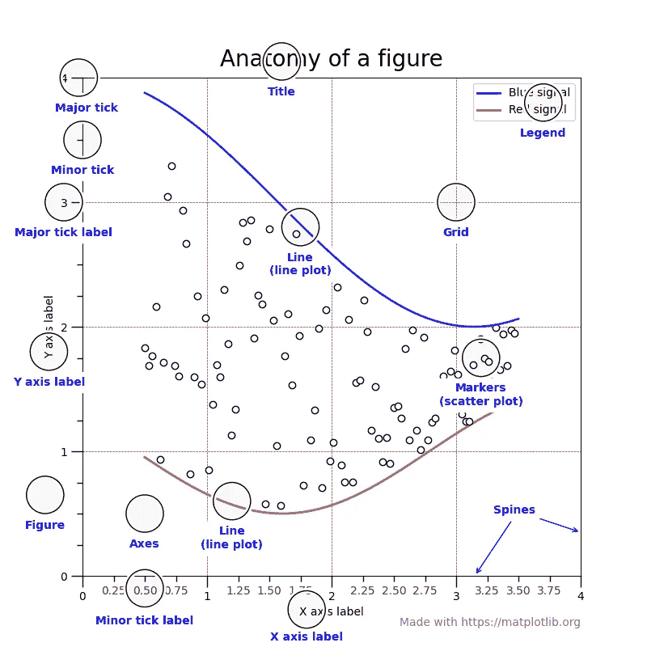

来自 Matplotlib 文档的图像

你在上图中看到的每个组件都是作为一个单独的类实现的。它们都继承自名为 Matplotlib Artist 的基类。这就是为什么你会经常在 MPL 文档中读到这个词。

为一个情节的每一个方面创建一个单独的类会带来一定程度的复杂性，但是它也给了你很大的灵活性。

一个伟大的情节的关键是定制。不仅仅是对剧情的简单改动，而是最深层次的定制。你应该能够调整你的视觉效果的每一个组成部分，使之符合你的品味、主题和专业性。

为了实现这一点，您应该知道如何提取您想要定制的组件。幸运的是，Matplotlib 有许多以`get_`前缀开始的函数，这允许您从创建的图形或轴中检索不同的类。这里有一个例子:

假设您想要定制该图的 xticks:

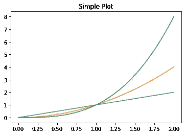

这很简单，只需在 axes 对象上调用`get_xticklabels`，就可以得到 Matplotlib `Text`实例的列表:

您也可以使用`get_xticklines`调整刻度线，或使用`get_xticks`调整刻度的位置。

你可能想知道，我们实际上如何调整这些对象？我们将在下一节回答这个问题。

# 3️⃣.获取/设置

一旦有了想要定制的组件，就应该知道它们接受什么属性或参数。这是你使用两把瑞士军刀的地方。

首先，在你的对象上调用`plt.getp`函数，看看它当前有什么参数。例如，假设我们想要对下面的图`l2`进行样式化:

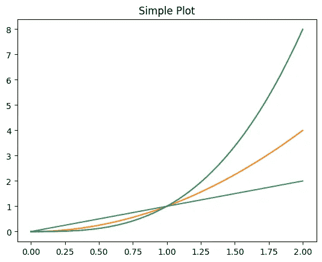

如您所见，我将每个线图存储在一个单独的变量中，以备后用。现在，我们在第二行`l2`上调用`plt.getp`:

不出所料，该函数打印出了`l2`的默认值。要改变一个属性，我们将使用另一个函数- `plt.setp`。在不带任何参数的对象上调用此函数会打印出该对象接受的属性值:

要仅打印单个属性的可能值，您可以将属性名称作为字符串提供给`setp`:

现在，让我们最后对第二行做一些修改:

要查看更改后的当前图形，只需调用图形对象上的`get_figure`:

```
>>> fig.get_figure()
```

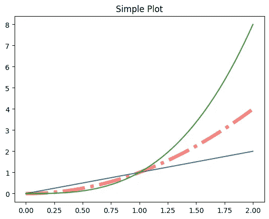

如你所见，第二行与其余的完全不同。

简而言之，如果您想要设置绘图中特定组件的样式，您应该遵循以下步骤:

1.  通过直觉或者 MPL 的文档来识别元素的名称。
2.  使用相关的`get_*`函数提取它
3.  用`plt.getp`查看其当前属性
4.  用`plt.setp`找出每个属性可能接受的值
5.  用同一个函数改变你想要的参数。

# 4️⃣.传说

图例是具有许多不同组件的复杂图的组成部分。一个好的情节不会让它的观众去猜测，而在一个传奇故事中提供准确和“容易理解”的信息是实现这一点的关键。

幸运的是，您可以仅使用 PyPlot API 中的`plt.legend`或 OOP API 中的`ax.legend`中的`legend`函数来控制任何绘图的图例。调用不带参数的函数会创建一个带有默认值的图例:

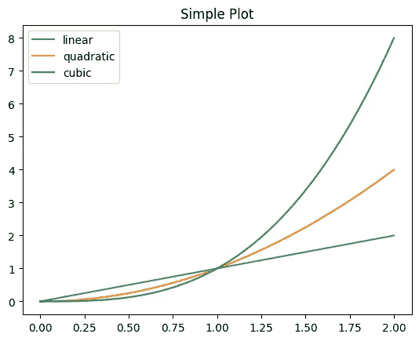

然而，正如我所说的，我们希望定制每个组件，使它们尽可能漂亮，当涉及到 Matplotlib 默认值时，我们很少能这么说。

所以我建议看一下`legend`函数的 Matplotlib 文档([链接](https://matplotlib.org/stable/api/_as_gen/matplotlib.pyplot.legend.html))。然而，我认为传奇最重要的参数是:

*   `loc` -图例的位置
*   `bbox_to_anchor` -另一个位置参数，特定于图例的舍入框(详情请阅读文档)
*   字体属性—大小、颜色、样式
*   `ncol` -当有许多元素时，图例中的列数

也可以在创建图例后更改这些参数。只需用`get_legend`提取并使用`getp`、`setp`功能。

# 5️⃣.骑机车者

你有没有想过 Matplotlib 是如何改变它的颜色或者自己在不同的风格中循环的？

原因是，在幕后，Matplotlib 使用 Python 内置的称为 Cyclers 的对象:

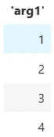

`cycle`功能非常通用。它接受任何键值参数，并创建一个字典列表:

此外，您可以使用“加”和“乘”运算符组合多个循环，以获得参数的索引到索引或穷举组合:

现在我们知道了什么是循环程序，我们可以创建自定义的循环程序并将它们传递给我们的绘图，这样 Matplotlib 就只循环我们指定的参数。下面，我们创建四种不同的线条样式，允许 Matplotlib 在不同的线条颜色、样式和粗细之间循环:

您可以使用 axes 对象的`set_prop_cycle`功能将该自定义循环程序传递给绘图:

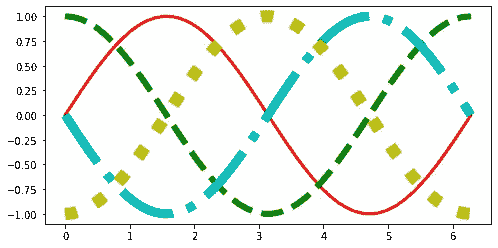

如你所见，正弦波的线条完全不同。

创建循环程序时，它们的每个参数和值都必须与 Matplotlib 对齐。例如，要创建一个迭代不同颜色的 cycler，您应该知道 Matplotlib 允许它的绘图使用哪种颜色。

您也可以将您的自定义循环仪添加到`rcParams`字典中。以下是默认值:

```
>>> rcParams["axes.prop_cycle"]
```

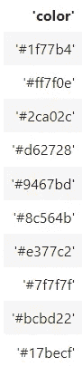

# 6️⃣.刻度参数

我提出的关于图例的所有论点都适用于轴刻度。轴刻度应准确传达数据点的最小值和最大值及其单位，并显示几个关键检查点，以便在不同的绘图部分之间进行比较。

如图例所示，大多数刻度属性可以通过 axes 对象的`tick_params` ( [docs link](https://matplotlib.org/stable/api/_as_gen/matplotlib.axes.Axes.tick_params.html) )函数来控制。以下是其中的几个例子:

您应该始终指定的第一对参数是`axis`和`which`。根据这些参数，您设置的参数将应用于 X 轴或 Y 轴刻度以及次要或主要刻度。

顺便说一句，大多数时候，小记号在 Matplotlib 中是不可见的。要快速打开它们，使用轴对象上的`minorticks_on`功能:

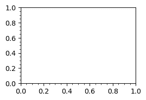

这里有一个[很棒的资源](https://e2eml.school/matplotlib_ticks.html)，它展示了关于`tick_params`函数的更多信息。

# 7️⃣.心脏

有时，您不想麻烦地给出定制的 tick 参数。在这种情况下，您可以使用许多内置的 Matplotlib 的 tick 参数“主题”集合，称为**ticker**。

如你所见，在`ticker`子模块下有很多。我建议使用文档浏览一下它们，了解一下它们各自的功能。

一般来说，标题中带有`Locator`的按钮控制刻度的位置。`Formatter`让您设计刻度标签的样式。通常，您会根据自己的需要使用一对定位器和格式化器。一旦您从上面的列表中选择，您可以通过以下方式将它们传递到您的绘图:

使用 axes 对象的`xaxis`或`yaxis`属性，并调用`set_major(minor)_formatter(locator)`函数，传入类名。上面，我们使用*工程*符号来格式化 X 轴记号。

# 8️⃣.添加自定义网格

一些情节中最微妙但最有影响力的元素之一是网格线。

一个经验法则是，当图中的水平和垂直变化会向上下文传达额外的含义时，创建网格。例如，当图中有许多条时，水平网格很有用。

在 Matplotlib 中，您可以使用 axes 对象的`grid`函数创建和定制网格。下面是一个难看的垂直网格示例:

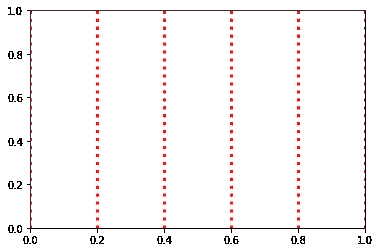

我建议你阅读[文档](https://matplotlib.org/stable/api/_as_gen/matplotlib.pyplot.grid.html)了解详情。

# 9️⃣.plt.bar_label()

条形图在数据分析过程中很常见。他们最重要的方面是每个酒吧的高度，所以你需要让你的观众容易区分每个酒吧。这就是你需要使用条形标签的地方。

您可以使用一些算术计算在每个条上方放置一个文本注释来手动完成此操作，但是有一种更好的方法。`bar_label`函数接受一个 BarContainer 对象作为参数，并自动用它的高度标注每个条。

这是一个简单的 Seaborn 计数图:

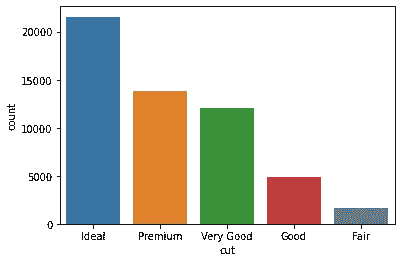

每次使用 Seaborn 或使用类似于`ax.bar`的函数创建柱状图时，`BarContainer`对象都会被添加到一个图中。然后，您可以使用 axes 对象的`containers`属性来检索这个容器对象:

```
>>> ax.containers[<BarContainer object of 5 artists>]
```

如您所见，上面的列表中有一个包含 5 个小节的 BarContainer 对象。现在，我们只需在创建情节后将该对象传递给`bar_label`:

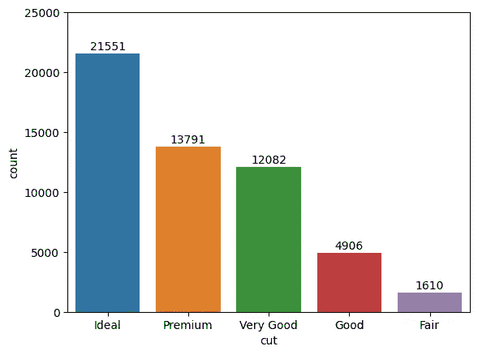

请注意，当条形标签变得狭窄时，您需要修正轴限制。

# 1️⃣0️⃣.佐德

最后，我们还有另一个微妙的方面——显示顺序。当你叠加不同的情节时，这是一个重要的概念。你需要确保每一个情节都以正确的顺序绘制在画布上。要实现这一点，您需要`zorder`参数。

下面，我们用不同的 zorders 创建三行(取自文档):

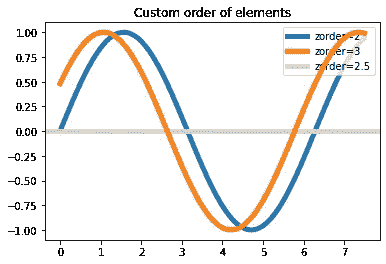

效果清晰可见。如果你注意的话，图例的 zorder 是用`set_zorder`函数指定的，这也是可以接受的。此外，您还可以使用之前的`plt.setp`功能更改任何对象的排序。

# 摘要

我告诉过你什么？所有这些都非常简单。现在，悲伤的部分来了。

你可以掌握每一个 Matplotlib 函数和类，但你仍然不是 Leonardo da Matplotlib。很抱歉，在你开始画这样的东西之前，还需要几个月的时间:

[](https://ibexorigin.medium.com/yes-these-unbelievable-masterpieces-are-created-with-matplotlib-2256a4c54b12) [## 是的，这些令人难以置信的杰作是用 Matplotlib 创作的

### 编辑描述

ibexorigin.medium.com](https://ibexorigin.medium.com/yes-these-unbelievable-masterpieces-are-created-with-matplotlib-2256a4c54b12) 

问题不在于你知道多少功能和“高级”概念，而在于你如何使用它们。

[](https://ibexorigin.medium.com/membership)

## 在你离开之前，这里有一些我的读者喜欢的帖子。查看它们:

[](/comprehensive-guide-on-multiclass-classification-metrics-af94cfb83fbd) [## 多类分类指标综合指南

towardsdatascience.com](/comprehensive-guide-on-multiclass-classification-metrics-af94cfb83fbd) [](/25-numpy-functions-you-never-knew-existed-p-guarantee-0-85-64616ba92fa8) [## 你从来不知道存在的 25 个 NumPy 函数| P(保证= 0.85)

### 成为一名忍者

towardsdatascience.com](/25-numpy-functions-you-never-knew-existed-p-guarantee-0-85-64616ba92fa8) [](/7-cool-python-packages-kagglers-are-using-without-telling-you-e83298781cf4) [## Kagglers 正在使用的 7 个很酷的 Python 包

### 让我来揭示秘密…

towardsdatascience.com](/7-cool-python-packages-kagglers-are-using-without-telling-you-e83298781cf4) [](/how-to-work-with-million-row-datasets-like-a-pro-76fb5c381cdd) [## 如何像专家一样处理百万行数据集

towardsdatascience.com](/how-to-work-with-million-row-datasets-like-a-pro-76fb5c381cdd) [](/why-is-everyone-at-kaggle-obsessed-with-optuna-for-hyperparameter-tuning-7608fdca337c) [## 为什么 Kaggle 的所有人都痴迷于 Optuna 进行超参数调优？

towardsdatascience.com](/why-is-everyone-at-kaggle-obsessed-with-optuna-for-hyperparameter-tuning-7608fdca337c)