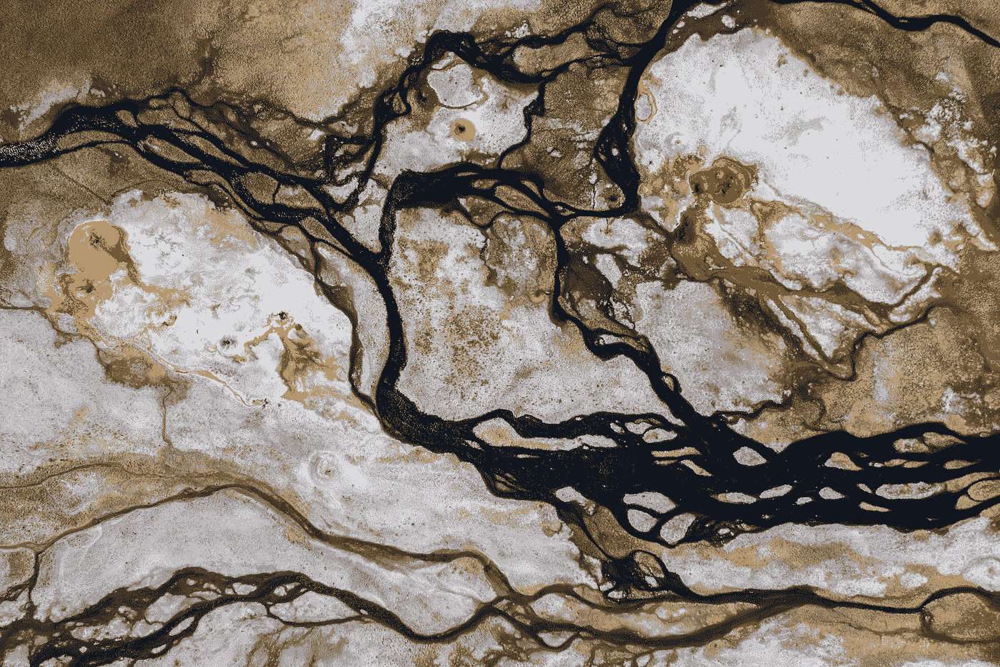
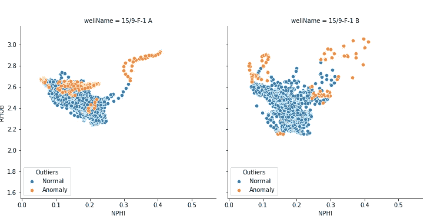
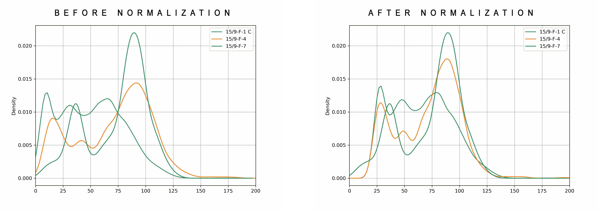
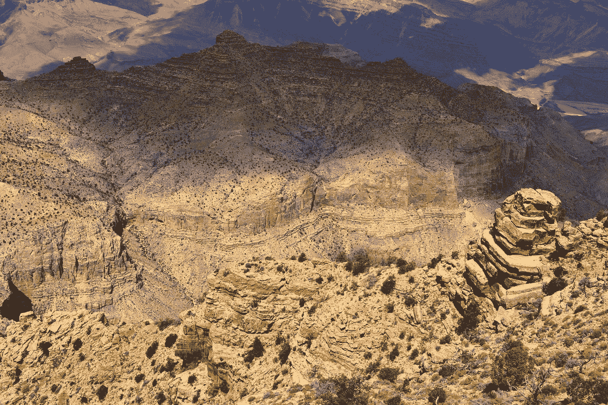
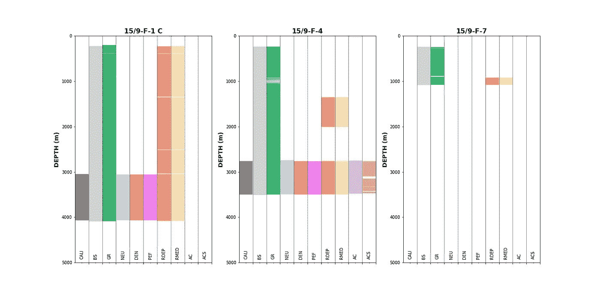
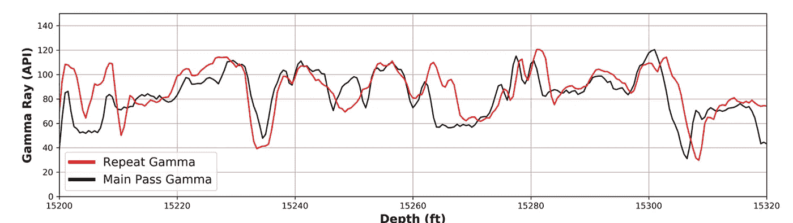
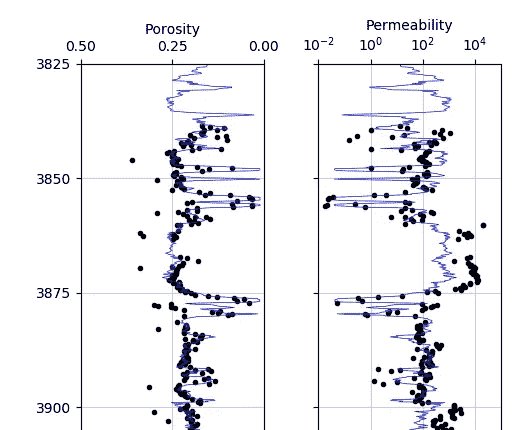
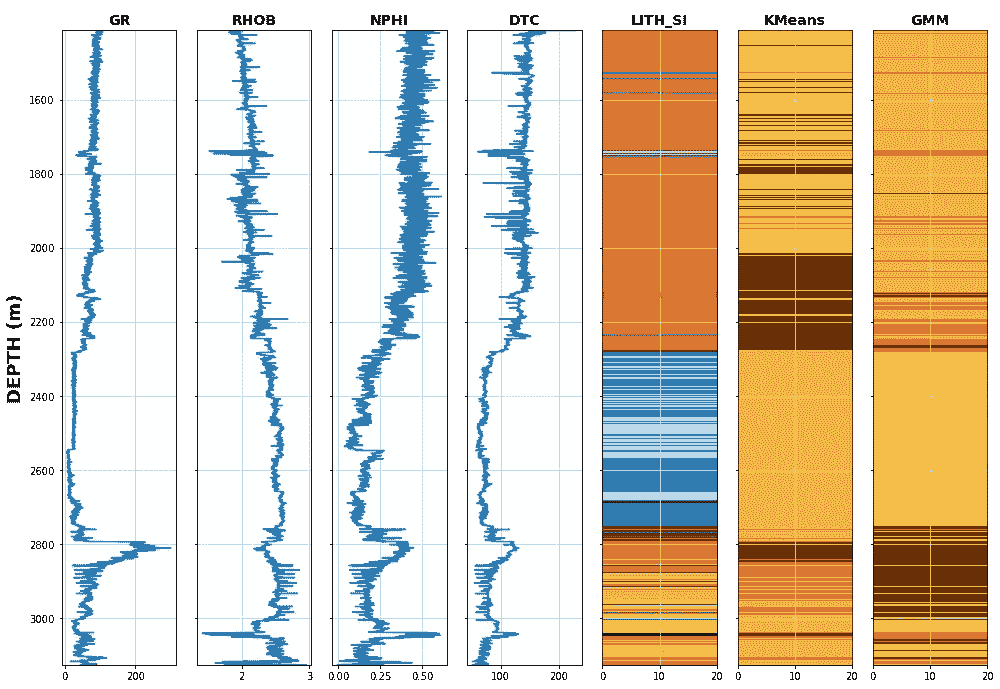

# 岩石物理学中机器学习的 10 个应用

> 原文：<https://towardsdatascience.com/10-applications-of-machine-learning-within-petrophysics-3709b1c4323a?source=collection_archive---------6----------------------->

## 增强岩石物理工作流程的机器学习示例

丹·梅耶斯在 [Unsplash](https://unsplash.com?utm_source=medium&utm_medium=referral) 上的照片

几十年的油气勘探已经导致了大量与井相关的测量数据的采集和存储，这些数据已被用于表征地下地质及其油气潜力。随着计算能力的提高和新机器学习算法的采用，这些大量数据的潜力在过去几十年中得到了越来越多的利用。在岩石物理领域，机器学习已被用于加快工作流程、将地质特征划分为离散电相、进行预测等等。

这篇文章的内容于 2021 年 9 月在伦敦岩石物理学会上发表，我的 YouTube 频道上有该演讲的修改版本。一定要喜欢，订阅它更多这样的内容。

# 什么是岩石物理学？

岩石物理学是一门研究岩石的物理和化学性质及其与所含流体相互作用的学科。它是石油和天然气行业中的一个主要学科，旨在了解和量化储层中可移动碳氢化合物的性质和数量。导出的属性包括孔隙度(可用于储存碳氢化合物的储存空间的数量)、渗透率(孔隙相互连接的程度)和水饱和度(充满水的孔隙空间的数量，这反过来可用于计算碳氢化合物饱和度。

岩石物理项目包括分析井下测井工具获得的测量值。这些工具测量岩石的各种属性，包括它们的天然放射性，以及它们对电流、活放射源和声信号的响应。推导出的许多特性随后被转换并用于成熟的经验公式(如阿尔奇公式)中，以计算所需的储层岩石物理特性。许多作者试图绕过经验方程，建立机器学习模型，利用测井数据直接预测岩石物理性质。

此外，与任何涉及数据的项目一样，大量时间(高达 90%)可能会花在乏味但非常重要的任务上，如数据收集、数据质量控制、数据校正和数据转换。因此，许多机器学习的文章和应用都专注于提高这些阶段的效率和速度。

下面的文章涉及 10 个例子，在这些例子中，机器学习被用来帮助处理岩石物理工作流程的各个方面。每一个例子都包含了使用这些技术的关键和有趣的论文的参考列表。

## **1。自动异常检测**

在 Equinor Volve 油田的两口井上使用隔离森林的自动异常值检测。作者创造的形象。

异常值是位于数据集的正常或预期统计分布之外的数据点，它们可能由于测井测量中的各种原因而出现。原因包括但不限于:

*   测量和传感器误差
*   钻孔冲刷
*   钻井振动影响随钻测井工具
*   意外事件和地质

识别异常值并适当处理是非常重要的。这可以通过手动方法实现，如使用 Z 值、箱线图和常规交会图(散点图)。

最近许多研究论文都集中在使用无监督的离群点检测算法来突出潜在的离群点。这些方法包括 K 均值聚类、基于角度的离群点检测、支持向量机和隔离森林。

为了完全确认一个点或一组点是否是异常值，应该使用领域知识。这将降低可能是真实数据的点的错误分类的风险。

*供进一步阅读的文章:*

*   Akkurt 等人，(2018): [利用机器学习加速和增强岩石物理分析:测井异常值检测和重建自动化系统的案例研究](https://onepetro.org/SPWLAALS/proceedings-abstract/SPWLA18/4-SPWLA18/D043S008R004/28770)
*   Banas 等人(2021 年):[自动识别和修复不良测井数据的新方法](https://onepetro.org/SPWLAALS/proceedings-abstract/SPWLA21/3-SPWLA21/D031S022R003/463073)
*   Misra 等人(2020 年):[测井和地球物理数据的无监督异常值检测技术](https://www.sciencedirect.com/science/article/pii/B9780128177365000016)

## **2。测井修复**

[Ivan vrani](https://unsplash.com/@hvranic?utm_source=medium&utm_medium=referral)在 [Unsplash](https://unsplash.com?utm_source=medium&utm_medium=referral) 上拍摄的照片

一旦识别出异常值和坏数据，通常可以在进行岩石物理解释或应用机器学习模型之前将其移除或修复。

识别和检查数据质量问题的过程可能会占用项目中大量的时间，因为许多作者都在寻找自动化/半自动化该过程的方法。模型在被认为“良好”的井段上进行训练，然后用于预测有问题的井段。

*供进一步阅读的文章:*

*   Banas 等人(2021): [自动识别和修复不良测井数据的新方法](https://onepetro.org/SPWLAALS/proceedings-abstract/SPWLA21/3-SPWLA21/D031S022R003/463073)
*   Cuddy (2020): [在岩石物理学中使用人工智能的好处和危险](https://onepetro.org/SPWLAALS/proceedings-abstract/SPWLA20/29-SPWLA20/D293S020R001/445748)
*   Cuddy (2002): [利用模糊性修复井眼电测井曲线](https://app.box.com/s/asxve4kcft6zd60isapy)
*   Singh 等人，2020: [机器学习辅助岩石物理测井质量控制、编辑和重建](https://onepetro.org/SPEADIP/proceedings-abstract/20ADIP/2-20ADIP/D021S054R001/452718)

## 3.测井标准化

测井标准化是岩石物理工作流程的一个常见部分。它用于消除由许多问题引起的数据不准确，包括不同的工具和传感器技术、井眼环境的差异以及工具校准问题。

标准化是重新标定或重新校准测井曲线的过程，以便它们与油田或区域内其他井的测井曲线一致。这可以通过对所需曲线应用单点标准化(线性移位)或两点标准化(“拉伸和挤压”)来手动实现。

标准化通常用于伽马射线测井，但也可用于中子孔隙度、体积密度、声波和自然电位测井。除非有足够的理由，否则电阻率测井一般不进行标准化(Shier，2004)。

*供进一步阅读的文章:*

*   Akkurt 等人，(2019): [测井标准化的机器学习](https://onepetro.org/SPEATCE/proceedings-abstract/19ATCE/3-19ATCE/D031S042R001/217741)
*   麦克唐纳(2021): [岩石物理学:Python 中的伽马射线归一化](/petrophysics-gamma-ray-normalization-in-python-9a67a335dbd)
*   Shier (2004): [测井曲线标准化；方法和指南](https://onepetro.org/petrophysics/article-abstract/171056/Well-Log-Normalization-Methods-and-Guidelines?redirectedFrom=PDF)

## 4.自动测井对比

伊利亚·格拉西缅科在 [Unsplash](https://unsplash.com?utm_source=medium&utm_medium=referral) 上拍摄的照片

井间对比是一个常见的过程，其中一个或多个地质层段根据地质相似性(如岩性、生物含量或矿物学)联系在一起。对于地质学家来说，这可能是一项耗时费力的任务，自 20 世纪 70 年代以来，许多作者一直试图将这一过程自动化(Brazell 等人，2019)。最近，机器学习已被用于进行测井曲线对比，并取得了很大的成功。

尽管井与井之间的对比通常是由地质学家进行的，但有时岩石物理学家不得不处理顶部和相关性。当进行岩石物理分析时，相同地层的不同油井通常使用相似的参数。确保测井曲线正确相关，可使这一过程更顺利地进行。

*文章延伸阅读:*

*   Bakdi 等人(2020 年):[使用机器学习和面部识别技术自动进行油井对比](https://onepetro.org/SPEADIP/proceedings-abstract/20ADIP/2-20ADIP/D021S054R003/452256)
*   Brazell 等人(2019): [一种基于机器学习的辅助测井对比方法](https://onepetro.org/petrophysics/article-abstract/60/04/469/171600/A-Machine-Learning-Based-Approach-to-Assistive?redirectedFrom=fulltext)
*   Tokpanov 等人，(2020) [基于深度学习的自动化地层对比](https://onepetro.org/SPEATCE/proceedings-abstract/20ATCE/2-20ATCE/D022S061R020/449943)

## **5。缺失测井曲线预测**

多口井的可视化说明了不同程度的数据覆盖，从单点到整个曲线。作者创造的形象。

在进行地下表征时，数据集尽可能完整至关重要，但是，也存在测井测量缺失的情况。这可能包括不同年份的测井记录、测井速度超过工具采样率、井眼环境问题、数据管理不当、昂贵的采集成本和套管效应。

在这些情况下，可以使用剩余测井测量值之间的经验关系或通过使用来自当前井和/或补偿井的机器学习模型来填充数据。

*供进一步阅读的文章:*

*   Akinnikawe 等人，(2018): [使用机器学习技术生成合成测井曲线](https://onepetro.org/URTECONF/proceedings-abstract/18URTC/2-18URTC/D023S029R005/157259)
*   Anemangley 等人，(2018): [使用岩石物理测井预测剪切波速的机器学习技术](https://www.sciencedirect.com/science/article/abs/pii/S0920410518310246)
*   McDonald (2020): [使用 Matplotlib](/visualising-well-data-coverage-using-matplotlib-f30591c89754) 可视化油井数据覆盖

## **6。测井测量的深度校准**

对比两次伽马射线测井，一次来自主测井通道，另一次来自重复测井通道。测井曲线之间的偏移程度是变化的，并且通常不是固定的偏移。图片来自 McDonald(2021)——岩石物理机器学习模型的数据质量考虑。

深度是一口井成功开发和完井的关键测量指标，所有测井记录都与深度相关。它允许选择射孔间隔，并在正确的深度设置封隔器。因此，所有测量都必须使用一致的深度参考。

由于多种原因，测井测量可能彼此偏离深度，包括随钻测井和电缆测井之间的不同深度参考、电缆拉伸、工具类型和测井之间的不同采样率，甚至半潜式钻井平台上天气条件和海面膨胀的变化。在石油和天然气行业，确保多次通过和运行的测井记录一直是一个长期的挑战。

传统上，数据的对齐是手动进行的，通过在关键特征处添加的多通道和引脚，比较两条或多条测井曲线。然后将这些特征对齐，以创建彼此深度一致的数据。这一过程经常会有偏差，而且执行起来可能很耗时。

多年来已经开发了半自动和自动方法，利用两条测井曲线之间的互相关和协方差测量。然而，最近许多作者试图使用机器学习模型来自动化这一过程，并消除任何偏见。

*供进一步阅读的文章:*

*   Bittar 等人(2020 年):[多井测井深度匹配的强化学习技术产生更好的油藏描述](https://onepetro.org/SEGAM/proceedings-abstract/SEG20/5-SEG20/D051S118R002/462710)
*   乐等(2019): [测井深度自动匹配的机器学习框架](https://onepetro.org/petrophysics/article-abstract/60/05/585/188037/A-Machine-Learning-Framework-for-Automating-Well?redirectedFrom=fulltext)
*   Zimmerman 等，(2018): [基于机器学习的测井深度自动匹配](https://onepetro.org/petrophysics/article-abstract/59/06/863/171509/Machine-Learning-Based-Automatic-Well-Log-Depth?redirectedFrom=fulltext)

## **7。根据离散岩心测量预测连续曲线**

岩心孔隙度和渗透率线性回归预测结果。图片作者。

岩石物理学家的主要成果之一是渗透率。它用于指示流体(尤其是碳氢化合物)流过岩石或储层的难易程度。目前，没有测井仪器可以直接测量井下地层渗透率，而是必须根据仪器响应或经验关系进行估计。许多经验关系是从特定地理和地质区域的岩心测量中得出的，可能不完全适用于其他区域。因此，通常的做法是导出岩心孔隙度和岩心渗透率之间的关系，并将该关系应用于测井导出的孔隙度。

岩心数据并不总是可用的，可能只存在于油田或开发中的少数几口井中。这是因为取芯操作既昂贵又耗时。因此，多位作者采用了机器学习模型，这些模型在关键油井上进行训练，然后用于预测所有其他油井渗透率。

供进一步阅读的文章:

*   Akinnikawe 等人，(2018): [使用机器学习技术生成合成测井曲线](https://onepetro.org/URTECONF/proceedings-abstract/18URTC/2-18URTC/D023S029R005/157259)
*   阿尔-安纳济和盖茨(2010 年):[非均质储层渗透率预测的支持向量回归:对比研究](https://onepetro.org/REE/article-abstract/13/03/485/192287/Support-Vector-Regression-for-Permeability?redirectedFrom=fulltext)
*   Arkalgud 等人(2019): [畴转移分析——岩石物理分析的一种稳健的新方法](https://onepetro.org/SPWLAALS/proceedings-abstract/SPWLA19/5-SPWLA19/D053S015R001/28992)
*   Elkatatny 等人，(2018): [利用人工智能网络从测井曲线预测非均质碳酸盐储层渗透率的新见解](https://link.springer.com/article/10.1007/s00521-017-2850-x)
*   McDonald，2020: [使用 Python 中的线性回归分析孔隙度-渗透率关系](/porosity-permeability-relationships-using-linear-regression-in-python-eef406dc6997)
*   Saputelli 等人，(2019): [利用自组织映射(SOM)和人工神经网络(ANN)推导渗透率和储层岩石类型——实现岩心-测井整合的最佳工作流程](https://onepetro.org/SPERCSC/proceedings-abstract/19RCSC/2-19RCSC/D021S015R001/219023)

## **8。相预测**

了解地下岩性是地球科学和岩石物理学中的一项重要任务。推导岩性标志或矿物体积是经常分配给岩石物理学家的任务之一。

机器学习算法通常被用来将测井记录测量值分成不同的岩性组，称为岩相。这个过程可以使用无监督学习或监督学习算法来实现。

数据的无监督聚类是探索性数据分析(EDA)的一种常见形式，用于根据共享的特征或属性将数据分成不同的组。彼此相似的数据点被分组在同一个群集中，而不同的数据点被放在另一个群集中。

*供进一步阅读的文章:*

*   Cuddy & Putnam，1998: [使用模糊逻辑从电测井预测岩相和渗透率。](https://onepetro.org/SPEADIP/proceedings-abstract/98ADIPEC/All-98ADIPEC/SPE-49470-MS/190859)
*   Hall，2016: [利用机器学习进行相分类](http://mr.crossref.org/iPage?doi=10.1190%2Ftle35100906.1)
*   McDonald，2021: [如何使用 Python 对测井数据进行无监督聚类](/how-to-use-unsupervised-learning-to-cluster-well-log-data-using-python-a552713748b5)
*   张，詹，2017: [机器学习在岩石相分类中的应用:XGBOOST](https://library.seg.org/doi/10.1190/IGC2017-351)

## 9.地质力学性质预测

照片由 [Chanhee Lee](https://unsplash.com/@cha_ra_cha_chan?utm_source=medium&utm_medium=referral) 在 [Unsplash](https://unsplash.com?utm_source=medium&utm_medium=referral) 上拍摄

诸如体积密度和声波慢度之类的测井测量可用于深入了解储层的应力和岩石性质(杨氏模量、体积模量、泊松比等)。地质力学性质的推导是钻井规划中的一个重要步骤，以确保安全钻井和成功完井。它还可以让我们了解岩石如何随着应力、温度和压力的变化而变化和变形。

获取地质力学特性的最准确方法是对从油井中获取的岩心样本进行破坏性测试。这通常是在少量样本上完成的，用于校准和验证测井测量值和属性之间的经验关系。当在常规储层中获取岩心样品时，通常是在储层段上方，忽略了上覆层段。如果感兴趣，这将导致推断与这些部分的关系。

*供进一步阅读的文章:*

*   AlBahrani 等人，(2021): [使用机器学习辅助的多孔弹塑性有限元方法建立完整的钻井地质力学模型](https://onepetro.org/SJ/article-abstract/doi/10.2118/205497-PA/462803/Building-an-Integrated-Drilling-Geomechanics-Model?redirectedFrom=fulltext)
*   宋等，(2021): [利用机器学习方法预测和分析吉木萨尔页岩的地质力学性质](https://onepetro.org/SPWLAALS/proceedings-abstract/SPWLA21/4-SPWLA21/D041S029R001/463055)

## 10。岩石物性预测

克里斯托弗·伯恩斯在 [Unsplash](https://unsplash.com?utm_source=medium&utm_medium=referral) 上拍摄的照片

确定关键的储层性质是岩石物理学家的主要任务之一，通常通过完善的关系和方程来实现。然而，许多研究集中在使用测井测量预测这些属性。

*供进一步阅读的文章:*

*   Khan 等人，(2018 年):[机器学习衍生的相关性，用于确定复杂岩性中的含水饱和度](https://onepetro.org/SPESATS/proceedings-abstract/18SATS/All-18SATS/SPE-192307-MS/215648)
*   Basu 等人(2020 年):[岩石物理工作流程与机器学习——威利斯顿盆地达科他集团的比较案例研究](https://onepetro.org/SPWLAALS/proceedings-abstract/SPWLA20/36-SPWLA20/D363S025R005/445737)
*   MacGregor 等人，(2018): [利用机器学习简化岩石物理工作流程](https://www.earthdoc.org/content/papers/10.3997/2214-4609.201803241)

# 摘要

我们做到了！我们已经看到了 10 个机器学习可以为岩石物理工作流程带来益处和附加值的例子。这 10 个例子绝不是应用机器学习的唯一方式，在文献中还有更多。你是否遇到过机器学习在岩石物理领域的不同应用？如果是这样，请在这篇文章上留下你的评论，或者在 LinkedIn 上联系我们。

***感谢阅读！***

如果您觉得这篇文章有用，请随时查看我的其他文章，这些文章介绍了 Python 和测井数据的各个方面。你也可以在[*GitHub*](https://github.com/andymcdgeo)*找到我在这篇文章和其他文章中使用的代码。*

*如果你想联系我，你可以在*[*LinkedIn*](https://www.linkedin.com/in/andymcdonaldgeo/)*或者我的* [*网站*](http://andymcdonald.scot/) *找到我。*

有兴趣了解更多关于 python 和测井数据或岩石物理学的知识吗？跟我上 [*中*](https://medium.com/@andymcdonaldgeo) *。*