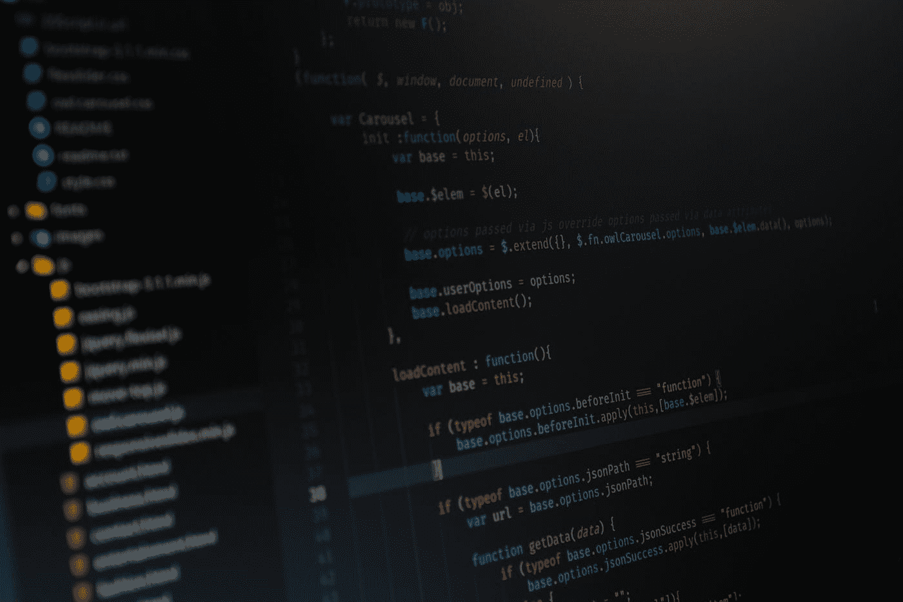
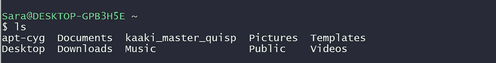
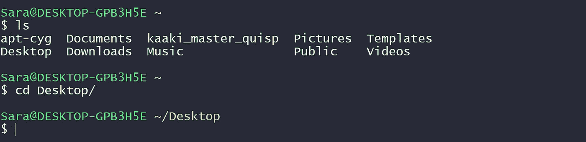
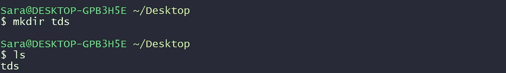
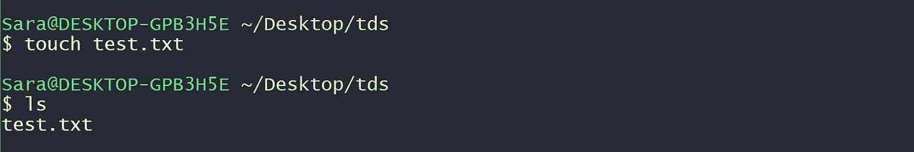
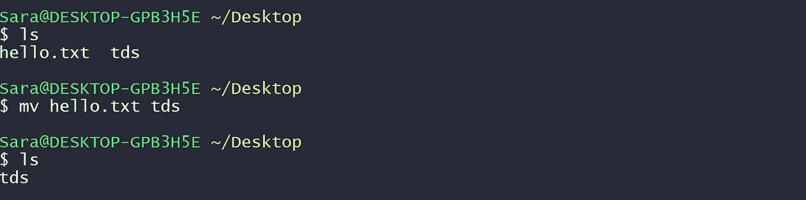
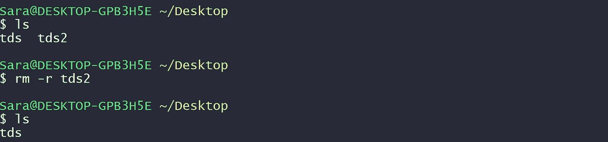
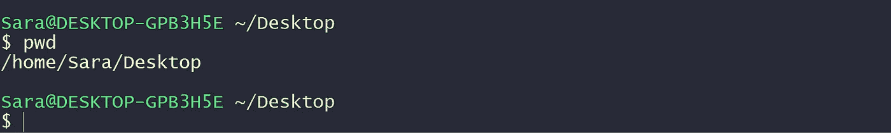

# 每个程序员都应该知道的 10 个基本 Shell 命令

> 原文：<https://towardsdatascience.com/10-basic-shell-commands-every-programmer-should-know-d5d43b009d20?source=collection_archive---------31----------------------->

## 更快更有效地使用您的计算机



照片由 [Reza Namdari](https://unsplash.com/@rezanamdari?utm_source=medium&utm_medium=referral) 在 [Unsplash](https://unsplash.com?utm_source=medium&utm_medium=referral) 上拍摄

我们都——可能——使用一些 GUI 开始了我们的数据科学或编程之旅。一个工具或一个应用程序，一切都建立起来了，我们只需要写代码，点击一些按钮来编译和运行它。瞧，结果出来了，我们结束了。

虽然图形用户界面绝对没有问题，但是随着你职业生涯的发展，你将需要一种更好、更快、更有效的方式来控制你的计算机并完成工作。它使用 shell 命令(Windows 中的命令提示符)来控制您的工作站。如果您想让自己的编程技能和职业生涯更上一层楼，使用 shell 命令是一项必须掌握的技能。

使用 shell 命令，您将能够利用计算机的真正能力，在更短的时间内完成更多的任务。一旦您掌握了 shell 命令，您将能够编写一些命令来更新您的系统，远程配置您的 web 服务器或数据库，以及更多更多的功能。

[](/pseudocode-101-an-introduction-to-writing-good-pseudocode-1331cb855be7) [## 伪代码 101:写好伪代码的介绍

### 使其清晰、易于理解

towardsdatascience.com](/pseudocode-101-an-introduction-to-writing-good-pseudocode-1331cb855be7) 

所有这些功能都始于一些基本的命令，以执行简单而重要的任务。在本文中，我将介绍 10 个基本的 shell 命令，无论从事什么领域的程序员都必须熟悉这些命令。

# №1:列出目录中的所有文件

最基本和有用的命令是`ls`命令。我们经常将源代码文件和其他重要文件放在系统的特定目录中。`ls`命令将显示当前目录下的所有文件夹。

## 句法

```
$ ls
```

当前目录是你运行`ls`命令的地方。运行该命令将显示如下内容。



作者截图

# №2:更改目录

如果您只想知道当前目录中有什么，使用`ls`命令是很好的。但是，如果您需要访问另一个目录呢？

这里是`cd`命令出现的地方。`cd`命令是“更改目录”的缩写使用该命令的方法是写入 cd，然后写入您要移动到的目录的名称或路径。

cd 命令有一些特殊的用法，主要是键入`cd ..`将带您回到目录树中的一个步骤，而键入没有目录名的`cd`将带您回到主目录。

## 句法

```
$ cd directroy_name
```



作者截图

# №3:创建新目录

要创建一个新的目录—文件夹—您需要使用 make directory 命令(`mkdir`)。`mkdir`命令只是创建一个新文件夹；你需要给它一个名字和一个路径。然后,`mkdir`将在给定的路径中创建一个具有给定名称的文件夹。

如果您没有为该命令提供路径，它将在您的当前目录中创建文件夹。一旦创建了文件夹，您可以通过运行`ls`命令来查看它。

## 句法

```
$ mkdir directory_name
$ mkdir directory/path/newdir
```



作者截图

# №4:创建文件

到目前为止，我们已经学习了如何更改目录、创建目录以及显示目录内容。如果你想创建一个文件呢？

然后你需要使用`touch`命令。这个命令可以用来创建各种类型的文件。这就是为什么在使用该命令时必须包含文件扩展名。

## 句法

```
$ touch file.extention
```



作者截图

# №5:定位文件

如果你想在你的系统中搜索一个文件，你可以使用`locate`命令。哪种方式是在目录树中更快地找到文件的方法？

您可以通过添加或排除 **-i** 选项，让`locate`命令搜索一个区分大小写或不区分大小写的文件名。此外，您可以使用*来扩大搜索范围。如果您添加了 **-r** 选项，您甚至可以查找正则表达式。

## 句法

```
$ locate [option] file_name
```

# №6:移动文件(mv)

如果要更改一个文件或一组文件的位置，可以使用 move (mv)命令来实现。mv 命令需要两条信息，您想要重定位的文件和新的目标位置。

## 句法

```
$ mv file_name path/to/move/to
```



作者截图

# №7:移除文件和目录

假设您想要移除/删除一个文件或目录；您可以使用移除(`rm`)命令。如果您想要删除文件，您可以使用`rm`命令，后跟您想要删除的文件的名称或路径。

但是，如果你想删除一个文件夹，那么你需要在使用`rm`命令时添加 **-r** 选项。



作者截图

## 句法

```
$ rm [option] file/directory/name
```

`rm`命令的一个稍弱的变体是`rmdir`。该命令用于删除空文件夹/目录。

# №8:获取当前路径

有时你会深入目录树，以至于迷失了方向，不再知道自己的确切目录。尽管 shell 命令的标题应该告诉您当前的位置，但是您可以使用`pwd`命令获得一个完整的位置。`pwd`代表*打印工作目录*。

## 句法

```
$ pwd
```



作者截图

# №9:显示用户信息

您还可以使用 shell 来显示当前登录用户的信息。要做到这一点，您可以使用命令 whoami，它完全按照它所说的那样工作。

## 句法

```
$ whoami
```


作者截图

# №10:清除外壳屏幕

在一些命令之后，你的外壳屏幕会变得混乱和拥挤。您可以从屏幕上清除旧命令及其结果，并使用`clean`命令开始清除。

## 句法

```
$ clear
```

# 外卖食品

作为一名程序员，无论你是一名数据科学家，一名应用程序开发人员，还是一名 web 开发人员，迟早你会发现自己需要掌握和使用 shell 命令来控制你的计算机。

使用 shell 将允许您使用计算机的全部功能并优化您的工作流程。在本文中，我介绍了每个程序员都应该熟悉的核心 10 个 shell 命令。当然，还有更多的命令，在你的职业生涯中，你会学到越来越多的命令。

[](/how-to-learn-programming-the-right-way-d7f87bdc7d6a) [## 如何以正确的方式学习编程

### 语法不应该是第一步！

towardsdatascience.com](/how-to-learn-programming-the-right-way-d7f87bdc7d6a) 

掌握 shell 是您职业发展和进步的必经之路。好消息是，您实际上不需要记住这些命令；每天使用它们，你会自动做到。

shell 命令的世界是广阔的，命令本身根据您使用的系统而有所不同。本文中提到的是 Unix/ Mac 命令；它们的 Windows 版本略有不同。这可能会让事情有些混乱，但是随着练习和时间的推移，它会成为你的第二天性。