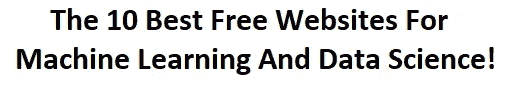
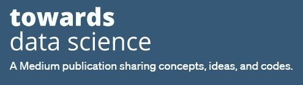

# 了解更多关于数据科学和机器学习的 10 个最佳免费网站

> 原文：<https://towardsdatascience.com/10-best-free-websites-to-learn-more-about-data-science-and-machine-learning-f2c6d7387b8d?source=collection_archive---------2----------------------->

## 意见

## 分析 10 个最好的免费网站，以获得更多关于机器学习和数据科学的知识

在 [Unsplash](https://unsplash.com?utm_source=medium&utm_medium=referral) 上由 [Boitumelo Phetla](https://unsplash.com/@writecodenow?utm_source=medium&utm_medium=referral) 拍摄的照片

随着数据科学和机器学习的流行程度不断增加，更多的有志之士和爱好者正在探索这些领域。数据科学和机器学习创造了大量的机会。

每个人都渴望了解这些领域，并最终增加一些额外的知识。对于初学者和专家来说，有一些很棒的免费网站可以学习并获得进一步的曝光。

对于试图理解任何主题并了解数据科学和机器学习的确切实体并获得进一步复杂知识的初学者来说，从一些免费资源和材料开始总是更好。

虽然最初从数据科学开始，但在你真正喜欢上它之前，你不想在这个主题上花太多钱。幸运的是，数据科学是一门拥有大量奇妙资源的学科，可以在您的旅程中为您提供帮助。

有一些网站致力于为所有用户免费提供高质量的数据科学和机器学习内容，以最大限度地利用这些资源并从中受益。

在本文中，我们将尝试探索十个免费网站，我们可以利用它们来获得更多关于机器学习和数据科学的知识。所以，事不宜迟，让我们开始分析它们。

[博伊图梅洛·菲特拉](https://unsplash.com/@writecodenow?utm_source=medium&utm_medium=referral)在 [Unsplash](https://unsplash.com?utm_source=medium&utm_medium=referral) 上的照片

# 1.卡格尔

Kaggle 也许是这个列表中最重要的条目。Kaggle 不仅仅是一个免费网站，而且 Kaggle 还是一个支持高质量数据科学、机器学习和深度学习项目的社区，以及许多其他可用的选项。

Kaggle 旨在为您提供有用的代码和资源，让您从零开始实施自己的项目，并为您提供大量数据集和数据储备，用于处理众多项目创意。

社区是支持的，并提供带有分析、探索性数据分析和代码的 Jupyter 笔记本。Kaggle 每年都会举办一系列比赛，您可以自由参加比赛，亲自探索。

Kaggle 还为您提供了一些 winners 解决方案，您可以从中阅读和学习，并在您的项目中进行实验。总的来说，Kaggle 是顶级免费网站选项之一，作为初学者或专家数据科学爱好者，你应该完全考虑利用它。

# 2.机器学习掌握

Jason Brownlee 的机器学习大师网站提供了一些互联网上最好的资源和内容。它涵盖了多个主题，并深入探讨了数据科学中一些最引人注目和最有趣的概念。

这个网站为每一个爱好者和渴望者提供内容和有用的资源。不管你是初学者还是专家，你访问这个网站都会获得很多难以置信的价值，而且这里的大部分内容都是免费的。

资源范围从初学者安装过程一直到复杂的机器学习、神经网络和深度学习计算和项目。如果你喜欢这个网站，作者也有很多高质量的书籍，你可以购买来支持他们。

我广泛地使用了这个网站，并从中传授了许多知识。我强烈建议每个数据科学爱好者至少访问一次这个网站，因为它涵盖了概念、代码、复杂的细节和对几个主题的理解。

# 3.带代码的文件

由[安娜·克鲁兹](https://unsplash.com/@anacruzbaeza?utm_source=medium&utm_medium=referral)在 [Unsplash](https://unsplash.com?utm_source=medium&utm_medium=referral) 拍摄的照片

[代码为](https://paperswithcode.com/)的论文，顾名思义，涉及附有简明代码的研究论文。

这是一个令人惊叹的平台，也是一个完全免费的网站，所有爱好者都可以访问并了解更多关于数据科学、机器学习、深度学习等等的知识。

其中涉及的一些概念和主题对于初级用户来说可能相当高级。但由于研究论文旁边提供了代码，数据科学爱好者分析这些项目变得更加容易。我强烈推荐看看这个网站。

# 4.开源代码库

[GitHub](https://github.com/) 是找到详细代码和编码架构的最佳地方。使用 GitHub 的主要原因是向许多优秀的人学习，他们提供详细的代码，让整个社区从中受益。

有了 GitHub，你不仅可以阅读和学习其他代码，还可以通过分叉在桌面上利用这些代码。您可以测试这些代码，验证它们，甚至根据您想要的项目修改它们以符合您的最大利益。

除了阅读他人的作品，您还可以发布您的项目和代码，供每个人使用和受益。将你的代码共享给所有人也是 GitHub 不可或缺的一部分。您可以通过更大项目的仓库或共享更小代码的简单 Gists 的形式来实现。

# 5.PyImageSearch

PyImageSearch(作者 Adrian Rosebrock)是帮助你开始计算机视觉项目的最佳网站之一。它还广泛涵盖了 OpenCV 和深度学习的主题，以免费构建简单和复杂的计算机视觉项目。

当我在做我的第一个计算机视觉项目时，这个网站是我发现的第一个网站，从那以后它就没有让我失望过。在我看来，该网站仍然是迄今为止构建计算机视觉项目的最佳机器学习资源之一。

如果你是一个计算机视觉项目的爱好者，并且想继续在这个领域建立更多的项目，我强烈建议你去这个网站查看更多的学习材料、知识和资源。如果你想支持作者，你也可以买他们的计算机视觉书籍。

此外，如果您对使用 OpenCV 学习计算机视觉感兴趣，并且希望从零开始学习初学者指南，我强烈建议您查看我的 21 分钟文章，该文章涵盖了这个主题。您可以通过下面提供的链接来完成。

 [## OpenCV:用代码掌握计算机视觉基础的完全初学者指南！

### 包含代码的教程，用于掌握计算机视觉的所有重要概念，以及如何使用 OpenCV 实现它们

towardsdatascience.com](/opencv-complete-beginners-guide-to-master-the-basics-of-computer-vision-with-code-4a1cd0c687f9) 

# 6.走向数据科学

作者截图来自 [TDS](https://towardsdatascience.com/)

[走向数据科学](https://towardsdatascience.com/)是 Medium 上最大的出版物之一，Medium 是让浏览者了解与数据科学、机器学习、可视化、计算机视觉等相关的思想、想法、代码和信息的最佳网站之一。

在免费网站上列出 TDS 的主要原因是，尽管访问无限内容只需要 5 美元，但你仍然可以免费查看大量关于数据科学和机器学习的有用资源和信息。

有一些了不起的高质量的作家在研究数据科学，并且为您提供了顶级的标准内容。您可以利用这个平台来加深对数据科学各种概念的理解和掌握。

# 7.谷歌人工智能

[Google AI](https://ai.google/) 是 Google 致力于人工智能的一个部门。该网站也是免费的，提供与数据科学和机器学习相关的信息。

谷歌人工智能希望教育所有用户人工智能的好处，因此它是一个学习和获得更多人工智能知识的免费网站。

谷歌人工智能平台是一个非常有用的网站。它在其武库中提供了一系列广泛的主题，包括研究主题，人工智能领域的人员和用户教育，使用人工智能的众多工具，以及学习概念以开发人工智能技能的博客。

# 8.油管（国外视频网站）

照片由[雅各布·欧文斯](https://unsplash.com/@jakobowens1?utm_source=medium&utm_medium=referral)在 [Unsplash](https://unsplash.com?utm_source=medium&utm_medium=referral) 上拍摄

[YouTube](https://www.youtube.com/?gl=IN&tab=w1) 是一个通过视频内容了解更多机器学习和数据科学的绝佳平台。

你可以浏览各种渠道，疯狂观看一些令人惊叹的视频，这些视频会启发你，教会你这些领域的实用知识和实现。

我个人推荐的有 Sentdex，3Blue1Brown，TechWithTim，科里斯查费等。在众多精彩的频道中。这些是 YouTube 上最好的频道，你可以从中找到精彩的深入解释，更直观地理解概念。

# 9.张量流

[TensorFlow](https://www.tensorflow.org/) 是开发一些惊人的数据科学和机器学习项目的最佳深度学习框架之一。

然而，除了这个用于解决复杂计算问题的惊人的库之外，它还有一个免费的网站来了解和获取关于 TensorFlow 的知识。

TensorFlow 网站为用户提供了官方文档、指南、有用的资源和代码，帮助他们开始使用 TensorFlow，并从头开始创建一些精彩的项目。

TensorFlow 的支持和开发工具正在快速构建。该网站还提供了基本的数据集和一些示例问题的解决方案。我强烈建议您登录网站，使用 TensorFlow 掌握深度学习。

# 10.Reddit、Quora 和堆栈溢出

Arnel Hasanovic 在 [Unsplash](https://unsplash.com?utm_source=medium&utm_medium=referral) 上拍摄的照片

在这一点上提到的三个资源倾向于服务于类似的目的，即，社区互动和参与，以及对几个问题的回答以获得澄清。

Reddit 是用户进行互动的地方，Reddit 中机器学习和数据科学的特定位置是非常有用的免费网站，可以了解更多信息，并获得对您可能遇到的一些问题的进一步回答。

Quora 是另一个类似的网站，有专门的 Quora 空间，致力于学习和获得更多关于数据科学或机器学习的知识。您还可以提出更多一般性问题，并免费获得答案和帮助。

堆栈溢出是接收高级问题答案的最佳资源。该网站有大量有用的内容和许多常见问题的精彩答案。它还提供了针对错误和缺陷的解决方案以及相应的修复方法。

威廉·艾文在 [Unsplash](https://unsplash.com?utm_source=medium&utm_medium=referral) 上的照片

# 结论:

在本文中，我们介绍了十个最好的数据科学和机器学习免费网站资源，供初学者入门，也可供更高级别的用户受益。

这里提到的每一个资源都包含了大量的内容和有价值的信息，你可以利用它们来更好地掌握这门学科，并通过获得更多的知识而从中受益。

如果你还没有的话，我强烈推荐你看看下面的免费网站资源。通过阅读、理解、分析并最终处理这些网站提供给你的信息，你可以学到很多东西。

这篇文章最好的部分是，这里提到的资源只是许多可能性中的十种。数据科学和机器学习是如此新鲜的主题，以至于你有无限的可能性。

它们的资源是无限的，在未来的文章中，我们将尝试覆盖至少十个以上这样令人惊叹和有用的网站，它们可以帮助您踏上数据科学之旅！

如果你对这篇文章中提到的各点有任何疑问，请在下面的评论中告诉我。我会尽快给你回复。

看看我的其他一些文章，你可能会喜欢读！

 [## 2021 年数据科学的利与弊

### 5 个优点和 5 个缺点，以确定数据科学是否是你在 2021 年的完美职业选择，或者你是否有更好的…

towardsdatascience.com](/pros-and-cons-of-data-science-in-2021-b3c333dfa79d)  [## 作为数据科学家要避免的 11 个关键错误！

### 初学数据科学的爱好者会犯的十一个关键性错误是什么？

towardsdatascience.com](/11-crucial-mistakes-to-avoid-as-a-data-scientist-71c29aef028)  [## 当今时代的 8 项革命性人工智能技术！

### 探索和分析即将或已经对世界产生巨大影响的 8 项人工智能技术！

towardsdatascience.com](/8-revolutionary-artificial-intelligence-technologies-of-the-modern-era-f8f22a4127d0)  [## 掌握 Python 中的字典和集合！

### 通过代码和示例理解 Python 中的字典和集合的概念

towardsdatascience.com](/mastering-dictionaries-and-sets-in-python-6e30b0e2011f)  [## 从数据科学中赚取收入的 5 种最佳方式！

### 探索作为数据科学爱好者或数据科学家的五种最佳创收方式！

towardsdatascience.com](/5-best-ways-to-earn-income-from-data-science-a9c8fed1eee6) 

谢谢你们坚持到最后。我希望你们喜欢阅读这篇文章。我希望你们都有美好的一天！