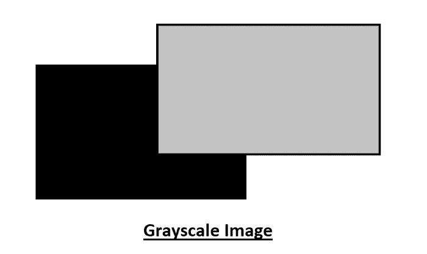
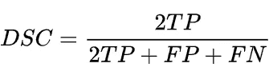
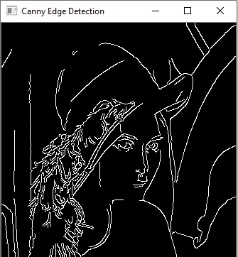

# 每个人都必须知道的 10 个计算机视觉术语！

> 原文：<https://towardsdatascience.com/10-computer-vision-terms-everyone-must-know-about-687a98845fc8?source=collection_archive---------23----------------------->

## 十个基本的计算机视觉术语，每个人都应该学习，以更加精通计算机视觉和示例代码


布鲁克·卡吉尔在 [Unsplash](https://unsplash.com?utm_source=medium&utm_medium=referral) 上的照片

机器或计算机能够感知现实世界中的图像并相应地解释它们的想法曾经被认为是不可能的。在当代，我们知道有一些快速的进步导致了计算机或机器视觉领域的快速发展。在接下来的几年里，计算机视觉将会有更多的发展，使其更加与众不同。

自从过去十年以来，计算机视觉已经变得特别流行。虽然理论概念已经存在了相当长的一段时间，但这是由于现代技术有助于将这门学科推向一个全新的水平。计算机视觉是人工智能的一个分支，它使系统能够衡量对图像、视频或其他实时实体和活动的整体高级理解。

虽然本文的目标是关注计算机视觉的一些重要术语，但我之前已经非常详细地介绍了 OpenCV 主题和计算机视觉的基础知识。如果您是该领域的新手，建议您首先阅读下面提供的文章，以更深入地了解该主题，并确保您可以获得阅读本文内容的最佳效果。

[](/opencv-complete-beginners-guide-to-master-the-basics-of-computer-vision-with-code-4a1cd0c687f9) [## OpenCV:用代码掌握计算机视觉基础的完全初学者指南！

### 包含代码的教程，用于掌握计算机视觉的所有重要概念，以及如何使用 OpenCV 实现它们

towardsdatascience.com](/opencv-complete-beginners-guide-to-master-the-basics-of-computer-vision-with-code-4a1cd0c687f9) 

在本文中，我们的目标是涵盖许多计算机视觉应用所需的十个最基本的术语。有了这些方面的正确信息和知识，你就可以用机器学习或深度学习算法的混合来构建任何类型的计算机视觉项目。让我们开始探索这十个概念，并逐一了解它们。

# 1.图像格式:

图像格式化和图像操作是你在计算机视觉世界中最常听到的两个术语。让我们以直观的方式理解这些关键概念，以避免将来的任何混淆。我们在自然世界中感知的正常图像通常是具有一定宽度和高度的图像，并且通常具有三个通道，因为它们通常包含 RGB 图像的颜色组合。以下是图像参数的典型表示。

```
Height of the Image = 512
Width of the Image = 512
Number of channels = 3
```

通过图像操作，您可以执行各种有用的操作，这些操作将有助于降低机器学习或深度学习算法的计算要求。一些图像处理方法包括调整大小、裁剪或将其转换成灰度图像(这一点将在下一节中进一步讨论)。图像操作在计算机视觉应用中起着至关重要的作用。

对于图像格式化，我们的任务通常是实现图像的最佳表示，使其适合我们的特定任务。如前所述，该步骤可能涉及某些图像处理，并将其存储为所需的格式。常用的图像存储格式包括 PNG、JPG、JPEG、TIF 和其他类似格式。

# 2.灰度:



在计算机视觉中，灰度图像在大多数具有实际应用的操作中起着至关重要的作用。通常，第 0 个范围指的是黑色，随着范围的不断增加，我们开始达到更亮的色调，直到我们最终在第 255 个值上遇到白色。因此，灰度图像也可以被认为是颜色为浅灰色并且跟随不同灰度的图像范围。

将彩色 RGB 图像转换为其他格式有很多用途，尤其是转换为灰度图像，以减少计算压力并降低 CPU(有时是 GPU)的限制。将数据集转换为灰度后，您可以更快、更有效地处理计算。您还可以使用它来简化算法和提取描述符，而不会消耗太多的额外需求。转换成灰度的简单代码如下。

```
gray = cv2.cvtColor(image, cv2.COLOR_BGR2GRAY) # Convert the color image to grayscale image
cv2.imshow("Gray Picutre", gray) # Display Grayscale image
cv2.waitKey(0)
```

另一个需要理解的基本概念是掩蔽。遮罩是由零值和非零值组成的二进制图像。如果将遮罩应用于另一个二进制图像或相同大小的灰度图像，则遮罩中为零的所有像素在输出图像中都将被设置为零。所有其他保持不变。更多信息，请参考以下[参考](https://homepages.inf.ed.ac.uk/rbf/HIPR2/mask.htm)。

# 3.欠条和骰子损失:

在处理图像和大多数计算机视觉任务时，我们利用某些基本的计算指标来分析模型的性能。确保模型在训练和评估阶段有效运行的两个主要指标是联合交集(IoU)分数和骰子损失。

并集上的交集(IoU)，顾名思义，是特定图像的地面实况和模型所做预测之间的重叠。它通常被认为是比精度更好的度量，广泛用于计算机视觉应用。通常情况下，对于实际应用而言，高于 0.5 的 IoU 分数可视为良好分数。

另一方面，骰子损失是在图像处理中用来理解两个或多个期望实体之间的相似性的度量之一。在考虑真正值、假正值和假负值之后，下面的公式可以写成如下:



[骰子相似系数](https://en.wikipedia.org/wiki/S%C3%B8rensen%E2%80%93Dice_coefficient)

# 4.锚箱和 NMS:


[成龙赵](https://unsplash.com/@jiaweizhao?utm_source=medium&utm_medium=referral)在 [Unsplash](https://unsplash.com?utm_source=medium&utm_medium=referral) 上的照片

以下两个术语，锚盒和非最大值抑制，是计算机视觉中，尤其是物体检测算法实现中常用的两个词。因此，理解它们在特定序列中的重要性以及为什么它们被用于这些任务是非常重要的。

锚定框对于在图像中设置预定义高度和宽度的边界框非常有用。它们通常会捕捉不同对象的大量比例和纵横比，您希望将这些比例和纵横比专门整合到您的培训模型中。有许多锚箱用于此目的。

当有许多锚盒用于特定目的时，可能会导致某些问题，尤其是由于重叠。因此，非最大抑制(NMS)的概念被用于过滤掉过多的重叠瓦片，并将处理的结果传递给神经网络用于进一步的计算和处理。

# 5.噪音:


照片由 [C D-X](https://unsplash.com/@cdx2?utm_source=medium&utm_medium=referral) 在 [Unsplash](https://unsplash.com?utm_source=medium&utm_medium=referral) 上拍摄

图像中的噪声基本上是由于污染(降低)图像质量的外部因素的干扰而可能发生的任何种类的干扰。图像中的噪声经常会成为图片或图像中不希望出现的干扰。虽然有时你可能会尝试为图像生成添加一些你自己的噪声(就像在 GANs 中)，但这通常不是你想要的完美图像。

在您认为特定图像中不需要添加噪声的情况下，您可以尝试滤除此噪声。噪声过滤是试验 OpenCV 模块中的各种技巧以消除现有噪声的方法之一。下面是一个示例代码，展示了相同的类似演示。

```
def custom_blur_demo(image):

    kernel = np.ones([5, 5], np.float32)/25   
    dst = cv2.filter2D(image, -1, kernel)
    cv2.imshow("custom_blur_demo", dst)src = cv2.imread("lena_noise.png")
img = cv2.resize(src,None,fx=0.8,fy=0.8,interpolation=cv2.INTER_CUBIC)
cv2.imshow('input_image', img)
custom_blur_demo(img)
```

# 6.模糊技术:

```
blur = cv2.GaussianBlur(gray, (19,19), 0) 

cv2.imshow("Blur Picture", blur) # Display Blur image
cv2.waitKey(0)
```

模糊或平滑处理是计算机视觉中减少特定图像中异常值数量的关键技术。由于我们在前一节中了解了噪声，我们对图像中噪声干扰的副作用有了一个简单的了解。防止这些干扰和过滤这种噪声的一种方法是使用模糊技术。

在上面的代码块中，我们使用了一种流行的模糊技术，称为高斯模糊，它利用了高斯函数，有助于相应地平滑给定的图像。在 OpenCV 提供的特定高斯模糊代码中，目标是提供源和内核大小，它们必须始终是奇数元组，以获得平滑的图像。

# 7.边缘检测:



作者图片

边缘检测是用计算机视觉实现的另一个重要目标。边缘检测有助于识别图像中亮度变化或图案不连续的各个部分，从而可以找到所需的区域。它还用于从图像中提取特定对象的结构，并在其他计算机视觉应用中找到它的效用，如对象检测。

上图举例说明了如何执行边缘检测的特定操作，以及如何通过改变阈值因子来改变检测能力。虽然有许多方法来执行对象检测，并且同样有许多独特的应用，但下面是一个示例代码块，演示了在 OpenCV 中使用 Canny 边缘检测器。

```
# Canny Edge Detection
edges = cv2.Canny(image=img_blur, threshold1=100, threshold2=200) # Canny Edge Detection
# Display Canny Edge Detection Image
cv2.imshow('Canny Edge Detection', edges)
```

# 8.FPS:

每秒帧数(FPS)是计算机视觉的另一个基本概念，通常用于计算视频镜头或实时图像。为了更简单地理解这个概念，让我们考虑几个例子。假设你正在 YouTube 或你的本地软件等特定平台上观看视频或电影。您可以选择查看特定视频每秒播放多少帧，以及具体质量如何。

另一个例子是，当你试图玩视频游戏时，你会有一定数量的每秒帧数，这是随着游戏的进行你的设备可以处理的内容量。对于这些任务，每秒 60 帧通常被认为是一个不错的数字。同样，对于实时对象检测等计算项目，FPS 的概念对于确定特定模型的性能至关重要。

为了理解大量与计算机视觉和深度学习相关的概念，我个人认为，开发者应该在学习阶段尝试构建至少一个单一的游戏。查看我以前的一篇文章，这篇文章讨论了用 Python 构建游戏的必要性，以及你应该考虑自己这么做的五个理由，请点击下面的链接。

[](/5-reasons-why-you-should-develop-a-game-with-python-and-ai-9f5f276e7637) [## 你应该用 Python 和 AI 开发游戏的 5 个理由！

### 学习创建一个游戏对提高你的 Python 工作效率大有裨益的 5 个原因…

towardsdatascience.com](/5-reasons-why-you-should-develop-a-game-with-python-and-ai-9f5f276e7637) 

# 9.细分:


迈克·多尔纳在 [Unsplash](https://unsplash.com?utm_source=medium&utm_medium=referral) 上的照片

你可以用计算机视觉和深度学习执行的最重要的操作之一是分割任务。具体来说，分割意味着从图像中分离出最基本的元素或特定的所需元素，以便您可以对图像执行进一步的计算，如分类或定位。考虑特定图像的聚类，并相应地对它们进行分割，以将它们与其他元素区分开来。

分割的正常过程包括考虑特定的数据集以及它们各自的掩码。利用相应的图像和该特定图像的基础事实，我们可以使用类似 U-Net 或其他类似架构的方法为某些样本训练模型。一旦您成功地构建了模型，您就可以对其他图像执行大量的分割测试，并隔离(分离)必要的需求。

# 10.物体检测:


照片由[埃里克·普劳特](https://unsplash.com/@eprouzet?utm_source=medium&utm_medium=referral)在 [Unsplash](https://unsplash.com?utm_source=medium&utm_medium=referral) 上拍摄

计算机视觉的另一个重要贡献是对象检测任务，它对于解决一些现实生活中的问题至关重要。对象检测是当今世界最重要的应用之一，在许多与对象跟踪(如跟踪板球或棒球)、面部识别(用于识别面部)、机器人应用、无人驾驶汽车等相关的问题中有其使用案例，最终将在很大程度上造福人类。

由于对象检测是计算机视觉任务中最基本的元素之一，因此有几种方法、工具、算法和库来完成这项任务。一些最好的算法包括梯度方向直方图(HOG)、快速 R-CNN、YOLO 和许多其他类似的算法和技术。还有几个像 Image AI 和 Detectron2 这样的库可以有效地执行这些任务。查看以下关于[对象检测算法和库](https://neptune.ai/blog/object-detection-algorithms-and-libraries)的文章，以获得关于该主题的更多信息。

# 结论:


在 [Unsplash](https://unsplash.com?utm_source=medium&utm_medium=referral) 上由 [Austin Distel](https://unsplash.com/@austindistel?utm_source=medium&utm_medium=referral) 拍摄的照片

*“以建设性和仁慈的方式使用计算机视觉技术有很大的潜力。”—*[**—**—](https://www.brainyquote.com/authors/fei-fei-li-quotes)

计算机视觉是人类取得的最伟大的成就之一。随着该领域的快速发展，现在可以轻松实现几乎任何类型的与图像、视频或实时捕捉相关的机器视觉任务。由于有一堆未来的业务和项目尚未被发现，我们在以下领域积累了巨大的潜力。

在本文中，我们探讨了与计算机视觉相关的十个最重要的术语。有了对这些资源的完美处理、理解和知识，对于大多数开发人员来说，用正确的工具和技术完成任何种类的特定计算机或机器视觉项目都成为可能。确保你记住或记下这些术语，以备将来使用。

如果你对这篇文章中提到的各点有任何疑问，请在下面的评论中告诉我。我会尽快给你回复。

看看我的其他一些文章，你可能会喜欢读！

[](/5-best-python-projects-with-codes-that-you-can-complete-within-an-hour-fb112e15ef44) [## 5 个最好的 Python 项目，代码可以在一小时内完成！

### 用完整的代码构建五个很酷的 Python 项目，开发人员可以在一个小时内构建这些项目，并添加到您的…

towardsdatascience.com](/5-best-python-projects-with-codes-that-you-can-complete-within-an-hour-fb112e15ef44) [](/14-pandas-operations-that-every-data-scientist-must-know-cc326dc4e6ee) [## 每个数据科学家都必须知道的 14 个熊猫操作！

### 关于 14 种最基本的熊猫手术的完整指南

towardsdatascience.com](/14-pandas-operations-that-every-data-scientist-must-know-cc326dc4e6ee) [](/7-best-ui-graphics-tools-for-python-developers-with-starter-codes-2e46c248b47c) [## 7 款面向 Python 开发人员的最佳 UI 图形工具，带入门代码

### Python 中用于开发酷用户界面技术的七个最佳 UI 图形工具

towardsdatascience.com](/7-best-ui-graphics-tools-for-python-developers-with-starter-codes-2e46c248b47c) [](/15-numpy-functionalities-that-every-data-scientist-must-know-f6d69072df68) [## 每个数据科学家都必须知道的 15 个数字功能

### 讨论开发人员必须学习的十五个最基本的数字函数

towardsdatascience.com](/15-numpy-functionalities-that-every-data-scientist-must-know-f6d69072df68) [](/17-must-know-code-blocks-for-every-data-scientist-c39a607a844d) [## 17 每个数据科学家都必须知道代码块

### 讨论将帮助您作为数据科学家有效处理大多数任务和项目的 17 个代码块

towardsdatascience.com](/17-must-know-code-blocks-for-every-data-scientist-c39a607a844d) 

谢谢你们坚持到最后。我希望你们都喜欢这篇文章。祝大家有美好的一天！