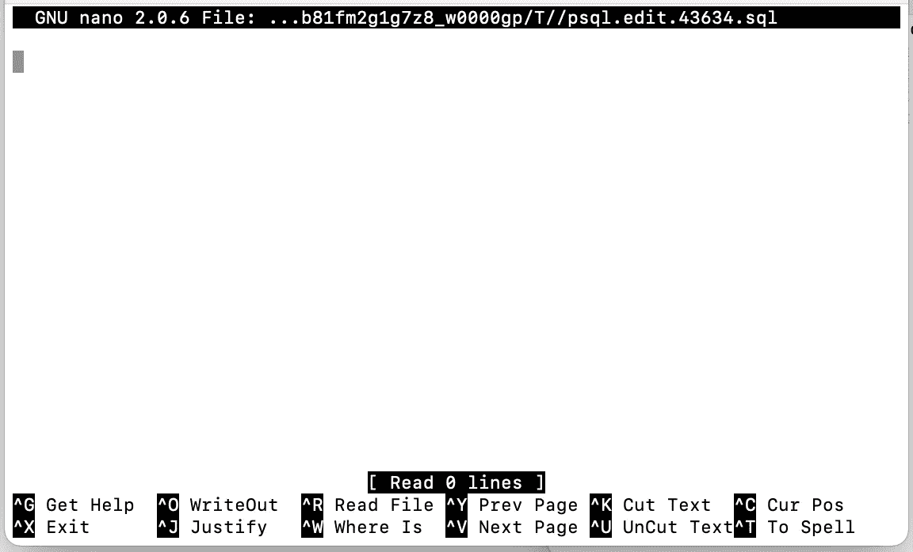
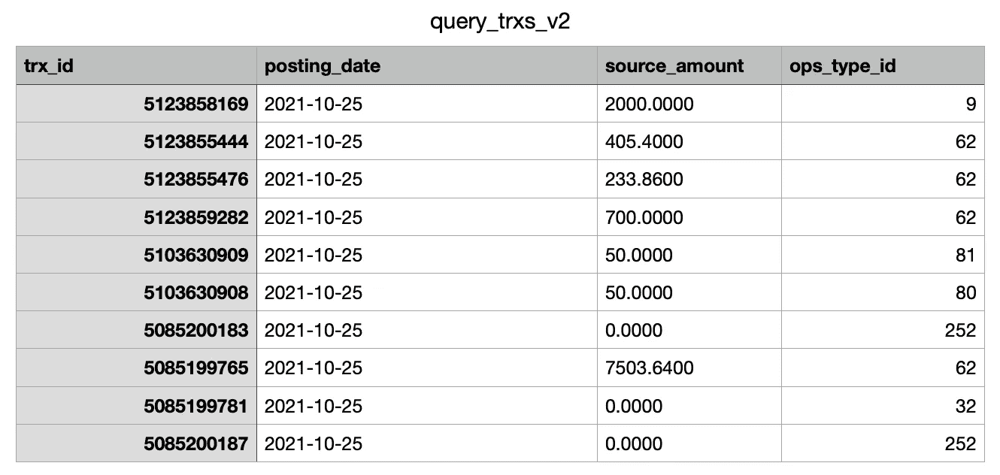

# 数据工程师的 10 个基本 PSQL 命令

> 原文：<https://towardsdatascience.com/10-essential-psql-commands-for-data-engineers-c1ea42279160?source=collection_archive---------29----------------------->

## 了解如何使用 PSQL 通过命令行与 PostgreSQL 数据库交互。


照片由 [Pexels](https://www.pexels.com/photo/brown-leaf-on-lapotp-3219549/?utm_content=attributionCopyText&utm_medium=referral&utm_source=pexels) 的 [Engin Akyurt](https://www.pexels.com/@enginakyurt?utm_content=attributionCopyText&utm_medium=referral&utm_source=pexels) 拍摄

## 建议的点播课程:

*你们中的许多人联系我，要求提供有价值的资源* ***来敲定基于 Python 的数据工程面试*** *。下面我分享 3 个我强烈推荐的点播课程:*

*   [**Python 数据工程纳米学位**](https://imp.i115008.net/zaX10r) **→** *精品课程！*
*   [***leet code In Python:50 个算法编码面试问题***](https://click.linksynergy.com/deeplink?id=533LxfDBSaM&mid=39197&murl=https%3A%2F%2Fwww.udemy.com%2Fcourse%2Fleetcode-in-python-50-algorithms-coding-interview-questions%2F)****→最适合涉及算法的编码回合！****
*   *[***Python 高级编码问题(StrataScratch)***](https://platform.stratascratch.com/coding?via=antonello)***→****我找到的准备 Python 的最佳平台& SQL 编码面试到此为止！比 LeetCode 更好更便宜。**

*希望你也会发现它们有用！现在欣赏:D 的文章*

# ***简介***

*在您成为数据工程师的过程中，在某些时候，您一定偶然发现了命令行(*也称为终端*)。*

*也许是一位同事向你展示如何[创建环境变量](/connect-to-databases-using-python-and-hide-secret-keys-with-env-variables-a-brief-tutorial-4f68e33a6dc6)？…或者教你使用本地版本控制的最佳实践？…或者你暗暗佩服他们与数据库交互的方式，看起来不费吹灰之力，也不需要现代的数据库管理系统？*

*无论您第一次接触命令行，您可能会想*“我想要同样的超级能力……我需要学习如何做到这一点！”。**

> *无论您第一次遇到命令行，您可能会想*“我想要同样的超级能力…我需要学习如何做到这一点！”。**

*为了帮助你掌握一个最基本的数据工程技能，在本文中，我将向你介绍`psql`以及如何使用它通过终端与 PostgreSQL 数据库进行交互。我还将向您展示我在工作场所反复使用的 10 组命令。*

*但首先，什么是`psql?`…更重要的是，它的利弊是什么？*

# *psql 如何给你超能力*

*在[PostgreSQL 官方网站](https://www.postgresql.org/docs/10/app-psql.html)上，`psql`被定义为 PostgreSQL 交互终端。*

*这意味着，如果您每天使用 PostgreSQL，您可以使用`psql`连接到您喜欢的数据库，输入查询并通过命令行查看查询结果。但是`psql`有什么好处和坏处呢？*

## *Psql 专业版*

*   *允许您与数据库快速交互，使您处于相同的环境中(*终端*)，而不像在标准 DBMS 中那样需要配置。这反过来加快了你的工作。*
*   *通过使用您最喜欢的编辑器或从文件中运行查询，允许您运行简短和更复杂的查询。*
*   *允许您通过在指定的时间间隔执行命令来跟踪表中的更改。*
*   *与标准 DBMS 相比，它可以帮助您几乎毫不费力地检索关于数据库、模式、表和用户的元数据和统计数据。*

## *Psql Cons*

*   *当您需要显示和分析大量列或者交互地改变输出中列的顺序时，这不是最好的工具。当查询返回少量在终端上看起来很整洁的列时,`psql`非常出色。*
*   *当您希望将查询的输出保存到特定格式的文件中时，这不是最好的工具。尽管这是可以做到的`psql` ( *我将在稍后展示*)，现代数据库管理系统提供了更广泛和用户友好的选择范围。*

*既然我多解释了一点 ***当*** `psql`应该是你的首选，那我也来分享一下*怎么用吧！**

# **装置**

## **苹果个人计算机**

**要在 Mac 笔记本电脑上安装`psql`，只需下载`homebrew`，然后执行以下两条命令:**

```
**$ brew install postgresql
$ brew services start postgresql**
```

**然后，当服务启动后，使用以下命令检查它是否已启动并正在运行:**

```
**$ brew services**Name       Status  User    Plist**postgresql started anbento /Users/anbento...**
```

## ****窗户****

**要在 Windows 机器上安装`psql`以及其他客户端应用程序，请遵循[这篇优秀的教程](https://www.postgresqltutorial.com/install-postgresql/)。**

# **你必须知道的 10 个命令**

**与其他终端客户端应用程序一样，`psql`提供了广泛的命令来与 PostgreSQL 数据库进行交互。然而，下面我试着给出了 10 个我每天最常用的命令。**

## **# 1 连接到 PostgreSQL 数据库**

**与 PG 数据库交互的第一步是连接到它。**

**请记住，如果您通常使用 SSH 隧道或任何其他类型的加密进行连接，您需要在运行下面的命令之前解决这个问题。**

**在工作场所，您很可能必须建立到驻留在特定主机上的数据库的连接。如果是这种情况，您应该使用:**

```
**$ **psql -h host -d database -U user -W****
```

**例如，假设您希望使用以下凭据连接到数据库:**

```
****database name:** fin_db**host:** localhost**port:** 5000**username** = anbento**
```

**命令和输出应该是这样的:**

```
**$ **psql -h localhost -p 5000 -d fin_db -U anbento -W**Password for user anbento:psql (14.0, server 12.5 (Ubuntu 12.5–1.pgdg18.04+1))SSL connection (protocol: TLSv1.3, cipher: TLS_AES_256...., bits: 256, compression: off)Type “help” for help.fin_db=>**
```

**一旦您运行它，您将被提示插入用户的密码。如果连接成功，您会看到屏幕上出现一个光标，前面有数据库名称。**

**现在你可以对它进行查询了！**

## **# 2 列出模式|表|视图|函数|用户**

**作为一名数据工程师，有时您可能希望列出当前连接的数据库中可用的模式。**

**这可以通过使用`\dn`命令来实现:**

```
**fin_db-> **\dn**List of schemas
Name              |        Owner
------------------+---------------------
audit             | owner_1
fin_data          | owner_2
fin_config        | owner_3
fin_control       | owner_4
fin_internal      | owner_5
finance_analytics | owner_6
findb             | owner_7
pdl               | owner_8
pdl_map           | owner_9
pdl_ob            | owner_10
pds               | owner_11
...               | ...(20 rows)**
```

**如您所见，`fin_db`数据库包括 20 个与特定所有者相关联的模式。然而，如果您在寻找一组特定的模式(假设所有模式都以`fin_`开头)，该怎么办呢？在这种情况下，您应该运行:**

```
**db_findb-> **\dn fin_***List of schemas
Name          | Owner
— — — — — — — + — — — — — — — — -
fin_adata     | owner_2
fin_config    | owner_3
fin_control   | owner_4
fin_internal  | owner_5(4 rows)**
```

**现在，该命令只显示与提供的正则表达式匹配的 4 个模式。**

**非常相似的命令可用于列出您所连接的数据库的表、视图、函数和用户:**

```
**# Display the list of tables
**\dt** or **\dt + regex**# Display the list of views
**\dv** or **\dv + regex**# Display the list of functions
**\df** or **\df + regex**# Display the list of users
**\du** or **\du + regex****
```

## **# 3 描述一张桌子**

**如果您希望通过列出特定表的列、数据类型以及了解哪些字段可以为空来了解更多信息，您应该使用`\d table_name`命令。**

**例如，要描述一个名为`findb.transactions`(其中`findb`是模式名)的表，您应该运行:**

```
**db_findb-> **\d findb.transactions**Partitioned table “findb.transactions”Column         | Type        | Collation | Nullable | Default
---------------+-------------+-----------+----------+---------
trx_id         | bigint      |           | not null | 
source_id      | bigint      |           |          |
ops_type_id    | bigint      |           | not null |
manual_status  | integer     |           | not null | 
source_amount  | numeric     |           | not null |
...            | ...         |...        | ...      |**
```

## **# 4 运行前一个命令**

**要使用`psql`查询数据库，您只需键入一些 SQL 代码，后跟一个分号`;`。如果省略分号，客户端应用程序将无法理解代码是否准备好执行，并将使您处于编辑模式。**

**例如，如果您希望计算在`2021-10-01`上创建的`findb.transactions`中的事务总数，您可以运行:**

```
**db_findb=> **select count(trx_id)** 
           **from findb.transactions**
           **where created_at = ‘2021–10–01’;**
count
-------
512323(1 row)**
```

**这个查询告诉我们`512,323`是在那个日期创建的。如果您希望再次运行相同的查询，该怎么办？你可以简单地输入`\g`:**

```
**db_findb=> **\g**count
-------
512323(1 row)**
```

**这适用于所有命令，相当于`up arrow + enter`。**

## **# 5 从文件中执行命令**

**有时，SQL 脚本变得更长更复杂，所以您可能想先创建它们，将它们保存到一个文件中，然后用`psql`运行文件中包含的查询。使用`\i filename`可以做到这一点。**

**在下面的示例中，我保存了该查询的等效内容:**

```
**select
TRX_ID
,POSTING_DATE
,SOURCE_AMOUNT
,OPS_TYPE_ID
from FINDB.TRANSACTIONS
where POSTING_DATE = current_date
limit 5;**
```

**到一个名为`query_trxs`的崇高文本文件。该文件位于我的桌面上，因此为了执行它，我运行:**

```
**db_findb=> **\i /Users/Anbento/Desktop/query_trxs**trx_id     | posting_date | source_amount | ops_type_id
-----------+--------------+---------------+------------+
5122579747 | 2021-10-24   | 386.00        | 18         |
5115148908 | 2021-10-24   | 0.0           | 252        |
5115148971 | 2021-10-24   | 0.6100        | 70         |
5122580187 | 2021-10-24   | 15000.00      | 62         |
5122580337 | 2021-10-24   | 0.38          | 69         |(5 rows)**
```

## **# 6 在编辑器中编写命令**

**不用说，终端并不是运行长 SQL 查询的最佳工具。为此，`psql`不仅允许你从文件中执行命令，还允许你通过`\e`命令访问默认编辑器。**

**例如，在我的 Mac 上，该命令将打开`vim`编辑器，因为这是`psql`找到的默认编辑器。如果这也是你的情况，做这两件事:**

*   **键入`i`进入`INSERT`模式。现在，您将能够键入您的查询。在这种情况下，我试图在`findb.transactions`中找到`max(trx_id)`:**

****

**我的 vim 编辑器在插入模式下是什么样子**

*   **当您对您的查询满意时，键入`esc`，然后键入`:x!`。这将保存您的内容并自动执行 SQL 脚本:**

```
**db_findb=> **\e**max_id
— — — — — — 
5124302389(1 row)**
```

**但是，如果您的默认 shell 是`zsh`，您可以通过向您的`~/.zshrc`文件添加以下行来切换到您最喜欢的编辑器(例如`nano`),或者如果您的默认 shell 是`bash`，则添加`~/.bash_profile`:**

```
**export EDITOR=nano
export VISUAL="$EDITOR"**
```

**然后，运行以下命令来更新配置:**

```
**source ~/.zshrc 
#or
source ~/.bash_profile**
```

**如果您退出`psql`并重新连接到数据库，当您运行`\e`时，您应该会看到`nano`编辑器正在启动:**

****

**现在 nano 是 psql :D 的默认编辑器**

## ****# 7 启用查询执行时间****

**数据工程师经常忙于测试某些 SQL 脚本的性能。在这种情况下，了解一个查询运行需要多少时间非常方便。**

**为了在`psql`上显示执行时间，可以输入`\timing on`。例如，运行与之前相同的文件:**

```
**db_findb=> **\timing on**
Timing is on.db_findb=> **\i /Users/Anbento/Desktop/query_trxs**trx_id     | posting_date | source_amount | ops_type_id
-----------+--------------+---------------+------------+
5122579747 | 2021-10-24   | 386.00        | 18         |
5115148908 | 2021-10-24   | 0.0           | 252        |
5115148971 | 2021-10-24   | 0.6100        | 70         |
5122580187 | 2021-10-24   | 15000.00      | 62         |
5122580337 | 2021-10-24   | 0.38          | 69         |(5 rows)Time: 2673.033 ms (00:02.673)**
```

**现在您知道运行查询需要`2.67secs`。**

**为了禁用计时，您可以键入`\timing off`来代替。**

## ****# 8 每隔一段时间重复命令****

**您是否曾经需要多次运行完全相同的 SQL 脚本？例如，通过将数据加载到特定的表中来检查 ETL 管道是否按预期工作？**

**如果您的答案是肯定的，那么您很幸运，因为使用`psql`，您可以使用`\watch + interval (in secs)`命令自动运行脚本，次数不限。例如:**

```
**db_findb=> **select
           max(TRX_ID) as max_id
           from FINDB.TRANSACTIONS;**max_id
— — — — — — 
5124378773(1 row)db_findb=> **\watch 5**
Sun Oct 24 18:55:13 2021 (every 5s)max_id
— — — — — — 
5124378799(1 row)Sun Oct 24 18:55:18 2021 (every 5s)max_id
— — — — — — 
5124378808(1 row)**
```

**如您所见，我正在运行我希望以特定时间间隔执行的 SQL 查询，然后我键入`\watch 5`以便该查询每隔`5 secs`开始执行。随着新记录被插入到表中，`trx_id`不断增长。**

**相同的查询会一直运行，直到您用`ctrl + c`杀死它。**

**在:D 这篇文章描述的 10 个命令中，`\watch`命令非常有用，也是我最喜欢的一个**

## **# 9 以 CSV 格式导出数据**

**你猜怎么着？正如我在文章开头提到的，`psql`确实允许您以 CSV 格式导出数据。您可以使用下面的语法通过`\copy`命令来实现:**

```
**\copy (SQL query) TO 'path\file_name.csv' WITH CSV HEADER**
```

**请记住，在这种情况下，SQL 查询不需要在末尾加上分号`;`(否则`psql`会抛出错误)。另外，如果您希望在 CSV 文件中保留列名，记得在末尾添加`HEADER`。**

**例如，假设您希望将此查询的结果导出到桌面上的 CSV 文件中:**

```
**select
TRX_ID
,POSTING_DATE
,SOURCE_AMOUNT
,OPS_TYPE_ID
from FINDB.TRANSACTIONS
where POSTING_DATE = current_date
limit 10**
```

**然后，您将键入:**

```
**db_findb=> \copy (
select
TRX_ID
,POSTING_DATE
,SOURCE_AMOUNT
,OPS_TYPE_ID
from FINDB.TRANSACTIONS
where POSTING_DATE = current_date
limit 10
) TO ‘/Users/Anbento/Desktop/query_trxs_v2.csv’ WITH CSV HEADERCOPY 10**
```

**当您运行这个命令时，它将创建一个名为`query_trxs_v2`的 CSV 文件，如下所示:**

****

**如你所见，标题在那里！**

## **# 10 退出 psql**

**使用`psql`完成后，您可以使用`\q + enter`退出客户端应用程序。或者，您可以使用`ctrl + z`。这将退出客户端应用程序，您将无法在终端上继续工作。**

# ****结论****

**在这篇文章中，我与你分享了你在成为拥有超能力的数据工程师的旅途中应该掌握的 10 条`psql`命令。这些也是我每天最常使用的命令，所以我希望你按照 80/20 法则从它们开始。**

**然而，要知道`psql`提供了非常广泛的命令，为了掌握这个工具，还有很多东西需要你去学习。**

**坚持学习就好！**