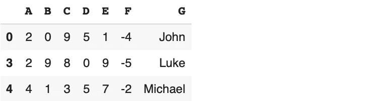
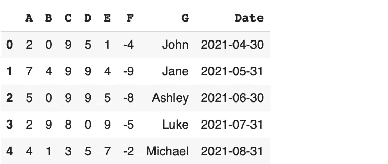

# 让你更经常使用熊猫查询功能的 10 个例子

> 原文：<https://towardsdatascience.com/10-examples-that-will-make-you-use-pandas-query-function-more-often-a8fb3e9361cb?source=collection_archive---------4----------------------->

## 发现它的全部潜力


法国人 Daphné Be 在 [Unsplash](https://unsplash.com/s/photos/filtering?utm_source=unsplash&utm_medium=referral&utm_content=creditCopyText) 上的照片

Pandas 是一个广泛使用的数据分析和操作库。它提供了许多功能和方法来简单有效地执行典型操作。

数据分析中的一个典型任务是过滤数据点(或观察值)。在使用表格数据的情况下，数据点由一行表示。我们有时需要根据一些特性(或列)值来过滤一行。

有[几种](/8-ways-to-filter-pandas-dataframes-d34ba585c1b8)熊猫方法来过滤数据点。在本文中，我们将重点介绍其中一种方法。就是查询功能。

让我们首先导入库并创建一个样本数据框。

```
import numpy as np
import pandas as pddf = pd.DataFrame(np.random.randint(10, size=(5,6)), columns=list("ABCDEF"))df
```


(图片由作者提供)

我们现在可以开始使用查询函数来过滤该数据框。

## 示例 1

查询函数允许以字符串形式应用过滤条件。与许多其他技术相比，它提供了更多的灵活性。

```
df.query("A > 4")
```


(图片由作者提供)

我们选择了 A 列中的值大于 4 的行。

## 示例 2

我们可以很容易地组合多个条件。

```
df.query("A > 4 and E == 5")
```


(图片由作者提供)

## 示例 3

也可以使用“或”逻辑来组合多个条件。

```
df.query("A > 2 or F > 4")
```


(图片由作者提供)

## 实例 4

“not”操作符也可以作为查询函数中过滤器的一部分来实现。

```
df.query("not (A > 2 or F > 4)")
```


(图片由作者提供)

## 实例 5

我们还可以在查询函数中使用简单的数学运算。

```
df.query("A*2 < 5")
```


(图片由作者提供)

## 实例 6

查询功能允许使用一些内置函数，这为我们提供了更多的灵活性。

例如，我们可以使用 abs 函数返回一个数字的绝对值。让我们首先将 F 列中的值转换为负整数，然后编写一个包含 abs 函数的查询。

```
df.F = -1 * df.Fdf.query("abs(F) > 6")
```


(图片由作者提供)

## 例 7

也可以使用排序(平方根)函数。

```
df.query("sqrt(A) > 2")
```


(图片由作者提供)

## 实施例 8

逻辑运算符也可用于过滤字符串。让我们添加一个包含字符串的列。然后，我们可以根据新列过滤数据框。

```
df["G"] = ["John", "Jane", "Ashley", "Luke", "Michael"]df.query("G > 'Jo'")
```



## 示例 9

在处理日期和时间时，查询功能也很方便。我们可以在 dt 访问器下实现一些函数。为了演示这个功能，我们需要一个包含日期或时间的列。

```
df["Date"] = pd.date_range(start="2021-04-05", periods=5, freq="M")df
```



(图片由作者提供)

假设我们需要选择月份值大于 6 的行。下面是我们如何完成这项任务。

```
df.query("Date.dt.month > 6")
```


(图片由作者提供)

## 实例 10

我们还可以创建一个比较两个或更多列的条件。

```
df.query("A + B < C")
```


(图片由作者提供)

## 结论

过滤值是数据分析和操作的重要部分。我们可能对符合特定条件的值感兴趣。类似地，我们可能想要基于一组过滤器来探索值。

Pandas 为过滤数据帧提供了丰富的技术选择。查询功能就是其中之一，它在很多情况下都很方便。

感谢您的阅读。如果您有任何反馈，请告诉我。