# 使用 Python Seaborn 掌握分布图的 10 个示例

> 原文：<https://towardsdatascience.com/10-examples-to-master-distribution-plots-with-python-seaborn-4ea2ceea906a?source=collection_archive---------5----------------------->

## 分布图对 EDA 至关重要


莎伦·皮特韦在 [Unsplash](https://unsplash.com/s/photos/flowers?utm_source=unsplash&utm_medium=referral&utm_content=creditCopyText) 上的照片

任何数据产品的第一步都应该是理解原始数据。对于成功和高效的产品，这一步占据了整个工作流程的很大一部分。

有几种方法用于理解和探索数据。其中之一是创建数据可视化。它们帮助我们探索和解释数据。

通过创建适当且设计良好的可视化，我们可以发现数据中的底层结构和关系。

分布图对于探索性数据分析至关重要。它们帮助我们检测异常值和偏斜度，或者获得集中趋势(平均值、中值和众数)的测量的概述。

在本文中，我们将通过 10 个例子来掌握如何使用 Python 的 Seaborn 库创建分布图。举例来说，我们将使用 Kaggle 上的墨尔本房屋[数据集](https://www.kaggle.com/dansbecker/melbourne-housing-snapshot)中的一个小样本。

让我们从导入库和将数据集读入 Pandas 数据框开始。

```
import pandas as pd
import seaborn as sns
sns.set(style="darkgrid", font_scale=1.2)df = pd.read_csv(
  "/content/melb_housing.csv", 
  usecols=["Regionname", "Type", "Rooms", "Distance", "Price"]
)df.head()
```

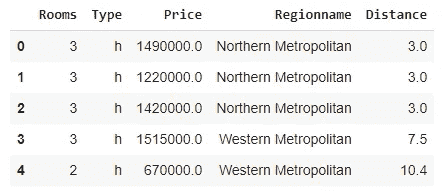

(图片由作者提供)

该数据集包含墨尔本房屋的一些特征及其价格。

Seaborn 的 displot 功能允许创建 3 种不同类型的分布图，它们是:

*   柱状图
*   Kde(核密度估计)图
*   Ecdf 图

我们只需要调整 kind 参数来选择绘图的类型。

## 示例 1

第一个例子是创建一个基本的直方图。它将连续变量的值范围划分为离散的区间，并显示每个区间中有多少个值。

```
sns.displot(
  data=df,
  x="Price",
  kind="hist",
  aspect=1.4
)
```

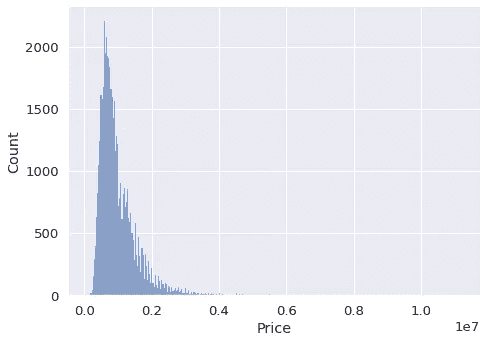

(图片由作者提供)

我们将数据框的名称传递给数据参数。x 参数采用要绘制的列名。aspect 参数调整大小的宽高比。也可以改变高度。

## 示例 2

在第一个例子中，我们清楚地看到 price 列中有异常值。柱状图右侧有一条长尾，表明很少有价格非常高的房子。

减少这种异常值影响的一种方法是取值的对数。displot 函数可以使用 log_scale 参数执行此操作。

```
sns.displot(
  data=df,
  x="Price",
  kind="hist",
  aspect=1.4,
  log_scale=10
)
```

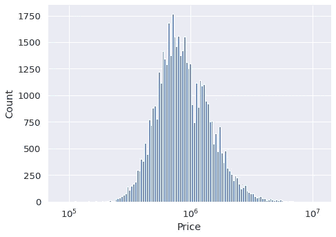

(图片由作者提供)

价格表示为 10 的幂。我们现在对房价的分布有了更好的了解。

## 示例 3

我们还可以调整直方图中的仓数量。在某些情况下，最好使用较少数量的箱，这样我们可以获得更有条理的概览。

用于此调整的参数是箱。

```
sns.displot(
  data=df,
  x="Price",
  kind="hist",
  aspect=1.4,
  log_scale=10,
  bins=20
)
```

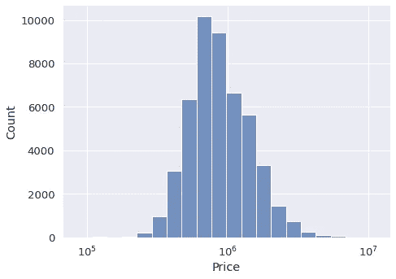

(图片由作者提供)

## 实例 4

数据集还包含分类变量。例如,“类型”列有 3 个类别，分别是 h(住宅)、t(城市住宅)和 u(单位)。我们可能需要分别检查每种类型的分布情况。

一种选择是在同一可视化中用不同的颜色显示它们。我们只需要将列名传递给 hue 参数。

```
sns.displot(
  data=df,
  x="Price",
  hue="Type",
  kind="hist",
  aspect=1.4,
  log_scale=10,
  bins=20
)
```

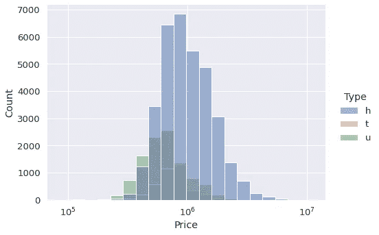

(图片由作者提供)

该图为我们提供了两条信息:

*   每类房屋的数量。h 类是最大的一类。
*   每类房屋的价格分布。

## 实例 5

另一种分别检查每个类别分布的方法是创建单独的图。对于这项任务，我们可以使用 col 或 row 参数。在给定的列中，每个类别都有一个子情节。

```
sns.displot(
  data=df,
  x="Price",
  col="Type",
  kind="hist",
  aspect=1.4,
  log_scale=10,
  bins=20
)
```

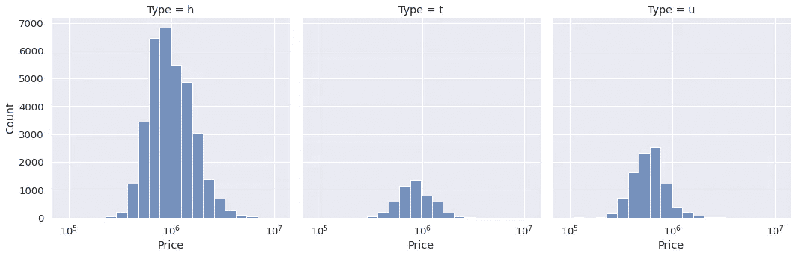

(图片由作者提供)

## 实例 6

displot 函数还允许生成二维直方图。因此，我们得到了关于 2 列中的值的观察值(即行)分布的概述。

让我们使用 price 和 distance 列创建一个。我们只是将列名传递给 x 和 y 参数。

```
sns.displot(
  data=df,
  x="Price",
  y="Distance",
  col="Type",
  kind="hist",
  height=5,
  aspect=1.2,
  log_scale=(10,0),
  bins=20
)
```

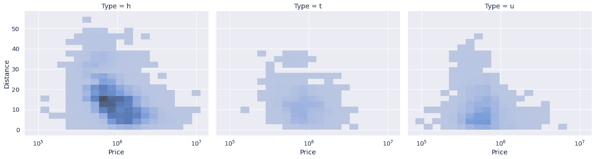

(图片由作者提供)

较暗的区域更密集，因此包含更多的观察结果。两列看起来都呈正态分布，因为密集区域位于中心。

您可能已经注意到，我们使用了一个元组作为 log_scale 参数的自变量。因此，我们可以为每一列传递不同的标度。

## 例 7

Kde 图也可以用来可视化变量的分布。它们与直方图非常相似。然而，kde 图使用连续的概率密度曲线而不是离散的箱来表示分布。

kind 参数设置为“kde ”,以生成 kde 图。

```
sns.displot(
  data=df,
  x="Price",
  kind="kde",
  aspect=1.4,
  log_scale=10
)
```

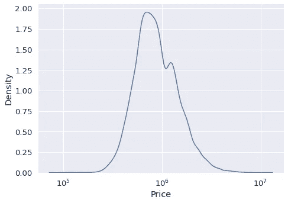

(图片由作者提供)

## 实施例 8

与直方图类似，kde 图可以针对不同的类别单独绘制。我们的数据集包含房屋的区域信息。让我们来看看不同地区的价格变化。

```
sns.displot(
  data=df,
  x="Price",
  hue="Regionname",
  kind="kde",
  height=6,
  aspect=1.4,
  log_scale=10
)
```

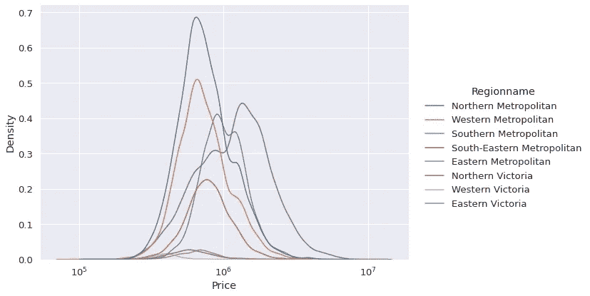

(图片由作者提供)

南部大都市地区似乎有最高的平均房价。

## 示例 9

检查变量分布的另一种方法是使用 ecdf 图。它表示低于给定列中每个唯一值的观察值的比例或计数。

这是一种视觉化的累积总和。因此，我们能够看到更密集的值范围。

```
sns.displot(
  data=df,
  x="Distance",
  kind="ecdf",
  height=6,
  aspect=1.4,
  stat="count"
)
```

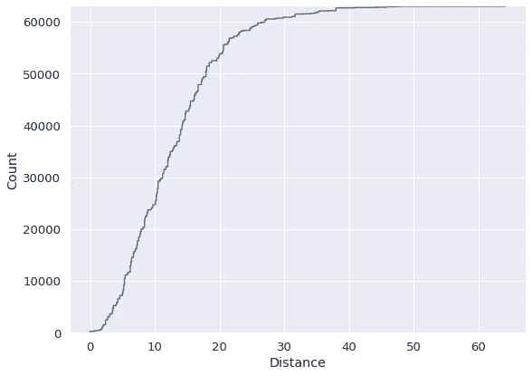

(图片由作者提供)

曲线斜率高的值范围由更多的观察值填充。例如，我们没有很多房子的距离高于 30。与此相反，在 10 到 15 的距离范围内有很多房子。

## 实例 10

ecdf 绘图也支持色调、颜色和行参数。因此，我们可以区分一列中不同类别之间的分布。

```
sns.displot(
  data=df,
  x="Distance",
  kind="ecdf",
  hue="Type",
  height=6,
  aspect=1.4,
  stat="count"
)
```

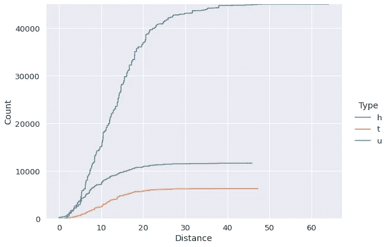

(图片由作者提供)

## 结论

对于数据分析或机器学习任务，了解变量(即特征)的分布非常重要。我们如何处理给定的任务可能取决于分布。

在本文中，我们看到了如何使用 Seaborn 的 displot 函数来分析价格和距离列的分布。

感谢您的阅读。如果您有任何反馈，请告诉我。