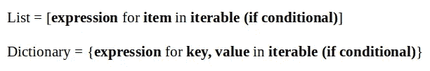
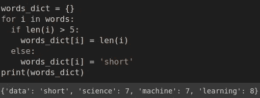
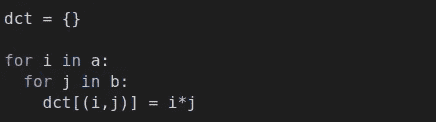

# 掌握 Python 字典理解的 10 个例子

> 原文：<https://towardsdatascience.com/10-examples-to-master-python-dictionary-comprehensions-7aaa536f5960?source=collection_archive---------12----------------------->

## 综合实践指南


照片由[皮斯特亨](https://unsplash.com/@pisitheng?utm_source=unsplash&utm_medium=referral&utm_content=creditCopyText)在 [Unsplash](https://unsplash.com/s/photos/dictionary?utm_source=unsplash&utm_medium=referral&utm_content=creditCopyText) 上拍摄

一个[字典](/12-examples-to-master-python-dictionaries-5a8bcd688c6d)是一个无序的键值对集合。每个条目都有一个键和值。字典可以被认为是一个有特殊索引的列表。


(图片由作者提供)

这些键必须是唯一且不可变的。所以我们可以使用字符串、数字(int 或 float)或元组作为键。值可以是任何类型。

在本文中，我们将关注字典理解，这是一种使用可重复项创建字典的方法。逻辑与列表理解相同，但由于词典的结构不同，语法有所不同。

为了了解列表和字典理解之间的相似性，我将在前两个例子中创建一个列表和字典理解。

## 示例 1

```
words = ['data', 'science', 'machine', 'learning']#list comprehension
[len(i) for i in words]
[4, 7, 7, 8]#dictionary comprehension
{i:len(i) for i in words}
{'data': 4, 'science': 7, 'machine': 7, 'learning': 8}
```

我们有一个 iterable，它是一个名为“words”的列表。在列表理解中，我们创建一个包含单词长度的列表。在字典理解中，我们需要基于迭代指定键和值。返回的字典包含作为键的单词和作为值的单词长度。

列表和词典理解的基本语法是:



(图片由作者提供)

## 示例 2

对于本例，我们将使用附加条件重复第一个示例中的任务。列表和字典理解都接受 if/else 条件语句。

```
words = ['data', 'science', 'machine', 'learning']#list comprehension
[len(i) for i in words if len(i) > 5]
[7, 7, 8]#dictionary comprehension
{i:len(i) for i in words if len(i) > 5}
{'science': 7, 'machine': 7, 'learning': 8}
```

返回的变量只包含长度超过 5 个字符的单词。

## 示例 3

在这个例子中，我们将稍微增加条件语句的复杂性。

```
words_dict = {i:len(i) if len(i) > 5 else 'short' for i in words}print(words_dict)
{'data': 'short', 'science': 7, 'machine': 7, 'learning': 8}
```

我们在字典理解中实现了 if/else 条件。如果长度大于 5，则该值成为长度。否则，我们将单词“short”指定为值。

使理解吸引人的是它们的一行语法。它看起来非常简单，比循环的等价形式更容易理解。例如，上面理解的循环的等价形式是:



对于循环版的字典理解(图片由作者提供)

## 实例 4

我们可以在字典理解中迭代两个条目。

```
words = ['data', 'science', 'machine', 'learning']
values = [5, 3, 1, 8]dict_a = {i:j for i, j in zip(words, values)}print(dict_a)
{'data': 5, 'science': 3, 'machine': 1, 'learning': 8}
```

键值对是通过对键和值的单独列表进行迭代来创建的。zip 函数通过组合每个列表中的项目来返回元组的可迭代表。

## 实例 5

我们还可以在迭代元组列表时对值设置条件。

```
words = ['data', 'science', 'machine', 'learning']
values = [5, 3, 1, 8]dict_a = {i:j for i, j in zip(words, values) if j > 4}print(dict_a)
{'data': 5, 'learning': 8}
```

## 实例 6

我们还可以在键值对上应用转换。

```
dict_b = {i.upper():j**2 for i, j in zip(words, values)}print(dict_b)
{'DATA': 25, 'SCIENCE': 9, 'MACHINE': 1, 'LEARNING': 64}
```

键和值都使用简单的 Python 方法进行修改。

## 例 7

我们可以通过使用 items 方法来访问字典中的键值对。

```
print(dict_b.items())
dict_items([('DATA', 25), ('SCIENCE', 9), ('MACHINE', 1), ('LEARNING', 64)])
```

我们可以使用现有字典中的条目作为字典理解中的条目。它允许我们基于现有的字典创建字典，并修改键和值。

```
dict_c = {i.lower():j%2 for i, j in dict_b.items()}print(dict_c)
{'data': 1, 'science': 1, 'machine': 1, 'learning': 0}
```

## 实施例 8

Python 的 enumerate 函数可用于创建基于列表的元组的 iterable。每个元组包含列表中具有递增整数值的项目。

```
names = ['John', 'Jane', 'Adam', 'Eva', 'Ashley']list(enumerate(names))
[(0, 'John'), (1, 'Jane'), (2, 'Adam'), (3, 'Eva'), (4, 'Ashley')]
```

我们可以在字典理解中使用枚举功能。

```
dict_names = {i:len(j) for i, j in enumerate(names)}print(dict_names)
{0: 4, 1: 4, 2: 4, 3: 3, 4: 6}
```

如果您只想创建一个基于元组列表的字典，而不对值进行任何修改，那么您不需要使用理解。dict 函数将完成这项工作。

```
dict(enumerate(names))
{0: 'John', 1: 'Jane', 2: 'Adam', 3: 'Eva', 4: 'Ashley'}
```

## 示例 9

这个例子包含的条件比上一个稍微复杂一些。假设我们有下面的字典和列表。

```
lst = ['data','science','artificial', 'intelligence']dct = {'data': 5, 'science': 3, 'machine': 1, 'learning': 8}
```

我们想使用上面定义的列表和字典创建一个新字典。新字典的键将是列表中的元素，所以我们将遍历列表中的元素。如果该元素也在字典中，则该值将是字典中该键的值。否则，该值将是密钥的长度。

```
{i:dct[i] if i in dct else len(i) for i in lst}{'artificial': 10, 'data': 5, 'intelligence': 12, 'science': 3}
```

单词 artificial 不在字典中，所以它的值是单词的长度。单词 data 在字典中，所以它的值取自字典。

## 实例 10

字典的键必须是不可变的，因此元组可以用作键。字典理解允许通过实现嵌套循环来生成元组的关键字。

```
a = [1,2,3,4]
b = [5,6,7]dct = {(i,j):i*j for i in a for j in b}print(dct)
{(1, 5): 5,
 (1, 6): 6,
 (1, 7): 7,
 (2, 5): 10,
 (2, 6): 12,
 (2, 7): 14,
 (3, 5): 15,
 (3, 6): 18,
 (3, 7): 21,
 (4, 5): 20,
 (4, 6): 24,
 (4, 7): 28}
```

列表中的每一对条目都是字典中的一个键。该值是键中各项的乘积。

等效的 for 循环语法:



(图片由作者提供)

## 结论

字典是 Python 中非常重要的数据结构，在很多情况下都会用到。我们在这篇文章中做的例子将涵盖你需要知道的关于字典理解的大部分内容。它们会让你在使用和创建新词典时感到舒适。

感谢您的阅读。如果您有任何反馈，请告诉我。