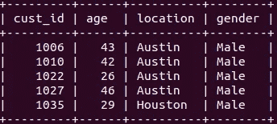
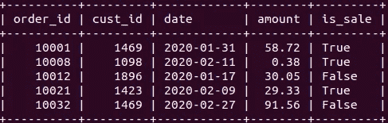

# 理解 SQL 视图的 10 个示例

> 原文：<https://towardsdatascience.com/10-examples-to-understand-sql-views-bcbc999a54e7?source=collection_archive---------14----------------------->

## MySQL 实用指南


保罗·斯科鲁普斯卡斯在 [Unsplash](https://unsplash.com/s/photos/view?utm_source=unsplash&utm_medium=referral&utm_content=creditCopyText) 上的照片

SQL 是一种编程语言，用于管理和维护存储在关系数据库中的数据。关系数据库由带有标记行和列的表组成。

SQL 最常见的操作之一是查询数据库以检索数据。典型的关系数据库包含许多表，这些表通过称为外键的列中的共享值相互关联。

随着表数量的增加，编写查询开始变得复杂。此外，我们通常需要在从数据库中检索时过滤或转换数据。因此，我们最终要编写复杂冗长的查询来获取所需的数据。

编写一两次复杂的查询是可行的。但是，如果我们需要多次使用它，就需要一种更实用的方法。一种选择是将查询保存在文本或 sql 文件中，并在需要时复制它。这很好，但是有一个更好的选择，那就是 **SQL 视图**或简单的**视图。**

视图是存储的查询。视图保存在数据库服务器中，因此我们不必从其他文件中复制它们。我们通过为查询指定一个名称来创建视图。

让我们从一个例子开始，这样我们就对视图的样子有了一个概念。之后，我将详细阐述示例，并更详细地解释观点。

我已经用模拟数据创建了一个客户和订单表。这些表包含一些关于企业客户及其订单的信息。以下是表格的概述:



客户表(图片由作者提供)



订单表(作者图片)

这些表通过客户 id (cust_id)列相关联，因此我们使用客户 id 列来连接这些表。

考虑这样一种情况，需要找到每个位置的总订单量。下面是完成这项任务的查询。

```
#Example 1mysql> select customer.location, sum(orders.amount)
    -> from customer
    -> join orders
    -> on customer.cust_id = orders.cust_id
    -> group by customer.location;+----------+--------------------+
| location | sum(orders.amount) |
+----------+--------------------+
| Austin   |            9811.09 |
| Dallas   |           23288.40 |
| Houston  |           12978.33 |
+----------+--------------------+
```

我们从 customer 表中选择 location，从 orders 表中选择 sum amount。这些表在客户 id 列上联接。group by 子句按位置对条目(即行)进行分组。

我们可以使用如下视图存储该查询:

```
#Example 2mysql> create view totalAmount
    -> as
    -> select customer.location, sum(orders.amount)
    -> from customer
    -> join orders
    -> on customer.cust_id = orders.cust_id
    -> group by customer.location;
```

“create view”语句与视图的名称一起使用。然后，我们在“as”关键字后编写查询。

正如您所注意到的，创建视图不会返回任何内容，或者不会执行 select 语句。视图只有在被调用时才会生成结果集。

我们可以像查询表一样调用视图。这是如何做到的:

```
#Example 3mysql> select * from totalAmount;+----------+--------------------+
| location | sum(orders.amount) |
+----------+--------------------+
| Austin   |            9811.09 |
| Dallas   |           23288.40 |
| Houston  |           12978.33 |
+----------+--------------------+
```

上面的例子使视图看起来像表格。就查询而言，视图可以被认为是表。但是，它们不存储任何数据。一旦执行了视图，SQL 就从视图中指定的表中检索数据。因此，视图有时被称为虚拟表。

**注意**:需要强调的是，我们使用 MySQL 作为关系数据库管理系统(RDBMS)。尽管不同 RDBMs 之间的 SQL 语法基本相同，但可能会有一些细微的差别。

我们可以使用 where 子句过滤视图。

```
#Example 4mysql> select * from totalAmount
    -> where location = "Austin";+----------+--------------------+
| location | sum(orders.amount) |
+----------+--------------------+
| Austin   |            9811.09 |
+----------+--------------------+
```

我们只能根据视图中包含的列进行筛选。例如，orders 表有一个日期列，但不能用于筛选。totalAmount 视图只涉及金额的位置和总和。这是我们可以用于过滤的仅有的两个值。

让我们创建另一个视图，它允许基于日期和金额列进行筛选。

```
#Example 5mysql> create view cityOrders
    -> as
    -> select
    ->   customer.location,
    ->   orders.date,
    ->   orders.amount
    -> from customer
    -> join orders
    -> on customer.cust_id = orders.cust_id;
```

cityOrders 视图引用了三列，即 customer 表中的 location 和 Orders 表中的 date 和 amount。

我们可以使用 cityOrders 视图来计算特定日期每个地点的总订单量。

```
#Example 6mysql> select location, sum(amount)
    -> from cityOrders
    -> where date = '2020-01-31'
    -> group by location;+----------+-------------+
| location | sum(amount) |
+----------+-------------+
| Austin   |       77.94 |
| Dallas   |      260.77 |
| Houston  |       72.46 |
+----------+-------------+
```

我们还可以计算每个城市高于特定金额的订单数量。

```
#Example 7mysql> select location, count(amount)
    -> from cityOrders
    -> where amount > 20
    -> group by location;+----------+---------------+
| location | count(amount) |
+----------+---------------+
| Austin   |           160 |
| Dallas   |           383 |
| Houston  |           205 |
+----------+---------------+
```

尽管 totalAmount 和 cityOrders 视图都引用了 Amount 列，但我们不能在 totalAmount 视图中使用单个订单金额进行筛选。原因是 totalAmount 视图指的是金额的总和，而不是单个订单的金额。

我们可以使用“alter view”或“create or replace view”语句来更新视图。区别在于视图必须存在才能使用“alter view”语句。如果我们不确定视图是否已经存在，我们应该使用“创建或替换视图”语句。

让我们修改 cityOrders 视图。

```
#Example 8mysql> alter view cityOrders
    -> as
    -> select
    ->   customer.location,
    ->   customer.age,
    ->   orders.date,
    ->   orders.amount
    -> from customer
    -> join orders
    -> on customer.cust_id = orders.cust_id;
```

我们已经将 customer 表中的 age 列添加到 cityOrders 视图中。我们现在也可以使用年龄进行过滤或聚合。以下查询返回 30 岁以上客户的平均订单额。它还根据位置对结果进行分组。

```
#Example 9mysql> select location, avg(amount)
    -> from cityOrders
    -> where age > 30
    -> group by location;+----------+-------------+
| location | avg(amount) |
+----------+-------------+
| Austin   |   53.740153 |
| Dallas   |   47.069703 |
| Houston  |   49.287771 |
+----------+-------------+
```

如果我们不再需要一个视图，我们可以删除它。语法与删除表相同。

```
#Example 10mysql> drop view totalAmount;
Query OK, 0 rows affected (0.00 sec)mysql> select * from totalAmount;
ERROR 1146 (42S02): Table 'practice.totalAmount' doesn't exist
```

## 结论

视图是 SQL 的一个重要概念。使用视图有很多好处。首先，它简化了复杂的查询。我们所做的例子包括连接两个表。对于包含许多表的大型数据库，查询可能会非常复杂。因此，视图提供了一种更实用的方法。

视图也使我们免于一遍又一遍地编写相同的查询。假设我们有一个非常复杂的例行计算，涉及多个过滤、聚合和嵌套的 select 语句。将它放在视图中比每次都编写查询要好得多。

我们还可以使用视图更好地控制对数据库的访问。表格可能包含只有特定员工才能访问的敏感信息。使用视图，我们可以只授予对表中特定列的访问权。

感谢您的阅读。如果您有任何反馈，请告诉我。