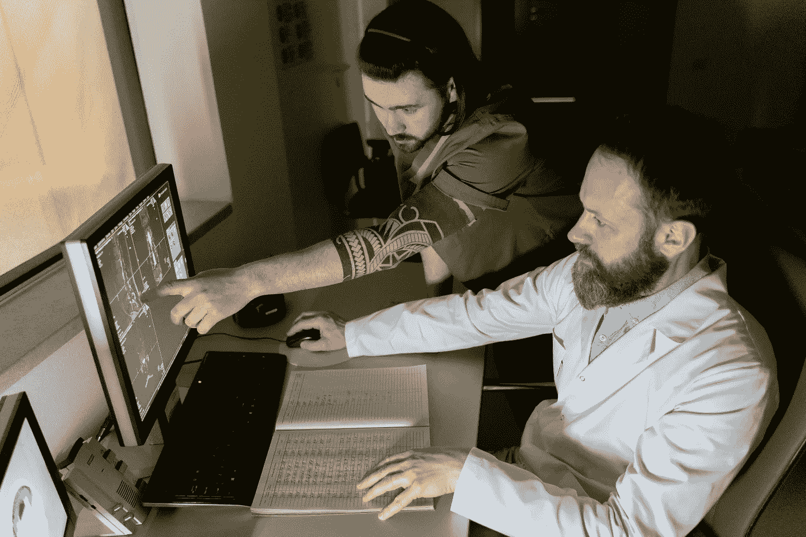

# 医疗保健中机器学习应用的 10 个激动人心的例子

> 原文：<https://towardsdatascience.com/10-exciting-examples-of-machine-learning-applications-in-healthcare-1c4de7b744e6?source=collection_archive---------13----------------------->

## 行业使用案例

## *为数据科学家提供最激动人心工作的行业*

照片由 [**玛特制作**](https://www.pexels.com/@mart-production) 发自 [**像素**](https://www.pexels.com/photo/technology-computer-head-room-7088521/)

全球医疗保健支出占全球国内生产总值的 10.3%，或全球近 9 万亿美元，预计未来几年的年增长率为 3.9%。

这些数字令人印象深刻，毫不奇怪，数字化和新技术正在彻底改变医疗保健行业。

人们拥有可穿戴设备，并使用技术来监控自己的健康。据估计，2022 年可穿戴设备的数量将达到 10 亿，市场规模将达到 930 亿美元。

远程医疗正在极大地扩展，现在近 30%的消费者首先进行虚拟就诊。医疗设备变得更加先进，并集成了人工智能来支持医生和内科医生。最后，为了改善提供商的服务和增强客户体验，数据生态系统是通过端到端数据集成构建的。

因此，护理模式正在发生变化，我们的健康和福祉变得由数据驱动。

医疗保健行业可分为以下 5 个领域。

*   医疗保健提供者和机构，如医院、手术中心、疗养院或医生和内科医生
*   医疗设备和装置，如诊断设备、矫形设备或医疗器械
*   分销商和批发商，如药店或医疗保健提供商的药品和设备分销商
*   健康保险和管理式医疗
*   制药、生命科学和生物技术

新冠肺炎加快了所有这些部门的创新和数字化，消费者和患者体验到了更多的便利和好处。

新冠肺炎疫苗的快速发展只能归功于数据驱动的发展方法。通过集成图像识别算法来检测微小异常(如癌症转移),放射诊断的质量得到了提高。

从社交媒体帖子到可穿戴数据和医疗记录，各种数据被用来预测健康状况和疾病。

但不仅仅是消费者一方受到了干扰。医疗从业者和保健专业人员也在改变他们的行为。

医疗游民是越来越多的人群，甚至[平台也存在](https://nomadhealth.com/)。数据可用性和提取的信息是这种发展的关键驱动力。它从经验和时间表匹配诊断工具开始。

因此，与健康相关的数据正在激增，医疗保健正处于相当大的混乱之中。

对工作平台的分析显示，大约 1/3 的开放数据科学家职位在医疗保健行业。毫不奇怪，看看 LinkedIn 上的数据科学家档案就会发现，这个行业的数据科学家几乎和科技行业一样多。

大多数有抱负的高级数据科学家只关注科技行业，错过了一个令人兴奋的行业。另外还有一个准入门槛，因为需要非常专业的知识。除了商业头脑的重要性之外，还需要对(生物)统计、因果关系和模型准确性有良好的经验，这超出了通常的基本要求。算法的结果影响人类的健康，在极端情况下，可以决定生死。

然而，对数据科学家的高需求给了一个独特的机会，可以在没有该领域经验的情况下进入这个令人兴奋的行业。这是一个很好的机会，我强烈推荐。

我在医疗保健行业担任了多年的数据科学顾问，为上述所有五个行业提供服务。

在下文中，我将展示 10 个机器学习应用的案例研究，涵盖所有五个医疗保健领域。

## **医疗保健提供者和机构**

## **1。** **癌症患者住院决策支持**

癌症患者遭受许多疾病的继发性障碍和治疗的副作用。如果或何时特定的症状如体温或疾病是由癌症疾病、治疗或其他疾病如流感或感冒引起的，通常并不明显。更具挑战性的是决定病人何时需要去医院。

患者通常等待太长时间，这导致两个问题:要么他们去医院太晚，使他们的健康处于高风险中，导致更长的恢复期和更高的费用，要么他们需要在急诊室的正常开放时间之外去医院，并由不熟悉他们病史的医疗专业人员治疗，最终导致错误或不必要的治疗。

因此，根据患者输入的可穿戴数据和信息，移动应用程序会在仪表盘上给出指示和进一步的细节，以便患者可以更好、更早地决定是否需要去医院。

急性疾病管理中的机器学习支持不仅是癌症患者的发展趋势。

应用的机器学习方法有 XGBoost(一种梯度提升算法，也是 Python、Julia、Java 等的库。)，随机森林，支持向量机。当足够的数据可用时，递归神经网络给出极好的结果。

## **2。** **个性化健康治疗**

个性化治疗在医学上并不新鲜。古希腊人已经致力于开发个性化的疗法和药物。随着基于更大人口规模的更多健康数据、更精细的人均数据(如基因型和表型)以及连续数据(如心跳频率或连续血糖监测)的可用，向数据驱动型决策的转变可能会实现。

一个例子是糖尿病的个性化治疗，其中机器学习算法改善了治疗。在全球范围内，超过 4 亿人患有糖尿病。糖尿病会导致失明、心脏病发作和中风，以及肾衰竭等。

糖尿病药物治疗的有效性取决于个人生活方式、健康和身体活动的许多变量。此外，这些因素会随着时间而变化。由于医学的快速发展，治疗方法也在改变。

因此，药物治疗的最初决定是具有挑战性的，更需要不断的调整和完善。机器学习和深度学习算法越来越多地支持医生进行诊断和开出最有效的治疗方案。

支持向量机(SVM)、随机森林和 k-最近邻等方法用于临床和医疗决策支持或患者自我管理工具。逻辑回归和多层感知器支持个人治疗结果的预测。

## **医疗设备和器械**

## **3。** **减少诊断测试中的假阳性/假阴性**

在许多应用中，如来自传感器的警报，需要减少误报。假阳性意味着测试结果被错误地分类为特定条件存在，例如疾病，而它并不存在。然而，在医学上，假阴性同样重要。如果实际上有一个条件，假阴性表示不存在该条件。

让我们看一些例子来更好地理解这个问题。

乳腺癌是导致全球大多数女性死亡的癌症类型。利用当前的乳房扫描方法，已知 10%-30%的乳腺癌被遗漏，这导致放射科医生的阳性癌症标记率更高。这导致在随后的详细诊断中高达 30%的假阳性。在这种情况下，需要减少假阳性。

另一方面，肺癌的早期检测可以挽救许多生命。最初的诊断有高达两位数百分比的假阴性。在肺癌的情况下，需要减少假阴性并且不遗漏任何肺癌。

所以，要解决的问题是高度相关的，需要完全理解。

为了改善假阳性或假阴性，机器学习方法被应用于诊断结果。这些结果通过逻辑回归或随机森林进一步分类，这两种方法在这些医学应用中效果很好，如果它们是假阳性/假阴性的话。当大量数据可用时，例如新冠肺炎数据，卷积神经网络(CNN)给出了极好的结果并极大地提高了准确性。

## **4。** **医疗设备性能的提高和更高质量的维护**

随着技术和更复杂的机器学习和人工智能应用的兴起，电子医疗设备正在成为主流，这些应用极大地提高了结果的准确性。

医疗设备的例子有诊断设备，如计算机断层扫描仪、呼吸机、起搏器、心肺机、糖尿病监测工具或婴儿保育箱。这些设备提供了有关患者状况的重要测量值，医疗专业人员需要依靠正确的操作和测量。否则，将会导致患者严重受伤或死亡。

可以理解的是，这种医疗设备的使用需要监管机构的批准以及高度的安全性和质量保证。因此，这些设备的维护成本很高。

为了获得所需安全级别的印象，考虑一个设备 99.9%的可靠性，这似乎是相对较高的。我们的心脏每天跳动大约 10 万次。因此，在 99.9%的可靠性下，这将意味着我们平均每 1000 次心跳就会错过一次，或者说一天 100 次心跳，这是一个很高的数字。

因此，医疗设备需要更高的可靠性。

随着今天的数据可用性，机器学习算法被开发来支持性能和维护预测。值得一提的是，此类支持系统需要满足标准，如*IEC 60601-1-医疗电气设备-第 1 部分:基本安全和基本性能的一般要求，*这些标准增加了模型开发的复杂性。

ML 模型是基于 30-50 个变量开发的，如设备年龄、制造商、电压等技术措施、性能检查结果和过去的安全检查决定。

决策树的优势在于它们是可解释的，而且通常给出最准确的结果。其他使用的方法有随机森林、支持向量机和朴素贝叶斯。由于所需的可解释性，没有使用神经网络/深度学习算法。

## **分销商和批发商**

## **5。** **疫苗冷链储存与配送质量控制**

许多药物，尤其是疫苗，需要储存在冰箱里。最近的例子是新冠肺炎疫苗，如辉瑞/BioNTech 或 Moderna，它们必须保存在-80 至-60 摄氏度的冰箱中。这种所谓的冷链必须在从生产工厂到全球交付的整个物流过程中得到保证，并在药剂师或医生为患者使用时得到保证。

管理这样一个冷链是非常复杂的。它始于包装和使用多少干冰来确保正确的温度。当货物在卡车上或货物在飞机上几个小时时，温度需要保持在一定范围内。最后，它必须到达最终用户，通常是药剂师和医生，在那里储存直到使用。

今天，安装了许多传感器和先进的跟踪技术来测量温度和 GPS 位置。诸如交通/空中交通数据、道路状况、机场信息、车辆规格、天气状况和包装数据之类的其他数据被集成。

机器学习被用来解决几个挑战。它从交通和空中交通预测以及优化物流路线开始。基于这些条件，可以预先预测货物的温度下降并优化包装。输送过程中的连续测量能够实时监控温度并预测进一步的温度下降。尤其是当意外延迟发生时，可以预测何时需要在交付期间进行干预。

这一应用领域仍处于起步阶段，还没有一套明确的方法在特定情况下是优越的。因此，所有不同的监督、非监督、半监督和集成学习方法都得到了测试和应用。

## **6。** **药品需求预测**

目前正在开发的另一个更复杂的数据驱动方法领域是药物需求预测。多年来，预测一直基于简单的统计数据、历史销售数据和时间序列模型，如移动平均线或 ARIMA。

与消费品相比，制药业有几个特点，使得预测更加复杂。制药业受到严格监管。因此，监管和不断变化的监管会极大地影响需求。例如，当生产非专利药物时，专利和专利到期可以完全改变市场竞争。

与政府的特殊合同或特殊合同条件，例如，对于新冠肺炎疫苗，所有政府都有自己与生产商的特殊条件和价格，某一药物的新研究成果，或社会媒体的宣传，无论是积极的还是消极的，都对需求产生重大影响。

药品有严格的有效期，因此不能提前很长时间生产。但是生产过程，包括所有的法规和质量要求、强制性认证过程和法规批准，需要提前很长时间计划和执行。因此，生产可能性和需求过程之间的反应时间有很大差距。

一个例子是流感疫苗的生产，从春天开始，到秋天交货。如果像 2020 年那样，对流感疫苗有更高的需求，这种需求在 6 个月之前无法满足。

整合社交媒体数据为使用所有自然语言处理方法的机器学习开辟了一个巨大的领域。如果信息一旦被提取，例如，对特定药物的情绪，你需要预测它在接下来的，例如，90 天。情绪水平显示了对一种药物的接受程度和需求程度。这些方法从回归模型到基于树的 boosting 方法，不同核方法的支持向量机，再到神经网络。

## **健康保险和管理式医疗**

## **7。** **数字健身教练**

缺乏锻炼会显著增加患糖尿病、心血管疾病、癌症、高血压、肥胖症和精神疾病的风险。另一方面，每周超过一小时的定期体育活动可以预防这些疾病，并使死亡率减半。

这为健康保险公司节省了大量成本，尤其是对整个社会而言。因此，有很多努力来激励人们进行有规律的体育活动。

另一方面，这是所有可穿戴设备的趋势。可穿戴设备的好处在于，它们可以持续测量健康相关因素，并实现数据驱动的教练支持。

一个重要的方面是推荐是个性化的。例如，一个几年不运动的人需要其他建议和激励，而不是一个已经有高水平活动的运动员，但可能需要一些睡眠或营养管理方面的指导。

机器学习是提供持续和实时的个性化辅导和激励系统的重要工具，以便基于活动的日常表现给出建议。

首先，必须将人们划分为响应性群体。例如，想要开始活动但需要外部推动的人，已经做了很少活动但需要被激励去做更多活动的人，等等。应用标准分类算法。

此外，根据个人的进步，必须给出进一步的建议。身体活动的预测是通过逻辑回归、AdaBoost、决策树、随机森林、支持向量机和神经网络来完成的。特别是对于行为改变的建议，使用类似长短期记忆(LSTM)的递归神经网络方法。

## **8。** **儿科护理质量改进**

保健服务的质量和治疗复杂疾病的可能性正在不断提高。尽管如此，仍然存在许多挑战，特别是基于个体特征的治疗剂量和持续时间，或针对没有许多临床研究可用的患者群体，如儿童。

幼儿药物和疗法的剂量仍然具有挑战性。剂量太高会导致永久性损伤，而剂量太低会延迟恢复并导致继发性疾病。这两种情况都可能导致死亡。此外，儿童的免疫系统没有得到充分训练，对治疗的反应可能不同于成人的反应。此外，儿童通常不能用语言表达疾病状态，以致于发现不良发展为时已晚。

因此，在过去的几年里，机器学习已经被纳入儿科护理，并在预测儿童的正确和个性化治疗方面取得了巨大成功。它仍处于起步阶段，具有很大的发展潜力。

充分利用其潜力的主要障碍之一是缺乏或没有足够的可用于检测和预测复杂模式的方法的数据。因此，目前使用更简单的方法。

首先，应用类似 k-means 的聚类算法来确定不同的群组。然后，不同队列的特征，如治疗时间、死亡率等。，进行了分析。当我们在关键健康领域工作时，队列的特征通过例如卡方检验(分类变量)和例如 Wilcoxon-Mann-Whitney 检验(连续变量)进行相互检验。

之后，应用各种分类算法，而交叉验证的随机森林是最常用的方法。

基因组数据在儿科护理中已经有一些应用，其中使用了深度学习方法。但这只是开始。

## **制药、生命科学和生物技术**

## **9。** **糖尿病的早期预测**

世卫组织估计，全球约有 4 . 22 亿人患有糖尿病，每年有 160 万人死于糖尿病。

糖尿病的永久疗法并不存在，也无法逆转。此外，糖尿病导致严重的继发性疾病，如心脏病和中风、肾衰竭、神经损伤和肝脏脂肪变性，此外，这显著增加了肝癌的可能性。

因此，预测糖尿病并提前采取措施将预防许多疾病和死亡，并提高生活质量。

幸运的是，已经有几个模型和应用程序可以做到这一点。独立变量是例如血液中的葡萄糖浓度、血压、皮肤厚度、胰岛素、体重指数、年龄、工作类型等。应用 k 倍交叉验证。然而，像线性回归、决策树、随机森林、朴素贝叶斯或支持向量机这样的所有方法的准确度都在 75%到 80%之间，而具有两个或三个隐藏层的神经网络可以达到高达 90%的准确度。

糖尿病的应用已经给出了可靠的结果。在这一成功的基础上，对更复杂的疾病如阿尔茨海默病和多发性硬化症的预测正在发展中。

## **10。** **临床药物开发成功的预测**

一种新药的开发平均花费 13 亿美元。临床开发阶段的[失败率为 90%](https://www.nature.com/articles/s41598-019-54849-w) 。

临床研究通常包含三个阶段。

第一阶段:第一阶段是在人体上测试药物。目的是测试安全性、最佳剂量和副作用。

*第二阶段:*在确定的治疗剂量下测试药物的疗效(对结果的影响)和副作用。

*第三阶段:*测试药物的安全性、有效性(疾病在实际应用中的影响)以及在确定的治疗剂量下的疗效。

每个阶段的成本都很高，在每个阶段的开始，都会对成功率进行一个估算。基于该比率，决定是继续还是放弃药物开发。

为了改进这种估计并做出更好的决策，应用了机器学习方法。

估计成功率的数据包含与临床试验相关的变量，包括来自前一阶段的数据、分子特性、监管环境、批准的药物(包括详细特征)、患者保护、医疗保健法、市场需求、公司和竞争对手信息、关于类似药物的信息，即，与类似疾病或类似设计类型相关的信息等。

主要应用且最成功的方法是基于树的方法。

数据形成复杂的模式，变量包含复杂的关系。因此，比应用的方法更重要的是特征选择、超参数调整和模型稳健性的各种测试，例如，用时间序列技术分析和减轻前瞻偏差。并且所有这些程序对于三个阶段中的每一个都不同。

这些程序相当复杂和耗时，需要项目的大部分时间，但需要确保可靠的预测结果。如果做得好，成功预测的准确率可以达到 90%。

## **连接圆点**

医疗保健中的机器学习是最具挑战性的任务之一。应用的探索和开发还处于起步阶段。这让数据科学家非常兴奋。

这 10 个应用令人印象深刻地展示了机器学习在医疗保健领域的潜力。是真正的三赢局面。

*   这是所有患者的胜利，他们在个体的基础上获得了更有效和高效的治疗
*   用有限的资源为更多的人提供更好的服务是医疗保健行业的胜利
*   对于数据科学家来说，这是一个双赢的局面，他们可以通过应用他们所有的知识和先进的方法来解决复杂而令人兴奋的问题。

我强烈推荐以数据科学家的身份进入医疗保健行业。

你喜欢我的故事吗？在这里你可以找到更多。

 [## 作为数据科学初学者应该避免的 10 个错误

towardsdatascience.com](/10-mistakes-you-should-avoid-as-a-data-science-beginner-ec1b14ea1bcd)  [## 7 份不需要任何编码技能的数据科学工作

### 没有编程经验如何进入数据科学领域

towardsdatascience.com](/7-awesome-data-science-jobs-where-you-dont-need-any-coding-skills-2e08d13e84e6)  [## 发现 9 个咨询领域，开始任何经验水平的激动人心的数据科学之旅

### 和更多指导，让您做好咨询准备

towardsdatascience.com](/discover-9-consultancy-segments-to-start-an-exciting-data-science-journey-for-any-experience-level-a972cb6b63e4)