# 您的 Streamlit ML 应用不可或缺的 10 个特性—已实现

> 原文：<https://towardsdatascience.com/10-features-your-streamlit-ml-app-cant-do-without-implemented-f6b4f0d66d36?source=collection_archive---------3----------------------->

## [简化技巧和窍门](https://towardsdatascience.com/tagged/streamlit-tips-and-tricks)

## 添加 Jupyter lab、会话管理、多页面、文件资源管理器、conda envs、并行处理和部署来简化应用程序

M uch 已经写了关于 [Streamlit 杀手级数据应用](https://towardsdatascience.com/tagged/streamlit)的文章，看到 Streamlit 是该领域发展最快的平台也就不足为奇了:

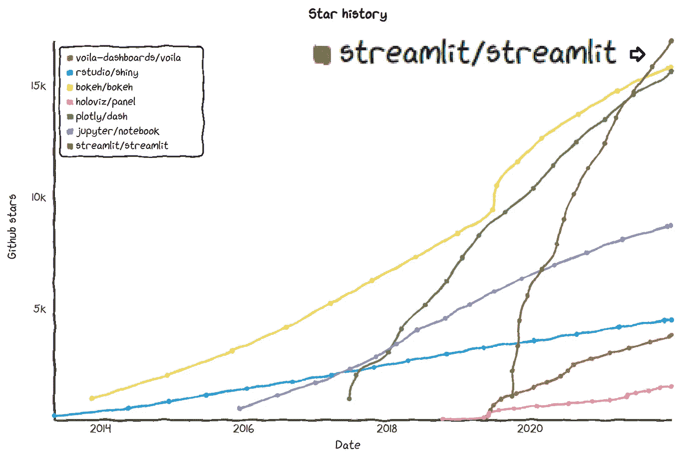

图片由[星史](https://star-history.com/#streamlit/streamlit&rstudio/shiny&plotly/dash&jupyter/notebook&voila-dashboards/voila&holoviz/panel&bokeh/bokeh)提供，作者编辑

**然而，使用 Streamlit 中的**[**CRISP-DM**](https://towardsdatascience.com/tagged/crisp-dm)**阶段开发一个对象分割应用程序让我意识到这个平台缺少了许多基本功能。这些功能在 Streamlit 的文章中很少被提及，可能是因为它们在后台做“脏活”,简单地说，没有那么迷人。尽管没有讨论这些功能，但我相信没有这些功能，您的数据应用程序不会成功。在我的例子中，一些功能是由应用程序的用户作为需求提出来的，而其他功能是在 R-shiny 平台上构建的，在那里我参与了另一个 AutoML 应用程序的开发。**

> Streamlit 缺少许多基本的应用程序功能。没有它们，你的应用程序就不会削减它。

**那么我为什么要写这篇文章呢？**抛开缺失的功能不谈，Streamlit 是一个很棒的平台(见[这里](https://awesome-streamlit.org/))，可能是几乎没有应用开发经验的人用 *Python* 开发应用的同类平台之一。因此，我尽我所能在网上搜索那些缺失的功能，谷歌搜索了几十个解决方案，并试图实现它们。此外，当网上没有好的解决方案时，我就自己开发功能。如果我已经花时间收集了这些特征，你不应该这样做。欢迎您坐下来，放松，享受旅程…

> 我已经花时间收集了这些特征，所以你不应该这样做。欢迎来到*坐好，放松，享受旅程……*

在深入研究代码之前，让我强调这里的大多数特性都是相互依赖的。不要担心——它们是按照依赖关系的顺序提到的，,所以每个前一个特性都是独立于后一个特性的。此外，值得一提的是，我本质上是一名数据科学家，而不是一名应用程序开发人员。因此，对于应用程序开发领域的概念，我可能不会使用合适的术语。然而，我原谅自己不精确，因为我相信你们大多数人都来自与我相似的背景，这意味着你精通 Python 和建立机器学习模型，但你对开发应用程序几乎一无所知。但是，如果您是一名经验丰富的开发人员，我在此为亵渎您的职业而道歉:)

所以，事不宜迟，这里有 10 个特点:

1.  [保存刷新和掉线工作](#7b09)
2.  [保存工作以备后用](#1bd6)
3.  [文件浏览器](#d121)
4.  [登录屏幕](#35fe)
5.  [多页面应用](#7438)
6.  [运行长时间并行计算](#f050)
7.  [使用不同环境的模型](#13f4)
8.  [动态绘制训练结果](#907e)
9.  [嵌入 Jupyter 并在新选项卡上提供许可文件](#4957)
10.  [部署训练有素的模型](#0474)

# 1.保留刷新和断开连接时的工作

> **问题**:Streamlit 用户在刷新或连接超时时丢失了她的工作。
> 
> **解决方案:**用会话文件自动保存并自动加载用户的会话。

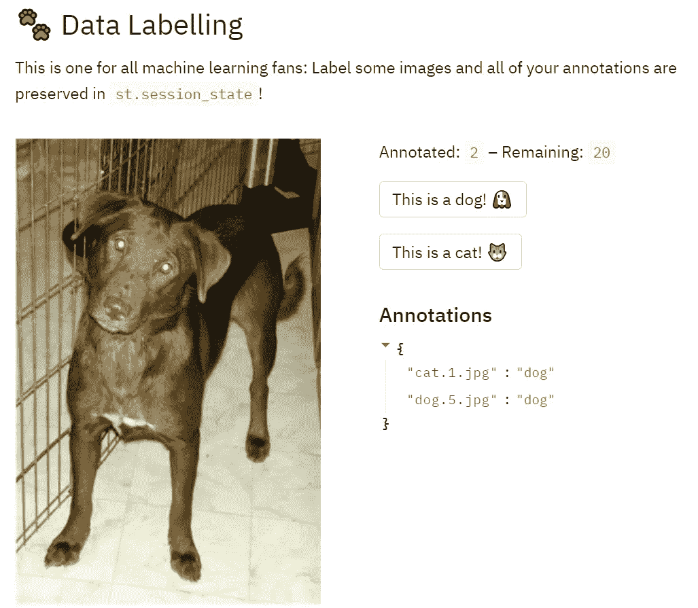

该应用程序“记住”用户的选择，Image by [Streamlit v0.84 演示](https://share.streamlit.io/streamlit/release-demos/0.84/0.84/streamlit_app.py?page=headliner)，

任何应用程序中最重要的事情之一是会话管理功能，也就是说，无论用户何时切换页面、刷新网络浏览器，当然还有保存模型并在以后加载，应用程序都必须“记住”用户已经配置的任何设置。如果你知道一个 ML 模型类是什么样子的，一个保存的会话只是在一个更广泛的上下文中是基本相同的概念。会话不仅会保存超参数和训练模型权重，还会保存整个数据集(或其文件路径)、预测、训练日志的文件路径、绘图、用户编写的脚本以及用户在会话中完成的任何其他工作。这意味着，如果不保持会话的持久性，每当用户刷新浏览器或只是暂时失去与应用程序的连接时，她就会丢失所有的工作。

> 如果不保持会话的持久性**，每当用户刷新浏览器或者只是暂时失去与应用程序的连接时，她就会丢失所有的工作。**

即使这个特性[在 Streamlit 论坛](https://discuss.streamlit.io/t/preserving-state-across-sidebar-pages/107)中从平台早期就不断被要求，会话管理在两年后才被引入平台[。尽管如此，**官方的 Streamlit 解决方案有一个很大的缺点:它只能保存用户在页面之间切换时的工作，而如果会话意外结束，它**](https://docs.streamlit.io/library/advanced-features/session-state) [**不能保存用户的工作**](https://docs.streamlit.io/library/advanced-features/session-state#caveats-and-limitations) **。**我的解决方案有，它使用了用户[*okld*](https://discuss.streamlit.io/t/multi-page-app-with-session-state/3074/48)*的会话管理解决方案来代替。*

***首先是**，app 的脚本应该有这几行:*

***其次**，此功能仅在 Streamlit 以调试模式启动并将调试消息写入日志文件时有效:*

```
*streamlit run app.py **--logger.level=debug** log_file.log 2>&1*
```

*日志文件应存储在文件夹**configs[' APP _ BASE _ DIR ']+'/logs/streamlit _ logs/*中，因为它在*was _ session _ shut down()***函数中使用。****

******第三个**，这是您自动保存会话的方式:****

```
****autosave_session(state)****
```

****什么时候应该自动保存和自动加载？每当用户更改配置，甚至只是更改应用程序中的页面时，我都会调用 autosave 函数，这样当会话重新加载时，用户可以立即继续工作，而不必浏览回他正在处理的页面。加载部分应该是应用程序脚本中首先调用的命令之一，因为应用程序刷新会从头重新运行整个脚本，我们希望用户的停机时间最短。****

******什么时候会话不会自动加载？**当用户注销时(参见下面的多页[部分)，或者当 Streamlit 应用程序重启时。](#7438)****

******官方的 Streamlit 会话解决方案是否可以添加自动保存功能？很有可能，如果你成功了，一定要告诉我！******

# ****2.保存工作以备后用****

> ******问题** : Streamlit 没有保存用户工作以备后用的选项。****
> 
> ******解决方案**:保存、加载&删除按钮****

****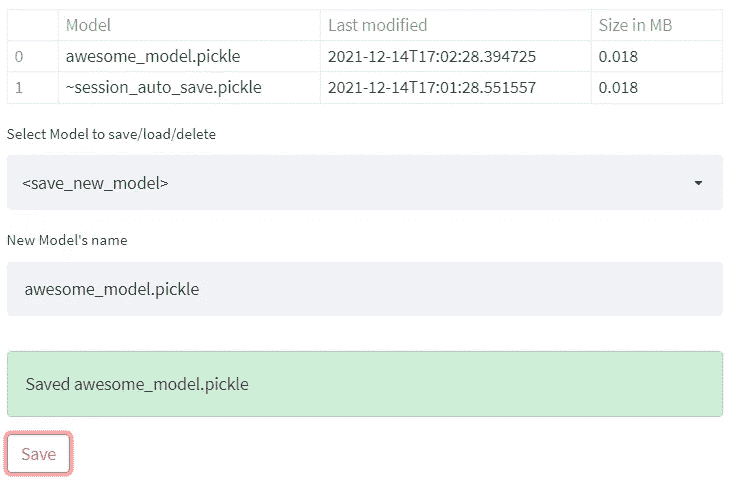****

****按作者保存模型、图像****

****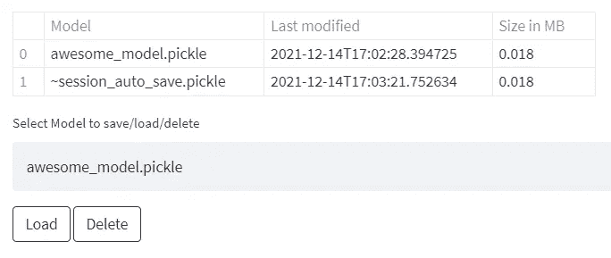****

****加载/删除选定的模型、作者的图像****

****让用户保存和加载他的工作的逻辑与上面的[部分完全相同，只是这次保存和加载是在用户按下动作按钮时触发的。不言而喻，您还必须提供一个表格，显示所有保存的模型，以及某种关于模型是否被成功保存/加载/删除的指示。](#7b09)****

# ****3.文件浏览器****

> ******问题**:Streamlit 用户不能创建、删除或浏览文件夹****
> 
> ******解决方案**:文件夹操作的递归函数****

****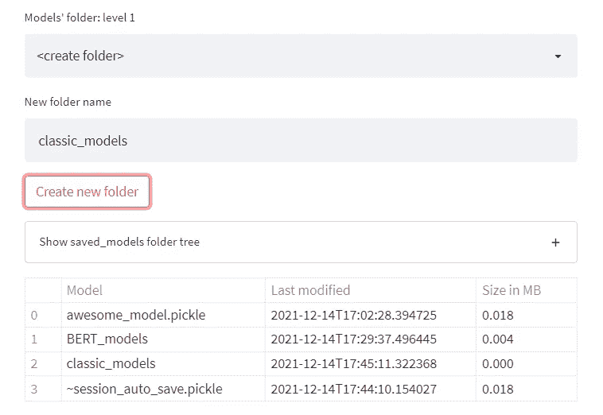****

****创建文件夹，按作者分类的图像****

****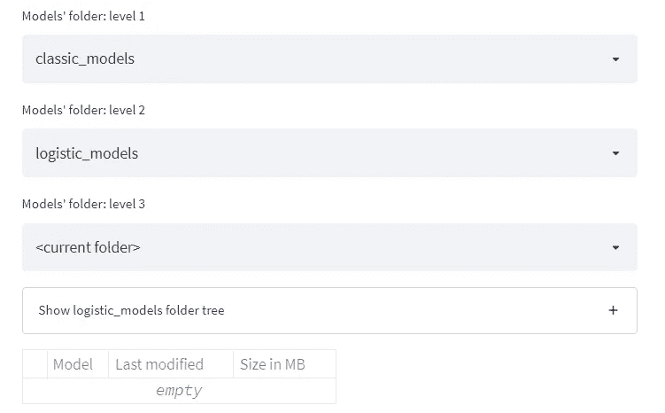****

****浏览子文件夹，作者图像****

****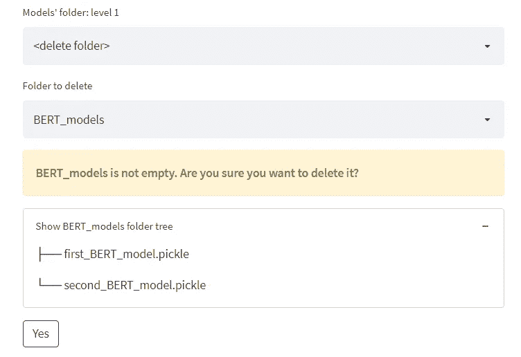****

****删除文件夹，按作者分类的图像****

****对于任何 CRISP-DM 应用程序来说，文件浏览器都是绝对必要的，因为它用于保存文件，并在几乎所有工作阶段将它们组织到目录中。例如，您可能决定为每个用户的定型模型创建一个文件夹，为每个特定项目的数据集创建一个文件夹。尽管这是一个非常基本的要求，但如果你谷歌一下这个问题，你可能会发现一些不那么实用的[简化用户的解决方案](https://medium.com/r?url=https%3A%2F%2Fdiscuss.streamlit.io%2Ft%2Fstreamlit-file-explorer%2F16031)。****

****该解决方案使用户能够创建、删除和浏览文件夹，并查看文件夹的树形结构。**最重要的是，即使你的 Streamlit 应用程序运行在用户不能直接访问文件系统的远程服务器上，它也能工作。******

# ****4.登录屏幕****

> ******问题**:细流没有内置的用户认证屏幕****
> 
> ******解决方案**:验证用户和密码的 main()前的 If 语句****

********

****登录屏幕，按作者分类的图像****

****任何专业 app 都需要一个“保镖”把守入口。Streamlit 没有，尽管很久以前[的 Streamlit 用户也要求这么做。](https://discuss.streamlit.io/t/user-authentication/612)****

****请记住，我的实现使用硬编码的用户和密码，但是添加 LDAP 或 MongoDB 身份验证应该很容易。****

# ****5.多页应用程序****

> ******问题** : Streamlit 没有内置的多页面功能****
> 
> ******解决方案**:在侧边栏中添加单选菜单，链接到每个页面的功能****

****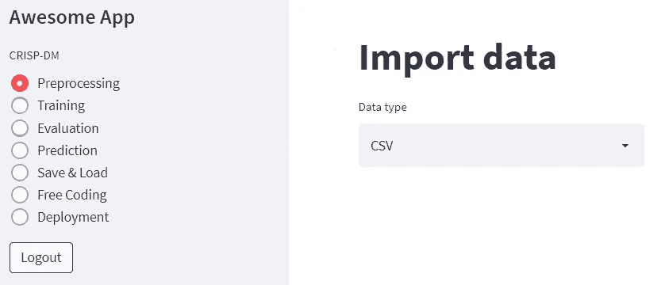****

****多页应用程序，作者图片****

****使用 CRISP-DM 需要在不同的阶段之间来回切换。这个工作过程在应用程序中以菜单的有序选项的形式得到了最好的体现，每个选项都链接到一个不同的功能。当您对这些阶段进行编码时，每个阶段的独立功能的概念也非常有意义。****

# ****6.运行长时间并行计算****

> ******问题** : Streamlit 不能同时运行两个操作并在中途停止****
> 
> ******解决方案**:运行子流程，在侧边栏中创建流程控制表****

********

****进程表，按作者排序的图像****

****无论您是在功能工程中强行使用自己的方式，还是训练繁重的深度学习模型，您都需要一种并行运行的方式，在某些情况下，过早地杀死它们。添加此功能的一种方法是将每个计算作为一个子进程运行，同时拥有一个进程表，该表既可以动态更新，又有动作按钮来分别终止每个进程或一次关闭所有进程。**运行独立的子进程不仅可以让您使用并行计算，还可以确保即使 Streamlit 会话突然终止，子进程仍将在服务器上继续运行而不会中断**。因此，无论 Streamlit 会话发生什么情况，用户都可以再次登录并查看结果。该解决方案的另一种方法是将这些子流程发送到云服务上，而不是在您自己的机器上工作——如果您需要额外的计算能力，这可能对您有价值。****

****使用 *Popen* 运行子流程相当容易:****

```
****try:
    subprocess.Popen(command)
except:
    st.write(f"Couldn't run: {command}")
    e = sys.exc_info()
    st.error(e)
updated_processes_table(process_table_sidebar, state)
# see updated_processes_table() implementation on the gist below****
```

****如果您正在运行的命令要求用户输入，这就有点棘手了，但是也可以用*管道*来管理:****

```
****process = subprocess.Popen(command, stdin=subprocess.PIPE, stdout=subprocess.PIPE,
                           universal_newlines=True)
try:
    process.communicate("\n".join(user_arguments), timeout=0.2)
except:
    pass
updated_processes_table(process_table_sidebar, state)****
```

****下面是实现流程控制表的方法:****

# ****7.使用不同**环境的模型******

> ****问题 : Streamlit 没有在不同环境下使用模型的选项****
> 
> ******解决方案**:运行子流程时激活 Conda 环境****

****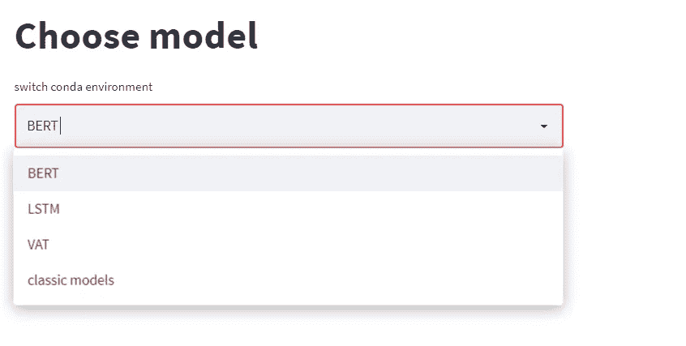****

****用于切换 python 环境的 UI，图片由作者提供****

****当处理复杂的 CV 和 NLP 模型时，你经常需要为每个模型安装不同的编码环境，因为很多时候它们依赖于特定的 *Tensorflow* 或 *Pytorch* 版本，这些版本与其他安装不兼容。在这种情况下，您将希望从自己的环境中调用每个模型命令，并且您还应该将所有的环境输出捕获到一个日志中(下面要点中的变量 *output_to_log* )。当然， *Conda* 只是一个多 env 解决方案，你也可以考虑 *Pyenv* 或者甚至使用 *Docker* 图像来代替。****

****现在我们知道了如何运行子流程(参见上面的[部分)，在不同的 conda 环境中运行它们是非常简单的:](#f050)****

# ****8.**动态**标绘训练结果****

> ******问题**:训练时 Streamlit 无法显示训练输出****
> 
> ******解决方案**:尾部建模日志，间隔绘图****

****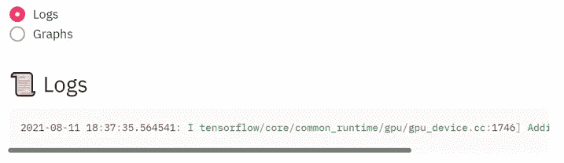****

****训练模型的动态日志输出，由作者制作图像****

****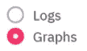********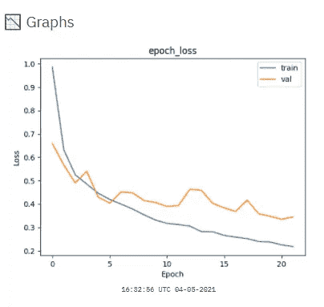****

****训练模型指标的动态图，图片由作者提供****

****你是合身、合身还是刚好合身？当处理深度学习模型时(如在上面的[部分)，如果不在训练期间绘制模型的度量标准，就很难知道这一点。查看正在运行的命令的文本输出，并选择将其下载到一个文件中，这可能也很有用。最后，设置刷新度量图的间隔可能很方便，因为它们通常在一个训练时期结束时更新，并且时期的持续时间因不同的模型和数据集而异。](#13f4)****

# ****9.在新标签上嵌入 Jupyter & Serving 许可证****

> ******问题**:细流没有自由编码**并且**无法重定向到新标签页上的文件****
> 
> ******解决方案**:将 Jupyter 嵌入为 HTML iframe **并**在文件中添加一个 Jupyter 链接****

****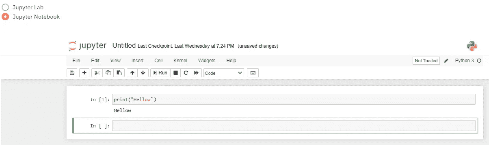****

****Jupyter 笔记本中的免费编码，图片由作者提供****

****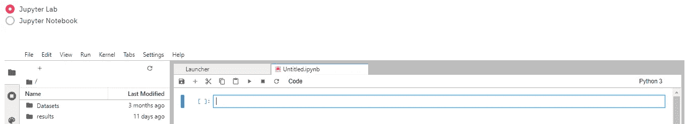****

****Jupyter 实验室的免费编码和文件探索，图片由作者提供****

****在应用程序的页面上嵌入 Jupyter 笔记本/实验室实例是我面临的最大挑战之一。有多种理论方法和工具可以做到这一点，但从我的经验来看，“星星需要对齐”配置才能工作。最后，我成功地嵌入了 Jupyter 来简化它，只使用了一个相当混杂的安全配置。如果这是你所关心的，从我的配置开始，试着增加一些限制，同时保持一切正常。****

****Jupyter 很难实现，但值得努力。这是一个非常强大的工具，因为它让知识渊博的 **用户用已经训练好的模型基本上做任何他想做的事情**，甚至添加一些尚未实现的阶段，如后处理、可解释性等。但是出于完全相同的原因，**它也是一个危险的工具，给用户一个对服务器**的终端访问，也就是说，一个命令就能摧毁它的能力——所以要小心使用！****

## ****Jupyter 构型****

******首先**，您应该创建一个 jupyter 配置文件，包含:****

```
****jupyter notebook --generate-config****
```

******接下来，**编辑文件，使其具有以下配置:****

```
****c.NotebookApp.allow_origin = '*'
c.NotebookApp.disable_check_xsrf = True
c.NotebookApp.ip = '*'
c.NotebookApp.notebook_dir = <directory of datasets and outputs>
c.NotebookApp.open_browser = False
c.NotebookApp.port = 8502
c.NotebookApp.token = ''
c.NotebookApp.tornado_settings = {'headers': {
        'Content-Security-Policy': "frame-ancestors http://<Server-IP>:8501/ "
    }
}
c.NotebookApp.use_redirect_file = True****
```

****最重要的配置是*c . notebook app . tornado _ settings*，它告诉 Jupyter 在呈现 Jupyter 的 iframe 时信任你的 Streamlit 应用。另请注意，您应该将 *c.NotebookApp.port* 设置为一个尚未被 Streamlit 端口占用的数字。默认的 Streamlit 端口号为 8501，任何新的 Streamlit 会话都将使用下一个空闲端口打开，即 8502、8503 等等。****

## ****简化代码****

****启动 Jupyter 很简单，你所要做的就是在应用程序的开头添加以下几行:****

```
****# in **if __name__ == "__main__":**
command = rf"""jupyter lab --allow-root"""
try:
    subprocess.Popen(command, stdout=subprocess.PIPE, shell=True)
except:
    st.error(f"Couldn't run {script_type}:")
    e = sys.exc_info()
    st.error(e)****
```

****但是将 Jupyter 嵌入 Streamlit 是一个不同的、更长的故事:****

## ******使用 Jupyter 在新选项卡上提供许可文件******

****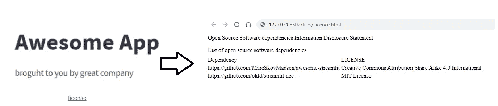****

****许可证链接指向一个新选项卡中的许可证文件，即按作者分类的图像****

****如果你希望你的应用程序的用户在打开许可文件时被重定向到一个新的单独的标签，换句话说，你需要一些网络应用程序来服务你的许可文件。幸运的是，Jupyter 完全可以做到这一点，因为它是建立在一个 [Torando web 服务器](https://www.tornadoweb.org/en/stable/)之上的。****

```
****with col9:
    linespace_generator(2)
    while not is_jupyter_up():
        time.sleep(0)
    link = f"[license](http://{state.jupyter_ip}:{state.jupyter_port}/files/Licence.html)"
    st.markdown(link, unsafe_allow_html=True)****
```

# ****10.部署经过训练的模型****

> ******问题** : Streamlit 没有交付训练模型的选项****
> 
> ****解决方案:创建一个 REST API flask web 服务****

****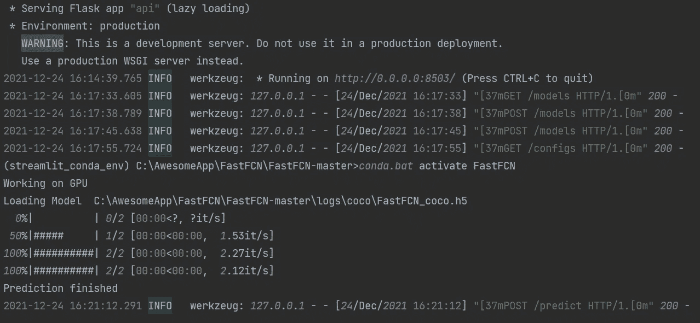****

****使用经过训练的 FastFCN 模型预测烧瓶供应数据，图片由作者提供****

****建立一个模型很容易，但是服务于这个模型，以便人们可以在日常生活中直接使用它——这是一个完全不同的挑战。**我在这里介绍的解决方案与 Streamlit 无关，但它是任何 CRISP-DM 应用程序的重要组成部分，因此我选择将其包含在本文中**。我的解决方案是使用 Flask，这是一个相当简单的平台，可能足以满足您的 POC 需求。尽管如此，当事情变得严重，你需要管理多个会话、安全性等等时，你可能想要切换到 [Django 或 Node.js](/python-vs-node-js-which-one-is-best-for-your-project-e98f2c63f020) 。****

****我的图像分割 API 有几个独立的路径:****

> ****[T3【www.AwsomeApp.com:8503】T5](http://www.awsomeapp.com:8503)****
> 
> ****/models:查询训练好的模型
> /configs:设置预测参数
> /base64:将图像文件格式转换为 base64 字符串
> /predict:向模型提供数据并获取预测****

****下面是完整的 API 实现，以及如何使用它的说明(就在要点之后):****

## ****查询训练模型****

*   ****查询哪些算法可用于预测:****

```
****import requests
IP = "<IP address>"
res = requests.get(f"http://{IP}:8503/models"); res.json()****
```

*   ****查询特定模型可用的训练权重:****

```
****params = {"algorithm":"FastFCN", "Model_path":"coco", "return_weights":"True"}
res = requests.post(f"http://{IP}:8503/models", data=params); res.json()****
```

*   ****查询特定模型在哪些类上接受训练:****

```
****params = {"algorithm":"FastFCN", "Model_path":"coco", "return_classes":"True"}
res = requests.post(f"http://{IP}:8503/models", data=params); res.json()****
```

## ****设置预测配置****

******首先，**创建一个包含预测配置的 json 文件。这些配置将用于所有后续预测，直到新的配置文件被发送到 API。****

*****configs.json* 文件示例:****

```
****{'algorithm': 'FastFCN',
 'Model_path': 'coco',
 'weight': 'FastFCN_coco1',
 'IMAGE_MIN_DIM': '1024',
 'IMAGE_MAX_DIM': '2048',
 'DETECTION_MIN_CONFIDENCE': '0.7',
 'mode': '2',
 'class_show': 'None'}****
```

******其次，**发送文件并评估当前配置:****

```
****IP = "<IP>"
files = {'file': open('configs.json', 'rb')}; json.load(files['file'])
files = {'file': open('configs.json', 'rb')}
res = requests.post(f"http://{IP}:8503/configs", files=files)
res = requests.get(f"http://{IP}:8503/configs"); res.json()****
```

## ****将图像转换为 base64****

****可选:将图像的 zip 文件预处理为 base64 字符串列表，以便以后输入模型进行预测:****

```
****files = {'file': open('image_to_predict.zip', 'rb')}; 
res = requests.post(f"http://{IP}:8503/base64", files=files); list_of_base64=res.json()
params['images'] = list_of_base64****
```

## ****做预测****

******首先，**定义一个名为 *params* 的字典，带有一个 *images* 键，其值是一个 base64 字符串列表，代表预测的图像:****

****`params = {'images':[<image0_base64>,<image1_base64>,<image2_base64>]}`****

****将此配置设置为 True 以获取图像文件形式的结果，而不是 base64 字符串:****

****`params['create_images'] = True`****

******二、**提出预测请求，并评估结果:****

```
****IP = "<IP>"
res = requests.post(f"http://{IP}:8503/predict", data=params)
res = res.json()['Responses']
predicted_image0 = res[0][1]
json_result0  = res[0][0]
print(f"Classes found: {json_result0['results']['class_name']}") 
print(f"Prediction scores: {json_result0['results']['scores']}")
print(f"Bounding Boxes: {json_result0['results']['rois [y_min, x_min, y_max, x_max]']}")****
```

# ****摘要****

****使用 Streamlit 开发一个 ML 应用程序就像乘坐游乐园里最疯狂的过山车:超级快，非常刺激，有时令人眩晕，但肯定非常有趣。然而，在 Streamlit 中快速实现您出色的机器学习想法后，几乎不可避免的是，您的应用程序将不会真正可用。这是由于 Streamlit 缺乏一些基本功能造成的:[保存刷新和丢失连接的工作](#7b09)、[保存工作以备后用](#1bd6)、[文件浏览器](#d121)、[登录屏幕](#35fe)、[多页应用](#7438)、[运行长时间并行计算](#f050)、[使用不同环境的模型](#13f4)、[动态绘制训练结果](#907e)、[嵌入 Jupyter 并在](#4957)****

****你可以尝试自己实现这些功能，甚至在谷歌上“掷骰子”，但为什么要浪费时间呢？所有这些功能的代码都在上面——所以请坐好，放松，享受旅程吧:)****

> ****欢迎分享您的反馈，并通过 LinkedIn 联系我。****
> 
> ****感谢您的阅读，祝您好运！🍀****