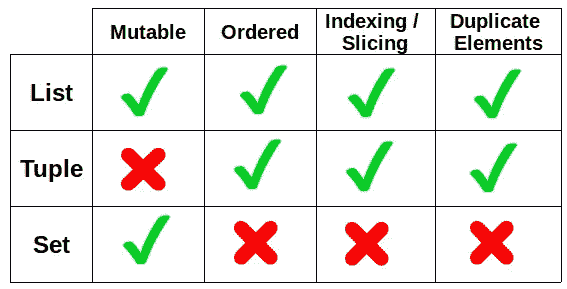
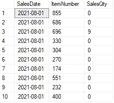

# 10 个极有可能成为数据科学家的面试问题

> 原文：<https://towardsdatascience.com/10-highly-probable-data-scientist-interview-questions-fd83f7414760?source=collection_archive---------1----------------------->

## 机器学习、Python 和 SQL


[斯科特·格雷厄姆](https://unsplash.com/@homajob?utm_source=unsplash&utm_medium=referral&utm_content=creditCopyText)在 [Unsplash](https://unsplash.com/s/photos/job-interview?utm_source=unsplash&utm_medium=referral&utm_content=creditCopyText) 上拍照

数据科学的普及吸引了来自各行各业的许多人转行，目标是成为一名数据科学家。

尽管对数据科学家的需求很高，但找到第一份工作是一项极具挑战性的任务。除非你之前有丰富的工作经验，否则面试是你展示技能和给潜在雇主留下深刻印象的地方。

数据科学是一个跨学科领域，涵盖了广泛的主题和概念。因此，在面试中你可能会被问到的问题数量是非常多的。

然而，在数据科学和机器学习的基础上有一些问题。这些是你不想错过的。在本文中，我们将讨论数据科学家面试中可能会被问到的 10 个问题。

这些问题分为 3 个主要类别，即机器学习、Python 和 SQL。我将尝试为每个问题提供一个简短的答案。然而，我建议在之后更详细地阅读或研究每一个。

# 机器学习

## 1.什么是过度拟合？

当你的模型没有被很好地概括时，机器学习中的过度拟合就会发生。该模型过于关注训练集。它捕获了训练集中的许多细节甚至噪声。因此，它无法捕捉数据中的总体趋势或关系。如果一个模型与数据相比过于复杂，它可能会过度拟合。

过度拟合的一个重要指标是训练集和测试集的准确性之间的巨大差异。过度拟合模型通常在训练集上具有非常高的精度，但是测试精度通常是不可预测的，并且远低于训练精度。

## 2.怎样可以减少过度拟合？

我们可以通过使模型更一般化来减少过度拟合，这意味着它应该更专注于总体趋势而不是具体细节。

如果可能的话，收集更多的数据是减少过拟合的有效方法。你将给予模型更多的能量，这样它将有更多的材料可以学习。数据总是有价值的，尤其是对于机器学习模型。

减少过拟合的另一种方法是降低模型的复杂性。如果一个模型对于一个给定的任务来说太复杂，它将可能导致过度拟合。在这种情况下，我们应该寻找更简单的模型。

## 3.什么是正规化？

我们已经提到过过度拟合的主要原因是模型过于复杂。正则化是一种降低模型复杂度的方法。

它通过惩罚模型中的较高条款来做到这一点。通过增加正则项，该模型试图最小化损失和复杂性。

两种主要的正则化类型是 L1 正则化和 L2 正则化。L1 正则化在每次迭代中从无信息特征的权重中减去少量。因此，它导致这些权重最终变为零。

另一方面，L2 正则化在每次迭代中从权重中移除一小部分。这些权重将越来越接近零，但实际上永远不会变成 0。

## 4.分类和聚类有什么区别？

两者都是机器学习任务。分类是一项受监督的学习任务，因此我们已经标记了观察值(即数据点)。我们用带标签的数据训练模型，并期望它预测新数据的标签。

例如，垃圾邮件检测是一项分类任务。我们提供了一个模型，其中有几封电子邮件被标记为垃圾邮件或非垃圾邮件。在用那些电子邮件训练模型之后，它将适当地评估新的电子邮件。

聚类是一项无监督的学习任务，因此观察值没有任何标签。该模型预计将评估观察结果，并将它们分组到聚类中。相似的观察值被放入同一个群中。

在最佳情况下，同一聚类中的观测值尽可能相互靠近，而不同的聚类尽可能相互远离。聚类任务的一个示例是根据客户的购物行为对他们进行分组。

# 计算机编程语言

内置数据结构至关重要。因此，你应该熟悉他们是什么，以及如何与他们互动。列表、字典、集合和元组是 Python 中 4 种主要的内置数据结构。

## 5.列表和元组的区别是什么

列表和元组的主要区别是可变性。列表是可变的，所以我们可以通过添加或删除条目来操作它们。

```
mylist = [1,2,3]
mylist.append(4)
mylist.remove(1)print(mylist)
[2,3,4]
```

另一方面，元组是不可变的。虽然我们可以访问元组中的每个元素，但是我们不能修改它的内容。

```
mytuple = (1,2,3)
mytuple.append(4)
**AttributeError**: 'tuple' object has no attribute 'append'
```

这里要提到的重要一点是，尽管元组是不可变的，但是它们可以包含可变的元素，比如列表或集合。

```
mytuple = (1,2,["a","b","c"])mytuple[2]
['a', 'b', 'c']mytuple[2][0] = ["A"]
print(mytuple)
(1, 2, [['A'], 'b', 'c'])
```

## 6.列表和集合的区别是什么

让我们做一个例子来演示列表和集合之间的主要区别。

```
text = "Python is awesome!"
mylist = list(text)
myset = set(text)print(mylist)
['P', 'y', 't', 'h', 'o', 'n', ' ', 'i', 's', ' ', 'a', 'w', 'e', 's', 'o', 'm', 'e', '!']print(myset)
{'t', ' ', 'i', 'e', 'm', 'P', '!', 'y', 'o', 'h', 'n', 'a', 's', 'w'}
```

正如我们在结果对象中注意到的，列表包含字符串中的所有字符，而集合只包含唯一的值。

另一个区别是，列表中的字符是根据它们在字符串中的位置进行排序的。但是，没有与集合中的字符相关联的顺序。

下表总结了列表、元组和集合的主要特征。



(图片由作者提供)

## 7.什么是词典，词典的重要特征是什么？

Python 中的字典是键值对的集合。它类似于列表，因为列表中的每一项都有一个从 0 开始的相关索引。

```
mylist = ["a", "b", "c"]
mylist[1]
"b"
```

在字典中，我们用关键字作为索引。因此，我们可以通过使用它的键来访问一个值。

```
mydict = {"John": 24, "Jane": 26, "Ashley": 22}mydict["Jane"]
26
```

字典中的键是唯一的，这很有意义，因为它们就像是值的地址。

# 结构化查询语言

SQL 对于数据科学家来说是一项极其重要的技能。有相当多的公司将他们的数据存储在关系数据库中。SQL 是与关系数据库交互所需要的。

您可能会被问到一个问题，这个问题涉及编写一个查询来执行一个特定的任务。您可能还会被问到一个关于一般数据库知识的问题。

## 8.查询示例 1

假设我们有一个包含产品日销售量的销售表。

```
SELECT TOP 10 * FROM SalesTable
```



(图片由作者提供)

根据每周总销售量找出前 5 周。

```
SELECT TOP 5
   CONCAT(YEAR(SalesDate), DATEPART(WEEK, SalesDate)) AS YearWeek,
   SUM(SalesQty) AS TotalWeeklySales
FROM
   SalesTable
GROUP BY CONCAT(YEAR(SalesDate), DATEPART(WEEK, SalesDate))
ORDER BY TotalWeeklySales DESC
```


(图片由作者提供)

我们首先从日期列中提取年和周的信息，然后在聚合中使用它。sum 函数用于计算总销售量。

## 9.查询示例 2

在同一个销售表中，查找每个月销售的独特商品的数量。

```
SELECT
   MONTH(SalesDate) AS Month,
   COUNT(DISTINCT(ItemNumber)) AS ItemCount
FROM
   SalesTable
GROUP BY MONTH(SalesDate) Month ItemCount
1     9      1021
2     8      1021
```

## 10.什么是数据库中的规范化和反规范化？

这些术语与数据库模式设计相关。规范化和反规范化旨在优化不同的指标。

规范化的目标是通过增加表的数量来减少数据冗余和不一致。另一方面，反规范化旨在加速查询执行。反规范化减少了表的数量，但同时也增加了一些冗余。

# 结论

成为一名数据科学家是一项具有挑战性的任务。这需要时间、努力和奉献。如果没有工作经验，这个过程会变得更加困难。

面试对展示你的技能非常重要。在本文中，我们讨论了您在数据科学家面试中可能会遇到的 10 个问题。

最后但同样重要的是，如果你还不是[中级会员](https://sonery.medium.com/membership)并打算成为其中一员，我恳请你使用以下链接。我将从你的会员费中收取一部分，不增加你的额外费用。

<https://sonery.medium.com/membership>  

感谢您的阅读。如果您有任何反馈，请告诉我。