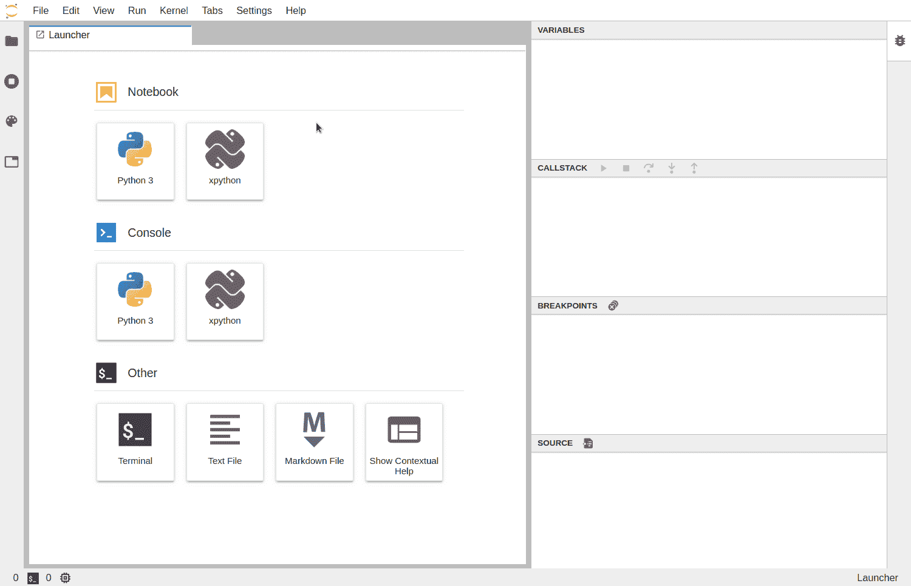

# 10 个 Jupyter 实验室扩展，提高您的工作效率

> 原文：<https://towardsdatascience.com/10-jupyter-lab-extensions-to-boost-your-productivity-4b3800b7ca2a?source=collection_archive---------0----------------------->


由[拍摄的照片](https://pixabay.com/users/free-photos-242387/)在 [Pixabay](https://pixabay.com/photos/aerial-view-landscape-high-scene-1246636/) 上

## 为你自己定制 Jupyter Lab，一个 IDE 工具

如果你是一个使用 Python 作为主要编程语言的数据科学家或数据工程师，我相信你一定会使用 Jupyter Notebook。作为 Jupyter 笔记本的“下一代”网络应用程序，Jupyter Lab 提供了比以前更方便的功能。其中之一是扩展。

现在，即使是 Jupyter 实验室开发团队也为拥有这样一个强大而繁荣的第三方扩展社区而感到兴奋。在本文中，我将介绍 10 个 Jupyter Lab 扩展，我发现它们对于显著提高典型数据科学家或数据工程师的工作效率非常有用。

# Jupyter 实验室推广经理

大多数在线资源会告诉您运行如下命令来安装 Jupyter Lab 扩展。

```
jupyter labextension install @jupyterlab/...
```

嗯，使用命令行也是我的最爱。然而，如果你是 VS 代码的用户，Sublime 或者 Atom，你可能也想直接在一个“管理器”中搜索你想安装的东西。Jupyter 实验室确实提供了这个功能。


如截图所示，您可以进入左侧导航的第 4 个选项卡，这是扩展管理器。然后，您可以搜索任何您想要的，以获得适合您需求的扩展。所以，你甚至不需要事先知道扩展名。


现在，我们来看看有哪些值得推荐的扩展！

# 1.JupyterLab 调试器

[](https://blog.jupyter.org/a-visual-debugger-for-jupyter-914e61716559) [## Jupyter 的可视化调试器

### 软件项目中取得的进步大部分来自于渐进主义。快速看到结果的能力…

blog.jupyter.org](https://blog.jupyter.org/a-visual-debugger-for-jupyter-914e61716559) 

我们都爱 Jupyter，因为它的互动性。然而，有时，调试功能对于编码是必要的。例如，我们可能想一步一步地运行一个 For 循环，看看里面到底发生了什么。大多数 IDE 工具都支持这种带有“单步调试”和“单步调试”功能的调试特性，但不幸的是，Jupyter 自然不支持这种特性。

这样的扩展允许我们补充 Jupyter 实验室中缺少的特性。



图片提供:[https://blog . jupyter . org/a-visual-debugger-for-jupyter-914 e 61716559](https://blog.jupyter.org/a-visual-debugger-for-jupyter-914e61716559)

# 2.JupyterLab-TOC

[](https://github.com/jupyterlab/jupyterlab-toc) [## jupyterlab/jupyterlab-toc

### 这个扩展被添加到 JupyterLab 3.0 的核心 JupyterLab 扩展中。任何使用 JupyterLab = 3.0 的人都会…

github.com](https://github.com/jupyterlab/jupyterlab-toc) 

有长长的笔记本？想要让您的笔记本在演示时更漂亮吗？或者，只是想为你的笔记本准备一个目录？`@jupyterlab/toc`前来帮忙。


图片提供:[https://github . com/jupyterlab/jupyterlab-TOC/raw/master/TOC . gif](https://github.com/jupyterlab/jupyterlab-toc/raw/master/toc.gif)

有了这个扩展，目录将基于带标题的 markdown 单元格自动生成(确保使用尖锐的符号`##`来指定标题级别)。这也是一种使用 Jupyter 笔记本的好方法，可以让你的工作更加系统和有条理。

# 3.JupyterLab-DrawIO

[](https://github.com/QuantStack/jupyterlab-drawio) [## QuantStack/jupyterlab-drawio

### jupyterlab 扩展，用于将 drawio / mxgraph 独立集成到 JupyterLab 中。jupyter labextension 安装…

github.com](https://github.com/QuantStack/jupyterlab-drawio) 

Diagram.net(原名画画。IO)是我最喜欢的绘图工具。如果你是我的追随者之一，我可以告诉你，我文章中的大多数图表都是用这个绘制的。它确实是 MS Visio 的一个完美的开源替代方案。

现在，有了`jupyterlab-drawio`，我们可以把这个完美的工具带到 Jupyter 实验室。请去看看并欣赏这幅画:)


图片提供:[https://github . com/quant stack/jupyterlab-draw io/raw/master/draw io . gif](https://github.com/QuantStack/jupyterlab-drawio/raw/master/drawio.gif)

# 4.JupyterLab 执行时间

[](https://github.com/deshaw/jupyterlab-execute-time) [## deshaw/jupyterlab-执行时间

### 显示单元格计时。这是受这里笔记本版本的启发。注意:为了显示任何内容，您需要…

github.com](https://github.com/deshaw/jupyterlab-execute-time) 

Jupyter Notebook/Lab 的一个惊人特性是它提供了许多有用的神奇命令。例如，我们可以使用`%timeit`来测试我们的代码运行需要多长时间。它将运行我们的代码片段数百或数千次，并获得平均值，以确保给出一个公平和准确的结果。

然而，有时候我们并不需要这么科学。此外，最好能知道每个单元运行的时间。这种情况下，每一个细胞都用`%timeit`绝对是矫枉过正。

`jupyterlab-execute-time`能在这种情况下提供帮助。


如屏幕截图所示，它不仅显示了执行该单元所用的时间，还显示了上次执行的时间。我向您保证，这是一个非常方便的特性，可以指示这些单元格的执行顺序。

# 5.JupyterLab 电子表格

[](https://github.com/quigleyj97/jupyterlab-spreadsheet) [## quigleyj 97/jupyterlab-电子表格

### 试试吧！这个插件为 JupyterLab 添加了一个简单的电子表格查看器。jupyterlab-电子表格支持 XLS，XLSX，ODS…

github.com](https://github.com/quigleyj97/jupyterlab-spreadsheet) 

作为一名数据科学家或数据工程师，您有时必须处理电子表格。然而，Jupyter 并不支持读取 Excel 文件，这迫使我们打开多个工具在 Jupyter 编码和 Excel 查看之间切换。

`jupyterlab-spreadsheet`完美解决了这个问题。它在 Jupyter 实验室中嵌入了 xls/xlsx 电子表格查看功能，因此我们可以在一个地方获得所有需要的信息。


图片提供:[https://github . com/quigleyj 97/jupyterlab-spread sheet/raw/main/snapshot . png](https://github.com/quigleyj97/jupyterlab-spreadsheet/raw/main/screenshot.png)

# 6.JupyterLab 系统监视器

[](https://github.com/jtpio/jupyterlab-system-monitor) [## JT Pio/jupyterlab-系统监视器

### 显示系统信息(内存和 cpu 使用)的 JupyterLab 扩展。为…提供替代前端

github.com](https://github.com/jtpio/jupyterlab-system-monitor) 

Python 不是一种执行有效的编程语言，这意味着与其他语言相比，它可能会消耗更多的 CPU/内存资源。另外，Python 最常见的用例之一是数据科学。因此，我们可能希望监控我们的系统硬件资源，以意识到我们的 Python 代码可能会冻结操作系统。

`jupyterlab-topbar-extension`是您可能想要的分机。它将在 Jupyter Lab UI 的顶栏上显示 CPU 和内存使用情况，以便我们可以实时监控它们。


图片提供:[https://github . com/JT Pio/jupyterlab-system-monitor/raw/main/doc/screen cast . gif](https://github.com/jtpio/jupyterlab-system-monitor/raw/main/doc/screencast.gif)

# 7.JupyterLab 风筝

[](https://github.com/kiteco/jupyterlab-kite) [## kiteco/jupyterlab-风筝

### Kite 是一个 AI 驱动的编程助手，可以帮助你在 JupyterLab 内部编写 Python 代码。风筝帮助你写作…

github.com](https://github.com/kiteco/jupyterlab-kite) 

虽然我喜欢 Jupyter，但它不能像其他经典 IDE 工具那样自动完成代码。代码自动完成非常有限且缓慢。

你可能听说过 Kite，这是一个免费的人工智能代码完成服务。在 Sublime、VS Code、PyCharm 等几乎所有流行的 ide 中都有。事实上，你也可以在 Jupyter 实验室使用这项服务。


图片提供:[https://github.com/kiteco/jupyterlab-kite](https://github.com/kiteco/jupyterlab-kite)

有了这个扩展，我们可以更流畅地在 Jupyter 实验室编码。

# 8.JupyterLab 变量检查器

[](https://github.com/lckr/jupyterlab-variableInspector) [## lckr/jupyterlab-变量检查器

### Jupyterlab 扩展，显示当前使用的变量及其值。目标是提供一个类似于…

github.com](https://github.com/lckr/jupyterlab-variableInspector) 

如果您是从 R studio 或 Matlab 转来的数据科学家，您可能非常熟悉这些工具提供的变量检查器。遗憾的是，Jupyter 实验室默认不提供该功能。然而，扩展`jupyterlab-variableInspector`把这个特性带回来了。


图片提供:[https://github . com/lckr/jupyterlab-variable inspector/raw/master/early _ demo . gif](https://github.com/lckr/jupyterlab-variableInspector/raw/master/early_demo.gif)

# 9.JupyterLab Matplotlib

[](https://github.com/matplotlib/ipympl) [## matplotlib/ipympl

### ipympl 利用 Jupyter 交互式窗口小部件框架，在…

github.com](https://github.com/matplotlib/ipympl) 

如果你是一名数据科学家，Matplotlib 是一个必须学习的 Python 库。这是一个基本但强大的 Python 数据可视化工具。然而，当我们使用 Jupyter Lab 时，交互功能已经消失了。

`jupyter-matplotlib`扩展可以让你的 Matplotlib 再次交互。只需使用一个神奇的命令`%matplotlib widget`启用它，你的花式三维图表将成为互动的。


图片提供:[https://github . com/matplotlib/ipympl/raw/master/matplotlib . gif](https://github.com/matplotlib/ipympl/raw/master/matplotlib.gif)

# 10.JupyterLab Plotly

[](https://plotly.com/python/getting-started/#jupyterlab-support-python-35) [## Plotly 入门

### 有关渲染器框架的详细信息，请参见在 Python 中显示图形，并参见 Plotly FigureWidget 概述…

plotly.com](https://plotly.com/python/getting-started/#jupyterlab-support-python-35) 

虽然 Matplotlib 是最基本和最强大的数据可视化库，但 Plotly 是我在这方面最喜欢的库。它包装了许多常见的图表，我们可以在几行代码中生成惊人的图表。

为了使 Jupyter Lab 无缝支持并能够显示交互式 Plotly 图表，需要安装`jupyterlab-plotly`。

# 摘要


照片由[像素](https://pixabay.com/photos/waves-dawn-ocean-sea-dusk-1867285/)上的[像素](https://pixabay.com/users/pexels-2286921/)拍摄

当然，社区中有更多精彩的 Jupyter 实验室扩展。在这篇文章中，我根据我的喜好介绍了其中的 10 种。在过去的几年里，这些扩展帮助我提高了很多效率，现在我向你推荐它们！

[](https://medium.com/@qiuyujx/membership) [## 通过我的推荐链接加入 Medium 克里斯托弗·陶

### 作为一个媒体会员，你的会员费的一部分会给你阅读的作家，你可以完全接触到每一个故事…

medium.com](https://medium.com/@qiuyujx/membership) 

如果你觉得我的文章有帮助，请考虑加入 Medium 会员来支持我和成千上万的其他作者！(点击上面的链接)