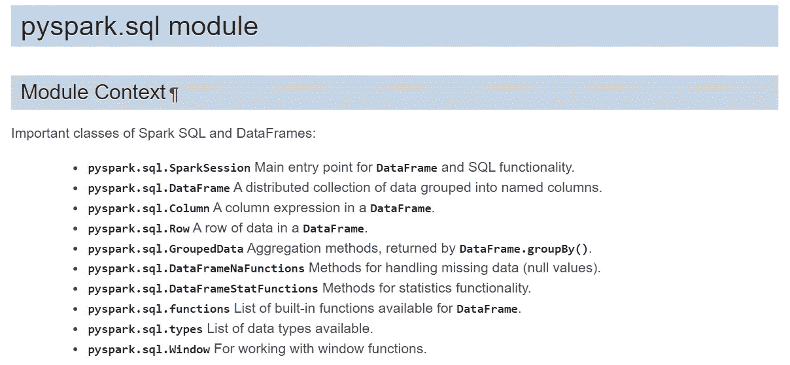
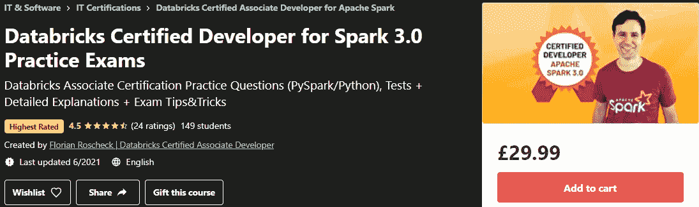

# Databricks Apache Spark 3.0 开发人员考试前要练习的 10 个问题

> 原文：<https://towardsdatascience.com/10-mcqs-to-practice-before-your-databricks-apache-spark-3-0-developer-exam-bd886060b9ab?source=collection_archive---------1----------------------->

## 在这篇文章中，我分享了真正的 mcq，以及我为考试做准备的 3 个顶级技巧。

[](https://click.linksynergy.com/deeplink?id=533LxfDBSaM&mid=39197&murl=https%3A%2F%2Fwww.udemy.com%2Fcourse%2Fdatabricks-certified-developer-for-apache-spark-30-practice-exams%2F)

认证徽章由[credential.net](https://www.credential.net/group/227965)

## 我的读者请注意

*这个帖子包括附属链接，如果你购买的话，我可以在不增加你额外费用的情况下赚取一小笔佣金。*

***>>>****还不是中等成员？考虑与我的* [***推荐链接***](https://anbento4.medium.com/membership) *签约，以获得 Medium 提供的一切服务，价格低至****【5 美元一个月*** *！*

# 缺乏练习的资源？

如果你正在为 Apache Spark 3.0 认证 而学习 [**Databricks 协理开发人员，你可能正面临着我几周前面临的同样问题:缺乏**模拟测试**来评估你的准备情况。**](https://academy.databricks.com/exam/databricks-certified-associate-developer)

现在，你应该知道考试由 60 道 mcq 组成，你将有 120 分钟的时间答对至少 42 道题(70%)。

另一个我想你已经注意到的细节是**考试将花费你 240 美元(包括增值税)**但是你将被允许**一次尝试**，这样如果你失败了，你将不得不**再次支付**重考。有了这些前提，我猜你真的希望第一次就通过考试。

但你可能会疑惑:*“如果我找不到任何代表考试难度水平的问题示例，我又怎么能真正理解自己是否准备好了呢？”。*

这也是我在参加考试前遇到的同样的困境:**我不确定自己是否准备好超过 70%的门槛，可能我没有，因为我发现真题比预期的更具挑战性。**

> 我发现真题比预期的更有挑战性。

尽管有一些困难(*也是技术性的，因为我的考试被监考人暂停了 30 分钟*)，[在准备了大约 2 个月之后，我设法以一个好分数通过了认证。](https://academy.databricks.com/award/certification/db22fd2b-a4dc-3ad3-8de6-9b7774b820ac/view)

在 Medium 上至少还有十几篇关于这个主题的文章(*我把它们都读了，作为我准备工作的一部分*)，我发现其中有 3-4 篇文章非常有见地(*文章结尾的链接*)，但没有一篇包含任何模拟选择题，帮助我测试我的知识。

> **在本文中，我将与您分享 PySpark 认证版本的 10 个 MCQs】、**，您可以在真正的考试**中找到它们。**

为此，**在本文中，我与大家分享 PySpark 版认证**、**的 10 个 mcq，你有望在真题考试**中找到。*请注意，我不允许透露确切的问题，所以我通过保持难度不变的方式重新表述了这些问题，因此您可以相信它们是一个有价值的学习资源。*

在开始真正的问题之前，让我给你 3 个提示，你可能在其他文章中找不到，但我认为它们会对你的最终分数产生巨大的影响。

[](https://medium.com/codex/4-full-practice-tests-to-prepare-databricks-associate-certification-pyspark-2021-eab289b1ea0c) [## 准备 Databricks 助理认证(PySpark | 2021)的 4 次全面实践测试

### 让我与你分享 200 多个现实的、高质量的问题来成为一个认证的 Spark 3.0 开发者

medium.com](https://medium.com/codex/4-full-practice-tests-to-prepare-databricks-associate-certification-pyspark-2021-eab289b1ea0c) [](/3-ways-to-create-tables-with-apache-spark-32aed0f355ab) [## 用 Apache Spark 创建表格的 3 种方法

### 学习如何用 PySpark 构建托管和非托管表，以及如何在您的项目中有效地使用它们

towardsdatascience.com](/3-ways-to-create-tables-with-apache-spark-32aed0f355ab) 

# 我通过考试的诚实建议

不，我不会建议你阅读 [**Spark -权威指南**](https://www.amazon.co.uk/Spark-Definitive-Guide-Bill-Chambers/dp/1491912219) 或 [**2d 版学习 Spark**](https://www.oreilly.com/library/view/learning-spark-2nd/9781492050032/) 因为……你已经知道它们了……对吗？我要给你的是 3 个技巧，它们将极大地增加你成功的机会——所以请仔细阅读！

## #1 学会用心浏览 PySpark 文档

这可能是我能给 excel 的最好建议了。实际上，在考试期间，你可以参考右边屏幕上的`pyspark.sql` [文档](https://spark.apache.org/docs/3.0.0-preview2/api/python/pyspark.sql.html)，但是你不能使用 **CTRL+F** 来搜索关键词。



考试期间你可以参考的课程。

这意味着，除非您知道在哪里可以找到特定的方法或特定的函数，否则您可能会浪费大量的时间来来回回地滚动，相信我，这会让您感到紧张。相反，我建议你把重点放在以下三堂课的内容上:

*   **py spark . SQL . data frame:***比如* *你应该能定位到* `*coalesce()*` *和* `*join()*` *函数。*
*   **py spark . sq . column:***比如你要知道*`*when()*`*`*between()*`*`*otherwise*`*是应用于 DataFrame 的列，而不是直接应用于 DataFrame。***
*   *****py spark . SQL . functions:****例如，您应该知道用于操作时间字段的函数，如* `*date_add()*` *、* `*date_sun()*` *和* `*from_unixtime()*` *(是的，我对这个函数有疑问！书上无处可寻……)在此描述。***

**我在测试前两天接触并研究了文档**的结构，但我希望我能更早地这样做，因为这些知识帮助我正确回答了至少 7-8 个问题。****

**因此，我在这里试图传达的是**不要高估你在 PySpark 语法上的知识，因为你的记忆可能会在考试中背叛你。**充分利用文档。**

## **#2 在 Udemy 上查看本课程:[data bricks Spark 3.0 实践考试认证开发人员](https://click.linksynergy.com/deeplink?id=533LxfDBSaM&mid=47900&murl=https%3A%2F%2Fwww.udemy.com%2Fcourse%2Fdatabricks-certified-developer-for-apache-spark-30-practice-exams%2F%3FranMID%3D39197%26ranEAID%3D533LxfDBSaM%26ranSiteID%3D533LxfDBSaM-CA8OlQBRwWToEEwq8oC0dg%26utm_source%3Daff-campaign%26LSNPUBID%3D533LxfDBSaM%26utm_medium%3Dudemyads)**

**事实证明，实际上**Python/Pyspark***的两个完整模拟测试在 [Udemy](https://click.linksynergy.com/deeplink?id=533LxfDBSaM&mid=47900&murl=https%3A%2F%2Fwww.udemy.com%2Fcourse%2Fdatabricks-certified-developer-for-apache-spark-30-practice-exams%2F%3FranMID%3D39197%26ranEAID%3D533LxfDBSaM%26ranSiteID%3D533LxfDBSaM-CA8OlQBRwWToEEwq8oC0dg%26utm_source%3Daff-campaign%26LSNPUBID%3D533LxfDBSaM%26utm_medium%3Dudemyads) 上可用，并且包括 Apache Spark 3.0 认证考试的 120 个模拟考试测验！***

***[](https://click.linksynergy.com/deeplink?id=533LxfDBSaM&mid=39197&murl=https%3A%2F%2Fwww.udemy.com%2Fcourse%2Fdatabricks-certified-developer-for-apache-spark-30-practice-exams%2F)

[可能是网上最新更新的测试。](https://click.linksynergy.com/deeplink?id=533LxfDBSaM&mid=47900&murl=https%3A%2F%2Fwww.udemy.com%2Fcourse%2Fdatabricks-certified-developer-for-apache-spark-30-practice-exams%2F%3FranMID%3D39197%26ranEAID%3D533LxfDBSaM%26ranSiteID%3D533LxfDBSaM-CA8OlQBRwWToEEwq8oC0dg%26utm_source%3Daff-campaign%26LSNPUBID%3D533LxfDBSaM%26utm_medium%3Dudemyads)*** 

***我在考试前两个月购买了测试权限，因为我想研究基于真题的材料，并复习我得到错误答案的主题。***

***与真正的考试一样，您有 2 个小时的时间来完成测试，并且每个题目的权重也受到尊重，这意味着:***

*   *****Spark DataFrame API 应用(~72%)*****
*   *****Spark 架构:概念理解(~17%)*****
*   *****Spark 架构:应用理解(~11%)*****

***就我而言，**实际考试中至少有 12-15 个问题与我在这些考试中练习的问题** ( *在措辞和解决方案方面*)非常相似，所以我认为这是你在学习认证时的一项出色投资。***

## **#3 不要只运行官方指南中的代码示例。更进一步。**

**事后看来，有一件事我在准备时可以做得更好，那就是尝试运行更多属于**Spark****data frame API**的函数和方法，并仔细检查它们的语法细节，而不是只关注书本上的代码片段。**

**想想看:你会发现至少有 40-43 个关于 Spark DataFrame API 的问题，因此有理由期待大量不同的概念将被测试(*甚至是你在书中找不到的概念——生活糟透了！*)。**

**此外，记住**这 40-43 个问题中有 30%会特别棘手**，至少有两个非常相似的选项，所以你需要非常确定语法。但是请记住:最坏的情况下，你可以随时查阅文档资料(*让我们回到第一点*)。**

**现在是进行一些测验的时候了！**

**[](/3-nanodegrees-you-should-consider-to-advance-your-data-engineering-career-in-2021-baf597debc72) [## 3 门数据工程课程，在 2021 年推进您的职业发展

### 加入数据行业，改变角色或通过注册数据工程简单地学习前沿技术…

towardsdatascience.com](/3-nanodegrees-you-should-consider-to-advance-your-data-engineering-career-in-2021-baf597debc72) 

# 问题 1

```
*Given a dataframe* ***df****, select the code that returns its number of rows:*A. df.take('all') 
B. df.collect()
C. df.show()
D. df.count() --> **CORRECT**
E. df.numRows()
```

正确答案是 **D** ，因为`df.count()`实际上返回了一个**数据帧**中的行数，正如你在文档中看到的。这是一个热身问题，但不要忘记它，因为你可以找到类似的东西。

# 问题 2

```
*Given a DataFrame* ***df*** *that includes a number of columns among which a column named* ***quantity*** *and a column named* ***price****, complete the code below such that it will create a DataFrame including all the original columns and a new column* ***revenue*** *defined as* ***quantity*price:***df._1_(_2_ , _3_)A. withColumnRenamed, "revenue", expr("quantity*price")
B. withColumn, revenue, expr("quantity*price")
C. withColumn, "revenue", expr("quantity*price") --> **CORRECT**
D. withColumn, expr("quantity*price"), "revenue"
E. withColumnRenamed, "revenue", col("quantity")*col("price")
```

正确答案是 **C** ，因为代码应该是:

`df.withColumn("revenue", expr("quantity*price"))`

你至少会被问到 2-3 个问题，涉及到在 DF 中添加一个新列或者重命名一个现有的列，所以要很好地学习`withColumn()`和`withColumnRenamed()`的语法。

# 问题 3

```
# *Given a DataFrame* ***df*** *that**has some null values in the column* ***created_date,*** *complete the code below such that it will sort rows in ascending order based on the column* ***creted_date*** *with null values appearing last.*df._1_(_2_)A. orderBy, asc_nulls_last("created_date")
B. sort, asc_nulls_last("created_date")
C. orderBy, col("created_date").asc_nulls_last() --> **CORRECT**
D. orderBy, col("created_date"), ascending=True)
E. orderBy, col("created_date").asc()
```

正确答案是 **C** ，因为代码应该是:

`df.orderBy(col("created_date").asc_null_last())`

而且`df.orderBy(df.created_date.asc_null_last())`也会起作用。

实际上，与答案 E 中的`asc()`一样，`asc_null_last()`不接受任何参数，而是应用于 column 以返回基于列的升序的排序表达式，null 值出现在非 null 值之后。

# 问题 4

```
Which one of the following commands does NOT trigger an eager evaluation?A. df.collect()
B. df.take()
C. df.show()
D. df.saveAsTable()
E. df.join() --> **CORRECT**
```

正确答案是 **E** 因为在 Apache Spark 中，所有的转换都被缓慢地*求值，所有的动作都被急切地*求值*。在这种情况下，唯一会被延迟评估的命令是`df.join()`。*

下面，您会发现一些经常出现在类似问题中的附加转换和操作:

```
**Transformations    Actions**
orderBy()          show()
groupBy()          take()
filter()           count()
select()           collect()
join()             save()
limit()            foreach()
map(), flatMap()   first()
sort()             count(), countByValue()
printSchema()      reduce() 
cache()
```

# 问题 5

```
Which of the following statements are NOT true for broadcast variables ?A. Broadcast variables are shared, immutable variables that are cached on every machine in the cluster instead of being serialized with every single task.B. A custom broadcast class can be defined by extending org.apache.spark.utilbroadcastV2 in Java or Scala or pyspark.Accumulatorparams in Python. --> **CORRECT**C. It is a way of updating a value inside a variety of transformations and propagating that value to the driver node in an efficient and fault-tolerant way.--> **CORRECT**D. It provides a mutable variable that Spark cluster can safely update on a per-row basis. --> **CORRECT**E. The canonical use case is to pass around a small table that does fit in memory on executors.
```

正确的选项是 **B** 、 **C** 和 **D** ，因为这些是 [*累加器*](https://sparkbyexamples.com/spark/spark-accumulators/) ( *分布式共享变量*的替代类型)的特征。

对于考试，请记住，广播变量是不可变的，并且在触发一个动作时会在集群中的所有节点上延迟复制。广播变量在规模上是有效的，因为它们避免了为每个任务序列化数据的成本。它们可以用在 rdd 或结构化 API 的上下文中。

# 问题 6

```
The code below should return a new DataFrame with 50 percent of random records from DataFrame **df** without replacement. Choose the response that correctly fills in the numbered blanks within the code block to complete this task.**df._1_(_2_,_3_,_4_)**A. sample, False, 0.5, 5 --> **CORRECT** B. random, False, 0.5, 5
C. sample, False, 5, 25
D. sample, False, 50, 5
E. sample, withoutReplacement, 0.5, 5
```

正确答案是 **A** 因为代码块应该是`df.sample(False, 0.5, 5)`事实上`sample()`的正确语法是:

`df.sample(withReplacement, fraction, seed)`

在这种情况下,`seed`是一个随机数，与答案无关。你应该记住它是顺序中的最后一个。

# 问题 7

```
Which of the following DataFrame commands will NOT generate a shuffle of data from each executor across the cluster?A. df.map() --> **CORRECT**
B. df.collect()
C. df.orderBy()
D. df.repartition()
E. df.distinct()
F. df.join()
```

正确答案是 **A** ，因为`map()`是列表中唯一的窄变换。

特别地，转换可以被分类为具有 ***窄依赖性*** 或 ***宽依赖性*** 。任何可以从单个输入分区计算出单个输出分区的转换都是窄转换。例如，`filter()`、`contains()`和`map()`表示窄转换，因为它们可以在单个分区上操作，并在没有任何数据交换的情况下产生结果输出分区。

下面你会发现一个列表，包括许多狭义和广义的变换，在考试前复习一下很有用:

```
**WIDE TRANSORM      NARROW TRANSFORM**
orderBy()           filter()
repartition()       contains()
distinct()          map()
collect()           flatMap()
cartesian()         MapPartition()
intersection()      sample()
reduceByKey()       union()
groupByKey()        coalesce() --> when numPartitions is reduced
groupBy()           drop()
join()              cache()
```

# 问题 8

```
When Spark runs in Cluster Mode, which of the following statements about nodes is correct ?A. There is one single worker node that contains the Spark driver and all the executors.B. The Spark Driver runs in a worker node inside the cluster. **--> CORRECT**C. There is always more than one worker node.D. There are less executors than total number of worker nodes.E. Each executor is a running JVM inside of a cluster manager node.
```

正确答案是 B，因为在 ***集群模式*** 中，除了执行器进程之外，集群管理器还在集群内的工作节点上启动驱动程序进程。这意味着集群管理器负责维护所有 Spark 工作节点。因此，集群管理器将驱动程序放在一个工作节点上，将执行器放在不同的工作节点上。

# 问题 9

```
The DataFrame **df** includes a time string column named **timestamp_1**. Which is the correct syntax that creates a new DataFrame **df1** that is just made by the time string field converted to a unix timestamp?A. df1 = df.select(unix_timestamp(col("timestamp_1"),"MM-dd-yyyy HH:mm:ss").as("timestamp_1"))B. df1 = df.select(unix_timestamp(col("timestamp_1"),"MM-dd-yyyy HH:mm:ss", "America/Los Angeles").alias("timestamp_1"))C. df1 = df.select(unix_timestamp(col("timestamp_1"),"America/Los Angeles").alias("timestamp_1"))D. df1 = df.select(unixTimestamp(col("timestamp_1"),"America/Los Angeles").alias("timestamp_1"))E. df1 = df.select(unix_timestamp(col("timestamp_1"),"MM-dd-yyyy HH:mm:ss").alias("timestamp_1"))
```

正确答案是 **E** ，因为`unix_timestamp()`的正确语法是:

`unix_timestamp(timestamp, format)`

这个函数不包括*时区*参数，因为它意味着使用默认的时区。同样，在 PySpark 中，在函数内部重命名列的正确方法是`alias()`。

# 问题 10

```
If you wanted to:1\. Cache a **df** as SERIALIZED Java objects in the JVM and; 
2\. If the **df** does not fit in memory, store the partitions that don’t fit on disk, and read them from there when they’re needed; 
3\. Replicate each partition on two cluster nodes.which command would you choose ?A. df.persist(StorageLevel.MEMORY_ONLY)
B. df.persist(StorageLevel.MEMORY_AND_DISK_SER)
C. df.cache(StorageLevel.MEMORY_AND_DISK_2_SER)
D. df.cache(StorageLevel.MEMORY_AND_DISK_2_SER)
E. df.persist(StorageLevel.MEMORY_AND_DISK_2_SER) --> **CORRECT**
```

正确答案是 **E** ，因为正确的命令应该是:

`df.persist(StorageLevel.MEMORY_AND_DISK_2_SER)`

事实上，对于 Spark 数据帧，默认情况下，`cache()`命令总是将数据放在内存和磁盘中(`MEMORY_AND_DISK`)。相反，`persist()`方法可以接受一个`StorageLevel`对象来指定缓存数据的确切位置。

请记住， ***数据存储在磁盘上时总是被序列化，而您需要指定是否希望在内存*** 中序列化数据(例如`MEMORY_AND_DISK_2_SER`)。

# 结论

在这篇文章中，我分享了 **10 个 mcq(选择题)**你应该用来准备 **Databricks Apache Spark 3.0 开发者认证**。这些问题与你在真实考试中遇到的问题极其相似，因此我希望这对你来说是一个有价值的学习资源。

如果你觉得这份材料有用，请随时在评论中告诉我，因为我很乐意写一份包括 10 个小测验的**第 2 部分**。

现在，我将留给你一些关于媒体的其他文章，这些文章涉及与认证相关的更一般的主题。** 

## ***其他有用的文章***

1.  *[通过](https://shrutibhawsar94.medium.com/study-guide-for-clearing-databricks-certified-associate-developer-for-apache-spark-3-0-69377dba0107) [Shruti Bhawsar](https://medium.com/u/23bd446f81d8?source=post_page-----bd886060b9ab--------------------------------) 的【Apache Spark 3.0 认证助理开发人员】考试(Python) 的学习指南*
2.  *[Apache Spark 3.0/2.4 data bricks 认证准备指南和提示](https://medium.com/@anoop_mk/guide-and-tips-for-apache-spark-3-0-2-4-databricks-certification-preparation-dad93c5ed4bb)由 [Anoop Malayamkumarath](https://medium.com/u/c81db296302e?source=post_page-----bd886060b9ab--------------------------------)*
3.  *[Crack data bricks Apache Spark 3.0 认证助理开发人员-准备提示，信息&澄清](https://medium.com/@sriramn84_34423/crack-databricks-certified-associate-developer-for-apache-spark-3-0-cf4cb89df61d)由 [Sriram Narayanan](https://medium.com/u/717abcdc6dc2?source=post_page-----bd886060b9ab--------------------------------)*