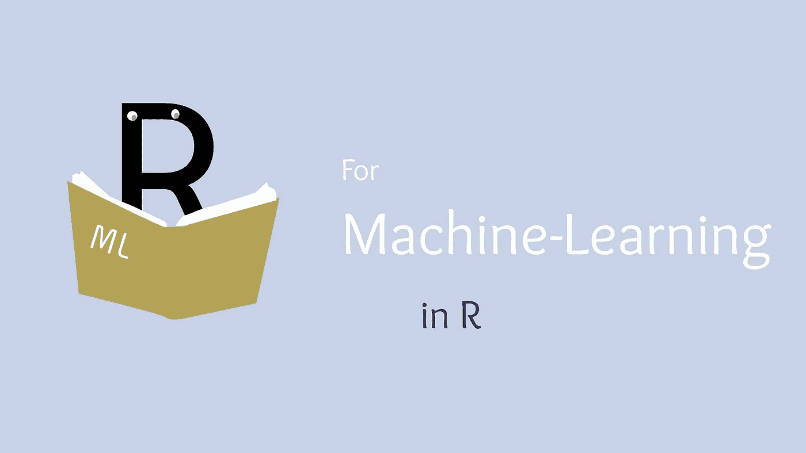

# 面向 R 程序员的 10 本最出色的机器学习书籍

> 原文：<https://towardsdatascience.com/10-most-brilliant-machine-learning-books-for-r-programmers-9e1780dd21f7?source=collection_archive---------16----------------------->

## R 中我最喜欢的 10 本统计学习用书！

(图片由作者提供)

# 介绍

当涉及到数据科学和统计计算时，很少有语言像 R 语言一样专注于这个领域。R 编程语言已经存在很长时间了，对于任何想从事数据科学的人来说，它肯定是一个可行的选择。令人惊讶的是，这甚至在 2021 年仍然如此。虽然在许多情况下，对于复杂的机器学习模型和神经网络等工作，有比 R 更好的选择，但 R 的生态系统尤其擅长事物的分析方面。

很难否认闪闪发光的仪表盘或 ggplot2 的威力。不用说，很难想象如果没有 R 编程语言，统计学习会是什么样子。尤其是 R 保持了概念和领域的生命力，多年来它是实现这一目的最流行的语言。如果您想了解更多关于这种实践中常用的所有语言，以及 R 的优缺点，我有一篇关于 2021 年数据科学最佳语言的文章，您可以在这里查看:

 [## 2021 年数据科学要学什么语言？

### 在新的十年里，哪些语言看起来对数据科学最有前途？

towardsdatascience.com](/what-language-should-you-learn-for-data-science-in-2021-fdeebb88d6e) 

用 R 编程语言可以做很多很棒的事情。此外，我想说，R 将很快成为任何数据科学家或有抱负的数据科学家的宝贵财富。关于 R 编程语言的一个伟大的事情是，随着它的生态系统，它真的已经存在了相当长的时间！这意味着在互联网上找到帮助往往相对容易。这意味着的另一件事更符合我在这篇文章中想要谈论的内容，

> 书籍。

在过去的几年里，书籍已经有点过时，这已经不是什么秘密了。也就是说，总的来说，现在写的书要少得多，而销售的文章和电子书要比精装书多得多。这是一件很棒的事情，因为我们可以拯救树木，但是使用 R，我们还可以受益于多年来为编程语言编写的整个教育书籍库！很难确定哪本书是我最喜欢的，因为我认为阅读编程是学习编程的最好方式——这些书已经派上了用场！如果你也想看看我最喜欢的几本 Python 书籍之间的类似比较，我这里有一本你可以看看:

 [## 7 本开创性的 Python 机器学习书籍

### 我用 10 多本我最喜欢的书来主导 Python 中数据科学的机器学习部分。

towardsdatascience.com](/7-ground-breaking-machine-learning-books-for-python-ea6db967e36c) 

# №1:用 R 进行深度学习

> 由[弗朗索瓦·乔莱](https://www.google.com/search?sa=X&hl=en&sxsrf=ALeKk03khH3nZP6IWRiHU-EArfOeuXon8g:1611098018087&q=inauthor:%22Francois+Chollet%22&tbm=bks)， [J. J .阿莱](https://www.google.com/search?sa=X&hl=en&sxsrf=ALeKk03khH3nZP6IWRiHU-EArfOeuXon8g:1611098018087&q=inauthor:%22J.+J.+Allaire%22&tbm=bks)

> 难度:中级—高级

这本书不仅封面很棒，内容也相当有趣和有用。虽然与 R 语言更强的分析能力和生态系统相比，深度学习可能不是这种语言的最大用途，但这本书实在太棒了。这本书的伟大之处在于，它给出了使用机器学习和深度学习技术的清晰、明确和定义的途径，并让你用简单的英语熟悉这些概念。

这本书对来自 r 的 Keras 库进行了相对深入的概述和常见用法。这个库当然是一个行业标准工具。这使得这本书更有价值，因为它将教授一种广泛使用的工具的用法，并从本质上为你在该领域使用该工具做准备。总的来说，这本书将为机器学习和深度学习概念提供坚实的基础，这将为整个数据科学职业生涯提供价值，我想说这当然值得一读！

> *综合评分:8/10*
> 
> *“这本书不仅将提供 R 编程和机器学习的基础知识，因为它是 R 语言，而且还将提供深度学习概念，这将极大地有利于数据科学职业生涯。”*

# №2: R 用于数据科学

> 由[哈德利·威克姆](https://www.google.com/search?hl=en&sxsrf=ALeKk000ChMgv765k9paUEwa4EgnvgkNnA:1611610391975&q=inauthor:%22Hadley+Wickham%22&tbm=bks)，[加勒特·格罗勒蒙德](https://www.google.com/search?hl=en&sxsrf=ALeKk000ChMgv765k9paUEwa4EgnvgkNnA:1611610391975&q=inauthor:%22Garrett+Grolemund%22&tbm=bks)

> 难度:初学者

*R for Data Science* 是 O'Reilly 对数据科学教育社区的另一个重大贡献，就有价值的教育而言，这一次肯定与其他任何一次没有什么不同。这本书绝对精彩，我发现这本书实际上非常令人兴奋和有趣，这超过了许多教育文学作品。这本书的伟大之处在于，它将把基本上具有基本编程经验的人变成一台分析机器！

这本书也更加关注数据科学的数据方面。我以前说过，我认为理解干净的数据、统计如何工作以及如何处理数据将是数据科学家最有价值的资产。这本书通过提供一个在 R 中处理复杂数据集的具体基础，并将那些观察结果转化为知识，将这种方法论铭记于心。另一个伟大的事情是，这本书真正进入了数据科学的核心，即数据科学周期。

这个循环涉及所有重要且至关重要的数据科学技能，例如获取数据、处理和整理数据，然后用这些数据建模并有效地交流结果。如果你仔细想想，所有这些技能都是绝对必要的，很容易明白为什么它们都同等重要。如果不能扯皮数据，怎么清理？如果你不能清理它，你打算如何建模？这本书采取了一个伟大的方法来解决这些问题，通过在整本书中重复同样的循环，并真正强调要一路骑着它回家。

> *总体评分:9/10*
> 
> *“这本书提供了一些优秀的数据科学技能，为构建 R 编程语言打下基础。它全面地审视了数据科学通常涉及的整个过程，不会让人不知所措，既平易近人又令人愉快。”*

# №3: R 在行动

> 作者:罗布·卡巴科夫

> 难度:初学者

《R in action》是另一本很棒的书，我肯定会推荐给 R 编程语言的新手。这本书的伟大之处在于，它真正着眼于在商业中使用语言进行数据科学和分析应用。这是机器学习的一个方面，我认为它经常被忽视，尤其是在使用编程语言和机器学习模型的时候。

我认为这本书和后一本书都提出了很多关于展示研究的想法，数据科学的*R*是很重要的想法，可能会被初学者忽略。也就是说，这两本书都提供了对这些概念的坚实的基础理解，这对任何试图从事数据科学工作的人都有价值。

> *总体评分:8/10*
> 
> *“R in action 不仅涵盖了统计分析和一般 R 用法的广泛主题，还全面概述了与科学和研究演示相关的主题。我认为这是书中经常忽略的东西，所以不用说，这本书对这些主题进行了有效的关注，这意味着这本书对于那些试图熟悉这些概念的人来说是一笔巨大的财富。”*

# №4:高级 R

> 作者:哈德利·韦翰

> 难度:中等

虽然这本书可能会将自己标榜为高级 R，但我仍然认为书中提供的许多概念和编程技巧可以由只广泛熟悉 R 的人来解释。也就是说，这本书可能不会深入研究机器学习、分析或 R 的任何统计能力，但确实在让程序员熟悉和有效使用 R 编程语言方面做了令人难以置信的工作。

实际上，在拿起这本书之前，我已经使用 R 有一段时间了。看到封面，我很兴奋能深入了解 R 作为一门语言的能力。相反，我惊喜地了解到 R 更多的声明性特性，这使我更好地使用了这种语言，这对于我使用这种语言进行数据科学工作无疑是有价值的。

> *总体评分:7/10*
> 
> *“我认为这本书对于那些已经使用 R 语言有一段时间，但感觉需要更好地学习这门语言的人来说是一个很好的选择。这本书的伟大之处在于它解构了许多 R 的特性，使读者成为一个更善于利用语言中已有的特性的程序员。”*

# №5: R 食谱

> 保罗·蒂特

> 难度:初学者

排在第五位的是奥莱利的另一个可爱的贡献，而《男人》是一个值得挑选的作品！从我这里得到 10/10 的评分是很难的，但是 R cookbook 采用了一种非常类似于烹饪书的方法来提供关于 R 语言的信息。对于那些可能不太熟悉这门语言，但希望更多地使用它的人来说，这无疑是一个很好的选择。

这本书是无法用语言来描述的，因为它太棒了，但是我会给你一个基本的概述，你可以期望通过书中的某些章节来实现。这本书从 R 的安装开始，在速成这门语言中可用的软件和数据结构之前，快速进入基础部分。这本书以做什么结束

我真正喜欢这本书的是，它将提供一个非常全面的知识基础，告诉我如何有效地利用 R 编程语言。这本书做到了这一点，同时还保持了良好的解释，非常容易阅读。我想说这本书最大的缺点是它是针对初学者的。虽然我想说，许多有经验的用户可以获得某种形式的启示，在 438 页，它可能只值得浏览更多的前 R 用户。

> *综合评分:10/10*
> 
> *“这本书将以一种非常平易近人和简单的格式提供大量 R 和统计的基础知识，也可用于整个数据科学和统计工作的参考。”*

# №6:实用数据科学与 R

> 约翰·芒特和尼娜·祖默

> 难度:初学者

《实用数据科学与 R》是另一本用 R 语言进行数据科学研究的好书。这本书唯一的缺点是，我不认为它比这份清单上的其他选择好多少。我发现写作风格相对黑白和简单，没有留下太多的想象力。

尽管如此，这仍然是一本很棒的书，它将让你熟悉分析知识，特别是 R。记住这一点，它真正进入了 R 在 2021 年最常被用于数据科学的面包和黄油。

> *综合评分:7/10*
> 
> *“这本书肯定会提供一些关于数据科学的很棒的课程，读者可以在他们的整个职业生涯中珍藏这些课程。这本书还深入研究了数据分析，并为概念提供了具体的解释，尽管它以相对直接和简单的方式格式化——这在某些学习环境下可能是一个优势。”*

# №7:统计学习导论:R

> 由加雷思·詹姆斯，[丹妮拉·威滕](https://www.google.com/search?hl=en&sxsrf=ALeKk01gTd0wekx1TklJQLXPLZlnY5Cprw:1611615235617&q=inauthor:%22Daniela+Witten%22&tbm=bks)，[特雷弗·哈斯蒂](https://www.google.com/search?hl=en&sxsrf=ALeKk01gTd0wekx1TklJQLXPLZlnY5Cprw:1611615235617&q=inauthor:%22Trevor+Hastie%22&tbm=bks)，[罗伯特·蒂布拉尼](https://www.google.com/search?hl=en&sxsrf=ALeKk01gTd0wekx1TklJQLXPLZlnY5Cprw:1611615235617&q=inauthor:%22Robert+Tibshirani%22&tbm=bks)

> 难度:初学者

我很久以前在另一个数据科学书籍综述中提到的一本书是*统计学习导论:r 中的应用*这本书的伟大之处在于它非常关注我认为非常重要的统计概念。如果你也想看看我在这篇文章中提到的其他一些很棒的书，你可以在这里查阅整篇文章:

 [## 面向终身学习者的 5 本伟大的数据科学书籍

### 在这次疫情期间，我对那些对机器学习感兴趣的人的阅读建议。

towardsdatascience.com](/5-great-data-science-books-for-lifelong-learners-3a6405a7f890) 

这本书的伟大之处在于它所涵盖的内容。本书涵盖的概念仍然完全适用于当前的 R 包生态系统。此外，这本书确实着眼于 R 编程语言的许多优势，并利用它们进行统计学习。围绕这本书的是对统计计算的深入研究，以及一些用 r。

> *总体评分:9/10*
> 
> *“这本书可能有点旧了，但它肯定还在马鞍上。这本书的伟大之处在于，它可以教授很多关于 R 在今天应该用于什么的知识，并且这种语言的许多应用在今天仍然很有意义。”*

# №8: R 图形食谱:可视化数据的实用食谱

> 温斯顿·张

> 难度:初学者

奥赖利的另一本令人敬畏的“食谱”是 *R 图形食谱*。这本书深入研究了 R 中的图形处理，对于可视化策略肯定会派上用场。这是当今 R 程序员使用的另一种非常流行的分析方法，所以我认为这本书也非常适用于现代技术和数据科学。

这本书的伟大之处在于它真正关注了 R 数据科学难题中的一个元素。很多书试图涵盖机器学习问题的整个范围，而在一本书中全面涵盖这些问题并不容易，这本书的范围是我非常欣赏的。这本书还深入研究了数据和数据分布的工作，这当然非常适用于数据科学，并且将在数据科学的任何领域中派上用场。

> *总体评分:8/10*
> 
> *“这本书在展示数据分析的 R 编程语言中常见的许多不同的可视化风格方面做得很好。这本书的伟大之处在于，它的范围相对有限，因此学习目标更少，但占用空间的东西也更少。涵盖的主题非常全面，这也使这本书更容易理解。”*

# №9:数据分析软件:用 R 编程

> 作者:约翰·钱伯斯

> 难度:初学者

约翰·钱伯斯实际上是 S 编程语言的主要设计者，而 R 编程语言本质上是以它为模板的。在某种程度上，r 对于 S 就像 C++对于 C 一样，所以不言而喻，这个基本上创造了这种语言的家伙对这种语言如何工作以及如何有效地使用有很多见解。

这本书的伟大之处在于它对 R 中的一切进行了广泛的概述。这本书将用相对较长但全面的 515 页篇幅带您了解 R 中的可视化模式、统计学和软件工程。这本书的很多页面也使用了 R 包，这些包在今天仍然被广泛使用！

总的来说，这本书很棒——如果你是 R 的新手，这本书绝对值得一读，因为它对软件包的全面概述有助于你熟悉 R 的生态系统。虽然我不会说 R 有我最喜欢的数据科学生态系统，但我会说它确实有一些值得拥有的古老技术，这本书通过实际利用模块来解决现实的统计问题证明了这一点。

> *总体评分:8/10*
> 
> *“对于有经验的程序员来说，这本书将是一个很好的 R 语言入门书。此外，我认为有很多关于数据的知识，更具体地说是在 R 中处理数据，这对于任何数据科学工作来说都肯定会派上用场。”*

# №10: R 数据科学编程

> 罗杰·彭

> 难度:初学者

我将第一个承认，这本书有点怪异——但这是它的魅力之一。从伸出的企鹅的奇怪封面，到我非常确定企鹅是因为作者的姓氏而出现在封面上的事实(我希望是这样)，这本书一开始可能有点令人不快……然而，我认为这本书肯定值得一读，这就是我为什么相信这一点的原因。

彭有一种非常独特的文风，那就是既直接，又含蓄的风格。很多教育类书籍让我感到不安的是，作者缺乏一种有效的写作风格，让读者既能参与又能理解。

为了真正让人们学习数据科学，他们需要寻找信息。这可能将是他们生活中彻底改变一切的一段时间，他们需要对技术、统计数据、数据、见解，当然还有机器学习真正感到兴奋、着迷和开心。我喜欢这本书的原因是，它确实持有一些我认为在学习时需要考虑的核心价值观，并采取了一种实践的方法来欣赏这些价值观。这就是我将如何写我的书，因为我认为一种让人们进入做科学的最佳状态，同时也展示为什么它很棒的方法，才是真正让人们想要学习更多的东西。

> *综合评分:8/10*
> 
> 虽然这不是我读过的最好的书，但它确实让读者对主题感到兴奋和有动力，而不是保持单调，这是值得赞赏的

# 结论

我认为 R 编程令人难以置信地棒，其中一些书可以提供一个非常好的关于利用机器学习语言的基础结构。尽管最近这种语言对 Python 的支持有所下降，但从分析来看，它仍然比以往任何时候都更强大。我对使用大量 R 模块感到兴奋，因为对我来说，它们的一些实现是如此完美，可能是因为这些年来这些技术变得如此古老。

我可以第一个告诉你，作为一个主要的 Julian 程序员，我们有许多生物医学类型的科学家在工作——其中许多类型的分析都是在 R 中完成的。我要说的是，R 在这些方面肯定比 Julia 有更好的生态系统，所以不难理解为什么教你使用像 R 这样强大的工具的书非常棒。我当然会建议从这个列表中挑选一些，可能是烹饪书。非常感谢您的阅读，我希望这个列表有助于您更加熟悉奇妙的 R 编程语言！