# 每个数据分析师都需要知道的 10 个最重要的 SQL 命令

> 原文：<https://towardsdatascience.com/10-most-important-sql-commands-every-data-analyst-needs-to-know-f0f568914b98?source=collection_archive---------6----------------------->

## 从数据库中查询数据并不复杂


由[拍摄的照片](https://unsplash.com/@shunyakoide?utm_source=medium&utm_medium=referral)在 [Unsplash](https://unsplash.com?utm_source=medium&utm_medium=referral)

作为一名数据分析师或数据科学家，无论你在创建奇特的可视化效果方面有多擅长，或者在构建复杂的模型方面有多熟练，都没有关系——从本质上讲，你需要数据来做这些事情。

在大公司工作时，这些数据通常存储在数据库中，这样每个人都可以轻松地访问和查询他们工作所需的数据。

你如何查询这些数据？这就是 SQL 的用武之地。

SQL 是结构化查询语言的缩写，顾名思义，它是一种用于从关系数据库中查询或检索数据的标准化语言。此外，它还可以用于对数据执行各种操作，如过滤行和列以及简单的数据操作。

当我开始作为一名数据分析师工作时，我最早的观察之一是我周围的每个人都知道如何使用 SQL，我指的是几乎每个人。无论你是刚入队不久的实习生，还是从业已久的资深分析师，这都是大家需要了解的技能。这表明了 SQL 在数据科学分析领域的重要性。

有鉴于此，我想在这篇博客文章中重点介绍 10 大 SQL 命令，以帮助您开始使用 SQL 的旅程，但更重要的是，我将使用实际示例演示每个命令，以模拟实际使用数据库的感觉。

为此，我们将使用 [SQL Fiddle](http://sqlfiddle.com/#!17/c37c5) ，这是一个方便的在线测试和共享 SQL 查询的应用程序。出于本教程的目的，我创建了两个模拟表 transaction 和 customers，它们分别代表一个连锁超市的事务和客户概要。

# 1.选择和从

`SELECT`和`FROM`构成了所有 SQL 查询的基础。最基本的 SQL 查询将涉及这两个命令，随着查询变得越来越复杂，将在它们之上添加更多的命令。

`SELECT`通知您想要选择哪些列，而`FROM`指定您想要从哪个表中查询数据。

现在让我们看一些与事务表相关的例子。

要查看事务表中的所有列，请执行以下操作:

```
SELECT *
FROM transaction;
```

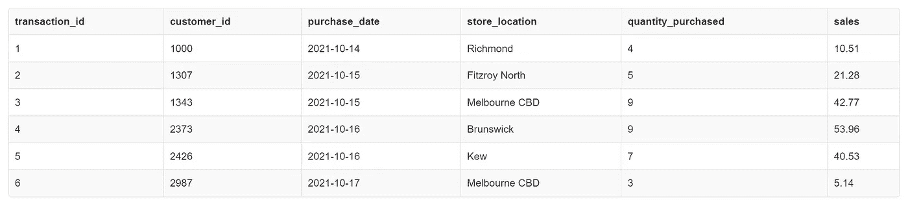

假设我们只需要事务表中的特定列:

```
SELECT transaction_id, purchase_date, sales
FROM transaction;
```

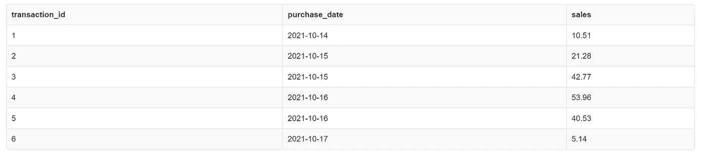

# 2.明显的

`DISTINCT`用于查看一列中的唯一值。例如，假设我们希望看到交易的唯一日期:

```
SELECT DISTINCT purchase_date
FROM transaction;
```

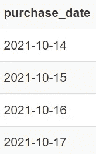

# 3.在哪里

`WHERE`用于过滤符合特定条件的行。此外，它还经常与其他运算符如`AND`、`OR`、`BETWEEN`、`IN`、`LIKE`一起使用，将多个条件组合在一起。

以下是一些例子:

```
SELECT *
FROM transaction
WHERE purchase_date = '2021-10-15';
```

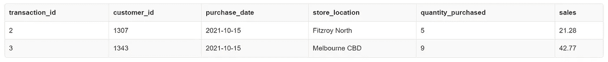

```
SELECT *
FROM transaction
WHERE purchase_date = '2021-10-15'
AND store_location = 'Melbourne CBD';
```

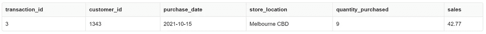

```
SELECT *
FROM transaction
WHERE purchase_date = '2021-10-15'
OR store_location = 'Melbourne CBD';
```

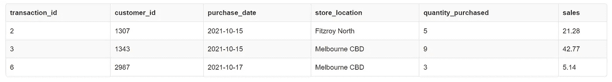

```
SELECT *
FROM transaction
WHERE store_location IN ('Richmond', 'Brunswick', 'Kew');
```

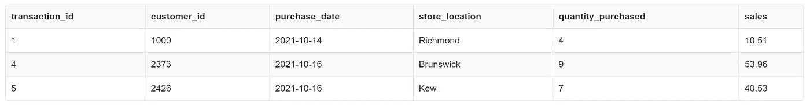

# 4.%通配符

在`LIKE`操作符中使用了`%`通配符来匹配字符串模式。

在我们研究这个通配符如何工作之前，让我们首先检查一下 customer profile 表。这张表告诉我们一个特定客户的生命阶段和保费状况。

```
SELECT *
FROM customers;
```

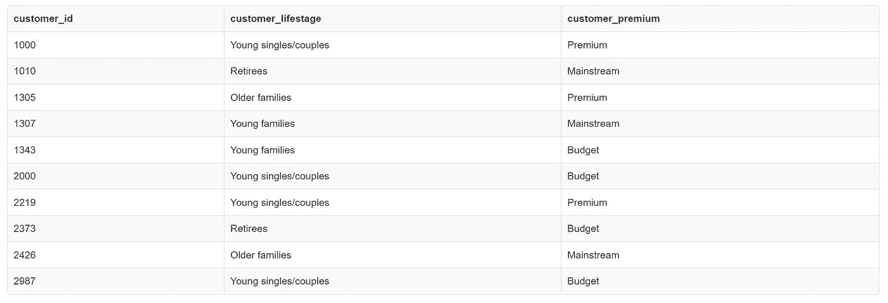

假设现在我们要过滤掉客户表中客户生命阶段以单词 Young 开始的行。

```
SELECT *
FROM customers 
WHERE customer_lifestage LIKE 'Young%';
```

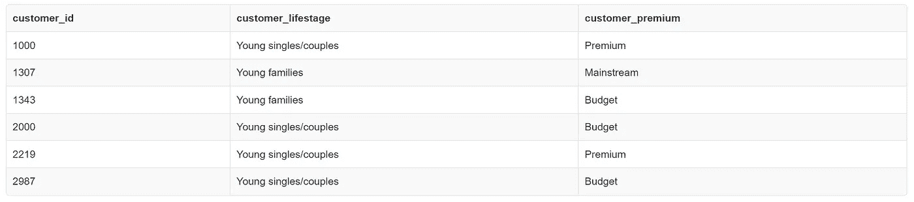

同样，如果我们想要查看客户生命阶段以单词 families 结束的行。

```
SELECT *
FROM customers 
WHERE customer_lifestage LIKE '%families';
```

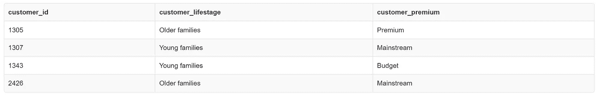

正如您所看到的，SQL 提供了一种快速而直接的方法来匹配字符串模式，这在许多情况下过滤掉行时非常方便。

# 5.以...排序

`ORDER BY`可用于按字母顺序或数字顺序对特定列的查询结果进行排序。可以有两种排序方式:`DESC`降序，或者`ASC`升序。尽管您会注意到大多数人不会在他们的查询中写`ASC`,因为 SQL 默认设置了这一点。

为了演示这一点，假设我们希望根据销售额对交易进行升序排序。

```
SELECT store_location, sales
FROM transaction 
ORDER BY sales;
```

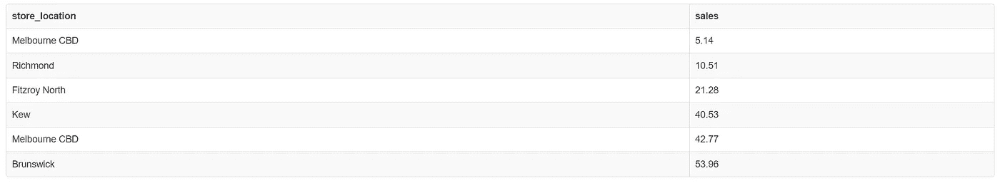

或者，我们也可以根据销售额对交易进行降序排序。

```
SELECT store_location, sales
FROM transaction 
ORDER BY sales DESC;
```

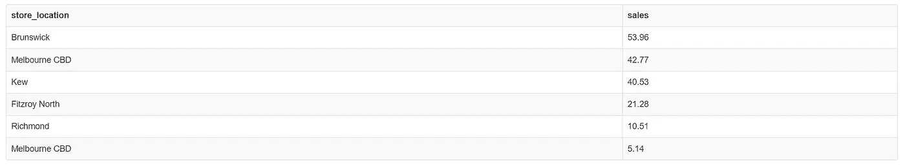

# 6.如同

`AS`使我们能够重命名列或表。请注意，这不会直接改变其原始列或表中的名称。

给定的查询将从事务表中返回日期列，其中*购买日期*被重命名为*日期*。

```
SELECT purchase_date as date
FROM transaction;
```

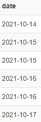

# 7.CASE WHEN，ELSE and THEN

如果您以前使用过任何其他编程语言，这与 if-else 语句非常相似。

实际上，用简单的英语来说，这个命令听起来有点像这样:如果满足一个条件，就这样做，否则就那样做。

让我们看一个例子来巩固这个想法。

假设我们想要创建一个新列，告诉我们特定交易的销售额是否超过 20 美元。

```
SELECT transaction_id, sales,
CASE WHEN sales < 20 THEN 'Sales amount is less than $20'
ELSE 'Sales amount is greater than $20' END AS sales_threshold 
FROM transaction;
```

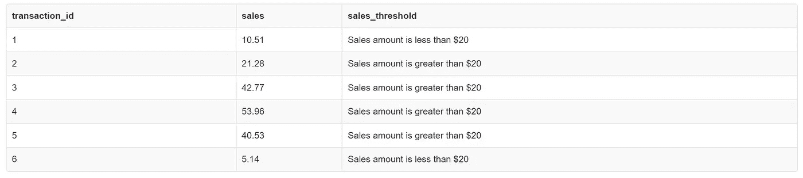

# 8.分组依据和聚合函数

`GROUP BY`将根据相同的值对数据进行分组。它经常与聚合函数一起使用，以总结特定数据组的属性。

另一方面，聚合函数对一系列值执行计算，并返回单个值。聚合函数的一些示例包括:

*   `COUNT`:返回总行数
*   `SUM`:返回所有值的总和
*   `MAX`:返回最大值
*   `MIN`:返回最小值
*   `AVG`:返回平均值

现在让我们来看一些例子。

假设我们想知道事务数据集中的行数。

```
SELECT COUNT(*)
FROM transaction;
```

交易数据集中最高销售额是多少？

```
SELECT MAX(sales) as max_sales
FROM transaction;
```

最后，如果我们想知道每天的总销售额，四舍五入到最接近的美元，该怎么办？

```
SELECT purchase_date, ROUND(SUM(sales)) as total_sales 
FROM transaction 
GROUP BY purchase_date;
```

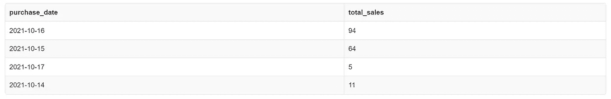

# 9.加入

在我们讨论连接的概念之前，我认为首先区分主键和外键是很重要的。

在关系数据库中，主键用于唯一标识表中的每一行。例如，事务表的主键是 *transaction_id* 列，而客户概要表的主键是 *customer_id* 列。

另一方面，外键提供了两个表中数据之间的链接。具体来说，一个表中的外键将链接到另一个表中的主键。例如， *customer_id* 列是事务表中的外键，但它是客户概要表中的主键。

给定主键和外键之间的关系，我们可以在这个特定场景中执行`LEFT JOIN`。

SQL 中还有其他类型的连接，比如`INNER JOIN`、`RIGHT JOIN`和`FULL JOIN`，这里就不赘述了。如果你有兴趣了解更多，查看这篇[博文](https://www.w3schools.com/sql/sql_join.asp)了解更多细节。

现在，假设我们想要在基于 *customer_id* 列的事务表上执行一个`LEFT JOIN`。

```
SELECT a.*, b.customer_lifestage, b.customer_premium
FROM transaction AS a
LEFT JOIN customers AS b
ON a.customer_id = b.customer_id;
```

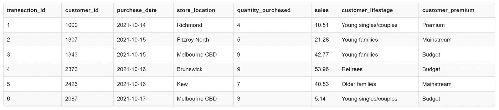

在我们执行了`LEFT JOIN`之后，总是检查行数也是一个很好的实践，以确保新表与连接之前的左表具有相同的行数，在本例中左表是事务表。

# 10.联盟

最后但同样重要的是，`UNION`用于组合来自多个`SELECT`语句的查询结果。请注意，您希望联合的表必须具有相同的列数，同样重要的是，这些列必须是相同的数据类型。

我不得不承认，我在这个练习中放在一起的两个表可能都不能最好地说明`UNION`的威力，但是，为了完整起见，我将在这里演示一下。

假设我们想要将来自事务表的 *customer_id* 列和 *quantity_purchased* 列联合起来。

```
SELECT customer_id AS sample_union
FROM transaction 
UNION
SELECT quantity_purchased FROM transaction;
```

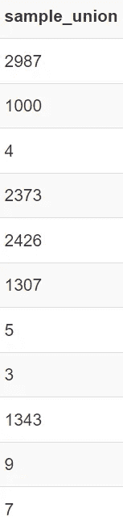

至此，我们总结了开始使用 SQL 时需要的 10 个最重要的 SQL 命令。

我希望，通过这篇博文，你已经更好地理解了什么是 SQL，以及它在数据科学分析中的重要性，但更重要的是，认识到一旦你掌握了基础知识，学习起来实际上相对容易。

对于任何有抱负的数据分析师或数据科学家来说，这绝对是您应该考虑添加到您的工具包中的技能之一，因为 SQL 已经存在。

不知道接下来要读什么？这里有一些建议。

[](/pandas-zero-to-hero-a-beginners-tutorial-to-using-pandas-f64e57386c7c) [## 熊猫从零到英雄——使用熊猫的初学者教程

### 熊猫零到英雄是一个视频教程系列，旨在教初学者友好的方式使用熊猫

towardsdatascience.com](/pandas-zero-to-hero-a-beginners-tutorial-to-using-pandas-f64e57386c7c) [](/five-basic-commands-to-getting-started-with-dplyr-in-r-c8b0451ad916) [## R 中开始使用 dplyr 的五个基本命令

### Dplyr 相当于 Python 中的 Pandas 库，可以轻松地进行数据探索和操作

towardsdatascience.com](/five-basic-commands-to-getting-started-with-dplyr-in-r-c8b0451ad916) [](/a-beginners-introduction-to-nlp-building-a-spam-classifier-cf0973c7f42c) [## NLP 入门——构建垃圾邮件分类器

### 如果您不熟悉自然语言处理这个激动人心的世界，请从这里开始

towardsdatascience.com](/a-beginners-introduction-to-nlp-building-a-spam-classifier-cf0973c7f42c)