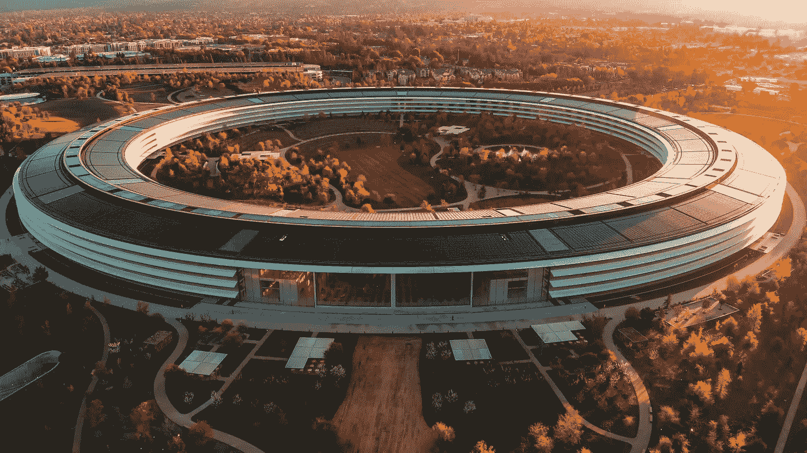

# 2022 年你应该知道的 10 个最实用的数据科学技能

> 原文：<https://towardsdatascience.com/10-most-practical-data-science-skills-you-should-know-in-2022-9487d7750e8a?source=collection_archive---------2----------------------->

## 实际上能让你就业的技能

照片由[卡莱斯·拉巴达](https://unsplash.com/@carlesrgm?utm_source=unsplash&utm_medium=referral&utm_content=creditCopyText)在 [Unsplash](https://unsplash.com/s/photos/apple-hq?utm_source=unsplash&utm_medium=referral&utm_content=creditCopyText) 上拍摄

# 介绍

许多“如何进行数据科学”的课程和文章，包括我自己的，倾向于强调基本技能，如统计、数学和编程。然而，最近，我通过自己的经历注意到，这些基本技能可能很难转化为让你能够就业的实用技能。

因此，我想创建一个**独特的**实用技能列表，让你**有工作能力。**

我谈到的前四项技能对于任何数据科学家来说都是至关重要的，不管你专攻什么。以下技能(5-10)都是重要的技能，但是会根据你的专业不同而有所不同。

例如，如果你最有统计学基础，你可能会花更多的时间在推断统计学上。相反，如果你对文本分析更感兴趣，你可能会花更多的时间学习 NLP，或者如果你对决策科学感兴趣，你可能会专注于解释性建模。你明白了。

话虽如此，让我们深入了解我认为最实用的 10 项数据科学技能:

> **请务必点击** [**订阅此处**](https://terenceshin.medium.com/membership) **或我的** [**个人简讯**](https://terenceshin.substack.com/embed) **千万不要错过另一篇关于数据科学指南、技巧和提示、生活经验等的文章！**

# 1.编写 SQL 查询和构建数据管道

学习如何编写健壮的 SQL 查询，并在像 Airflow 这样的工作流管理平台上调度它们，会让你成为一名非常受欢迎的数据科学家，这就是为什么它是第一点。

为什么？原因有很多:

1.  灵活性:公司喜欢数据科学家，他们能做的不仅仅是数据建模。公司喜欢全栈数据科学家。如果您能够介入并帮助构建核心数据管道，您将能够改进收集的洞察力，构建更强大的报告，并最终使每个人的生活更轻松。
2.  **独立性:**有些情况下，您需要一个不存在的模型或数据科学项目的表或视图。能够为您的项目编写健壮的管道，而不是依赖数据分析师或数据工程师，这将节省您的时间，并使您更有价值。

因此，作为一名数据科学家，你必须精通 SQL。没有例外。

## 资源

 [## 为期 15 周的完整课程，旨在掌握数据科学的 SQL

### 在 15 周内学习最重要的数据科学技能

towardsdatascience.com](/a-complete-15-week-curriculum-to-master-sql-for-data-science-999e690033e4)  [## 模式 SQL 教程| -模式

### 学会用 SQL 用数据回答问题。不需要编码经验。

mode.com](https://mode.com/sql-tutorial/) 

# 2.数据争论/功能工程

无论您是在构建模型、探索要构建的新功能，还是进行深度探索，您都需要知道如何处理数据。

**数据争论**意味着将你的数据从一种格式转换成另一种格式。

**特征工程**是数据争论的一种形式，但特指从原始数据中提取**特征**。

无论您是使用 Python 还是 SQL，如何操作数据并不重要，但是您应该能够以自己喜欢的方式操作数据(当然是在可能的范围内)。

## 资源

 [## 面向机器学习的特征工程基本技术

### 用熊猫例子进行综合数据预处理所需的所有方法。

towardsdatascience.com](/feature-engineering-for-machine-learning-3a5e293a5114)  [## 发现特征工程，如何工程化特征以及如何擅长它-机器学习…

### 特征工程是一个非正式的话题，但绝对是众所周知的，并同意是成功的关键应用…

machinelearningmastery.com](https://machinelearningmastery.com/discover-feature-engineering-how-to-engineer-features-and-how-to-get-good-at-it/) 

# 3.版本控制

当我说“版本控制”时，我特别指的是 **GitHub** 和 **Git** 。Git 是世界上使用的主要版本控制系统，GitHub 本质上是一个基于云的文件和文件夹存储库。

虽然一开始 Git 不是最直观的学习技能，但对于几乎每一个与编码相关的角色来说，了解它都是必不可少的。为什么？

*   它允许您与其他人并行协作并处理项目
*   它跟踪你代码的所有版本(以防你需要恢复到旧版本)

花时间学习 Git。它会带你走得很远！

> **请务必在此** [**订阅**](https://terenceshin.medium.com/membership) **或我的** [**个人简讯**](https://terenceshin.substack.com/embed) **千万不要错过另一篇关于数据科学指南、技巧和提示、生活经验等的文章！**

## 资源

# 4.讲故事(即交流)

建立一个视觉上令人惊叹的仪表板或一个精确度超过 95%的复杂模型是一回事。但是如果你不能把你的项目的价值传达给其他人，你就不会得到你应得的认可，最终，你不会在你的职业生涯中取得你应该取得的成功。

讲故事指的是你“如何”传达你的见解和模型。从概念上讲，如果你考虑一本图画书，洞察力/模型就是图片,“讲故事”指的是连接所有图片的叙述。

在科技界，讲故事和交流是被严重低估的技能。从我的职业生涯来看，这种技能是初级、高级和经理的区别。

## 资源

# 5.回归/分类

建立回归和分类模型，即预测模型，不是你将**总是**在做的事情，但如果你是一名数据科学家，雇主会希望你知道这一点。

即使这不是你经常会做的事情，这也是你必须擅长的事情，因为你希望能够构建高性能的模型。举个例子，在我的职业生涯中，到目前为止，我只生产了两个机器学习模型，但它们是对业务有重大影响的关键任务模型。

因此，您应该对数据准备技术、增强算法、超参数调优和模型评估指标有很好的理解。

## 资源

 [## 2021 年你应该知道的所有机器学习算法

### 最流行的机器学习模型的直观解释

towardsdatascience.com](/all-machine-learning-algorithms-you-should-know-in-2021-2e357dd494c7)  [## 如何为机器学习模型准备数据

### 数据准备分步指南

towardsdatascience.com](/how-to-prepare-your-data-for-your-machine-learning-model-b4c9fd4e7ea) 

# 6.解释性模型

您可以构建两种类型的模型。一种是预测模型，它根据一些输入变量来猜测结果。另一个是**解释模型**，它不是用来做预测的，而是用来更好地理解输入变量和输出变量之间的关系。

解释性模型通常是使用回归模型创建的。这是因为它们在理解变量之间的关系时提供了大量有用的统计数据。

解释性模型被难以置信地低估和有用，如果你想进入决策科学领域，它是必不可少的。

## 资源

 [## 在解释性建模中解释结果

### 正如我们在简单线性回归课程中所讨论的，我们可以出于不同的原因使用回归。两个共同的目标…

www.jmp.com](https://www.jmp.com/en_ca/statistics-knowledge-portal/what-is-multiple-regression/interpreting-results-in-explanatory-modeling.html) 

# 7.A/B 测试(实验)

**A/B 测试**是一种实验形式，你可以根据给定的标准比较两个不同的组，看哪一组表现更好。

A/B 测试可以说是企业界最实用、最广泛使用的统计概念。为什么？A/B 测试允许您将 100 或 1000 个小的改进组合起来，随着时间的推移，会产生重大的变化和改进。

如果你对数据科学的统计方面感兴趣，A/B 测试对于理解和学习是必不可少的。

## 资源

 [## A/B 测试——统计测试完全指南

### 通过统计测试优化网络营销策略

towardsdatascience.com](/a-b-testing-a-complete-guide-to-statistical-testing-e3f1db140499) 

# 8.使聚集

就我个人而言，我在职业生涯中没有使用过集群，但它是数据科学的一个核心领域，每个人至少应该熟悉它。

集群很有用，原因有很多。您可以找到不同的客户群，可以使用聚类来标记未标记的数据，甚至可以使用聚类来找到模型的分界点。

下面是一些资源，介绍了您应该知道的最重要的集群技术。

## 资源

 [## 数据科学家需要知道的 5 种聚类算法

towardsdatascience.com](/the-5-clustering-algorithms-data-scientists-need-to-know-a36d136ef68)  [## 掌握 Python -机器学习的 10 种聚类算法

### 聚类或聚类分析是一个无监督的学习问题。它经常作为数据分析技术用于…

machinelearningmastery.com](https://machinelearningmastery.com/clustering-algorithms-with-python/) 

# 9.建议

虽然我还没有建立推荐系统，但这是数据科学中最实际的应用之一。推荐系统是如此强大，因为它们有能力推动收入和利润。事实上，[亚马逊声称在 2019 年](https://rejoiner.com/resources/amazon-recommendations-secret-selling-online/#:~:text=%E2%80%9CJudging%20by%20Amazon's%20success%2C%20the,the%20same%20time%20last%20year.)由于他们的推荐系统，他们的销售额提高了 29%。

因此，如果你曾经在一家公司工作，在那里用户必须做出**选择**，而**有很多选项可以选择**，推荐系统可能是一个值得探索的有用应用。

## 资源

# 10.自然语言处理

NLP，或**自然语言处理**，是人工智能的一个分支，专注于文本和语音。与机器学习不同，我要说 NLP 远未成熟，这就是它如此有趣的原因。

NLP 有很多用例…

*   它可用于情感分析，了解人们对企业或企业产品的感受。
*   它可以通过区分正面和负面评论来监控公司的社交媒体。
*   NLP 是构建聊天机器人和虚拟助手的核心
*   NLP 也用于文本提取(筛选文档)

总的来说，NLP 在数据科学领域是一个非常有趣和有用的领域。

## 资源

 [## 每个数据科学家都应该知道的 10 项 NLP 技术

### 自然语言处理是人工智能的一个子领域，旨在使机器理解自然语言

www.projectpro.io](https://www.projectpro.io/article/10-nlp-techniques-every-data-scientist-should-know/415) 

# 感谢阅读！

我希望这有助于指导你的学习，给你来年一些方向。有很多东西需要学习，所以我肯定会选择一些你听起来最感兴趣的技能，并从那里开始。

请记住，这更多的是一篇有轶事经验支持的自以为是的文章，所以从这篇文章中获取你想要的。但一如既往，我祝你学习一切顺利！

> **请务必在此** [**订阅**](https://terenceshin.medium.com/membership) **或我的** [**个人简讯**](https://terenceshin.substack.com/embed) **千万不要错过另一篇关于数据科学指南、技巧和提示、生活经验等的文章！**

不确定接下来要读什么？我为你挑选了另一篇文章:

 [## 六分钟内解释所有概率分布

towardsdatascience.com](/all-probability-distributions-explained-in-six-minutes-fe57b1d49600) 

**又一个！**

 [## 超过 100 个数据科学家面试问题和答案！

### 来自亚马逊、谷歌、脸书、微软等公司的面试问题！

towardsdatascience.com](/over-100-data-scientist-interview-questions-and-answers-c5a66186769a) 

## 特伦斯·申

*   ***如果您喜欢这个，*** [***订阅我的媒介***](https://terenceshin.medium.com/subscribe) ***获取独家内容！***
*   ***有兴趣合作吗？让我们连线上***[***LinkedIn***](https://www.linkedin.com/in/terenceshin/)