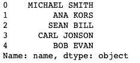

# 熊猫中最有用的 10 个字符串函数

> 原文：<https://towardsdatascience.com/10-most-useful-string-functions-in-pandas-a8c35b92d9a5?source=collection_archive---------45----------------------->

## 这些简单的熊猫函数使字符串处理变得容易


图片由 [ciggy1](https://pixabay.com/users/ciggy1-1593902/?utm_source=link-attribution&utm_medium=referral&utm_campaign=image&utm_content=1019062) 来自 [Pixabay](https://pixabay.com/?utm_source=link-attribution&utm_medium=referral&utm_campaign=image&utm_content=1019062)

**简介**

如果您一直在使用 python 中的 pandas 库，您可能已经注意到许多数据是以文本形式出现的，而不是像一些人想象的那样是纯数字。

这意味着需要清理和预处理字符串，以便它可以被分析、被算法使用或向公众显示。幸运的是，熊猫图书馆有自己的字符串处理部分。

在本文中，我们将带您浏览 pandas 库的这一部分，并向您展示最有用的 pandas 字符串处理函数。您将学习如何使用:

*   上部()
*   下部()
*   isupper()
*   较慢()
*   isnumeric()
*   替换()
*   拆分()
*   包含()
*   查找()
*   findall()

准备好了吗？

让我们开始吧。

**代码设置**

为了演示我们的第一个函数是如何工作的，我们应该创建一个我们将要使用的 pandas 数据框。您可以使用下面的代码来做到这一点:

```
import pandas as pd
client_dictionary = {'name': ['Michael Smith', 'Ana Kors', 'Sean Bill', 'Carl Jonson', 'Bob Evan'], 
                     'grade': [['A', 'A'], ['C'], ['A', 'C', 'B'], [], ['F']], 
                     'age': ['19', '19', '17', '18', '-'],
                     'group': ['class 1', 'class 2', 'class 2', 'class 1', 'class 2'],
                     'suspended': [True, False, True, False, True]
                    }
df = pd.DataFrame(client_dictionary)
df
```


这样一来，你就创建了一个包含五列的数据框:*姓名、年级、年龄、组别、*和*暂停*。我们将关注的列是由字符串值表示的*姓名、年龄*和*组*。

**1。上()**

我们将讨论的第一个函数将一个字符串中的所有字母转换成大写。我们可以使用下面的代码将它应用到 name 列。

```
df.name.str.upper()
```



正如你所看到的，名字中的所有字母都被改成了大写。

注意用于转换字符串的代码的语法。你需要先打电话。请在调用 upper()函数之前调用“str”。的’。“str”将 series 对象转换为可以执行实际字符串操作的字符串形式。

在列上执行的所有字符串操作函数都需要这样做。

**2。lower()**

Lower()函数的工作方式与 upper()函数类似，但它的作用正好相反，它降低了字符串中的所有字符。在这里你可以看到在*名字*栏调用它的结果。

```
df.name.str.lower()
```


**3。isupper()**

在*'之后，可以用与 upper()或 lower()相同的方式调用该函数。str'* 列上。它将检查一列中的每个字符串条目，如果它的所有字符都是大写的。再叫上*名*栏吧。

```
df.name.str.isupper()
```


如您所见，这会返回一个包含所有假值的序列。这是有意义的，因为 *name* 列中的条目只有名字和姓氏的首字母大写。

要查看不同的行为，请尝试以下代码:

```
df.name.str.upper().str.isupper()
```


正如您现在看到的，函数 isupper()现在返回一个只有真值的序列。这是因为我们在事先用 upper()函数大写的*名称*列上调用了它。

**4。islower()**

这个函数的工作原理与 isupper()相同，但是它检查是否所有字符都是小写的。

您可以看到，当在 *name* 列上调用时，它将返回一个包含所有 Flase 值的序列。

```
df.name.str.islower()
```


**5。isnumeric()**

这个函数检查字符串中的字符是否实际上是数字。它们都必须是数字，isnumeric()才能返回 True。

在我们的数据框中，我们有用一些字符串填充的*年龄*列。让我们调用*年龄*列的 isnumeric()函数。

```
df.age.str.isnumeric()
```


正如你所看到的，我们得到了一系列真值，除了最后一项是假的。如果您没有记错，数据框中最初的*年龄*栏除了最后一项是'-'(破折号)之外，其他都是数字。

**6。replace()**

另一个非常有用的函数是 replace()。它可以用来替换字符串的一部分与另一个。让我们演示一下如何在*组*列中使用它。如果你还记得*组*列由‘1 类’和‘2 类’条目组成。

```
df.group.str.replace('class ', '')
```


在上面的代码中，我们用两个参数调用 replace()函数。第一个参数是需要替换的字符串(在我们的例子中是“class”)，第二个参数是我们想要替换的内容(在我们的例子中是一个空字符串)。对*组*列执行此操作的结果是我们得到一个只有数字的序列，(‘1’和‘2’)。

注意，replace 也可以和正则表达式一起使用。我们上面所做的(删除“class”部分)可以通过以下方式使用正则表达式来完成:

```
df.group.str.replace(r'[a-z]+ ', '')
```


在本教程中，我们不打算详细介绍 python 中的正则表达式，但是上面的代码会用空字符串替换每个字母数字单词后面的空格。

使用 replace()还可以使用 *case* 参数来设置匹配是否区分大小写。

**7。split()**

函数的作用是:将一个字符串分割成所需的字符。如果你有一个句子和一个单词列表，这将非常有用。您可以通过在空白位置(“”)拆分字符串来实现这一点。

在我们的例子中，我们可能希望获得人名和姓氏作为单独的字符串。请注意，现在它们作为一个字符串列在*‘name’*列中。这将通过以下方式完成:

```
df.name.str.split()
```


注意，在这种情况下，split 甚至不需要参数。默认行为是在空白区域拆分。如果你想在别的地方拆分字符串，你必须把它传递给 split 函数。例如，下面的代码演示了在字符“a”上拆分同一列。

```
df.name.str.split('a')
```


**8。包含()**

Contains()函数可以检查字符串是否包含特定的子串。该函数与 replace()非常相似，但它不替换字符串本身，而是返回布尔值 True 或 False。

让我们通过在*组*列上调用该函数来演示该函数是如何工作的，以便找出字符串是否包含数字‘1’:

```
df.group.str.contains('1')
```


如你所见，结果是一系列的布尔。

类似于 replace()的 Contains()也可以与 case 参数一起使用，使其区分大小写或不区分大小写。

它也可以与正则表达式一起使用。下面是一个检查字符串在*组*列中是否有数字字符的例子:

```
df.group.str.contains(r'[0-9]')
```


如您所见，结果是一个只有真值的 Series 对象。这是正确的，因为*组*列包含了字符串中含有 1 或 2 的条目。

**9。find()**

Find()是另一个在清理字符串数据时非常方便的函数。这个函数将返回给定子串在字符串中的位置索引。

用一个例子更容易理解。让我们尝试使用 *name* 列来找出它的功能。我们将在字符串中搜索字母“s”。

```
df.name.str.find('s')
```


如果您不记得名称列，这是一个原始数据框。


如你所见，索引 1 处的条目(Ana Kors)的第 7 个字符是“s”。此外，索引 3 处的条目(Carl Jonson)的第 8 个字符是“s”。其余条目的结果是'-1 '，因为它们根本不包含' s '字符。

请注意，如果找到了多个“s”字符，find()将返回第一个字符的索引。

**10。findall()**

与 find()类似，Findall()将在字符串中搜索现有的子字符串，但它将返回匹配子字符串的列表，而不是一个索引。

同样，最好使用真实的例子。让我们在 *name* 列中搜索‘an’子字符串。

```
df.name.str.findall('an')
```


我们可以看到在第 1 行和第 4 行出现了一次“an”。

findall()函数的默认行为是不区分大小写的。如果您想忽略这种情况，您可以使用 *flags* 参数并导入 re 模块。

```
import re
df.name.str.findall('an', flags=re.IGNORECASE)
```


正如您现在看到的，索引 1 处的条目也返回‘An’。

**总结**

这篇文章介绍了我最喜欢的 pandas 模块中的字符串处理函数，你做到了！恭喜你。

我希望你现在能够使用本教程中的函数来清理你自己的数据集。

编码快乐！

*原载于 about datablog . com:*[2021 年 5 月 31 日熊猫](https://www.aboutdatablog.com/post/10-most-useful-string-functions-in-pandas) *中最有用的 10 个字符串函数。*

*PS:我正在 Medium 和*[***aboutdatablog.com***](https://www.aboutdatablog.com/)*上撰写以简单易懂的方式解释基本数据科学概念的文章。你可以订阅我的* [***邮件列表***](https://medium.com/subscribe/@konkiewicz.m) *在我每次写新文章的时候得到通知。如果你还不是中等会员，你可以在这里加入*<https://medium.com/@konkiewicz.m/membership>**。**

*下面还有一些你可能喜欢的帖子*

*</top-9-jupyter-notebook-extensions-7a5d30269bc8>  </top-8-magic-commands-in-jupyter-notebook-c1582e813560>  </introduction-to-f-strings-3822ed8683cc>  </9-things-you-did-not-know-about-jupyter-notebook-d0d995a8efb3> *