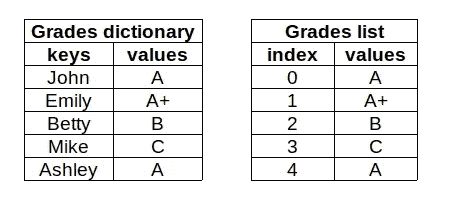

# 数据科学的 10 个必知 Python 主题

> 原文：<https://towardsdatascience.com/10-must-know-topics-of-python-for-data-science-9ce36a5b9681?source=collection_archive---------2----------------------->

## 熊猫或 Matplotlib 没有教你的


纳文·拉伊在 [Unsplash](https://unsplash.com/s/photos/10?utm_source=unsplash&utm_medium=referral&utm_content=creditCopyText) 上拍摄的照片

Python 正在主宰数据科学生态系统。我认为这种优势的两大原因是相对容易学习和丰富的数据科学库选择。

Python 是一种通用语言，所以它不仅仅用于数据科学。Web 开发、移动应用程序和游戏开发是 Python 的一些用例。

如果您仅将 Python 用于与数据科学相关的任务，您不必是 Python 专家。但是，有一些核心概念和特性，我认为你必须具备。

我们在本文中讨论的内容不是特定于库的。它们可以被认为是数据科学的基础 Python。即使你只是使用 Pandas、Matplotlib 和 Scikit-learn，你也需要对 Python 基础有一个全面的了解。这些库假设您熟悉 Python 基础知识。

我将用几个例子简要解释每个主题，并提供一个链接，链接到大多数主题的详细文章。

## 1.功能

函数是 Python 中的构建块。它们接受零个或多个参数并返回值。我们使用 def 关键字创建一个函数。

这是一个简单的将两个数相乘的函数。

```
def multiply(a, b):
  return a * bmultiply(5, 4)
20
```

这是另一个基于单词长度评估单词的例子。

```
def is_long(word):
  if len(word) > 8:
     return f"{word} is a long word."is_long("artificial")
'artificial is a long word.'
```

函数应该完成一个单一的任务。创建一个执行一系列任务的函数违背了使用函数的目的。

我们还应该为函数指定描述性的名称，这样我们就可以在不看代码的情况下知道它在做什么。

## 2.位置和关键字参数

当我们定义一个函数时，我们指定它的参数。当调用一个函数时，必须向它提供所需参数的值。参数的值也称为自变量。

考虑上一步中创建的乘法函数。它有两个参数，所以我们在调用函数时提供这些参数的值。

*   位置参数仅由名称声明。
*   关键字参数由名称和默认值声明。

调用函数时，必须给出位置参数的值。否则，我们会得到一个错误。如果我们没有为关键字参数指定值，它将采用默认值。

让我们用关键字参数重新定义乘法函数，这样我们就可以看到不同之处。

```
def multiply(a=1, b=1):
  return a * bprint(multiply(5, 4))
20print(multiply())
1
```

## 3.*args 和**kwargs

函数是 Python 中的构建块。它们接受零个或多个参数并返回值。就参数如何传递给函数而言，Python 相当灵活。*args 和**kwargs 使处理参数变得更加容易和简洁。

*   *args 允许函数接受任意数量的位置参数。

这里有一个简单的例子:

```
def addition(*args):
   result = 0
   for i in args:
      result += i
   return resultprint(addition(1,4))
5print(addition(1,7,3))
11
```

*   **kwargs 允许函数接受任意数量的关键字参数。

默认情况下，**kwargs 是一个空字典。每个未定义的关键字参数都作为键值对存储在**kwargs 字典中。

这里有一个简单的例子:

```
def arg_printer(a, b, option=True, **kwargs):
   print(a, b)
   print(option)
   print(kwargs)arg_printer(3, 4, param1=5, param2=6)
3 4
True
{'param1': 5, 'param2': 6}
```

[](/10-examples-to-master-args-and-kwargs-in-python-6f1e8cc30749) [## 掌握 Python 中*args 和**kwargs 的 10 个例子

### 如何使用和不使用它们

towardsdatascience.com](/10-examples-to-master-args-and-kwargs-in-python-6f1e8cc30749) 

## 4.班级

面向对象编程(OOP)范式是围绕拥有属于特定类型的对象的思想而构建的。在某种意义上，类型是向我们解释对象的东西。

Python 中的一切都是整数、列表、字典、函数等类型的对象。我们使用类来定义对象的类型。

类拥有以下信息:

*   数据属性:创建一个类的实例需要什么
*   方法(即过程属性):我们如何与类的实例交互。

[](/a-comprehensive-guide-for-classes-in-python-e6bb72a25a5e) [## Python 中的类的综合指南

### 如何定义一个类并与之交互

towardsdatascience.com](/a-comprehensive-guide-for-classes-in-python-e6bb72a25a5e) 

## 5.列表

List 是 Python 中内置的数据结构。它表示为方括号中的数据点集合。列表可用于存储任何数据类型或不同数据类型的混合。

列表是可变的，这也是它们被广泛使用的原因之一。因此，我们可以删除和添加项目。也可以更新列表中的项目。

下面是一些如何创建和修改列表的例子。

```
words = ['data','science'] #create a listprint(words[0]) #access an item
'data'words.append('machine') #add an itemprint(len(words)) #length of list
3print(words)
['data', 'science', 'machine']
```

[](/11-must-know-operations-to-master-python-lists-f03c71b6bbb6) [## 掌握 Python 列表的 11 个必知操作

### 附有示例的综合实践指南。

towardsdatascience.com](/11-must-know-operations-to-master-python-lists-f03c71b6bbb6) 

## 6.列表理解

列表理解基本上是基于列表、元组、集合等其他可迭代对象创建列表。它还可以被描述为用更简单、更吸引人的语法来表示 for 和 if 循环。列表理解相对来说比循环要快。


(图片由作者提供)

下面是一个简单的列表理解，它根据给定的条件从另一个列表创建一个列表。

```
a = [4,6,7,3,2]b = [x for x in a if x > 5]
b
[6, 7]
```

下面的列表理解将一个函数应用于另一个列表中的项目。

```
words = ['data','science','machine','learning']b = [len(word) for word in words]
b
[4, 7, 7, 8]
```

[](/11-examples-to-master-python-list-comprehensions-33c681b56212) [## 掌握 Python 列表理解的 11 个例子

### 如何有效地使用列表理解？

towardsdatascience.com](/11-examples-to-master-python-list-comprehensions-33c681b56212) 

## 7.字典

Dictionary 是一个无序的键值对集合。每个条目都有一个键和值。字典可以被认为是一个有特殊索引的列表。

这些键必须是唯一且不可变的。所以我们可以使用字符串、数字(int 或 float)或元组作为键。值可以是任何类型。

考虑这样一种情况，我们需要存储学生的成绩。我们可以将它们存储在字典或列表中。



(图片由作者提供)

创建字典的一种方法是用花括号写键值对。

```
grades = {'John':'A', 'Emily':'A+', 'Betty':'B', 'Mike':'C', 'Ashley':'A'}
```

我们可以使用它的键来访问字典中的值。

```
grades['John']
'A'grades.get('Betty')
'B'
```

[](/12-examples-to-master-python-dictionaries-5a8bcd688c6d) [## 掌握 Python 词典的 12 个例子

### 学习词典的综合实用指南

towardsdatascience.com](/12-examples-to-master-python-dictionaries-5a8bcd688c6d) 

## 8.设置

一个*集合*是不同可散列对象的无序集合。这是官方 Python 文档中对 set 的定义。让我们打开它。

*   无序集合:它包含零个或多个元素。集合中的元素没有关联的顺序。因此，它不像我们处理列表那样支持索引或切片。
*   独特的可散列对象:一个集合包含独特的元素。hashable 的意思是不可变的。虽然集合是可变的，但是集合的元素必须是不可变的。

我们可以通过将逗号分隔的对象放在花括号中来创建一个集合。

```
a = {1, 4, 'foo'}print(type(a))
<class 'set'>
```

集合不包含重复的元素，因此即使我们尝试多次添加相同的元素，结果集合也将包含唯一的元素。

```
a = {1, 4, 'foo', 4, 'foo'}print(a)
{1, 4, 'foo'}
```

[](/12-examples-to-master-python-sets-71802ea56de3) [## 掌握 Python 集合的 12 个示例

### 学习集综合实践指南

towardsdatascience.com](/12-examples-to-master-python-sets-71802ea56de3) 

## 9.元组

元组是由逗号分隔并包含在括号中的值的集合。与列表不同，元组是不可变的。不变性可以被认为是元组的识别特征。

元组由括号中的值组成，用逗号分隔。

```
a = (3, 4)print(type(a))
<class 'tuple'>
```

我们也可以在不使用括号的情况下创建元组。由逗号分隔的值序列将创建一个元组。

```
a = 3, 4, 5, 6print(type(a))
<class 'tuple'>
```

元组最常见的一个用例是使用返回多个值的函数。

```
import numpy as npdef count_sum(arr):
   count = len(arr)
   sum = arr.sum()
   return count, sumarr = np.random.randint(10, size=8)
a = count_sum(arr)print(a)
(8, 39)print(type(a))
<class 'tuple'>
```

[](/10-examples-to-master-python-tuples-6c606ed42b96) [## 掌握 Python 元组的 10 个例子

### 综合实践指南

towardsdatascience.com](/10-examples-to-master-python-tuples-6c606ed42b96) 

## 10.λ表达式

λ表达式是函数的特殊形式。一般来说，lambda 表达式是不带名字的。

考虑以下返回给定数字的平方的函数。

```
def square(x):
   return x**2
```

等效的λ表达式为:

```
lambda x: x ** 2
```

考虑一个需要做一次或很少几次的操作。此外，我们对这个操作进行了许多修改，与原来的略有不同。在这种情况下，为每个操作定义一个单独的函数是不理想的。相反，lambda 表达式提供了一种更有效的方式来完成任务。

[](/the-power-of-lambda-expressions-in-python-c5a1dcea9837) [## Python 中 Lambda 表达式的威力

### 附有示例的实用指南

towardsdatascience.com](/the-power-of-lambda-expressions-in-python-c5a1dcea9837) 

## 结论

我们已经讨论了 Python 的一些关键概念和主题。大多数数据科学相关任务都是通过第三方库和框架完成的，如 Pandas、Matplotlib、Scikit-learn、TensorFlow 等等。

然而，我们应该对 Python 的基本操作和概念有一个全面的理解，以便有效地使用这样的库。它们假设您熟悉 Python 的基础知识。

感谢您的阅读。如果您有任何反馈，请告诉我。