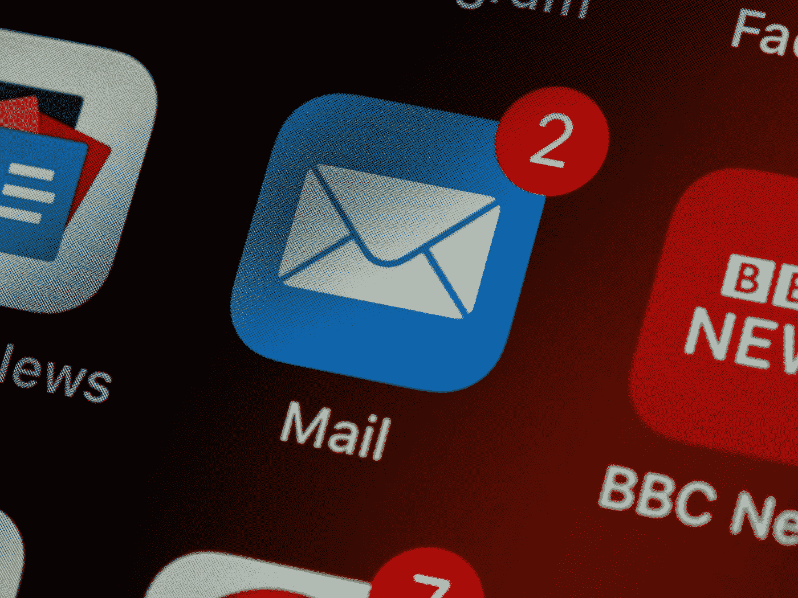

# 作为数据科学家，您需要订阅的 10 份简讯

> 原文：<https://towardsdatascience.com/10-newsletters-you-need-to-subscribe-to-as-a-data-scientist-d12c7f33fbab?source=collection_archive---------17----------------------->

## 直接通过电子邮件获取有用的知识。

布雷特·乔丹在 [Unsplash](https://unsplash.com?utm_source=medium&utm_medium=referral) 上的照片

在科技领域，我们总是在学习。有时候感觉我们永远不会到达我们领域的尽头，这是真的。技术发展和进步非常快。每天都在开发新的进步和工具。作为一名开发人员/数据科学家，我们日常工作的一个重要部分就是跟上所有的新闻，始终保持最新状态。

但是，通常，努力跟上技术世界的发展，磨练自己的技能，做好自己的日常工作并不容易。因此，我们倾向于优先考虑工作、放松、花时间与家人和朋友一起浏览网页、寻找最新消息和学习新东西。这个选择是正确的，我也几乎一直在做这个选择。

这就是为什么我最喜欢的东西之一是时事通讯。我不需要每天去查找信息；我只需要定期检查我的电子邮件，以获得我需要的关于这个领域的所有信息，也许还能在旅途中学到一些新东西。如果我想特别谈论数据科学，那么试图跟上该领域的各个方面可能有些不可能。

 [## 9 台用于数学、Python 和数据科学的 Discord 服务器，您需要立即加入

towardsdatascience.com](/9-discord-servers-for-math-python-and-data-science-you-need-to-join-today-34214b93d6b8) 

在这篇文章中，我将与你分享我最喜欢的 10 个数据科学相关的时事通讯。时事通讯可以跟上最新的数据科学研究、数据科学工具、新的可视化工具、可视化灵感，甚至可以磨练和提高您的编程、版本控制和 Python 技能。

那么，我们开始吧。

# №1:黑客之夜

让我们从一份面向所有阶段的开发人员的时事通讯开始吧，不管他们的专业是什么， [HackerNoon 时事通讯](https://hackernoon.com/tagged/software-development)。这是一份旨在增加专业软件开发知识和创新传播的周刊。这份时事通讯包含各种信息，从工程师的故事到新工具和详细的教程。此外，HackerNoon 提供了不同的标签，您可以根据自己的兴趣单独订阅。

# №2: **Git Rev 新闻**

接下来，我们有 [Git Rev News](https://git.github.io/rev_news/rev_news/) ，这是一份由 Git 志愿者撰写的时事通讯，旨在帮助开发人员磨练他们的版本控制技能。这篇时事通讯的主要目标是帮助人们更多地了解 Git，对它产生兴趣，并希望参与其中。它还旨在展示 Git 生态系统和社区。有时时事通讯包括职位空缺和一些与 Git 相关的自由职业者的工作。

# №3:更好的开发者

[Better Developers](https://sparklp.co/sara53f5cf) 简讯是我最喜欢的简讯之一，由最优秀的 Python 培训师之一[鲁文·m·勒纳](https://lerner.co.il/reuven-m-lerner/)撰写和维护。鲁文有着惊人的教学风格；他能用通俗易懂的术语解释复杂的概念。所以，如果你是 Python 的新手，或者想提高你的 Python 技能，看看这篇令人惊叹的每周时事通讯就知道了。

 [## 你需要加入的 6 个数据科学空闲工作区

### 从社区获得支持和灵感

towardsdatascience.com](/6-data-science-slack-workshops-you-need-to-join-b0c00952105d) 

# №4:讲故事的数据

数据可视化是数据科学的一个重要方面。我认为这是最重要的方面。如果你不能展示你的发现，那么人们——你的老板、上级或客户——可能不会意识到你付出了多少努力，甚至不知道你是否应用了正确的算法。了解如何使用可视化来更好地展示您的发现并帮助您探索数据对于每个数据科学家来说都是至关重要的。[讲故事数据简讯](https://www.storytellingwithdata.com/blog)将帮助你创造更好的可视化效果。

# №5:流动数据

另一个很棒的数据可视化时事通讯是 [FlowingData](https://flowingdata.com/newsletter/) 。这份时事通讯关注图表、它们的类型、何时使用它们，以及如何使它们更好、更具描述性和更有效。新闻简报提供了一些数据可视化工具工作的重点介绍和[可视化指南](https://flowingdata.com/category/guides/)的组合，适用于初学者和寻求提高可视化技能的人。

# №6:今日数据

我们的第三份也是最后一份数据可视化简讯是 [DataVizToday](https://dataviztoday.com/) 。本期时事通讯由数据即设计师[阿利·托班](https://dataviztoday.com/about)主持。她是一个伟大的可视化者，旨在分享她在工作中发现的可视化技巧、诀窍、最新工具和方法。因此，如果你是一名数据科学家、分析师、记者或设计师，并希望提高你的可视化和创造力，这份简讯是为你准备的。

 [## 6 个数据科学播客，随时随地学习新知识

### 充分利用你的时间。

towardsdatascience.com](/6-data-science-podcasts-to-learn-something-new-on-the-go-aa9f7628d951) 

# 第七名:玛奇纳数据

数据科学领域最著名的时事通讯之一是[数据玛奇纳](https://datamachina.substack.com/)。数据玛奇纳解决了许多数据科学主题，从专注于特殊的编程语言，如 Python 和 R，到算法和更高级的主题，如区块链和大数据。玛奇纳数据是一份每两周发送一次的时事通讯，它通常充满了有用的信息。

# №8:奥莱利数据/编程

O'Reilly 是科技领域所有专业的知名出版商之一。O'Reilly 提供 4 种不同的每周简讯，关注编程、数据科学、经济和基础设施，您可以单独订阅或一次订阅。但是，对于这篇文章，我想把重点放在编程和数据科学上。因此，通过关注这些时事通讯，了解更多关于编程范例和数据科学领域的热点。

# №9: KDnuggets

谈到数据科学时事通讯，我不能不提到 [KDnuggets 时事通讯](https://www.kdnuggets.com/news/subscribe.html)。KDnuggets 时事通讯拥有超过 6 万名订阅者，它关注所有对任何数据科学家都很重要的事情。从研究新闻到讨论数据科学主题的最新会议、研讨会、活动和网络研讨会。不仅如此，它还包括职业建议，面试准备，有时还有职位空缺。

 [## 数据可视化 101:有效可视化的 7 个步骤

### 用引人注目的视觉效果讲述您的数据故事。

towardsdatascience.com](/data-visualization-101-7-steps-for-effective-visualizations-491a17d974de) 

# №10:数据药剂

最后但同样重要的是[数据灵丹妙药简讯](https://dataelixir.com/)。这份每周 30，000 多份的订阅者简讯涵盖了广泛的主题，涉及见解、工具、技术、资源和数据可视化技巧。

# 最后的想法

作为数据科学家，我们总是在学习，总是在改进，总是在寻找新的技能、工具和算法来学习和实施。但是，不幸的是，我们经常被要求在完美地完成日常工作的同时不影响我们的个人生活。

我们可以通过订阅时事通讯和经常查看我的邮件来获取信息。时事通讯是新信息的重要来源，也可能是更新现有信息的一种方式。但是，有很多很多的时事通讯，订阅一大堆时事通讯也不是一个理想的情况。

然而，你不希望那天你的电子邮件被 100 封来自随机简讯的邮件攻击。但是，这并不意味着您可以订阅少量简讯来保持您的知识新鲜，并帮助您了解数据科学领域的最新动态。所以，我希望你能发现我推荐的一个或多个时事通讯是有帮助的，并决定订阅它们并从中获得新的知识。