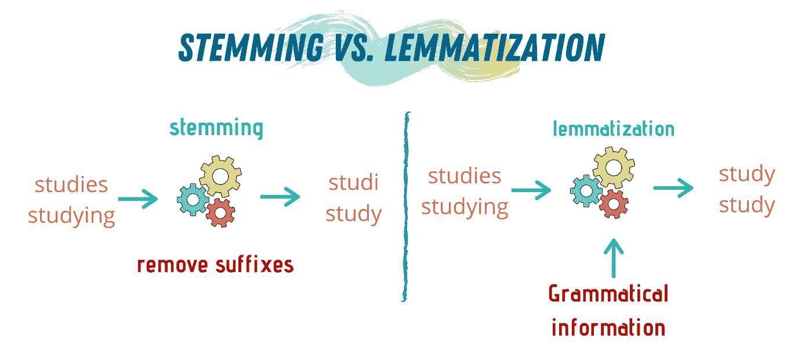
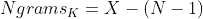
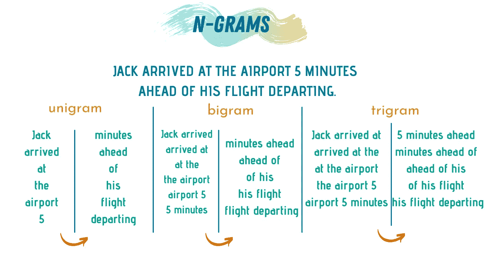
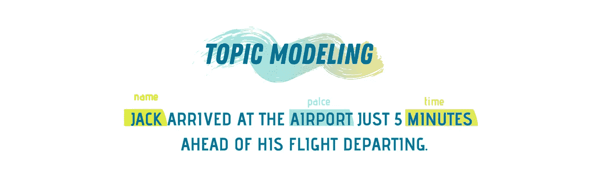
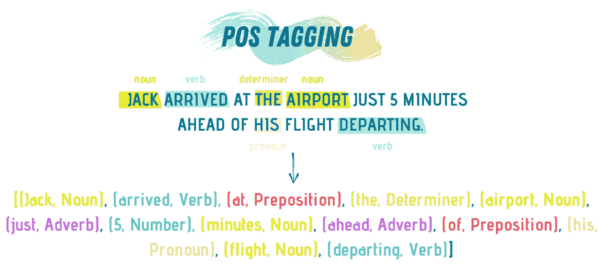

# 每个数据科学家都应该知道的 10 个 NLP 术语

> 原文：<https://towardsdatascience.com/10-nlp-terms-every-data-scientist-should-know-43d3291643c0?source=collection_archive---------10----------------------->

## 了解术语对于理解任何教程都是必不可少的。

由 [Raphael Schaller](https://unsplash.com/@raphaelphotoch?utm_source=medium&utm_medium=referral) 在 [Unsplash](https://unsplash.com?utm_source=medium&utm_medium=referral) 拍摄的照片

当你决定学习一项新技能时，通常会有许多挑战需要你去克服，直到你掌握了那项技能。你需要有一个坚实的想法，知道你需要做什么/学会掌握这个想法；你需要知道你可以使用什么资源，你需要能够区分好的和坏的资源，这样你就不会把时间浪费在错误的资源上。

也许你需要采取的最艰难的一步是学习技能的语言。如果我们确切地说自然语言处理(NLP)是你想要学习的新技能，那么在你开始浏览教程和视频之前，你需要学习这个领域的语言。

当开发人员和数据科学家编写关于特定主题的在线教程或创建视频时，总会有一个假设，如果你在这里(在教程或视频旁边)，那么你就知道发生了什么。因此，他们会使用技术术语，假设读者/观察者知道它们的意思。

 [## 成为数据科学家的学习之路

### 开启数据科学未来的 10 步路线图

towardsdatascience.com](/a-learning-path-to-becoming-a-data-scientist-56c5c2e8ae3f) 

如果你不知道这些术语的意思，阅读或观看这些教程可能会很麻烦。因为那样的话，你需要停下来，谷歌一下这个术语，然后回到教程。你可以想象，或者经历过，这并不理想。

我写这篇文章的目标是为所有对自然语言处理感兴趣的人提供一篇一站式文章，让他们了解该领域常用术语的含义。因为一旦你这样做了，你将能够阅读任何关于自然语言处理的文章或观看任何视频，而不会感到困惑。

让我们开始吧…

# №1:文集

自然语言处理是一个独特的领域，它将计算机科学、数据科学和语言学结合在一起，使计算机能够理解和使用人类语言。从这个角度来看，**文集**——拉丁文中的*正文*——是一个用来指文本的*正文*的术语。单词的复数形式是**语料库**。

该文本可以包含一种或多种语言，并且可以是书面或口头语言的形式。语料库可以有特定的主题，也可以是概括的文本。无论哪种方式，语料库都用于统计语言分析和语言计算。

如果您正在使用 Python 来构建您的项目， [Gensim](https://radimrehurek.com/gensim/index.html) 包可以帮助您从 Wiki 或基于 Wiki 的文章中构建语料库。

 [## 6 个网页抓取工具，让收集数据变得轻而易举

### 任何数据科学项目的第一步都是数据收集。

towardsdatascience.com](/6-web-scraping-tools-that-make-collecting-data-a-breeze-457c44e4411d) 

# 2 号:词干

在自然语言处理中，词干提取是一种通过去除所有前缀、词缀和后缀来提取单词来源的技术。词干提取的主要目的是让算法能够从巨大的来源(如互联网或大数据)中寻找和提取有用的信息。

各种算法用于执行词干分析，包括:

1.  **查找表格。**包含所有单词的所有可能变体的形式(类似于字典)。
2.  **剥离后缀。**去掉单词的后缀，构建其词源形式。
3.  **随机建模。一种独特的算法理解后缀的语法规则，并利用它来提取新词的来源。**

您可以通过使用 [NLTK](https://www.nltk.org/) 包中的预定义方法在 Python 中执行词干提取。

# №3:词汇化

虽然词干提取是提取单词来源的好方法，但有时去除修正不足以获得正确的单词来源。举个例子，如果我用词干分析器得到*支付*的起源，它会给我 *pai* 。这是不正确的。

词干分析器的缺点经常出现在处理不符合标准语法规则的不规则单词时。在这里，术语化可以派上用场。

*词汇化*是一个用来表达某事做得很好的词。这种情况指的是提取单词的原始形式——也就是词条。因此，在我们前面的例子中，lemmatizer 将根据单词在句子中的位置返回 *pay* 或*payed*。

NLTK 包还提供了可以用来提取单词的词条的方法。

图片由作者提供(使用 [Canva](https://www.canva.com/) 制作)

# №4:标记化

在自然语言处理中，标记化是将句子砍成单个单词或标记的过程。在形成记号的过程中，标点符号或特殊字符通常被完全删除。

标记由特定的文本主体构成，用于统计分析和处理。值得一提的是，令牌不一定是一个单词；例如，“摇滚”，“3d 打印机”是令牌，它们是由多个单词构成的。

简而言之，标记化是一种用于简化语料库的技术，为下一阶段的处理做准备。

在 Python 中，NTLK 包提供了执行标记化的方法，比如 sent_tokenize 和 word_tokenize。此外，NLTK 为除英语之外的其他语言提供了标记器。

# №5:词汇

当面对自然语言处理任务时，我们需要考虑的不仅仅是语言。我们需要考虑如何在特定的上下文中使用一些术语来表示特定的意思。例如，“混战线”、“踢球者”和“闪电战”是用来描述美式足球不同方面的术语。

在语言学和自然语言处理中，词汇是包括所有词汇实体的语言语法的一部分。词汇实体处理一个词在不同情况和环境下使用时的含义。

词汇对于从自然语言处理模型中获得更准确的结果是必不可少的。例如，在对一些推文进行情感分析时，了解推文周围的主题，描述事物的口语化方式可以在分析结果中产生很大的差异。

 [## 每个数据科学家都应该知道的 6 种 NLP 技术

### 迈向更高效的自然语言处理

towardsdatascience.com](/6-nlp-techniques-every-data-scientist-should-know-7cdea012e5c3) 

# №6:单词嵌入

计算机不理解单词，所以如果我们想让它们分析并正确使用我们的语言，我们需要将它们呈现出来，让它们能够理解。此外，分析文本可能具有挑战性，而数字对于算法和计算机来说可能更容易。

在自然语言处理中，单词嵌入是一种用于将单词映射到实数值向量以供分析的技术。这些向量一旦形成，就可以用于训练模型、构建神经网络和使用深度学习技术。

可以使用各种算法来实现单词嵌入，主要有:

1.  **嵌入层**。在神经网络前端实现的层，用于提取单词嵌入。在将语料库应用于该层之前，必须对其进行清理和准备。
2.  **Word2vec。**一种统计技术，它从语料库中有效地学习单词嵌入，从而有效地训练神经网络。

# №7: N-grams

在文本分析任务中，n 元语法指的是将语料库分成 n 个单词的组块。这些词块通常是通过一次移动一个单词来构建的。当 n =1 时，我们使用术语单字码而不是 1 字码。在 n = 2 的情况下，我们称之为 bigams，当 n = 3 时，我们称之为 trigrams。

你可以用一个简单的等式计算出一个句子有多少克:

其中 **x** 是句子中的字数，n 是期望的克数。

在 Python 中，编写一个构造句子的 n 元语法的函数相对容易。但是，如果您不想自己实现，NTLK 和 textblob 包提供了一些方法，可以帮助您自动生成 n 元语法。

图片由作者提供(使用 [Canva](https://www.canva.com/) 制作)

# №8:标准化

当我们出于任何目的想要分析文本时，如果我们使用的文本是标准格式的，那么分析过程会更加准确。将文本放入标准格式就是所谓的标准化。例如，如果我们在一个文本中搜索，如果整个文本是大写或小写会更好。

规范化通常在对文本和查询进行标记化之后进行。然后，我们可能有两个相似的短语，但不是 100%相同，例如 USA 和 U.S.A。但是，您希望您的模型将这两个术语匹配在一起，而不管微小的差异。

规范化文本对您的自然语言处理模型既有好的影响，也有不好的影响。一方面，规范化导致搜索任务中更好的匹配。另一方面，将所有内容都转换成小写或大写可能会影响整个应用程序的可靠性。

# **№9:命名实体识别(NER)**

在任何自然语言处理任务中，我们经常被要求阅读、清理和分析一个巨大的语料库。这就是为什么这个列表中的大多数术语是可以使分析更容易和更有效的技术。

命名实体识别是另一种自然语言处理技术，它通过将不同的单词标记为预定义的类别，如人物、地点、时间、电子邮件等，来提取关于某些文本的更多信息。

图片由作者提供(使用 [Canva](https://www.canva.com/) 制作)

执行 NER 可以使对文本的进一步分析更加准确。您可以使用 Spacy 和 NLTK 之类的包在 Python 中执行 NER。

# **№10:词性标注**

另一种有用的分析技术是识别特定文本或句子中的不同词类。词性标注产生元组列表；每个元组包含单词及其标签。标签是对单词词性的描述，是动词、名词、形容词等等。

在大多数应用程序中，我们最初使用一个默认的 tagger 来获得基本的 POS 标记，然后我们可以增强它。NLTK 包提供了一个默认的标记器，可以为您提供任何文本的基本标记。

图片由作者提供(使用 [Canva](https://www.canva.com/) 制作)

# 外卖食品

每个领域都有自己的一套术语，该领域的人们经常使用这些术语来描述特定的过程和步骤，以便于相互交流和有效地解释他们的工作。

有时这些术语是你以前可能遇到过的词，知道它们的大概意思。但是，对于特定领域，这种含义可能不是 100%准确的。其他时候，这些术语是一组放在一起指向有时新的词。

不管它们的来源如何，理解这些术语是理解该领域、阅读任何讨论该领域的资源并最终掌握该领域的必要步骤。

 [## 给数据科学新手的 7 条建议

### 让您的学习之旅更加轻松。

towardsdatascience.com](/7-tips-for-data-science-newbies-d95d979add54) 

本文向您介绍了自然语言处理的基本术语，您可以在大多数描述任何领域方面的文章和视频中找到这些术语。希望了解这些术语的含义会让你更容易接触到资源，建立新的项目，在你的学习之旅中前进，并实现你的梦想职业。