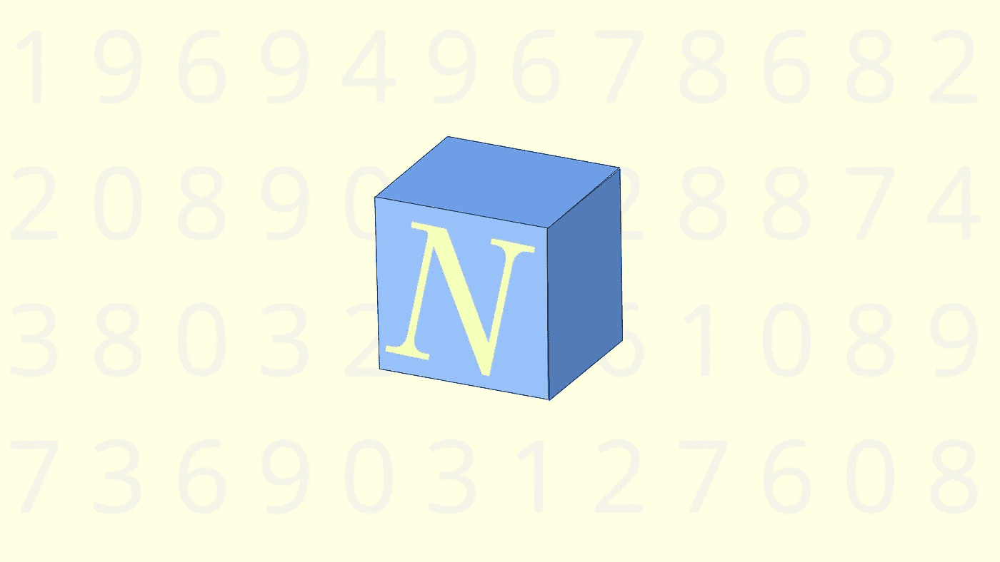

# 原始数据科学的 10 大特性

> 原文：<https://towardsdatascience.com/10-numpy-features-for-prestine-data-science-a434069ec94a?source=collection_archive---------23----------------------->

## 用这 30 个伟大的数字技巧完善你的代数



(图片由作者提供)

# 介绍

除非你是数据科学的新手，或者以某种方式使用拨号连接并生活在装有过时软件的终端中，否则你很可能听说过 NumPy。NumPy 是 Python 编程语言中典型的数据科学包之一。简单地说，NumPy 是一个库，可以用来执行线性代数和算术。然而，由于该软件的用户肯定能够迭代，它做的还不止这些！

NumPy 是一个巨大的库，已经被构建和迭代。一件很棒的事情是，所有 Pythonic 数据科学生态系统，甚至数学生态系统都已经使用 NumPy 进行线性代数。一个很好的例子是像 SkLearn 这样的包，甚至更多；熊猫。对于许多科学程序员来说，NumPy for Python 的强大功能甚至可能会将他们引入这种语言。

虽然 NumPy 是一个很棒的库，但它也是广泛的，并且已经开发了多年！虽然这意味着 NumPy 是一项古老的技术，肯定可以用于生产，但这也意味着对于没有经验的数据科学家来说，NumPy 可能很难接近。此外，你可以用 NumPy 做很多非常有趣和棒的事情，这些事情往往被掩盖起来，或者并不经常被想到。这当然是有害的，但也是可以理解的错误。

也就是说，让一个庞大而多样的包变得更熟悉的最有效的方法就是探索它！NumPy 是一个可以花上几个小时进行讨论的库，但是今天我决定用 NumPy 模块带来一些我最喜欢的函数和技巧，并把它们展示出来，这样我们就可以更加熟悉 NumPy 了！

# 类型

NumPy 为 Python 编程语言中的表带来的最酷的属性之一是它对类型的处理。Python 中的类型可能很复杂，因为在这种语言中处理和使用某些数据类型的方式。虽然这些概念在普通 Pythonic 编程中很容易实现，但在处理大量数据时很快就会出现问题。

这就是 NumPy 的用武之地。NumPy 提供了细化的标量类型、新的类型层次结构和完全不同的类函数来帮助支持他们的方法。使用普通的 Pythonic 列表可能会很乏味，为了有效地使用模型，通常需要将它调整到不同的维度。NumPy 之所以伟大，是因为它在一个相对高级的接口下提供了所有这些类型，这个接口包含了线性代数的所有内容。

## №1:内置标量类型

虽然 Python 可能有一些很好的数据类型，但这些类型通常很难用线性代数来处理。这是因为 Python 列表通常不用于矩阵乘法。幸运的是，有了 NumPy，我们有了一种新的数组类型，它支持科学程序员所期望的这种数学语法。

关于这些新的 NumPy 数组，一个非常棒的特性是标量类型。Python 只定义了一种类型的数据类，例如 int 或 str。这是一个很好的想法，因为对于不太复杂的应用程序(这正是使用 Python 的初衷)，您真的不需要担心计算机可能处理数据的所有不同方式。另一方面，对于科学计算，可能需要规范和更强制性的控制。

也就是说，NumPy 集成了这些新的标量类型，这些类型非常有用，可以用来存储 Python 的数据类型，具有更像 C 的控制。这些标量存在于类型层次结构中。例如，我们可以在给定的 NumPy 数组上运行 isinstance()函数，这将告诉我们该类型是否是 np.generic 的子类型，在本例中是层次结构的顶部。

```
import numpy as npval = np.array([5, 10, 15])
print(isinstance(val, np.generic))True
```

如果您想了解更多关于编程中的类型层次结构，我用 Julia 编程语言写了一篇文章，您可以在这里查看:

[](/overview-abstract-super-type-heirarchies-in-julia-26b7e64c9d10) [## 概述 Julia 中的抽象超类型层次结构

### Julia 的酷类型抽象介绍！

towardsdatascience.com](/overview-abstract-super-type-heirarchies-in-julia-26b7e64c9d10) 

## №2:屏蔽阵列

在许多情况下，数据集可能是不完整的，或者被坏数据污染。这些数据会破坏统计推断，因为不完整的观察值不是观察值。此外，这当然是机器学习模型的一个完全杀手。NumPy.ma 模块提供了一种快速、简单、方便的方法来解决科学计算中使用掩码数组的这些常见问题。

掩码数组是标准 NumPy 标量数组和掩码的组合。什么是口罩？掩码是表示是否满足条件的布尔类型列表。这意味着，通过在整个观察集上应用条件语句，可以快速有效地处理数据。例如，我们可以创建一个如下所示的数组:

```
**import** **numpy.ma** **as** **ma** x = np.array([1, 2, 3, -1, 5])
maskx = ma.masked_array(x, mask=[0, 0, 0, 1, 0])
```

## №3:数据类型(数据类型)

虽然数据类型通常是大多数编程语言的属性，但 NumPy 因拥有库附带的更加精细的数据类型对象而获得了额外的荣誉。NumPy 有一个更好的、更专注于数据的方法来识别数据类型，与它们的 Python 等价物相比，这些各自的数据类型有不同的属性。同样的概念有许多不同的应用，包括 Pandas 库中 Pythonic 数据帧的突出特性。

此外，这个函数可以更时尚地用于 NumPy 标量数据类型。也就是说，在处理大型数据集时，该函数通常主要应用于处理各种数据类型，如果某些数据被读取为可能不期望的类型，该函数肯定会派上用场。NumPy 的伟大之处在于，它真正关心其生态系统中的类型，使用这些类型可以很快使它们在不同模块和目标的整个范围内变得非常有用。

## №4:空

这种场景已经上演了多少次；您找到了一个很棒的数据集，兴奋地将数据拉入 Python，然后最终接触到一个巨大的失望——缺少值。缺失值是数据科学家或数据工程师最大的敌人，是坏数据或“脏”数据的明显标志。

虽然 Python 当然有工具来处理没有值的数据类型，但是 Python 本身带来的实现对于处理单一数据类型和对象要有用得多。也就是说，如果只给缺失数据分配了通用空值，那么很难对其进行排序。这个 NumPy 解决方案通过在熊猫图书馆的使用得到了进一步的认可。Pythonic 数据科学中检查空值最常见的语法是

```
df.isnull().sum()
```

这将给出给定数据帧中所有缺失值的总和。事实上，这是在 Python 中读入数据后最常运行的代码行之一，非常有价值，这肯定说明了 NumPy 模块的采用和可用性。我们还可以将它与掩码、循环和其他工具(如 Pandas 的 apply()函数)一起使用，只需一行代码就可以毫不费力地创建处理一维数据堆的调用。由于 Pandas 模块与 NumPy 紧密集成，我们甚至可以使用 fillna()函数轻松填充缺失的值！

```
*df = df.fillna(value=mean(df["X"]))*
```

如果您想为熊猫图书馆学习更多类似的技巧，我写了一篇文章，详细介绍了该图书馆能够做的 20 件令人兴奋的事情，任何有抱负的数据爱好者都可能会感兴趣:

[](/20-great-pandas-tricks-for-data-science-3a6daed71da0) [## 数据科学的 20 个大熊猫技巧

### 你应该每天使用的 20 个大熊猫技巧。

towardsdatascience.com](/20-great-pandas-tricks-for-data-science-3a6daed71da0) 

## №5:真实

在科学计算的奇妙世界中，另一个非常常见的概念是实数和虚数之间的差异。NumPy 带来了对复杂类型的强大支持，即既有实数值又有虚数值的数字。这些在 vanilla Python 中是不支持的，这一添加在原本作为高级脚本接口的语言和科学计算之间建立了一座真正的桥梁。对于科学家来说，拥有虚拟的边界来浮动数据类型是一个重要的概念，NumPy 包含了真实的、虚拟的和复杂的数据类型，这使得 Python 编程语言总体上对科学观众更有吸引力。

真正的“类型”本质上只是一系列数据类型，它们符合数学中的现实维度。也就是说，实数数据类型的主要例子是整数和浮点数。幸运的是，使用 NumPy 我们可以快速地在数据维度之间切换，并通过使用 real()函数消除虚部。虽然这是一个函数，而不是一个类型，但我认为重要的是要包括实数类型仍然只是一个概念，因为 NumPy 能够处理具有虚拟和实数维度的复杂浮点。最棒的是，他们给了我们这个函数来快速将适当的数据类型转换为复杂的浮点型:

```
np.real(np.conjugate(1+2j))
```

# 功能

虽然 NumPy 的类型非常有价值、有组织并且非常有用，但是 NumPy 也有一些很好的全局函数来执行一些很好的数学运算。这些运算的范围从点积到复数的倒数。不用说，模块作用域中的函数更有条理，是函数调用，尽管通常可以在 np.array 类的子类中找到等价的函数。

## №1: np.log()

NumPy 模块中的 log()函数是一个简单的函数，可以调用它来执行对数运算。这些对于创建数值算法非常有用，当与其他编程概念一起有效使用时，可以节省大量时间。对数是 NumPy 中的另一个特性，它为 Python 处理数值计算提供了更大的灵活性。这个 log()函数当然会使用所提供数据的自然对数。

```
np.log(x, 2)
```

## №2: np.recipricol()

NumPy 模块中的 recipicol()函数是一个简单的单函数调用，可用于获取值、分数、矩阵和数组的 recipicol。虽然这可能不是 Numpy 提供的最有用的函数，但它肯定是一个很好的例子，说明了 NumPy 对线性代数的深入研究。

```
np.recipricol(2.)
```

## №3: np.mod()

NumPy 模块引入 Python 的另一个非常重要的数学函数是 mod()函数。mod 函数将返回除法的元素余数。也就是说，通常需要两个矩阵、数组或向量来用函数进行除法运算。让我们试试这个:

```
x = [5,10,15,20]
x2 = [5,10,15,20]
np.mod(x, x2)
```

## №4: np.convolve()

np.convolve()函数用于获得两个一维序列的离散线性卷积。这意味着传递的数组的形状必须是(-1，1)或(1，-1)。卷积是一个数学概念，作为数据科学家，我们可能都很熟悉。回顾一下，卷积是指两个函数共同创建一个新函数。这当然是指微分方程，通常是某些分布的累积函数。

这意味着该函数旨在制定一组新的线性数据，这些数据遵循这些数组分布的卷积。换句话说，这两个变量的和在多维意义上分布在卷积上。不用说，我们很熟悉机器学习中的卷积，并且经常使用它，即使这个函数对于普通用户来说从来没有派上用场，它仍然是一个很好的工具！

```
x = [5,10,15,20]
x2 = [5,10,15,20]
np.convolve(x, x2)
```

## №5: np.conj()

如果你熟悉复数，那么你可能也熟悉复数的共轭概念。简单来说，一个复数的共轭就是虚维数的反转。这意味着为了计算共轭，复数的虚维度的符号被翻转。通常对于复数，我们可能会看到这样的情况:

```
5.5 + 0.2im
```

这个复数的共轭是

```
5.5 - 0.2im
```

## 奖金:nan_to_num()

nan_to_num()函数是 NumPy 模块中绝对被低估的数据科学资产。这个函数是做什么的？该函数接受缺失值或无穷大值，并将它们转换为数字。这对于有大量无效数据的数据集非常有用。缺失值被转换为零和具有大的有限值的无限值，或者由用户定义的值。

```
np.nan_to_num(np.inf)
```

# 结论

NumPy 无疑是一个非常棒的线性代数库。该模块使 Python 中的任何科学计算变得容易得多，如果不是这样，这种语言不太可能在科学计算领域被广泛采用。NumPy 最大的优点就是它的影响力。因为这个包很有影响力，所以维护得很好。此外，它还集成了整个 Python 工具生态系统。这意味着通用的 NumPy 函数可以在整个 Python 包中使用，大约有 250，000 个。对 NumPy 库的一个真正的赞美是，其他完全不同语言的生态系统也开始调整它们的语法，使之更像 NumPy，例如 C++的 XTensor，我写了一个简短的教程，你可以在这里查看:

[](/linear-algebra-in-c-with-xtensor-is-just-like-numpy-1a6b1ee00736) [## 用 XTensor 用 C++写的线性代数就跟 Numpy 一样！

### 使用张量库快速浏览 C++中的代数运算。

towardsdatascience.com](/linear-algebra-in-c-with-xtensor-is-just-like-numpy-1a6b1ee00736) 

NumPy 带来了许多对科学家来说非常有用的优秀类型和方法，这确实使它成为对整个社区有益的包。很容易理解为什么越来越多的科学家继续专门转向 Python 来使用这个模块，因为它可能是所有计算中如此高级的线性代数的最完善和精炼的解决方案之一！