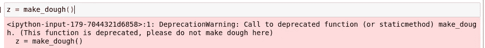

# 我最喜欢的 10 个 Python 装饰者

> 原文：<https://towardsdatascience.com/10-of-my-favorite-python-decorators-9f05c72d9e33?source=collection_archive---------3----------------------->

## Python 编程语言中更多优秀装饰者的概述。


(图片由 [Pixabay](http://pixabay.com) 上的[丹尼斯·杜可汗](https://pixabay.com/images/id-1285354/)提供)

# 介绍

如果说在计算领域有一件事真正让我着迷，那就是编程语言。我对编程语言很感兴趣，因为它们实际上只是硬件的抽象层。我们人类从这些抽象层中发现的与硬件交互的方式真的很神奇。我们想和非常人性化的东西一起工作:文字、关系和事物；我们在电脑里模拟了我们大脑的定义过程。虽然这与硬件编程类似，但我认为这些抽象层确实使语言变得有趣，因为有各种各样的方法来处理不同的场景和类型，看到人们提出的这种想法是非常有趣的。

每当我们谈论一种非常具有声明性的脚本语言——在这里是 Python——时，我认为这种魅力会变得更加强烈。像 Python 这样的语言的伟大之处在于它是声明性的，因为它是抽象的。这种语言非常容易使用，所有的底层硬件和内核调用都远离程序员。但是从底层发生的 push 和 pop 中抽象出这么多，看到如何操纵语法来处理这些类型真的很酷。

在上一篇文章中，我深入研究了 Python 中的多重调度。多重分派模块使用一个简单的装饰器将 Python 语言变成多重分派。如果你想了解更多，文章在这里:

</flawless-parametric-polymorphism-in-python-with-multipledispatch-f26b75d69c5f>  

> 顺便说一下，我喜欢多态性。

但是写了那篇文章，并对那个包进行了一些探索，确实让我的大脑再次开始关注装饰者——我想这是有充分理由的……装饰者很棒！它们在许多不同的场景中都非常有用，而且非常容易使用。我写的另一篇很棒的文章反映了这篇文章——可以被认为是某种类型的先驱，在这篇文章中，我详细介绍了我喜欢使用的 10 个很棒的 Python 装饰器，如果你也想看的话，这里有一个链接:

</10-fabulous-python-decorators-ab674a732871> [## 10 个神话般的 Python 装饰者

towardsdatascience.com](/10-fabulous-python-decorators-ab674a732871) 

鉴于 Python decorators 令人敬畏的本质，以及它们的能力，我认为用一些新的难以置信的 decorator 来编写一个新的故事，以便在您的 Python 代码中使用，是非常合适的。其中很多都改变了 Python 的范式，并且真的可以让您的 Python 代码更上一层楼！这份名单上的装饰家不包括在最后一份里，所以如果你想加倍努力，你可以看看这两份名单，看看你的军火库里有没有一些非常理想的装饰家。此外，Github 上有一个笔记本，上面有我在本文中使用的所有代码和装饰器，链接如下:

<https://github.com/emmettgb/Emmetts-DS-NoteBooks/blob/master/Python3/10%20Python%20Decorators.ipynb>  

# №1:多重分派:分派

毫无疑问，我刚刚写了一篇文章，介绍了多重调度模块及其功能。不用说，由于我倾向于大声地表达我的多重派遣观点和我的朱莉娅观点，如果有一件事我喜欢的话，那就是多重派遣。这似乎是一种非常自然的编程方式，不会真正妨碍到你。每当我写 Python 的时候，我经常错过这个非常 Julian 的编程概念，所以偶然发现这个包是一件非常高兴的事情。

在讨论如何使用这个装饰器之前，让我们先讨论一下多重分派是什么以及为什么。首先，多重分派是一个函数和类型系统，它允许方法按照它们的类型对应部分列出。通常，在面向对象的方法中，所有 Python 函数都将在 Python 类的范围内定义。这基本上就是面向对象编程的定义。然而，让 Python 成为一种更有用的语言的原因之一是，它不强迫人们使用这种范式。在 Pythonic 生态系统中，许多数据科学代码都非常有条理，在许多方面对类型的关注比第一次听说这种语言是“面向对象的”时所期望的要少得多。

我认为通过多重分派实现多态性确实可以将系统化带到下一个层次。正如我们将在我的例子中看到的，在一个类中也是如此。我之所以推荐在某些情况下使用这个装饰器，是因为它只是一个简单的调用，就可以从根本上改变代码，并产生一些非常棒的语法。让我们考虑下面的例子:

```
**from** multipledispatch **import** dispatchclass Pasta:
    def __init__(self, width, height, classification):
        self.width, self.height = width, height
        self.classification = classification
    def classify():
        if self.width > 3 and height < 2:
            self.classification = "Linguine"
        elif self.width == self.height and self.width < 3:
            self.classification = "Spaghetti"
        elif width > 2 and height == 1:
            self.classification = "Fettuccine"
        else:
            self.classification = "Dough"class Bread:
    def __init__(self, width, height, classification):
        self.width, self.height = width, height
        self.classification = classification
    def classify():
        if self.width > 3 and height < 2:
            self.classification = "Pizza Crust"
        elif self.width == self.height and self.width < 3:
            self.classification = "White bread"
        elif width > 2 and height == 1:
            self.classification = "Flatbread"
        else:
            self.classification = "Dough"class Roller:
    def __init__(self):
        pass
    def roll_thinner(x : Pasta):
        x.height -= 1
        x.width += 1
        x.classify()
    def cut(x : Pasta):
        x.width -= 1
        x.classify()
    def fold(x : Pasta):
        x.width += 1
        x.classify()
```

我们这里有三个班级。第一个对象是意大利面，它只是可以用我们的擀面杖(滚筒)擀出来的意大利面。)接下来是面包。面包和面食有许多相同的属性。然而，对于这个例子，我们在 bread 类中缺少了一样东西，唯一的问题是，如果我们包含了这个值，那么没有一个 Roller 函数会对 bread 起作用！在正常情况下，要么必须有专门处理这种类型的新函数，例如我们分别有 roll_thinnerbread()和 roll_thinnerpasta()，要么需要第二个擀面杖，我们只用于面包

```
class BreadRoller:
```

然而，有了多重分派，这些担心就可以消除了——我们可以使用多重分派来处理不同函数的不同类型。在这个例子中，我将只改变 Bread 类中的一个函数名。我将把 classify()函数的名称改为 bake()。还有我做的这个函数，它会用一些预设的“面团”设置为我们吐出一个新的对象:

```
def make_dough(pasta = False):
    if pasta:
        return(Pasta(10, 10, "Dough"))
    else:
        return(Bread(10, 10, "Dough"))
```

> 让我们赚些钱吧！

```
dough = make_dough()print(dough.classification)'Dough'
```

我们还会做一些面团:

```
pasta_dough = make_dough(pasta = True)
```

现在让我们把意大利面擀成一条美味的扁面条，和我们刚刚做好的比萨饼皮一起食用。

```
rollingpin = Roller()while pasta_dough.height >= 3:
    rollingpin.roll_thinner(pasta_dough)while pasta_dough.width > 2:
    rollingpin.cut(pasta_dough)print(pasta_dough.classification)Linguine
```

太好了！我们做了些扁面条！但是看着这一切分崩离析，因为我们的另一种类型有一个稍微不同的结构:

```
rollingpin.roll_thinner(dough)---------------------------------------------------------------------------
AttributeError                            Traceback (most recent call last)
<ipython-input-132-b755ead4a785> in <module>
----> 1 rollingpin.roll_thinner(dough)

<ipython-input-118-1af4dc2d94f2> in roll_thinner(self, x)
 **5**         x.height -= 1
 **6**         x.width += 1
----> 7         x.classify()
 **8**     def cut(self, x : Pasta):
 **9**         x.width -= 1

AttributeError: 'Bread' object has no attribute 'classify'
```

> 哦不！

我真的很期待那个比萨饼…幸运的是，我们现在可以通过修改我们的擀面杖类中的函数来展示多重分派，以接受两种类型。我们将通过简单地克隆函数，更改需要更改的内容，然后使用 dispatch decorator 使代码只在传递正确的类型时执行，如下所示:

```
class Roller:
    def __init__(self):
        pass
    [@dispatch](http://twitter.com/dispatch) (Pasta)
    def roll_thinner(self, x : Pasta):
        x.height -= 1
        x.width += 1
        x.classify()
    [@dispatch](http://twitter.com/dispatch) (Pasta)
    def cut(self, x : Pasta):
        x.width -= 1
        x.classify()
    [@dispatch](http://twitter.com/dispatch) (Pasta)
    def fold(self, x : Pasta):
        x.width += 1
        x.classify()
    [@dispatch](http://twitter.com/dispatch) (Bread)
    def roll_thinner(self, x : Bread):
        x.height -= 1
        x.width += 1
        x.bake()
    [@dispatch](http://twitter.com/dispatch) (Bread)
    def cut(self, x : Bread):
        x.width -= 1
        x.bake()
    [@dispatch](http://twitter.com/dispatch) (Bread)
    def fold(self, x : Bread):
        x.width += 1
        x.bake() rollingpin.roll_thinner(dough)
```

现在这段代码执行了。不用说，这在许多不同类型的场景中都非常方便！就个人而言，我发现多重分派是一种非常明显编程方式。它非常灵活，可以创建一些非常出色的语法。更好的是，用这个装饰器很容易做到——我强烈推荐！

# №2:芹菜

在 Python 中处理任务时，芹菜是必不可少的。Celery 本质上是 Python 的一个任务管理器。它可以跟踪任务队列，任务队列是一系列计算机或线程接下来要执行的操作。计算世界中的字队列应该总是对数据应用先进先出的思想。打个更隐喻的角度来说，我们在叠煎饼，但我们先吃最下面的那个。

芹菜的唯一问题是它很难展示。为了使用这个库，我需要有一个生产服务器供我使用。当然，我没有这个，但我过去确实用过几次芹菜。以下是使用芹菜创建任务的基本示例，来自文档:

```
**from** **celery** **import** Celery

app = Celery('tasks', broker='pyamqp://guest@localhost//')

**@app**.task
**def** **add**(x, y):
    **return** x + y
```

不用说，芹菜非常容易使用。只需创建一个芹菜茎类，然后使用 decorators 对您的任务进行排队。然后，代理中的可用服务器将承担这些任务。

# №3:咔嚓:咔嚓

Click 是另一个我认为非常棒的模块。Click 帮助 Python 开发人员构建命令行界面，即 CLI。最棒的是，它可以用于向 Python 提供 CLA 或命令行参数。当然，这不会在我的笔记本上很好地着陆，但不管怎样，我认为它可能仍然是一个重要的工具来添加到一个人的武器库中。下面是一个示例，它会在将某人的姓名解析为 CLI 后问候该人:

```
import click[@click](http://twitter.com/click).command()
[@click](http://twitter.com/click).option("--name", prompt="Your name", help="The person to greet.")
def hello(count, name):
    click.echo(f"Hello, {name}!")if __name__ == '__main__':
    hello()
```

Click 非常酷，因为在很多方面它都像 bash 代码一样与 Python 并行工作。然而，用 Click 实现这一点的好处还在于，代码将不仅在类 Unix 操作系统上工作。

# №4:已弃用:

进行反对是非常令人讨厌的。你想摆脱一个功能，但每个人都还在试图使用它。在正常情况下，您可能需要键入一点代码来创建弃用警告。为此，我们将使用模块 warn:

```
warnings.warn(
            "this function is deprecated... etc.",
            DeprecationWarning
        )
```

然而，使用 deprecated，我们只需要用一个简单的调用做一件事。我们通过装饰器调用这个函数，可以立即给出弃用警告。

```
from deprecated import deprecated[@deprecated](http://twitter.com/deprecated) ("This function is deprecated, please do not make dough here")
def make_dough(pasta = False):
    if pasta:
        return(Pasta(10, 10, "Dough"))
    else:
        return(Bread(10, 10, "Dough"))
```

现在，当我们试图运行这个函数时，我们将得到一个不赞成使用的警告:

```
z = make_dough()
```



(图片由作者提供)

现在每个试图使用这个功能的人都会知道有

> 不允许生面团！

# №5:装饰:并发

Deco 是 Python 的并行计算模块。如果你在附近看我做的关于装饰者的最后一个列表，我提到了一个叫做 Numba 的包。Numba 可以 JIT 编译和 GPU 编译 Python 软件。Deco 很像 Numba，但是允许同步和并发进程。现在，我们专门来看看并发装饰器。并发选项使用 multiprocessing.pool 使事情并发。然后与另一个装饰器一起使用，在后台的一个线程中运行该函数，同时继续处理该函数。让我们看看前面 pasta roller 上并发函数的一个简单用法。

```
from deco import concurrent, synchronizeddef roll_linguine(count : int):
    rollingpin = Roller()
    pastas = []
    for i in range(0, count):
        dough = make_dough(pasta = True)
        while dough.height >= 3:
            rollingpin.roll_thinner(dough)
        while dough.width > 2:
            rollingpin.cut(dough)
        pastas.append(dough)
    return(pastas)
```

我还为比萨饼做了一个等价物！：

```
def roll_pizzas(count : int):
    rollingpin = Roller()
    pizzas = []
    for i in range(0, count):
        dough = make_dough()
        while dough.height > 3:
            rollingpin.roll_thinner(dough)
        while dough.width > 2:
            rollingpin.cut(dough)
```

为了使这些功能并发，我们只需添加装饰器:

```
[@concurrent](http://twitter.com/concurrent)
def roll_linguine(count : int):
    rollingpin = Roller()
    pastas = []
    for i in range(0, count):
        dough = make_dough(pasta = True)
        while dough.height >= 3:
            rollingpin.roll_thinner(dough)
        while dough.width > 2:
            rollingpin.cut(dough)
        pastas.append(dough)
    return(pastas)
[@concurrent](http://twitter.com/concurrent)
def roll_pizzas(count : int):
    rollingpin = Roller()
    pizzas = []
    for i in range(0, count):
        dough = make_dough()
        while dough.height > 3:
            rollingpin.roll_thinner(dough)
        while dough.width > 2:
            rollingpin.cut(dough)
```

# №6:装饰:同步

恐怕我们在披萨和扁面条的制作上犯了一个错误…不幸的是，今晚我们将有 500 多位客人！如果我们想确保每位客人都有饭吃，我们就需要做很多比萨饼和扁面条。每位客人需要 2 个披萨(我邀请了披萨爱好者大会，)和至少 20 个扁面条(披萨爱好者在大多数情况下也是面食爱好者。)幸运的是，因为我为这两种能力使用的两个函数是并发的，所以我可以使用 deco 的 synchronized decorator 来同步它们！

```
# linguine e pizza? molta bellisima!
[@synchronized](http://twitter.com/synchronized)
def prepare_meal(count : int):
    roll_linguine(count * 200)
    roll_pizzas(count * 2)
%timeit prepare_meal(500)
```

披萨/意大利面工厂有相当多的风扇噪音，但好消息是这一切都在运行——尽管在每个连续的循环中我都收到了早期**的反对警告，完全破坏了我的输出。**

# №7:缓存工具:缓存

缓存工具是另一个有助于提高 Python 性能的优秀包。这样的包很棒，因为它们确实让 Python 体验变得更好。写得非常好的 Python 代码可以非常快，但事实是我们是在脚本语言中。我们需要尽可能多的性能。此外，我们不能总是写出完美的代码！记住这一点，让我们看看另一个装饰器，它将增强我们的 Python 包的性能！装饰器被称为 cached，它可以使用许多不同的参数来改变所使用的缓存类型，以及这些缓存的可能大小。

所有这些对我们已经开始的小通心粉/比萨饼生意来说都将会派上用场。因为该函数可用于存储以前的计算以备将来调用。好消息是，这意味着我们现在可以让我们的比萨饼滚筒非常擅长滚动比萨饼，但他们在滚动 100 个比萨饼后仍然会感到疲劳，或者不管设定的数量是多少。

```
from cachetools import cached, LRUCache, TTLCache
```

我们可以提供一个缓存关键字参数，以确定使用哪种缓存。需要注意的一点是，这些缓存都以不同的方式运行。如果您将此代码用于一个大型应用程序，该应用程序可能会有很多这样的代码，但是您不希望您的缓存在使用时被覆盖，那么您可能希望使用 TTL 缓存。该缓存将在 10 分钟后消失，但不会被覆盖。另一方面，LRU 缓存可以被覆盖，但可以永久保存，这是通用用例的更好选择。还有一个版本，它没有类似于 LRU 的论证，我相信，只是可能使用一些其他的算法——坦白说，我不完全确定。

# №8:明天:线程

Tomorrow 是另一个可以用来提高 Python 编程语言性能的库。这个装饰器叫做线程。可以用一个位置参数来调用它，以指示我们希望为该任务分配多少个线程，然后我们可以设置关键字参数—例如，超时。

```
from tomorrow import threads
[@threads](http://twitter.com/threads)(5)
def prepare_meal(count : int):
    roll_linguine(count)
    roll_pizzas(count)
```

下面是一个使用超时关键字参数的示例:

```
[@threads](http://twitter.com/threads)(5, timeout = 1)
def prepare_meal(count : int):
    roll_linguine(count)
    roll_pizzas(count)
```

# №9:坚韧

Tenacity 是一个更独特的包，可以用来在某些代码不能正确执行的情况下再次尝试一些东西。它可以用于开发中的软件，或者如果请求没有得到满足，也可以用于请求。这样的东西有数百种用途，最棒的是，因为它被包装到这个装饰器中，所以可以非常容易地使用它！鉴于这种包装的性质，我在笔记本上构思演示的唯一方法就是用指纹进行投掷。

```
from tenacity import retry[@retry](http://twitter.com/retry)
def ohno():
    print("function ran once")
    try:
        2 == 3 - 5 == 6
    except ValueError:
        print("Idk what that was even meant to do")ohno()
```

每当我运行它时，它运行一次，然后使我的内核崩溃，也就是说，我在笔记本之外重试了一次，所以关于这个包有一些需要注意的地方，它在笔记本中不太可用。

# №10:财产

我们要看的最后一个模块装饰器是属性装饰器。这个来自标准库，decorator 部分用于将一个方法变成同名只读属性的“getter”。换句话说，我们只是让这个属性成为前一个属性的只读副本。

```
class PowerLine:
    def __init__(self):
        self._voltage = 100000
    [@property](http://twitter.com/property)
    def voltage(self):
        return self._voltage
```

# 结论

装饰器是 Python 编程语言中一个非常棒的特性。它们特别棒，因为它们可以用来改变给定类型与其周围方法的交互方式。我个人觉得这非常令人兴奋。装饰者的另一个优点是他们经常可以提高 Python 的速度，鉴于 Python 的脚本特性，我相信这是非常可取的。

希望有了这个装饰器列表，你的 Python 函数将会加速和改变！非常感谢您阅读我的文章，它意味着世界！我希望这些装饰者中的一些能让你成为一个更好的大画家！