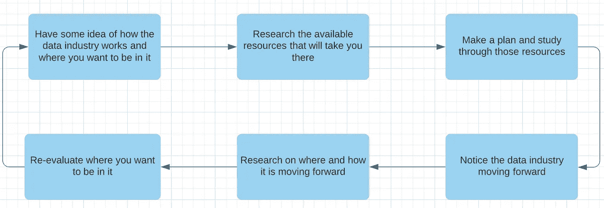

# 在数据行业大展拳脚的 10 个点

> 原文：<https://towardsdatascience.com/10-points-to-make-it-big-in-the-data-industry-db62dfdcd9f2?source=collection_archive---------24----------------------->

## 人们想在这里发展事业。但是他们经常被周围的噪音震聋。

约书亚·索蒂诺在 [Unsplash](https://unsplash.com?utm_source=medium&utm_medium=referral) 上拍摄的照片

假设你刚刚对人工智能、机器学习和数据科学这些华而不实的术语感到敬畏，并决定要么获得其中一个领域的学位，要么改变职业生涯，进入数据行业。你参与炒作，赶时髦，在 Coursera 上注册吴恩达的课程，在 Udacity 上注册更多的课程，买一些详细的书籍并浏览它们，开始旅行，实施一些项目并发表研究论文。你开始为自己的成就感到高兴。但当你去申请工作或实习时，你没有得到它，你想知道为什么。

嗯，问题是你上面所做的一切有助于了解基础知识，并接触到这个行业所能提供的东西。然而，数据行业本质上是跨学科的，广泛的，不断发展的，其周围的生态系统非常嘈杂。我的意思是，只要搜索任何热门词汇，你就会找到成千上万篇文章——它们都声称与众不同；这一个没有——爆破意见，建议，教程等等。我最近读了一篇文章，作者哀叹该领域专家缺乏有用的在线资源。几乎所有的东西都是针对新来者的。想象一下！

新来者实际上需要的是培养在这个巨大的行业中导航的能力，自己决定他们在这个行业中想要什么以及如何得到它。

> 在数据行业，做纵向的专家，而不是横向的‘专家’

# 磨练思维过程

为了让数据变大并过滤噪音，每个人都有必要在他们永无止境的学习过程的每个阶段都知道:

1.  数据产业如何运作
2.  它使用什么技术
3.  它是如何向前发展的

并将其与个人的行为联系起来:

1.  想象他们在行业中的角色
2.  已经计划好到达他们想要的位置
3.  “知道”是他们可以利用的资源，所有这些都是一个循环的过程。

一位数据行业资深人士的思维过程(图片由作者提供)

也就是说，这里是对可用的互联知识资源类型的深入探究。

# 10 种资源

1.  MOOCs 认证:在线课程和认证是一种很好的入门方式，很像速成课程。这里噪音的一个优点是有大量的选择。鉴于人们从一门强烈推荐的课程开始，MOOCs 让人们熟悉数据行业及其各个子行业的概念、术语、差异和布局。最重要的是，有一个证书——许多大学已经开始承认这些学分——来证明它！
2.  **参考书:**关于人工智能、深度学习和机器学习的参考书可以很好地深入研究任何选定的主题。这种类型的资源将涵盖深入的理论，并给出对基础概念的坚实理解。此外，还有基础数学的介绍！
3.  **数学:**数学，本身是没有必要的。然而，要全面理解数据行业中的任何概念、算法或技术，必须了解基础数学。这将允许他们在基层理解这个概念，以及在编程层面理解和调整这个概念的工作方式(想想:实现库)
4.  **技术:**对于开发人员来说，每天都有许多不同语言的更好、更优化的库和框架建立在数据行业的概念之上。对于希望从事 ML 模型或数据管道开发的人来说，他们必须了解最新的产品，同时还要理解基本的概念和数学，以便能够最大限度地使用它们。
5.  **研究论文:**相反，对于那些期待成为行业研究员的人来说，从*理论*的角度跟上最新的产品势在必行。这就是为什么阅读研究论文和出版他们自己的作品大有帮助。在这里，数学上的理解也很有帮助。
6.  **Kaggle:** 在了解了理论和概念之后，接下来的事情就是利用理论和库来处理一些实际数据。Kaggle 是处理来自真实世界用例的真实世界数据的最佳平台——从数据分析到超参数调整。唯一的缺点——也是最大的缺点——是模型部署和围绕模型构建应用程序在平台上是不可能的。Kaggle 可以证明最适合未来的数据分析师和机器学习工程师。
7.  **项目:**为了克服 Kaggle 的劣势，需要构建独立的项目。同样，来自 Kaggle 的数据可以被利用，但是在任何没有在 Kaggle 上完成的项目中，都要注意围绕模型包装应用程序并部署它。通过这种方式，人们可以在数据行业的端到端应用程序开发中获得一些经验。
8.  **云:**说到端到端开发，现在很多开发和提供的服务都利用了云。因此，想要在部署数据应用程序方面有所作为的人(比如 MLOps)必须熟悉该领域的各种云技术。
9.  **实习:**最后，所有的实施和理论知识都可以在实习或工作中加以利用，以便根据客户的要求从零开始构思、规划、设计和构建一些东西。这和项目的区别在于，在项目中，问题定义已经给出，不需要从业务角度思考。本质上，实习和工作提供了一个机会来扩展一个人的头脑风暴能力，因为要求很少是直截了当的。对于未来的数据科学家来说，这可能是一种理想的体验
10.  **领域知识:**记住，数据行业就像跑马拉松。将任何类型的业务需求与数据结合起来都是困难的，并且获得足够的知识来始终为业务领域做到这一点需要时间和与业务领域的多年联系。一旦实现，你将处于该领域数据金字塔的顶端！

这篇文章是基于我迄今为止在这个行业的经历和经验。如果有人在帖子上有所改进，或者指出我遗漏或错误的地方，我会觉得很丢脸。

最后，我想在 Linkedin 上联系一下！