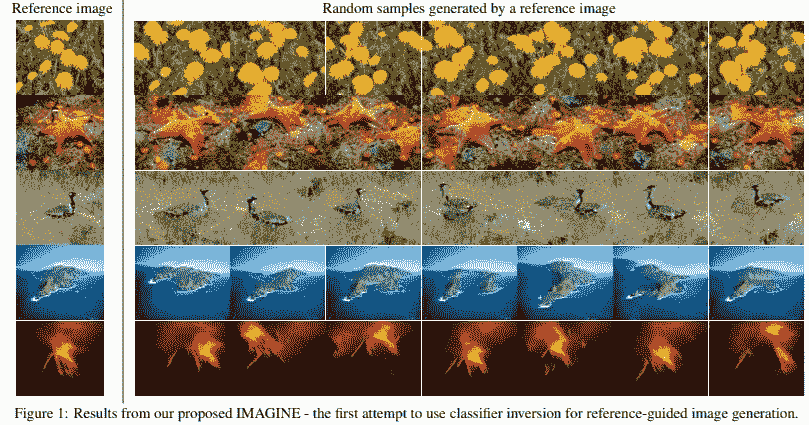
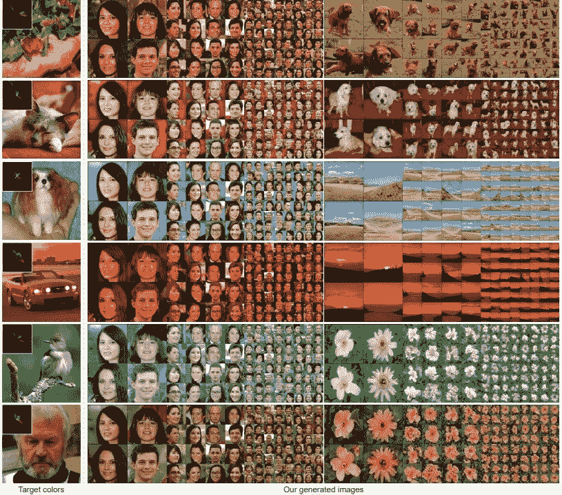
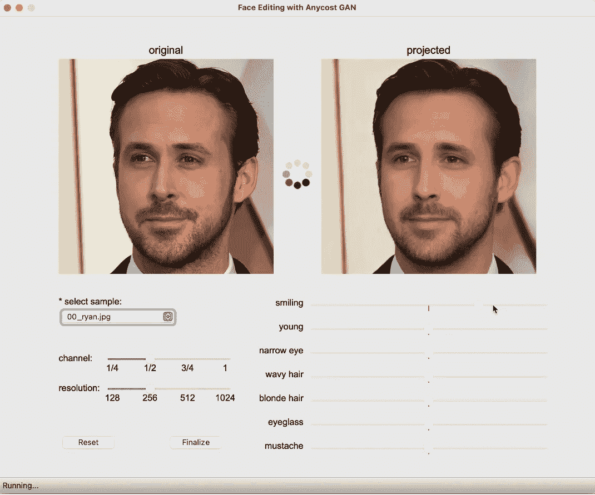
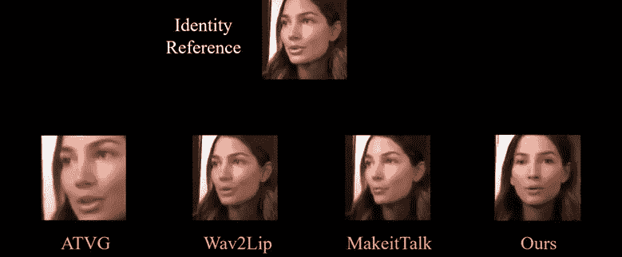
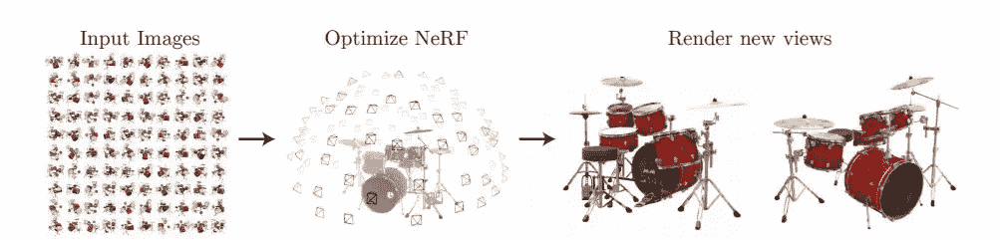
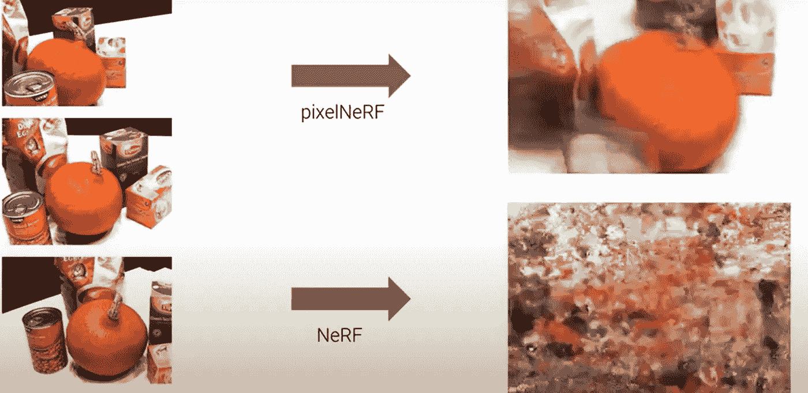
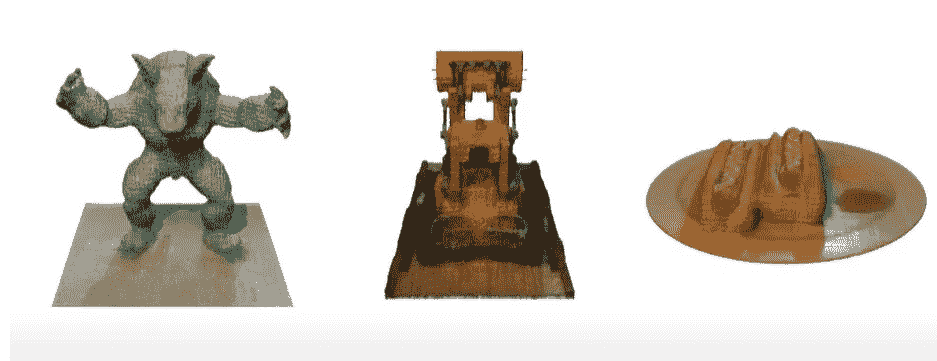
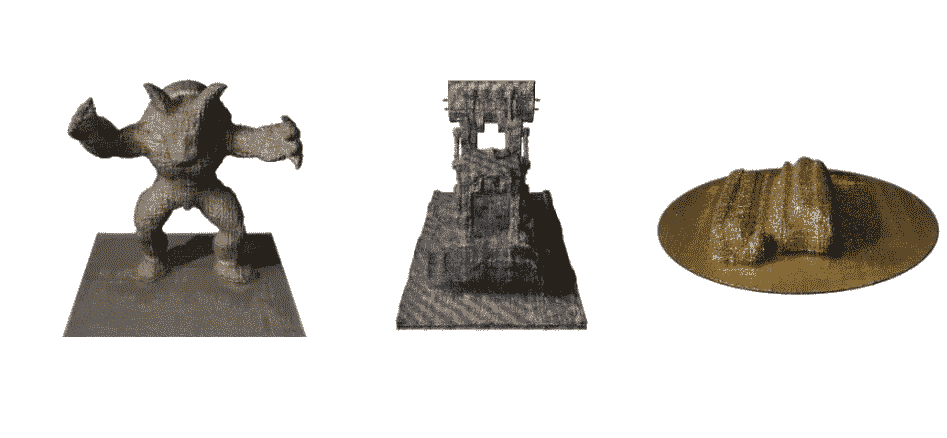

# 来自 CVPR 2021 的 10 篇有前途的综合论文

> 原文：<https://towardsdatascience.com/10-promising-synthesis-papers-from-cvpr-2021-5dc670981872?source=collection_archive---------22----------------------->

## 我们从顶级计算机视觉会议上挑选的关于人类、场景和运动合成的最有前途的最先进的论文。

2021 年计算机视觉和模式识别大会(CVPR)刚刚开始。主题涵盖从自动驾驶到医疗成像的整个领域，CVPR 2021 展示了一系列令人兴奋的最新技术，展示了巨大的实际应用潜力。在信息高度密集的文件迷宫中穿行可不是在公园里散步。因此，我们精选了十篇有前途的 CVPR 论文，涉及三大主题——图像合成、场景重建和运动合成。

# 图像合成中对 GANs 的控制

“我们没有更好的算法。我们有更多的数据，”谷歌的研究主管彼得·诺维格说。这恰当地反映了机器学习社区中普遍流行的“数据越多(通常)越好”的口号。在计算机视觉领域，近年来在合成和编辑真实感图像方面已经看到了生成式对抗网络(GANs)的出现和发展。

然而，计算机视觉从业者哀叹对这种生成模型合成的图像缺乏控制——这是正确的。在这里，我们探索一些 CVPR 2021 论文，这些论文吹嘘在生成图像的过程中提供更多的控制。这些进步代表了向 GAN 的广泛采用迈进了一步。

**1。长颈鹿:将场景表示为合成生成神经特征场** [ [Github](https://autonomousvision.github.io/giraffe/) ]

控制生成图像中的对象的任务需要模型在 3D 中推理。这对于在 2D 空间中运行的模型来说绝不是微不足道的。为了解决这个问题，本文在模型中引入了一种组合的 3D 场景表示，允许独立地控制对象的位置、方向和视角。

该模型能够首先识别前景和背景中的对象，然后改变它们的位置、方向和视角。然后，它将所有对象组合起来，生成一个输出图像。在该示例中，在汽车图像集合上训练的模型可以生成不同尺寸、位置和方向的汽车图像。长颈鹿也能够改变背景，甚至改变场景中汽车的数量。

**2。想象:通过图像引导模型反演**
的图像合成想象，图像引导模型反演(IMAGINE)方法从一个单一的图像生成高质量和多样的图像，而不需要训练生成器。它的一个关键特性是在合成过程中对语义(如对象的形状和位置)施加约束的能力，并为用户提供对控件的直观控制。不像它的前辈像 SinGAN 那样努力创造非重复的物体，IMAGINE 创造了非重复图像的高质量图像。

由想象生成的结果([来源](https://arxiv.org/pdf/2104.05895.pdf))

**3。HistoGAN:通过颜色直方图控制 GAN 生成的图像和真实图像的颜色**[纸张](https://arxiv.org/pdf/2011.11731.pdf)

GAN 难以控制的另一个方面是图像的颜色。受基于类直方图的颜色传递方法的启发，慕尼黑工业大学和谷歌的研究人员开发了 HistoGAN。

HistoGAN 通过修改 StyleGAN 的最后两个块来整合直方图特征，从而利用了 StyleGAN2 的架构。因此，通过将目标颜色直方图作为直方图输入的一部分，可以控制图像的色调。

使用直方图作为改变图像颜色的杠杆是直观的和独立于领域的，允许来自不同领域的图像和从业者潜在地使用直方图。在上面的 HistoGAN 图中可以看到目标颜色对生成图像的影响。

HistoGAN 生成的图像。每一行的图像都有不同的目标图像，目标颜色以直方图的形式从中导出(显示在左栏的左上角)。

**4。用于交互式图像合成和编辑的 any cost GANs[Github | Paper]**

像 StyleGAN2 这样的先进网络的高计算成本已经阻止了用户即时和交互式地生成图像。今天，一个完整的生成器大约需要 3 秒来渲染一幅图像，这对于许多用途来说都太慢了。这个问题预示着交互式自然图像编辑的任何代价。

使用 Anycost GAN，用户可以控制以较低的通道和分辨率配置生成图像，以换取更快的结果和更低的计算成本。有了这样的控制，用户可以以快 5 倍的速度生成视觉上相似的图像。

这一发现为用户在各种成本预算和硬件要求下生成图像铺平了道路，代表了向没有计算资源的用户普及 GANs 的一步。

AnycostGan 演示，重点介绍通道和分辨率设置。[播放 gif](https://raw.githubusercontent.com/mit-han-lab/anycost-gan/master/assets/figures/demo.gif) ！

# 动态物体和人的合成

我们已经看到了 GANs 如何允许静态图像被重新创建和控制。但是动态图像呢？在下一节中，我们将看到在运动中建模和合成物体方面的进步。

**5。通过隐式模块化视听表示生成姿态可控的说话人脸**

“我们正在进入一个时代，在这个时代，我们的敌人可以让任何人在任何时间点说任何话，”这是一位[总统奥巴马根据 2018 年](https://www.youtube.com/watch?v=AmUC4m6w1wo)几个小时的镜头重建的话。从那时起，计算机视觉社区已经实现了从音频剪辑中创建具有精确同步嘴唇运动的说话头部的壮举。然而，控制正在说话的头部的姿态的问题是具有挑战性的，并且是产生具有个性化的有节奏的头部运动的正在说话的头部的瓶颈。

姿势可控视听系统(PC-AVS)承诺通过实现自由姿势控制，同时创建带有音频的任意说话人脸来解决这一问题。PC-AVS 可以将一个演员的单张照片、音频剪辑和另一个演员姿势的源视频转换成一个逼真的说话头。这种方法优于现有的方法，如节奏头(陈等人)和 MakeitTalk(周等人)，特别是在音频的极端条件下，如当音频有噪声时。

[玩说话脸夹！](https://www.youtube.com/watch?v=lNQQHIggnUg&t=1s)

**6。神经体:具有结构化潜在代码的隐式神经表示，用于动态人的新颖视图合成[**[**GitHub**](https://zju3dv.github.io/neuralbody/)**]**

一个人需要多少台摄像机才能精确地再现人类的 3D 动作？过去，一个像样的机会需要一屋子的摄像机，尤其是像跳舞这样复杂的身体动作。多亏了神经体，一种带有结构化潜在代码的隐式神经表示，现在只需要四个摄像头。

这项任务，正式名称为“新视图合成”，在密集的单目摄像机阵列中是可能的，但在稀疏的多视图视频中似乎是不可能的。该模型不能完全依赖拼接多个 2D 图像来创建 3D 视图。相反，该模型学习在可变形网格上拼凑多个 2D 图像，并跨帧整合观察结果。

# 新观点综述

去年引入了非常流行的神经网络领域(也称为 NeRF)。NeRF 是一个经过训练的简单全连接网络，被认为是使用多张图片合成复杂场景的新颖视图的最佳解决方案之一，具有最先进的效果。今年，研究人员通过实现更快更高级的场景重建扩展了 NeRF。

**7。pixelNeRF:来自一个或几个图像的神经辐射场[** [**网站**](https://alexyu.net/pixelnerf/)**】**
使用 NeRF，需要在同一场景的多个视图上优化模型几个小时，如果不是几天，以追求合成高质量的图像，如下所示。

[使用 100 张图像优化 NeRF 渲染一个打击乐器组新视图的过程。](http://source:%20https//arxiv.org/pdf/2003.08934.pdf)

pixelNeRF 解决了 NeRF 的缺点，承诺在更短的时间内用更少的场景视图再现新的视图。它通过引入一种架构来实现这一点，该架构使网络能够跨多个场景进行训练，以学习先前的场景。例如，在只有三个输入视图的情况下，pixelNeRF 比 NeRF 产生了更好的结果。这可以通过需要更少的计算和更少的输入图像来潜在地降低合成视图的成本，使这种技术更容易获得。

[pixelNeRF](https://www.youtube.com/watch?v=voebZx7f32g&t=44s) 在用少量图像合成 3D 物体方面优于 NeRF。

**8。NeRV:用于重新照明和视图合成的神经反射和可见性场[** [**纸张**](https://arxiv.org/pdf/2012.03927v1.pdf) **|** [**视频**](https://www.youtube.com/watch?v=nRyOzHpcr4Q)**|**[**GitHub**](https://pratulsrinivasan.github.io/nerv/)**]**【T20]虽然 NeRF 允许从新颖的视图渲染相同的场景，但它不提供用新颖的照明条件再现相同场景的方法。因此，谷歌、麻省理工和伯克利的研究人员提出了用于重新照明和视图合成的 NeRV、神经反射和可见度场。NeRV 在已知光照的情况下获取物体的图像，并在任意光照下从新的视点输出其 3D 表示。这可以重新照亮对象，甚至改变对象的材质。

[NeRV](https://pratulsrinivasan.github.io/nerv/) 可以改变照明条件和物体的材质。

# 场景重建

今天，实时 3D 场景重建已经应用于创建沉浸式增强现实和虚拟现实环境。今年，研究人员对用比以前少得多的资源重建场景产生了兴趣。

9。NeuralRecon:从单目视频[[**Github**](https://zju3dv.github.io/neuralrecon/)**|**[**纸**](https://arxiv.org/pdf/2104.00681.pdf)**】**

当前的重建技术只有在具有深度传感器的昂贵的专用相机存在的情况下才是实用的。如果我们可以只使用像智能手机上那样的单目相机来执行 3D 场景和对象重建，会怎么样？NeuralRecon 可以通过已知相机姿态的单目相机实时捕捉视频来实现这一点。

NeuralRecon 的实时重建之所以成为可能，是因为它的计算成本比 Atlas 等现有的最先进方法相对更低。令人印象深刻的是，根据室内数据训练的 NeuralRecon 模型可以有效地重建墙壁等同质纹理，并很好地推广到室外场景。

可以想象，智能手机可以利用 NeuralRecon 网络实时创建逼真的场景，有可能在不久的将来催化 AR 和 VR 的主流采用。

# 蛋白质相互作用的预测

当 DeepMind 宣布其基于注意力的神经网络算法 AlphaFold 成功解决了生物学中 50 年的重大挑战——蛋白质折叠问题时，科学界感到敬畏。这证明了深度学习是解决蛋白质科学现存问题的有效方法。

10。蛋白质表面的快速端到端学习[ [**论文**](https://www.biorxiv.org/content/10.1101/2020.12.28.424589v1)

**蛋白质科学中的另一个问题是识别蛋白质的相互作用位点，以及通过扩展蛋白质如何彼此结合(由于它们的结构和化学特征)。在这篇论文中，作者表明，计算机视觉可以用来高精度地解决这两个问题，而无需预先计算蛋白质的手工化学和几何特征。因此，计算可以在占用很少内存的情况下进行，这使得在更大的蛋白质结构集合上进行这种预测变得切实可行。
本文实现了最先进的性能，运行时间比以前的模型更快。蛋白质建模的这一突破可以预测蛋白质的功能，并催化合成蛋白质的设计。这种发展，加上其他深度学习方法，可能会被证明是解决蛋白质科学中许多开放问题的关键之一。**

# **CVPR 2021:图像合成是未来**

**在这次会议上，我们了解到计算机视觉领域取得的令人印象深刻的进展。特别是，从业者可以期待在生成新图像和视频的过程中得到更好的控制，而不是将控制委托给黑盒。我们也惊叹于社区在更精确地再现运动方面的进步及其在将计算机视觉应用于蛋白质科学方面的创造力。**

**2021 年 CVPR 是计算机视觉社区在推进图像生成技术方面足智多谋的证明。我们相信，在未来的几年中，这个致力于实践的社区将使图像生成技术保持快速突破。**

***原载于 2021 年 6 月 22 日*[*https://www . data gen . tech*](https://www.datagen.tech/10-promising-synthesis-papers-from-cvpr-2021/)*。***