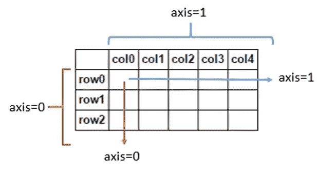

# 让数据科学家的生活更轻松的 10 个快速数字技巧

> 原文：<https://towardsdatascience.com/10-quick-numpy-tricks-that-will-make-life-easier-for-a-data-scientist-35a0253c7479?source=collection_archive---------3----------------------->

## 了解数据科学的基本数字函数


照片由 [Unsplash](https://unsplash.com?utm_source=medium&utm_medium=referral) 上的 [Aditya Saxena](https://unsplash.com/@adityaries?utm_source=medium&utm_medium=referral) 拍摄

Numpy 是唯一让我这个铁杆 C++程序员首先转向 python 的东西。请注意，这是在我的数据科学学习曲线出现之前，没有 python，任何人都无法生存！(请不要冒犯，只是陈述我的观点，所有的 R 爱好者，我都一样尊重你们)。但是如果一个库可以改变我对编程语言的忠诚，那么它一定是一个地狱般的库。

在我曾经实习过的机器人实验室里，我们曾经就奇怪的 Numpy 命令互相测验，那时我才真正看到了这个图书馆的美丽。所以，如果你通过了下面的测试，无论如何，你不需要这个博客:p。但除此之外，继续阅读！！

测试:预测以下内容的输出

```
import numpy as nparr = np.arange(5)
arr = arr[-1::-1]
print(arr)
```

如果你已经知道了这一点，你可能已经知道了我将在这篇博客中讲述的大部分内容，但除此之外，请继续阅读。

*输出为[4，3，2，1，0]*

让我们深入研究 Numpy 的函数，这些函数是我们的救命稻草，尤其是对我来说，因为我讨厌编写 double for 循环来访问 2D 数组。

[吉菲](https://gph.is/g/E3lq5qO)

*注意:在所有未来的例子中，我假设作为 np 的 import numpy 已经被调用*

# 1.numpy.arange(开始、停止、步进)

此函数返回一个 numpy 数组，其中包含从 start 开始到 stop 结束并以步长差递增的数字。所以这些数字位于[开始，停止]区间。

举个例子，

```
**>>> np.arange(3,7,2)
array([3, 5])****>>> np.arange(5)
array([0,1,2,3,4])**
```

**类似函数** : [numpy.linspace](https://numpy.org/doc/stable/reference/generated/numpy.linspace.html) ， [numpy.repeat](https://numpy.org/doc/stable/reference/generated/numpy.repeat.html) ， [numpy.tile](https://numpy.org/doc/stable/reference/generated/numpy.tile.html#numpy.tile) ， [numpy.eye](https://numpy.org/devdocs/reference/generated/numpy.eye.html) (是不同的用例，但在处理矩阵时很有帮助)。

如果你想看看定义和初始化数组的其他方法，我在之前的博客[这里](/linear-algebra-essentials-for-data-scientist-along-with-implementation-5cfbece6d7ca)提到过。

# 2.numpy.random

numpy.random 是 numpy 中的一个模块，包含用于生成随机数的函数。它有多种用途，尤其是在处理基于概率的函数时。让我们看看本模块中不同功能的几个示例。当您使用相同的命令时，下面显示的输出会发生变化，因为它们是随机生成的。

```
**#Create an array of random numbers, size of array is (3,2)****>>> np.random.rand(3,2)
array([[ 0.14022471,  0.96360618],  #random
       [ 0.37601032,  0.25528411],  #random
       [ 0.49313049,  0.94909878]]) #random**
```

点击查看更多示例[。](https://numpy.org/doc/stable/reference/random/generated/numpy.random.rand.html)

```
**#Return random integers from *low* (inclusive) to *high* (exclusive) or 0 (inclusive) to low(exclusive),** **random.randint****(*low*, *high=None*, *size=None*, *dtype=int*)****>>> np.random.randint(2, size=10)
array([1, 0, 0, 0, 1, 1, 0, 0, 1, 0]) # random
>>> np.random.randint(5)
1**
```

点击查看更多[的例子。](https://numpy.org/doc/stable/reference/random/generated/numpy.random.randint.html)

**类似功能** : [numpy.random.randn](https://numpy.org/doc/stable/reference/random/generated/numpy.random.randn.html) ，[numpy . random . sample](https://numpy.org/doc/stable/reference/random/generated/numpy.random.random_sample.html)， [numpy.random.choice](https://numpy.org/doc/stable/reference/random/generated/numpy.random.choice.html) 。

# 3.numpy.argmax(arr，axis = None)

我们的许多用例，尤其是在执行优化时，要求我们知道具有最大值或最小值的变量。为了去掉跟踪这些信息的额外代码行，我们可以简单地使用 argmax 和 argmin 的 numpy 函数。让我们看一个同样的例子。以下示例包含术语轴。数组的轴是我们希望执行计算的方向。如果我们没有指定一个轴，那么默认情况下计算是在整个数组上完成的。



[图像参考](https://i.stack.imgur.com/gj5ue.jpg)

```
**>>> a = np.array([[10, 12, 11],[13, 14, 10]])
>>> np.argmax(a)
4 #since if the array is flattened, 14 is at the 4th index
>>> np.argmax(a, axis=0)
array([1, 1, 0]) # index of max in each column
>>> np.argmax(a, axis=1)
array([1, 1]) # index of max in each row**
```

**类似功能** : [numpy.argmin](https://numpy.org/doc/stable/reference/generated/numpy.argmin.html#numpy.argmin) ， [numpy.amax](https://numpy.org/doc/stable/reference/generated/numpy.amax.html#numpy.amax)

## 4.切片和索引

这在改变 NumPy 数组的内容时起着至关重要的作用。它用于同时访问数组中的多个元素。举个例子会让你更容易理解它是如何工作的。

```
**>>> a = np.arange(5)
>>> print(a[4])
4 # number at index****>>> print(a[1:])
array([1, 2, 3, 4]) #it will print all element from index 1 to last (including number at index 1)****>>> print(a[:2])
array([0, 1]) #it will print all element from index 0 to index 2(excluding number at index 2)****>>> print(a[1:3])
array([1, 2]) #it will print all element from index 1 (including) to index 3 (excluding)****>>> print(a[0:4:2])
array([0,2]) # [0:4:2] represents start index, stop index, and step respectively. It will start from index 0 (inclusive) go to index 4 (exclusive) in step of 2 which will result in [0, 2] and a[0,2] will be the output.**
```

切片用于灵活地访问 numpy 数组的多个索引处的元素。如果使用得当，它可以大大减少代码的长度。

回到我在博客开头给出的测试，那里的魔法使用了切片。当我们写 arr[-1::-1]时，它实际上从 arr 的最后一个元素开始，然后第二个-1 确保它以步长 1 的相反顺序进行。因此我们得到了相反的数组。

## 5.numpy.setdiff1d **( *ar1* ， *ar2* )**

当我们需要将数组视为集合并寻找它们的差、交或并时，numpy 通过这些内置函数使这项工作变得简单。

```
**#Set difference**
**>>> a = np.array([1, 2, 3, 2, 4, 1])
>>> b = np.array([3, 4, 5, 6])
>>> np.setdiff1d(a, b)
array([1, 2])****#Set intersection
>>> np.intersect1d([1, 3, 4, 3], [3, 1, 2, 1])
array([1, 3])****#Set Union
>>> np.union1d([-1, 0, 1], [-2, 0, 2])
array([-2, -1,  0,  1,  2])**
```

**类似功能:** [numpy.setxor1d](https://numpy.org/doc/stable/reference/generated/numpy.setxor1d.html) ， [numpy.isin](https://numpy.org/doc/stable/reference/generated/numpy.isin.html) 。

## 6.numpy . shape**(*a*， *newshape* ， *order='C'* )**

在处理矩阵时，我们需要适当的维数来进行乘法等运算。或者甚至在处理复杂数据时，我不得不无数次地改变数组的形状。

```
**>>> a = np.arange(6).reshape((3, 2))
>>> a
array([[0, 1],
       [2, 3],
       [4, 5]])
>>> np.reshape(a, (2, 3)) *# C-like index ordering*
array([[0, 1, 2],
       [3, 4, 5]])
>>> np.reshape(a, (2, 3), order='F') *# Fortran-like index ordering*
array([[0, 4, 3],
       [2, 1, 5]])**
```

点击查看更多例子。(我强烈建议阅读所有示例)

**类似功能:** [ndarray.flatten](https://numpy.org/doc/stable/reference/generated/numpy.ndarray.flatten.html) ， [numpy.ravel](https://numpy.org/doc/stable/reference/generated/numpy.ravel.html) 。这两种方法都可以将任意数组转换成 1D 数组，但是两者之间有细微的差别。此外，像 [numpy.squeeze](https://numpy.org/doc/stable/reference/generated/numpy.squeeze.html) 和 numpy.unsqueeze 这样的函数用于在数组中删除或添加一个维度。

## 7.numpy.where( ***条件* [， *x* ， *y* ]** )

帮助我们根据输入到函数中的一些条件提取子数组。这里如果条件满足，则选择 *x* ，否则选择 *y* 。让我们看一些例子来了解更多

```
**>>> np.where([[True, False], [True, True]],
...          [[1, 2], [3, 4]], #x
...          [[9, 8], [7, 6]]) #y
#Here since the second element in first row was false the output contained the element from the second array at that index.** **>>> a = np.arange(10)
>>> a
array([0, 1, 2, 3, 4, 5, 6, 7, 8, 9])
>>> np.where(a < 5, a, 10*a)
array([ 0,  1,  2,  3,  4, 50, 60, 70, 80, 90])**
```

**类似功能** : [np.choose](https://numpy.org/doc/stable/reference/generated/numpy.choose.html#numpy.choose) ， [np .非零](https://numpy.org/doc/stable/reference/generated/numpy.nonzero.html#numpy.nonzero)

## 8.numpy . concatenate(***(a1*、 *a2* 、*……)*、 *axis=0*** )

该函数有助于沿现有轴连接数组。当我们预处理数据并需要多次追加或组合数据时，这是有益的。

```
**>>> a = np.array([[1, 2], [3, 4]])
>>> b = np.array([[5, 6]])
>>> np.concatenate((a, b), axis=0)
array([[1, 2],
       [3, 4],
       [5, 6]])
>>> np.concatenate((a, b.T), axis=1)
array([[1, 2, 5],
       [3, 4, 6]])
>>> np.concatenate((a, b), axis=None)
array([1, 2, 3, 4, 5, 6])**
```

**类似功能:** [numpy.array_split](https://numpy.org/doc/stable/reference/generated/numpy.array_split.html#numpy.array_split) ， [numpy.ma.concatenate](https://numpy.org/doc/stable/reference/generated/numpy.ma.concatenate.html#numpy.ma.concatenate) ， [numpy.split](https://numpy.org/doc/stable/reference/generated/numpy.split.html#numpy.split) ，numpy.hsplit，numpy.vsplit，numpy.dsplit， [numpy.hstack](https://numpy.org/doc/stable/reference/generated/numpy.hstack.html)

## 9.numpy.power( ***x1* ， *x2)***

我无法告诉你这个功能给我的生活带来了多大的便利。它帮助我取代了所有用来写一个数组的平方或立方的循环。该函数输出一个数组，该数组包含第一个数组的元素的自乘幂，从第二个数组开始，按元素排序。让我给你举个例子来说明一下。

```
**>>> x1 = np.arange(6)
>>> x1
[0, 1, 2, 3, 4, 5]
>>> np.power(x1, 3)
array([  0,   1,   8,  27,  64, 125])
>>> x2 = [1.0, 2.0, 3.0, 3.0, 2.0, 1.0]
>>> np.power(x1, x2)
array([  0.,   1.,   8.,  27.,  16.,   5.])
>>> x2 = np.array([[1, 2, 3, 3, 2, 1], [1, 2, 3, 3, 2, 1]])
>>> x2
array([[1, 2, 3, 3, 2, 1],
       [1, 2, 3, 3, 2, 1]])
>>> np.power(x1, x2)
array([[ 0,  1,  8, 27, 16,  5],
       [ 0,  1,  8, 27, 16,  5]])**
```

在 ndarrays 上，`**`操作符可以用作`np.power`的简写。

**相似函数:**所有的基本数学运算符。你可以在这里查看它们。

## 10.numpy.allclose(a，b，rtol=1e-5，atol=1e-8)

allclose 用于确定两个数组在某个容差范围内的元素是否相等。公差值是正数，并且是一个小数字。计算为( *rtol* * abs( *b* ))和 *atol 之和。*a 和 b 之间的元素绝对差值应小于计算的公差*。*

```
**>>> np.allclose([1e10,1e-7], [1.00001e10,1e-8])
False
>>> np.allclose([1e10,1e-8], [1.00001e10,1e-9])
True**
```

事实证明，在比较包含来自两个不同模型的预测值的两个数组时，这非常有用。

**类似功能:** [numpy.isclose](https://numpy.org/doc/stable/reference/generated/numpy.isclose.html#numpy.isclose) ， [numpy.all](https://numpy.org/doc/stable/reference/generated/numpy.all.html#numpy.all) ， [numpy.any](https://numpy.org/doc/stable/reference/generated/numpy.any.html#numpy.any) ， [numpy.equal](https://numpy.org/doc/stable/reference/generated/numpy.equal.html#numpy.equal)

我很高兴现在证明你是 Numpy 的主人！！

[吉菲](https://gph.is/g/EGRVvKJ)

尝试这些，你很快就会成为一名数据科学家大师！万事如意。

更多此类内容，请关注我们的[媒体](https://medium.com/@AnveeNaik)。请在评论中告诉我们你想了解更多的话题，我们会尝试就这些话题写博客。

*成为* [*介质会员*](https://medium.com/@AnveeNaik/membership) *解锁并阅读介质上的许多其他故事。*