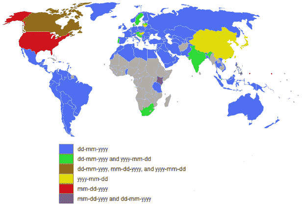

# 可以帮助您处理日期的 10 个快速 Python 片段

> 原文：<https://towardsdatascience.com/10-quick-python-snippets-that-can-help-you-work-with-dates-831f4f27aa05?source=collection_archive---------36----------------------->

在 [Unsplash](https://unsplash.com?utm_source=medium&utm_medium=referral) 上由 [Brad Neathery](https://unsplash.com/@bradneathery?utm_source=medium&utm_medium=referral) 拍摄的照片

如果您在工作中使用 Python，或者仅仅是为了编写脚本，那么很可能会有一天您需要处理日期。

它可以从一种格式转换到另一种格式，改变时区，等等。

既然你已经决定阅读这篇文章，那么我们为什么不停止浪费时间交谈，并立即开始学习呢？

# 1.将字符串转换为日期

尽管是工程师，我们仍然花相当多的时间使用自然语言交谈。

既然如此，我们也可以将看起来像自然短语的字符串转换成日期，如下所示:

在本例中:

*   %d —表示一个月中的某一天，如 21、22、23 等。
*   %B —表示月份的实际名称，如一月、二月、三月等。
*   % Y-代表年份，如 2020、2021 等。

# 2.从一个时区转换到另一个时区

由于这些天我们大部分时间都在远程工作，我们可能也有机会和在另一个时区的人一起工作。

你当然可以谷歌一下，找出纽约市现在的时间，即使你以前从未去过，但是你自己去实现它也是一种乐趣。

让我们看看如何做到这一点。

# 3.找出两个日期之间的天数

由于我们仍然生活在这个时间流逝的宇宙中，我们可能需要找到从一点到另一点之间已经过去的天数。

我们当然可以拉一个日历，手动算日子，又慢又无聊。

为了快速做到这一点，我们可以在 Python 脚本中导入*日期*模块，并初步准备日期:

之后，我们基本上可以找到两个数字的区别:

是的，就这么简单。

您不必花费数小时在物理日历上手动完成。像这样做只需要几分钟。

# 4.向日期添加天数

让我们假设您正在开发一个产品的特性，其中一个用户的订阅从现在起 90 天后到期。您希望使用以下命令将该日期保存在数据库中:

# 5.向日期添加周数

您也可以将其更改为周，如下所示:

# 6.从日期中减去天数

你有没有想过回到过去，改善你生活中的一些事情，与你爱的人呆在一起，或者干脆早一点开始投资比特币？

嗯，我希望我能告诉你怎么做。

但是，如果您想查找过去的某个日期，比如说从现在起 180 天后，您可以使用以下内容轻松完成:

# 7.从日期中减去周数

你可能已经猜到了，你也可以通过减去星期来找到一个日期:

# 8.找出月份中两个日期的差异

我们也可以很快地找出这两个日期在几个月内的差异。

我们应该记住，我们可能有不同年份的日期，仅仅认为我们可以减去两个月是不够的。

例如，在 2018 年 10 月和 2021 年 11 月之间，不仅仅是一个月的差异。在年龄上也有差别。

# 9.把日子放在月份之前

世界上大多数国家在日期中将日期放在月份的前面:

图像:约翰·哈丁/蒙娜·沙拉比摄影:约翰·哈丁/蒙娜·沙拉比

但是，也有这样的情况，当您输入一个日期时，月份在日期的前面。

如果您想将这些日期转换成世界上大多数人使用的格式，以下是方法:

# 10.查找一个月的第一天

在一些公司，他们每个月的第一天给员工发工资。

如果您想知道那天是星期几，下面这个片段会很有帮助:

差不多就是这样。我希望你至少从这篇文章中学到了一些东西。