# 你应该马上开始使用的 10 个秘密场景

> 原文：<https://towardsdatascience.com/10-secret-tableau-features-you-should-start-using-right-away-b0f14efa6570?source=collection_archive---------12----------------------->

这是我从一个画面专家那里学到的…

图片由来自 AdobeStock 的 I [ssaronow](https://stock.adobe.com/uk/contributor/205162424/issaronow?load_type=author&prev_url=detail) 提供

如果你对可视化分析感兴趣，你可能听说过 Tableau，这是一个突破性的数据可视化软件，现在大多数数据分析和数据科学角色都需要它。

我最近有机会与 Tableau 专业服务公司的一位高级顾问一起工作，我不得不说，这次经历确实使我的 Tableau 技能达到了一个新的水平(鉴于我是 Tableau 自学者)。

> *Tableau 的强大之处在于它的易用性。只需几次点击，您就可以拖放不同的数据字段来创建您的视图。正如所有其他工具一样，探索和掌握所有 Tableau 功能需要时间，但通过这篇文章，我旨在解释* ***10 个技巧和窍门，它们将帮助您及时构建引人注目的仪表板。***

如果你喜欢这篇文章的视频格式，一定要在我的 YouTube 频道查看。

# 1.从您的提取文件。twbx 工作簿

你知道吗？twbx 扩展名其实是一种压缩的压缩文件？像任何压缩文档一样，您可以提取其中的文件。如果您想要检索用作数据源的表格、图标或嵌入到打包工作簿中的任何其他外部文件，这可能会非常有用。为此，只需将工作簿的扩展名从"。twbx "到" **.twbx.zip** "。右键单击该文件，并单击**提取**选项，您现在将看到。twb 文件、包含数据源文件的文件夹以及外部缓存中的任何其他文档。

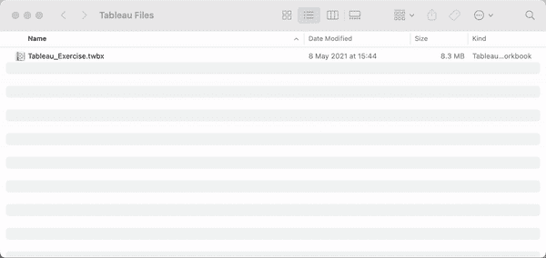

作者图片

# 2.连接到另一个工作簿上的数据源

您知道可以从不同的 Tableau 工作簿中获取数据源吗？您无需在现有工作簿中重新创建数据源，只需点击顶栏上的**创建新数据源**，转到**更多**，导航到您机器上的特定工作簿，Tableau 将列出您可以连接到的该工作簿的数据源。

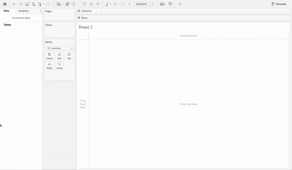

作者图片

# 3.从 Excel 中快速复制和粘贴数据

如果您需要执行快速分析或数据调查，您只需从 Excel 电子表格中复制您感兴趣的单元格，打开 Tableau 工作表，只需单击顶部栏中的**文件**，然后单击**粘贴**(您也可以使用常用的快捷键 Ctrl/Command + V)，瞧，只需几次点击，您的数据就准备好了！

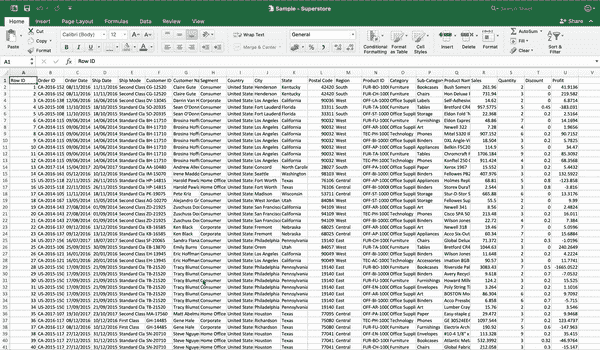

作者图片

# 4.将工作表从一个工作簿复制并粘贴到另一个工作簿

这也非常简单，可以节省你大量的时间。要做到这一点，右键单击一个工作表，然后单击**复制**，转到另一个工作簿，再次右键单击，然后**粘贴**。这实际上会带来工作表及其数据源，这将再次允许重用您以前的工作！

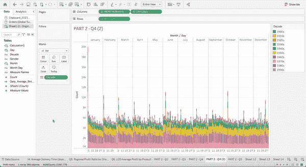

作者图片

# 5.只需点击几下鼠标，即可从多个工作表中删除过滤器

假设您正在处理多个工作表，并且对所有工作表都应用了筛选器。现在，您希望在所有不同的视图中删除作为过滤器的字段。有一种方法可以做到这一点，不需要打开每个工作表，也不需要手动删除过滤器。只需转到其中一个工作表，右键单击过滤器，选择**应用到工作表**，然后选择**全部使用该数据源**。这将对连接到同一数据源的所有工作表应用该筛选。然后您可以从筛选器面板中删除该字段，工作就完成了，这将自动删除所有其他工作表的筛选器！

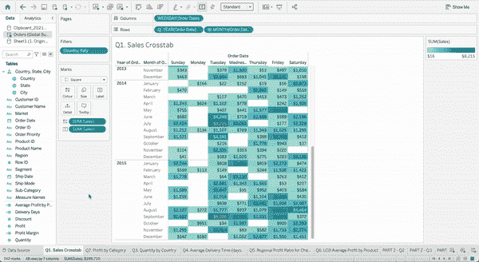

作者图片

# 6.复制并粘贴工作表格式

设置工作表格式后，可以复制其格式设置并将其粘贴到其他工作表中。您可以复制的设置是您可以在**格式**窗格中设置的任何内容，参考线和注释除外。为此，选择要从中复制格式的工作表，右键单击工作表标签并选择**复制格式**。现在选择您想要粘贴格式的工作表，右键单击工作表标签并选择**粘贴格式**。这里有一个额外的提示:如果你想一次格式化不同的工作表，使用顶栏中的**格式**菜单，因为那些设置将应用于工作簿级别。

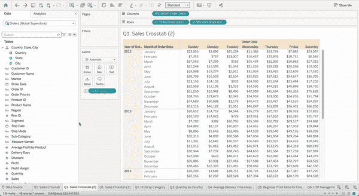

作者图片

# 7.给工具提示添加可视化效果

当我展示 Tableau 文件时，如果有一样东西总是让用户感到惊讶的话，那就是显示在仪表板中不同工作表的工具提示上的视图。如果您想显示特定图表的更多细节，而不必牺牲仪表板的空间，这是一个非常棒的功能。只需点击标记窗格中的**工具提示**，**插入工作表**，然后选择您想要添加的工作表。

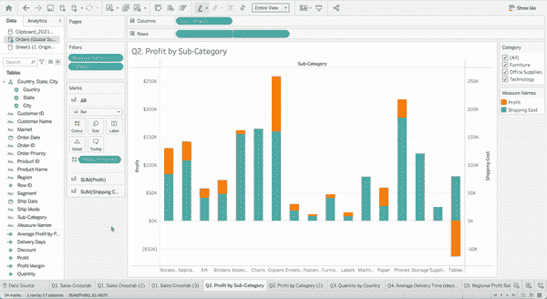

作者图片

这还不止于此！Tableau 会根据你在仪表盘上看到的内容自动过滤工具提示。例如，在下图中，如果你将鼠标悬停在**办公用品**类别上，工具提示会显示办公用品的销售详情。

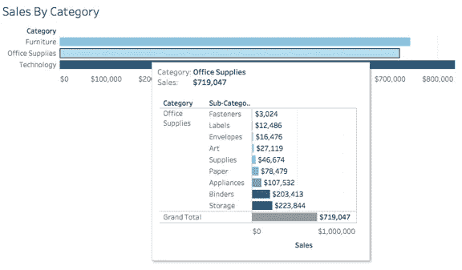

作者图片

# 8.使用这些快捷键

至少有 3 个快捷方式是我一直在使用的，并且我肯定会推荐使用的。

第一个是**右键拖动**(对于 Mac，Option+Drag)，它允许打开拖放字段窗口，准确地指定您想要添加到画布的内容。假设您想在行货架中添加字段**利润**的平均值。如果您简单地将文件添加到行中，Tableau 将向您显示字段 Profit 的总和，然后您需要右键单击该字段并选择您想要显示的计算。相反，如果你右击并拖动，Tableau 会先询问你想如何显示字段，这是一个很好的时间节省。

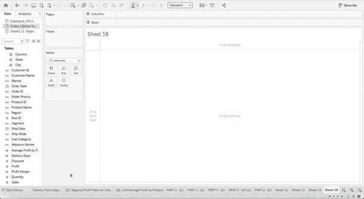

作者图片

**Ctrl +拖动**(Mac 为 Command +拖动)是在画布中复制药丸并粘贴到其他任何地方的快捷方式。这将再次让您节省大量时间，而不是再次搜索特定字段，重新创建计算或重新设置格式等。

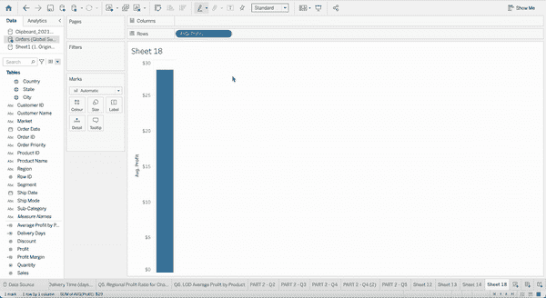

作者图片

另一个很酷的快捷方式与您必须构建包含多个度量的文本表格有关。除了将字段**度量名称**添加到列架中，将字段**度量值**添加到标记窗格中，然后选择您感兴趣的字段，还有另一种快速的方法。只需将您的维度添加到列架，然后直接从字段窗格中双击您想要添加的所有**度量**。

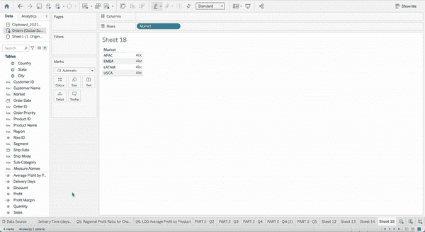

作者图片

# **9。隐藏所有未使用的字段**

我们很少有数据连接只有我们需要的数据。通常，我们最终得到的数据连接包含许多我们分析不需要的列。有许多因素会影响提取的性能，但是从提取中删除未使用的列会产生巨大的影响。当您完成工作簿并准备共享或发布它时，单击搜索栏旁边的小箭头并确保选择了**隐藏所有未使用的字段**。这样，Tableau 就不会在提取中包含那些字段，这确实可以提高性能！

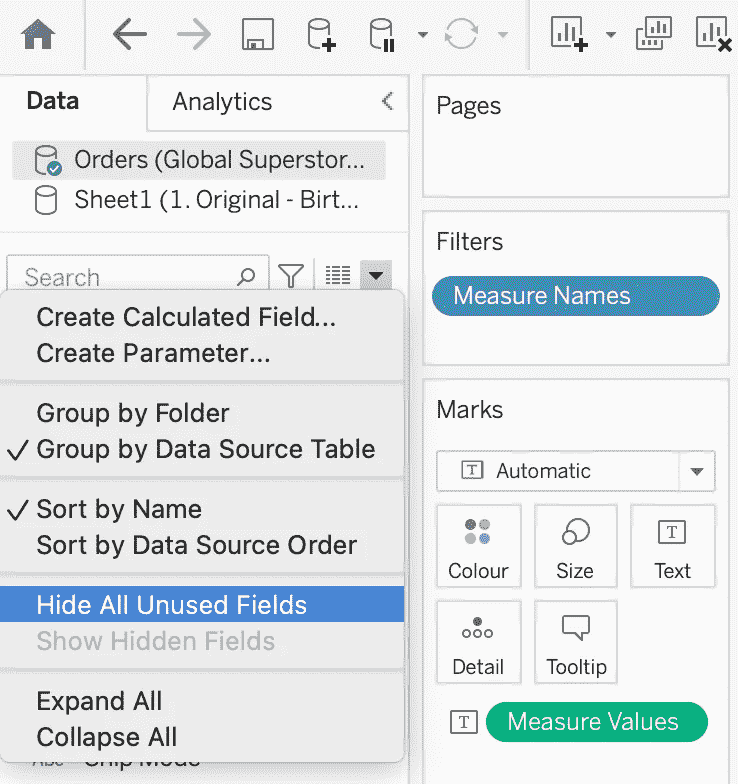

作者图片

# 10.发布时覆盖现有工作簿

最后一个技巧与 Tableau 服务器更相关，这可能会让您的 Tableau 体验压力更小。当您处理同一工作簿的不同版本，并且准备将更新的文件发布到 Tableau 服务器时，我总是建议覆盖现有的工作簿，只需将它上传到相同的文件夹并使用相同的标题。这样，如果最新版本有问题，您可以使用**修订历史** Tableau 服务器功能恢复先前版本，同时更正最新版本。如果您使用不同的名称和文件夹上传版本，此功能将不适用。考虑到这一点，您可以始终依赖以前的版本，不需要创建归档文件夹、备份文件或制定计划来应对上一份出版物出现的问题。

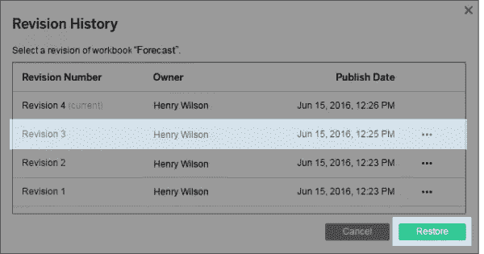

作者图片

这就对了。这些是**我给你的 10 大桌面技巧**。我希望你能找到一些新的东西，并帮助你从 Tableau 中获得最大收益！

请务必联系我，告诉我你所有的建议和意见。

感谢阅读！

如果你喜欢这个内容，一定要看看我的 **YouTube 频道**下面的了解更多！

<https://www.youtube.com/@loresowhat> 