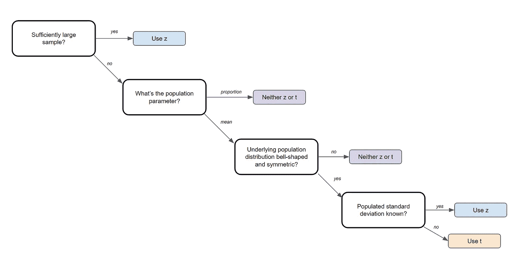
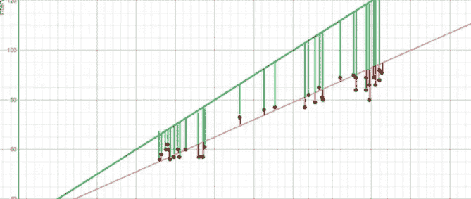
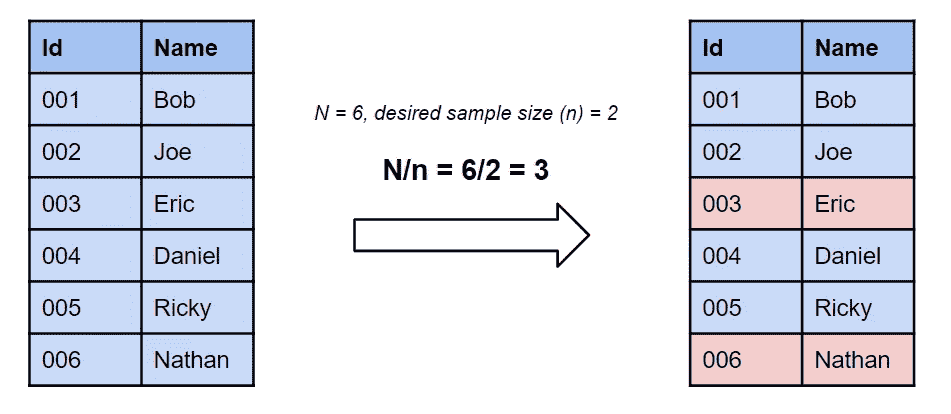
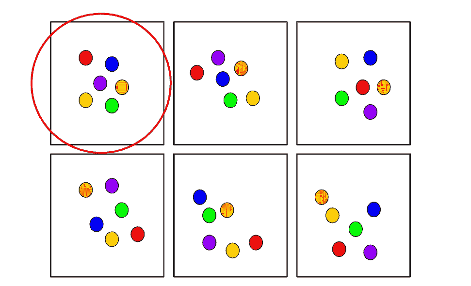
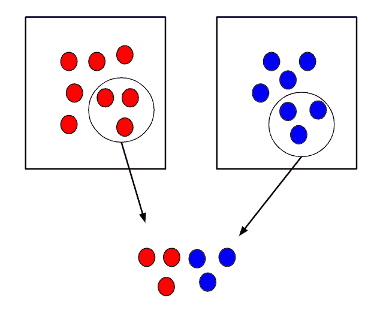
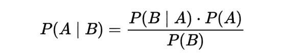
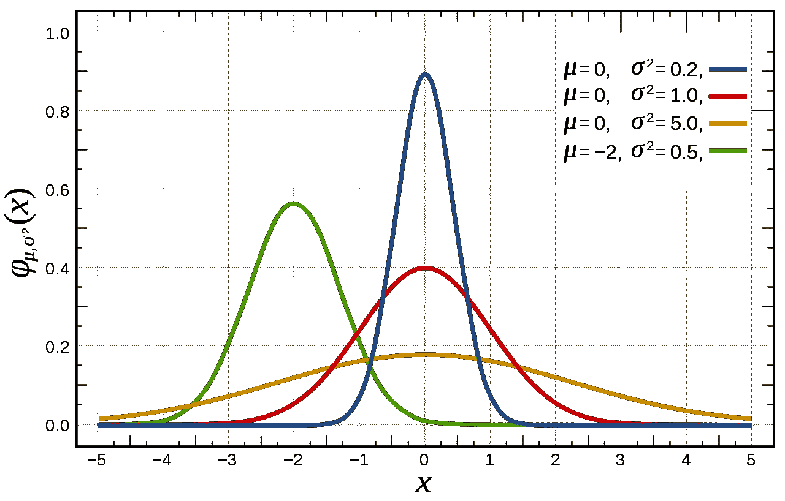
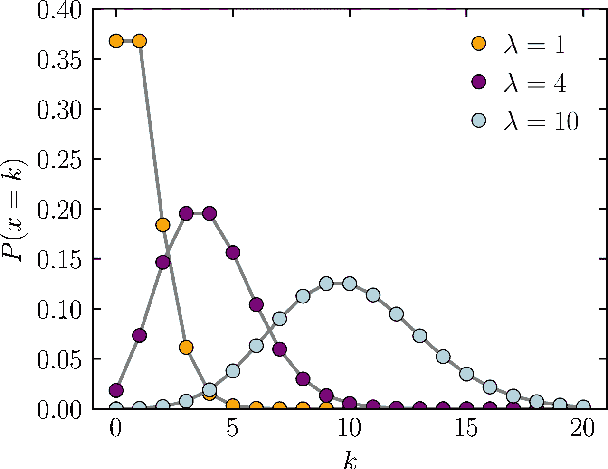
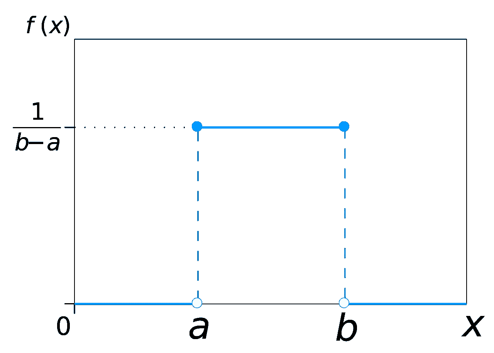

# 数据科学面试中你应该知道的 10 个统计概念

> 原文：<https://towardsdatascience.com/10-statistical-concepts-you-should-know-for-data-science-interviews-373f417e7d11?source=collection_archive---------0----------------------->

## 学习聪明，不努力。

pch.vector 创建的业务向量—[www.freepik.com](http://www.freepik.com)

# 介绍

统计有时真的让人不知所措，这并不奇怪，因为统计已经存在了几千年了！

然而，当谈到数据科学面试时，面试官只测试了这么多概念。在经历了成百上千的数据科学面试问题后，我整理了最常出现的 10 个统计学概念。

在这篇文章中，我将回顾这 10 个概念，它们都是关于什么的，以及它们为什么如此重要。

说到这里，我们开始吧！

# 1) P 值

p 值最专业、最精确的定义是，它是获得与零假设同样极端或更极端结果的概率。

仔细想想，这是有道理的。实际上，如果 p 值小于α值，比如说 0.05，那么我们说这个结果偶然发生的概率小于 5%。类似地，p 值为 0.05 相当于说“在 5%的时间里，我们会偶然看到这种情况。”

因此，如果最初的定义与你不符，请记住我上面给出的例子！

# 2)置信区间和假设检验

置信区间和假设检验有着非常密切的关系。置信区间建议未知参数的值的范围，然后与真实参数在建议范围内的置信水平相关联。置信区间在医学研究中通常非常重要，可以为研究人员的估计提供更有力的基础。

举例来说，置信区间可以显示为“10 +/- 0.5”或[9.5，10.5]。

假设检验是任何研究问题的基础，通常归结为试图证明一些事情不是偶然发生的。例如，你可以试着证明当滚动一种染料时，一个数字比其他数字更有可能出现。

# 3) Z 检验与 T 检验

理解 z-检验和 t-检验之间的区别以及如何和何时应该选择使用它们在统计学中是非常宝贵的。

一个 **Z 检验**是一个正态分布的假设检验，使用了一个 **z 统计**。当您知道总体方差或不知道总体方差但样本量很大时，可以使用 z 检验。

**T 检验**是一种假设检验，其 t 分布使用了 **t 统计量**。当不知道总体方差并且样本量很小时，可以使用 t 检验。

您可以查看下图，作为参考来指导您应该使用哪种测试:

作者创建的图像

# 4)线性回归及其假设

线性回归是用于对因变量和一个或多个自变量之间的关系进行建模的最基本的算法之一。简而言之，它包括找到代表两个或更多变量的“最佳拟合线”。

最佳拟合线是通过最小化点和最佳拟合线之间的平方距离找到的，这被称为最小化残差平方和。残差等于预测值减去实际值。

作者创建的图像

万一它还没有意义，考虑上面的图像。比较最佳拟合的绿线和红线，注意绿线的垂直线(残差)比红线大得多。这是有意义的，因为绿线离点太远了，根本不能很好地表示数据！

有四个与线性回归模型相关的假设:

1.  **线性:**X 和 Y 的均值之间的关系是线性的。
2.  **同方差:**残差的方差对于 x 的任意值都是相同的
3.  **独立性:**观测值相互独立。
4.  **正态:**对于 X 的任意固定值，Y 都是正态分布的。

# 5)逻辑回归

逻辑回归类似于线性回归，但用于模拟离散数量的结果的概率，通常为两个。例如，您可能希望根据年龄预测一个人是活着还是死了。

乍一看，逻辑回归听起来比线性回归复杂得多，但实际上只有一个额外的步骤。

首先，使用一个类似于线性回归最佳拟合直线方程的方程来计算分数。

额外的步骤是输入您之前在下面的 sigmoid 函数中计算的分数，以便您获得一个概率作为回报。这个概率可以转换成二进制输出，1 或 0。

为了找到初始方程的权重来计算分数，使用了像梯度下降或最大似然这样的方法。由于这超出了本文的范围，我就不多赘述了，但是现在您已经知道它是如何工作的了！

# 6)取样技术

有 5 种主要的数据采样方式:简单随机、系统、方便、整群和分层采样:

## 简单随机抽样

**简单随机抽样**要求使用随机生成的数字来选择一个样本。更具体地说，它最初需要一个**抽样框架**，一个群体所有成员的列表或数据库。然后，您可以使用 Excel 为每个元素随机生成一个数字，并获取您需要的前 n 个样本。

## 系统抽样

作者创建的图像

**系统采样**甚至更简单，只需从样品中取出一种元素，跳过预定的数量(n ),然后取出下一种元素。回到我们的例子，你可以选择列表中的第四个名字。

## 方便抽样

**便利抽样**从容易联系的群体中抽取样本，例如询问购物中心外的人。你只需要对你遇到的第一批人进行取样。这种技术通常被认为是不好的做法，因为您的数据可能会被视为偏见。

## 巢式抽样法

作者创建的图像

**整群抽样**从将一个群体分成组或者**群开始。**分层抽样的不同之处在于，每个聚类必须能够代表总体。然后，随机选择整个集群进行采样。

例如，如果一所小学有五个不同的八年级班级，可以使用整群随机抽样，例如，只选择一个班级作为样本。

## 分层抽样

作者创建的图像

**分层随机抽样**从将人群分成具有相似属性的组开始。然后从每组中随机抽取一个样本。这种方法用于确保群体中的不同部分得到平等的代表。举个例子，假设在一所学校进行了一项调查，以确定总体满意度。这里使用分层随机抽样来平等地代表每个系学生的意见可能是有意义的。

# 7)中心极限定理

中心极限定理是非常强大的——它指出样本均值的分布近似于正态分布。

举个例子，你可以从一个数据集中抽取一个样本，然后计算这个样本的平均值。一旦重复多次，你就可以把所有的平均值和它们的频率绘制到一个图表上，你会看到一个钟形曲线，也就是众所周知的正态分布，已经被创建出来了。

该分布的平均值将非常类似于原始数据的平均值。通过获取更大的数据样本和更多的总体样本，可以提高平均值的准确性并降低标准差。

# 8)组合和排列

组合和排列是从集合中选择对象以形成子集的两种略有不同的方式。排列会考虑子集的顺序，而组合则不会。

如果你从事网络安全、模式分析、运筹学等工作，组合和排列是非常重要的。让我们更详细地回顾一下这两者中的每一个:

## 排列

**定义:**n 个元素的排列是这 n 个元素按照**确定的顺序**的任意排列。有 n 个阶乘(n！)排列 n 个元素的方式。注意粗体字:顺序很重要！

**一次取 r 的 n 个事物的排列数**被定义为可以从 n 个不同元素中取出的 r 元组的数目，并且等于以下等式:

*例题:一个 6 位数的车牌有多少种排列？*

回答

## 组合

定义:从 n 个对象中选择 r 的方法的数量，其中**顺序无关紧要**。

**一次取 r 个的 n 个事物的组合数**被定义为具有 n 个元素的集合中具有 r 个元素的子集的数目，并且等于以下等式:

*例题:从一副 52 张牌中抽出 6 张牌有多少种方法？*

回答

请注意，这些都是非常非常简单的问题，可能会比这复杂得多，但是您应该很清楚上面的例子是如何工作的！

# 9)贝叶斯定理/条件概率

贝叶斯定理是一个条件概率陈述，本质上它着眼于一个事件(B)发生的概率，假设另一个事件(A)已经发生。

最受欢迎的机器学习算法之一 nave Bayes 就是建立在这两个概念之上的。此外，如果你进入**在线**机器学习领域，你很可能会使用贝叶斯方法。

贝叶斯定理方程

条件概率方程

# 10)概率分布

概率分布是一种在实验中找到不同可能结果的概率的简单方法。你应该了解许多不同的分布类型，但我推荐几个是正态分布、均匀分布和泊松分布。

## 正态分布

[图片来自维基媒体](https://en.wikipedia.org/wiki/Normal_distribution#/media/File:Normal_Distribution_PDF.svg)

正态分布又称高斯分布，是一种钟形曲线，在很多分布中相当突出，包括人的身高、智商得分等。

正态分布的均值等于μ，方差等于σ。

## 泊松分布

[图片来自维基媒体](https://commons.wikimedia.org/wiki/File:Poisson_pmf.svg)

泊松分布是一种离散分布，它给出了在固定时间内独立事件发生的概率。使用这种方法的一个例子是，如果您想确定在给定的一个小时内有 X 个病人来医院的可能性。

均值和方差都等于λ。

## 均匀分布

[图片来自维基媒体](https://commons.wikimedia.org/wiki/File:Uniform_Distribution_PDF_SVG.svg)

当所有结果的可能性相等时，使用均匀分布。例如，硬币具有均匀的分布以及染料。

# 感谢阅读！

仅此而已！我希望这对你的面试准备有所帮助，并祝你在未来的努力中好运。深刻理解这十个概念将为进一步学习数据科学和机器学习领域打下坚实的基础。

一如既往，我祝你在努力中一切顺利！

不确定接下来要读什么？我为你挑选了另一篇文章:

 [## 2021 年成为数据科学家的完整 52 周课程

### 连续 52 周，每周学点东西！

towardsdatascience.com](/a-complete-52-week-curriculum-to-become-a-data-scientist-in-2021-2b5fc77bd160) 

**又一个！**

 [## 数据科学面试你应该知道的十个深度学习概念

### 学习聪明，不努力。

towardsdatascience.com](/ten-deep-learning-concepts-you-should-know-for-data-science-interviews-a77f10bb9662) 

## 特伦斯·申

*   ***如果你喜欢这个，*** [***跟我上媒***](https://medium.com/@terenceshin) ***了解更多***
*   ***报名我的邮箱列表*** [***这里***](https://forms.gle/tprRyQxDC5UjhXpN6)
*   ***我们来连线上***[***LinkedIn***](https://www.linkedin.com/in/terenceshin/)
*   ***有兴趣合作吗？查看我的*** [***网站***](http://terenceshin.com/)