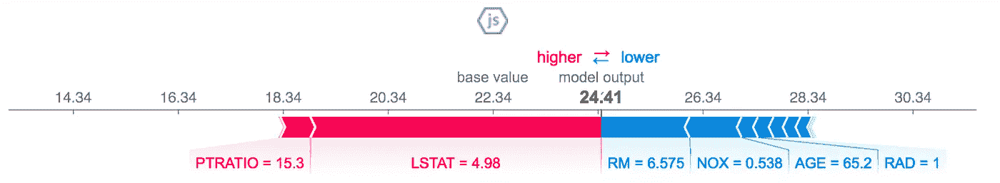

# 通过数据科学带回家任务的 10 个步骤

> 原文：<https://towardsdatascience.com/10-steps-to-pass-the-data-science-take-home-task-c5a696679526?source=collection_archive---------27----------------------->

## 确保包括以下内容，给你的面试官留下深刻印象

*注意:虽然这篇文章是专门针对表格数据的任务的，但是这些步骤中的大部分也适用于非表格数据(即 NLP 或 CV 任务)。*

[Rich Tervet](https://unsplash.com/@richtervet?utm_source=unsplash&utm_medium=referral&utm_content=creditCopyText) 在 [Unsplash](https://unsplash.com/s/photos/code?utm_source=unsplash&utm_medium=referral&utm_content=creditCopyText) 上拍摄的照片

# 1.数据分析和可视化📈

这是显而易见的，这是数据科学家面对全新数据集时要经历的第一步。不幸的是，这一步没有模板，所以只要确保你的面试官能跟上你在做数据科学挑战时的思维过程就行了。你可能想要使用干净、漂亮的数据可视化来打动你的读者。

# 2.数据转换和特征工程🏗

这包括:

*   通过使用例如独热、目标、标签、计数或百分比编码来处理分类变量。使用`sklearn.pipeline.Pipeline`将转换合并到一个管道中是一个好主意。请记住，将训练数据上训练的同一编码器或管道用于测试数据集！
*   重新采样，例如，如果数据集不平衡(例如，`y==1`比`y==0`多得多)，则使用`imblearn`
*   通过将日期转换成数字变量来处理日期。选择参考日期时要小心
*   特定数据集的特征工程技术。根据手头的数据集，创建您认为可能具有预测能力的要素。

# 3.训练最先进的预测模型

当涉及到表格数据时，梯度推进方法(或者可能是随机森林)通常被认为是最先进的分类器。目前，梯度增强的三种变体被广泛使用，在以下 Python 库中实现:

1.  `xgboost`
2.  `lightgbm`
3.  `catboost`

尽管每个数据集可能都不同，但从高层次上看，根据我的经验，当数据集有许多分类特征时，`catboost`的性能会更好，`lightgbm`的性能通常会稍差，但会快得多，`xgboost`的性能会很好，但通常会比`lightgbm`慢(尽管与其他一些方法相比非常快)。

记住也要为你的模型选择正确的度量标准。一个好的指标是 AUC，因为它是稳健的，并且考虑了特异性和敏感性。对于更具体的情况，将需要使用其他度量，这取决于误报和漏报的成本。

# 4.训练基本预测模型

如果您有时间，最好训练一个基本模型，如线性回归或逻辑回归，并证明性能差异是对更高级模型引入的复杂性的合理权衡。

# 5.使用交叉验证

这似乎是显而易见的，但请记住，当报告模型的性能或试图改进它时。特别是当在模型中进行小的、递增的改进时，具有足够数量的折叠和重复以将性能度量的波动降低到最小是有用的。

如果您使用目标编码，您可能还希望使用例如`RepeatedKFold`创建一个显式交叉验证循环，因为它可以让您完全控制包内数据集与包外数据集中发生的事情。

如果您想要进一步进行交叉验证，您可能想要运行几次，以查看您实际需要多少次折叠来获得模型性能的准确估计。

# 6.优化机器学习模型

通过为所讨论的数据集找到最佳超参数，可以实现模型的最佳性能。尽管存在经验法则，但数据集的特征(例如变量之间的交互程度)将决定最佳超参数是什么。以下三种方法通常用于超参数调整:

1.  **网格搜索**:概念上简单但非常耗费资源，特别是在优化有大量超参数的算法时(比如`xgboost`
2.  **随机搜索**:比网格搜索好很多次，但可能达不到最佳解
3.  **贝叶斯超参数优化**:目前的最佳实践

作为超参数优化的当前最佳实践，推荐第三个选项。除了优化直接超参数之外，它还有一个重要的优势，即可以将其他变量视为超参数。例如，除了`xgboost`使用的超参数外，该方法还可用于确定

*   根据基数，对哪些变量进行单热编码，对哪些变量进行目标编码(这个参数在 catboost 中被命名为`onehot_max_size`)
*   给目标编码增加多少平滑度
*   在对一个类别进行目标编码之前，该类别中所需的最小记录量

贝叶斯优化通常分为三个步骤:

1.  定义目标函数。这包括依赖于超参数的转换和交叉验证结果
2.  定义超参数搜索空间，即从中采样的分布。
3.  在指定的迭代次数(例如 1000 次)上运行优化

# 7.解释机器学习模型

通常使用三种模型可解释性的方法，由 Python 包`Eli5`、`LIME`和`SHAP`代表。目前`SHAP`被许多人认为是建立在表格数据上的模型的最佳实践。SHAP 有两个重要优势:

*   一致性:意味着我们可以比较模型之间的属性特征的重要性
*   准确性:我们可以将所有特征的重要性相加，以获得整个模型的重要性

## 全局特征重要性

用来解释模型的第一种方法通常是特征重要性。`xgboost`包有一个专用的方法，可以用来绘制每个变量的重要性。与为每个预测值生成一个系数的参数方法不同，有多种方法可以计算梯度增强的重要性。`xgboost`有三个选项:

*   **权重**:由变量在树中出现的次数给出
*   **增益**:因使用特定变量进行分割而获得的平均精度增益
*   **Cover** :由受预测器影响的观察次数给出

尽管`plot_importance`中的默认选项是“重量”,但增益通常被认为是更好的衡量标准，并在下文中使用。

## **局部特征重要性**

解释单个观测值的预测在很多时候是有用的。这对于调试模型以及向利益相关者解释单个客户的预测都很有用。例如，市场营销中的利益相关者，当他们知道为什么一个客户会以一种特定的方式被评分时，他们可能会对与客户沟通更有信心。`shap`库中的局部力图提供了一个很好的可视化效果(见下文)。红色因素是推动预测分数上升的因素，蓝色因素是拉低预测分数的因素。

# 8.使用 AWS 或 GCP —如果可能，使用☁️

如果这项工作需要云计算，并且您有时间，那么在您的提交中包含在云虚拟机上运行代码的脚本可能是一个好主意。

如果您收到的数据集很大并且训练需要很长时间，情况尤其如此。然而，即使不是这种情况，您仍然可以将 VM 用于资源密集型任务，例如超参数优化(如上所述)。

# 9.记录代码并使用 Git —如果可能的话

Git 可能不是所有数据科学工作的要求。然而，如果你申请的是一家软件公司，那么展示一下你会使用 git 并且在版本控制方面很自律也无妨。

# 10.包括单元测试—如果可能的话

特别是如果你申请的公司是科技类的，如果你也包括单元测试，你可能会得到加分——如果时间允许的话。Python 库将是一个不错的选择。即使你不能设法用单元测试覆盖你的所有代码，向公司展示你能够写出有弹性的、生产就绪的代码也是一个优势。

# 结论

取决于你有多少时间，你可能无法涵盖所有这些。不过，尽可能多的面试会让你给面试官留下深刻印象。以下是 10 个要点的清单:

1.  ✅展示了一些深刻分析
2.  ✅设计了一些巧妙的功能
3.  ✅训练了一个复杂模型
4.  ✅训练了一个简单的模型
5.  ✅，别忘了交叉验证！
6.  ✅优化模型超参数
7.  ✅解释这个模型
8.  ✅使用 AWS 或 GCP —如果可能的话
9.  ✅记录代码并使用 Git —如果可能的话
10.  ✅包括单元测试—如果可能的话
11.  🎉协商工资💰

祝你好运！🤞