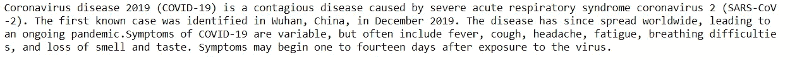
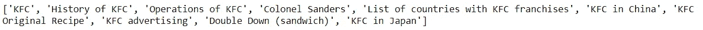
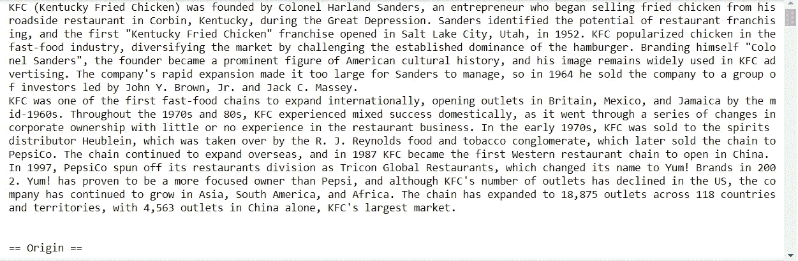
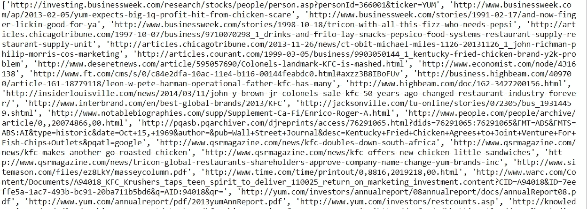
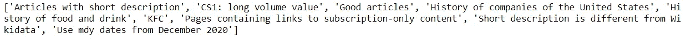
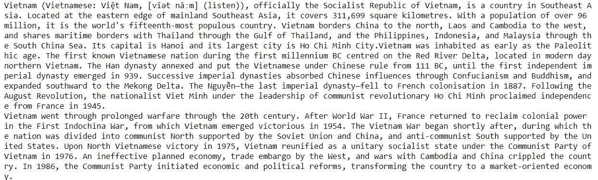

# 关于 Python 中的维基百科库，你可能不知道的 10 件事

> 原文：<https://towardsdatascience.com/10-things-you-might-not-know-about-wikipedia-library-in-python-61af5d46037d?source=collection_archive---------10----------------------->

## 使用 Wikipedia API 的一行代码获取数据要简单得多


由[阿尔方斯·莫拉莱斯](https://unsplash.com/@alfonsmc10?utm_source=medium&utm_medium=referral)在 [Unsplash](https://unsplash.com?utm_source=medium&utm_medium=referral) 上拍摄的照片

# 介绍

在我之前的帖子[你可能错过的 5 个有趣的 Python 库](/5-interesting-python-libraries-that-you-might-have-missed-3ee7cb4f099e)中，我谈到了 5 个我很少听说过的被低估的 Python 库，其中之一就是维基百科 API。随着我对这个库做了更多的阅读，我发现这比我想象的要酷得多。在本文中，我将与您分享一些使用这个简单、方便且有用的库的示例。

# **期待什么**

由于 Wikipedia API 可以从 Wikipedia 页面中检索几乎所有内容，在这种情况下，我们不需要严重依赖不同的数据抓取技术。使用 Wikipedia API 的一行代码获取数据要简单得多。

***然而，需要记住的一个重要注意事项是，这个库的最初目的不是为了高级使用。因此，正如文档所建议的，如果您打算做任何抓取项目或自动化请求，请考虑其他替代方案，如***[***Pywikipediabot***](http://www.mediawiki.org/wiki/Manual:Pywikipediabot)***或***[***MediaWiki API***](http://en.wikipedia.org/wiki/Wikipedia:Creating_a_bot#Python)， ***，它们具有其他优越的特性。***

好吧，首先，安装这个很酷的库，让我们看看这个包能给我们带来什么。

```
!pip install wikipedia
import wikipedia
```

# **工作原理**

## 1.获取特定关键词的摘要

如果您希望获得某个特定数量的摘要句子，只需将它作为参数传递给`summary()`函数。例如，我试图用 4 句话来解释新冠肺炎是什么。

**输出:**



图 1:摘要句子——作者图片

## 2.搜索文章标题

`Search()`功能帮助我们搜索包含特定关键字的所有标题。例如，如果我想获得与**“肯德基”、**相关的所有帖子标题，我将在搜索功能中传递**“肯德基”**。

图 2:搜索方法

因此，维基百科中包含肯德基信息的所有文章的列表都会被检索出来，如下所示。

***输出:***



图 3:标题列表——按作者分类的图片

您还可以说明您希望结果中出现多少个标题。

图 3: 5 个结果

## 3.搜索关键字

万一你有什么东西要在脑海中查找，但又记不清到底是什么，你可以考虑`suggest()`方法。该函数返回相关单词。

假设我想找到德国总理的准确姓名，但不记得她的名字是如何拼写的。我可以写我记得的，也就是**“安吉拉·马克尔”**让`suggest()`给我做剩下的。

图 4:拼写错误

如你所见，该函数返回一个正确的值，即**“安格拉·默克尔”**。

***输出:***


图 5:正确的拼写——作者图片

## 5.提取内容

如果您希望以纯文本格式提取 Wiki 页面的所有内容，请尝试使用`page`对象的`content`属性。

在下面的例子中，我演示了如何获取**“肯德基的历史”**文章。结果不包括图片或表格，…只有纯文本。

图 6:获取肯德基内容的历史

这是结果的样子。简单吧？



图 7:肯德基的历史——作者图片

您甚至可以通过组合`search()`和`page().content`来创建一个循环，以获取与您定义的主题相关的不同文章的不同内容。让我们试着为奥普拉·温弗瑞合并几篇文章。

图 8:组合内容

## 6.提取页面的 URL

你可以用`page`对象的`url`属性轻松提取维基百科中任何页面的 URL。

图 9:提取 URL

***输出:***


图 10:页面的 URL 作者的图片

## **7。提取参考网址**

你甚至可以用`page`对象和一个不同的属性(这次是`references.`)提取维基百科页面上的所有引用 URL

图 11:提取引用链接

**输出:**

外部参考列表提取如下:



图 12:参考链接——作者图片

## 8.获取页面类别

如果我想知道我的文章是如何被维基百科分类的呢？使用了`page`对象的另一个属性，就是`categories.`我会尽量找出上面文章的所有外部链接，**《肯德基的历史》**。

图 13:获取类别

***输出:***



图 14:类别——按作者分类的图片

## 9.提取页面图像

也可以通过命令行检索图像。通过使用`page().images,`，你将得到图片的链接。继续我的例子，我会试着从**“肯德基的历史”**页面获取第二张图片。

图 15:获取图像 URL

看我这里有什么:

***输出:***

```
[https://upload.wikimedia.org/wikipedia/commons/b/b1/Col_Sanders_Restaurant.png](https://upload.wikimedia.org/wikipedia/commons/b/b1/Col_Sanders_Restaurant.png) 
```

链接带你去桑德斯的餐馆！


图片来自维基百科上的 Acdixon

## 10.更改语言输出

如果页面以该语言存在，则可以将语言更改为任何语言。`Set_lang()`方法用于这种情况。有点跑题了，但我认为这是学习新语言的好方法。你可以尝试不同的语言来理解一个特定的段落。翻译都在屏幕上。

图 16:转换成英语

以上是我如何将关于**【越南】**的总结翻译成**英语。**

***输出*** :



图 17:关于越南的英文摘要——作者图片

# 临终遗言

这挺有意思的吧？维基百科是互联网上最大的信息源之一，是收集数据的天然场所。有了 Wikipedia API 的各种特性，这将容易得多。

如果你有任何有趣的图书馆，请不要犹豫与我分享。

# 参考

[https://pypi.org/project/wikipedia/](https://pypi.org/project/wikipedia/)