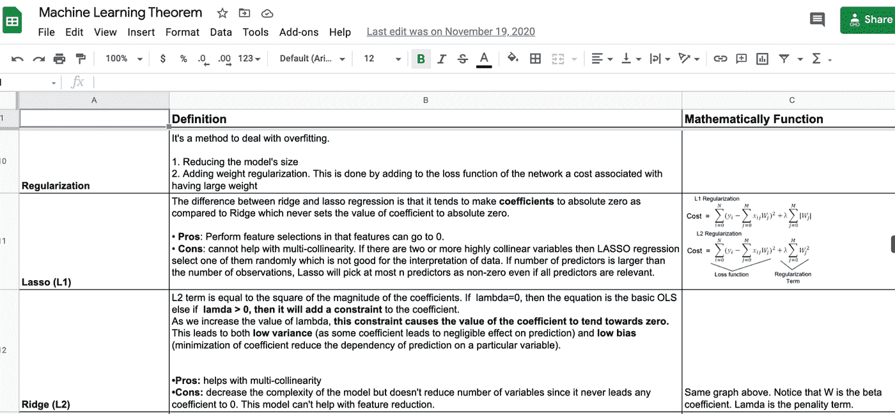

# 作为新毕业生获得第一份数据科学工作的 10 个技巧

> 原文：<https://towardsdatascience.com/10-tips-to-land-your-first-data-science-job-as-a-new-grad-87ecc06c17f7?source=collection_archive---------11----------------------->

## 从我的求职之旅中学到的经验

在 [Unsplash](https://unsplash.com/s/photos/positive?utm_source=unsplash&utm_medium=referral&utm_content=creditCopyText) 上由 [Austin Chan](https://unsplash.com/@austinchan?utm_source=unsplash&utm_medium=referral&utm_content=creditCopyText) 拍摄的照片

# 我的求职之旅

我最近开始了一份新工作，在我梦想的公司担任数据科学家。一年前，我还在努力争取面试机会。我从未想过一年后我会在一家财富 100 强公司工作。老实说，这是一次过山车般的旅程，尤其是由于疫情，入门级别的职位空缺下降了 68%。现在，就业市场已经开放了一些，我想分享我的故事，希望它能帮助那些正在开始求职之旅的人。

简单介绍一下我的背景。2017 年获得应用数学学士学位，2020 年获得商业分析硕士学位。大学毕业后，我做过初级数据分析师、数学教师、网站开发助理和数据科学家实习生。因为我还在上学，所以我的大部分职位都是兼职的。我还在暑假期间参加了 2019 年为期 12 周的数据科学训练营 Metis。就我个人而言，我认为这是我做过的最好的决定之一。我从训练营学到了很多。如果你有兴趣了解更多关于我的经历，请随时联系我。我愿意帮忙！:)

去年一月，我正式开始每天发送求职申请。虽然为期 12 周的研究对我的起步非常有帮助，但这远远不足以获得一个全职数据科学家的职位。我申请，面试，失败，学习，再次面试，再次失败，再次学习…这是令人兴奋的，令人沮丧的，令人不知所措的，尤其是在新冠肺炎疫情期间。我最终进入了 Visa 的最后一轮，但之后出现了招聘冻结。虽然我很失望，但事实上我有机会得到工作面试的确有助于增强我的信心。当你还在学校的时候找工作最好的一点是，它给你更多的时间准备面试过程。面试的越多，就越知道自己还有哪些方面需要学习和准备。

# 以下是我在整个过程中学到的 10 个技巧

## 1.即使你觉得自己还没有准备好，也要尽早开始申请

我注意到现在很多数据科学的空缺职位都要求在职位描述中有 3 年以上的工作经验。申请这些工作可能会令人生畏，但如果你不申请，你就会错过机会。有时，招聘经理甚至不知道他们希望应聘者有什么样的经历。要看你能给公司和团队带来什么。此外，即使你的申请没有被选中，你也不会有什么损失。

## 2.非常了解基础知识

面试的时候，你需要很好的了解所有的基础知识，比如统计学，概率，机器学习，产品感，编程。有很多资源可以帮助你复习基础数据科学面试。

*   [**SQL 和 Python**](https://leetcode.com/) **:** 我主要用**leetcode.com**来练习。我发现很多公司不会为一个数据科学家职位提出中等难度的 python 问题。它们倾向于测试你清理数据的能力，比如对 pandas 使用 lambda 函数和一些数据操作函数。
*   [**Google 的 Udacity A/B 测试课程**](https://www.udacity.com/course/ab-testing--ud257) **:** 这是**最受欢迎的** A/B 测试课程。如果你在下次面试前没有时间完成整个课程，我建议你看看由 Kelly Peng 撰写的本课程的[总结](/a-summary-of-udacity-a-b-testing-course-9ecc32dedbb1)。
*   [**产品感**](https://stellarpeers.com) :当谈到对一个企业产生影响时，它不是关于你能编码多少。相反，它是对需要为用户构建什么做出正确决策的能力。Stellarpeers 是一个很好的平台，可以帮助专业人士准备产品管理面试。如果你有兴趣了解更多关于咨询面试问题的知识，可以在这里查看我的总结。
*   [**统计与概率**](https://online.stat.psu.edu/stat414/) **:** 如果你有一段时间没有接触统计，可以看看 PennState 的 STAT 414 或者 STAT 415。面试官喜欢问贝叶斯定理，条件概率，中心极限定理，I 型和 II 型误差，幂，P 值等。所以要确保你能用自己的话解释基本定理。
*   **机器学习:**Coursera、Udemy、Udacity 等上有很多课程可以了解更多关于机器学习的知识。我发现学习所有定理的最好方法就是自己总结。

这是我为自己整理的部分表格的截图

## 3.网络很重要

“重要的不是你知道什么，而是你认识谁”不仅仅是一句陈词滥调。建立一个强大的关系网并寻求推荐会带来令人兴奋的机会。当你找到第一份工作时，你需要向雇主展示你愿意付出更多的努力。尽管我们都不得不做出暂时的牺牲，但没有理由停止社交。尤其是因为网络帮助我们发展和提高我们的技能，紧跟当前的行业趋势，最重要的是，学习他人的经验。在 meetup.com 有很多虚拟活动和学习小组。不要害羞，走出你的舒适区，你会很高兴你这样做了。

## 4.展示你的作品

现在我们生活在一个数字世界，如果你没有把你的作品放到网上，没人知道你有多了不起。雇主希望看到你在简历之外的能力。建立一个强大的数据科学组合来展示你的技能将增加你获得面试的机会。如果你不知道从哪里开始，看看我的另一个[博客](/10-open-source-dataset-finders-for-your-next-ml-project-c8d01679160d)来获得一些灵感！

## 5.充分了解你的项目

将开源项目中的代码直接复制并粘贴到您的项目中很容易，但是您真的知道项目的业务影响吗，您能解释所有的事情吗？偷别人的作品是绝对不行的！面试官可以通过问几个有深度的问题来判断你是否真的参与了这个项目。因此，了解项目的所有细节并准备好解释复杂的机器学习概念非常重要，例如为什么某种机器学习算法具有更好的预测性能，如何解释预测结果。这也表明你不仅理解了这些概念，还能向其他团队成员和风险承担者清楚地解释你的分析。

## 6.准备行为面试问题

信不信由你，许多雇主会问行为问题，因为他们想更好地评估候选人是否适合这份工作、团队和公司文化。

[阿克谢·萨克德瓦](https://www.themartec.com/insidelook/behavioral-interview-questions)提出了一些常见的行为面试问题:

*   描述一次你与团队成员意见相左的时候。你是如何解决这个问题的？
*   告诉我你与主管意见相左的时候。
*   告诉我你在团队项目中失败的一次经历，以及你是如何克服的。
*   告诉我你在工作中犯过的一个大错误，以及你是如何处理的。
*   你在工作场所遇到的最困难/最具挑战性的情况是什么？
*   你如何处理意想不到的变化或挑战？

在回答这类问题时，着重提供你过去如何处理某种情况的例子。如果你在面试中紧张时容易昏厥，你可以事先准备和练习你的答案。我发现研究职位描述，思考雇主可能在寻找什么样的品质，以及你如何成为他们的资产是很有帮助的。

## 7.准备一份要问面试官的问题清单

在面试中提问表明你对这些问题非常感兴趣，而且你已经做了功课。虽然在面试结束时问问题很重要，但不要问所有面试官同样的问题，不管他们是什么角色。相反，试着向人力资源/招聘人员询问招聘经理的期望或整个招聘过程，向招聘经理询问关于该职位的更多细节，并分享你如何能提供帮助。记住面试也是一种对话，你问问题是因为你真的对这个职位感兴趣。

## 8.设定每日目标

每天设定目标帮助我更好地集中注意力，并让自己负起责任。在求职过程中，拒绝是不可避免的，但不要让它定义你或决定你的价值！通过实现和庆祝每天的小目标，我开始更多地认可和欣赏自己所完成的一切。

## 9.要自信

> 我注意到成功人士和不成功人士之间最大的区别不是智力、机会或资源。这是他们能够实现目标的信念。—詹姆斯·克利尔

如果你不相信你自己，你怎么能让雇主相信你就是那个人呢？几乎每个人都在与自我怀疑或冒名顶替综合症做斗争，所以不要让它影响你！在一次面试中，我被告知，我永远不可能得到一份首席执行官的数据科学家工作，因为我不是常春藤盟校的毕业生。但最后他还是给了我一个报价。当然，我拒绝了。我们不需要别人的赞美来了解我们的价值观。所以，不要再担心自己是否足够优秀了，多关注于从错误中吸取教训。

## 10.现在祈祷吧

运气可能在求职中发挥作用。有时候，不管你有多努力，都不是那么回事。记住，不要把拒绝看得太个人化。相反，要感谢你有机会更多地了解这家公司，提高你的面试技巧。最适合你的职位就在外面等着你，现在当面试来临时，你更有准备去赢得它！

# 最终想法

在疫情期间找工作会非常有压力，让人不知所措，但是嘿，你有这个！你已经学到了这么多。我知道在没有经验的情况下很难找到第一份数据科学工作，但这并非不可能！如果我能做到，你也能做到！毕竟，成功需要努力、时间和耐心。所以现在不要放弃！

# 参考

1.  https://www . CNBC . com/2020/06/26/entry-level-jobs-down-68% what-new-grads-can-do-to-stand-out . html
2.  https://leetcode.com/
3.  【https://www.udacity.com/course/ab-testing ud 257
4.  [https://stellarpeers.com/](https://stellarpeers.com/)
5.  [https://online.stat.psu.edu/stat414/](https://online.stat.psu.edu/stat414/)
6.  [https://www . themartec . com/inside look/behavioral-interview-questions](https://www.themartec.com/insidelook/behavioral-interview-questions)

如果你觉得这很有帮助，请关注我，看看我的其他博客。敬请关注更多内容！❤

 [## 作为分析师如何准备商业案例面试？

### 作为数据分析师或数据科学家，我们不仅需要知道概率和统计，机器学习算法…

towardsdatascience.com](/how-to-prepare-for-business-case-interview-as-an-analyst-6e9d68ce2fd8)  [## 想要在 SQL 面试中胜出，你必须知道的 10 个问题

### 2021 年你应该知道的 SQL 面试问题

towardsdatascience.com](/10-questions-you-must-know-to-ace-any-sql-interviews-2faa0a424f07)  [## 用 Python 解释概率抽样方法

### 为什么我们需要取样？

towardsdatascience.com](/probability-sampling-methods-explained-with-python-4c0a19a59456)  [## 用例子理解和选择正确的概率分布

### 举例说明最常见的离散概率分布

towardsdatascience.com](/understanding-and-choosing-the-right-probability-distributions-with-examples-5051b59b5211)  [## 如何在 Python 中处理缺失值

### 缺失值插补的简明介绍

towardsdatascience.com](/how-to-handle-missing-values-in-python-23407781b2b0)