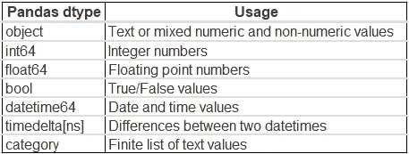

# 在机器学习中使用大型数据集的 8 个技巧和诀窍

> 原文：<https://towardsdatascience.com/10-tips-tricks-for-working-with-large-datasets-in-machine-learning-7065f1d6a802?source=collection_archive---------10----------------------->

## 内存和代码优化基本指南


图片由[穆罕默德·哈桑](https://pixabay.com/users/mohamed_hassan-5229782/?utm_source=link-attribution&amp;utm_medium=referral&amp;utm_campaign=image&amp;utm_content=3679741)来自 [Pixabay](https://pixabay.com/?utm_source=link-attribution&amp;utm_medium=referral&amp;utm_campaign=image&amp;utm_content=3679741)

Pandas 和 Scikit-learn 是数据科学社区中流行的库，因为它们具有高性能和易于使用的数据结构和函数。熊猫为数据准备和分析提供数据分析工具。这些库可以很好地处理内存中的数据集(适合 RAM 的数据)，但是当处理大规模数据集或内存外的数据集时，它会失败，并可能导致内存问题。

在本文中，我将讨论在处理大规模数据集时可以使用的 10 个技巧和诀窍。这些技巧将帮助他们在处理内存不足或大型数据集时避免内存溢出问题，并加快他们的工作流程。

```
***Checklist:***
**1) Read dataset in chunks with Pandas
2) Optimize the datatype constraints
3) Prefer Vectorization
4) Multiprocessing of Functions
5) Incremental Learning
6) Warm Start
7) Distributed Libraries
8) Save objects as Pickle file**
```

# 1.)用熊猫读数据块:

Pandas 提供 API，可以在一行 Python 代码中读取 CSV、txt、excel、pickle 和其他文件格式。它一次将全部数据加载到 RAM 内存中，在处理内存不足的数据集时可能会导致内存问题。

其思想是读取/加载和处理大数据块或数据集的小样本。

(作者代码)

上面的代码示例以块的形式读取大型数据集(第 14 行)，对每个块执行处理(第 15 行)，并进一步保存处理后的数据块(第 17 行)。

# 2.)优化数据类型约束:

熊猫通过观察特征值，将默认数据类型分配给数据集的每个要素。对于具有整数值的要素，数据类型为 int64，而具有小数值的要素，数据类型为 float64。在分配给每个要素的默认数据类型列表下找到列表。



(作者图片)，熊猫默认数据类型

int64 值的范围在`**-9,223,372,036,854,775,808 to 9,223,372,036,854,775,807.**` 之间。对于大多数数据集，整型特征值不会超过该限制。想法是通过观察最大和最小特征值来降级特征数据类型。


(作者图片)，**左:**(作者图片)，分配的默认数据类型和内存使用量，**右:**降级数据类型后的内存使用量

示例数据集使用默认的数据类型约束集，占用 467.4 MB 内存。对数据类型进行类型转换后，内存使用减少了大约 70%,为 134.9 MB。

阅读我以前的一篇文章，更好地理解通过类型转换降级的数据类型。

</optimize-pandas-memory-usage-while-reading-large-datasets-1b047c762c9b>  

# 3.)首选矢量化进行迭代:

对于数据处理任务，人们总是会遇到各种需要遍历数据集的情况。Pandas 提供了各种函数来使用`iterrows()`、`itertuples()`、`iteritems()`循环它们的实例，其中`iterrows()`是最慢的。

要素的矢量化加快了迭代过程。`iterrows()`遍历熊猫系列，因此是最慢的。`itertuples()`遍历元组列表，因此相对更快。

跟随我以前的一篇文章，了解更多关于如何让熊猫的迭代速度加快 400 倍。

</400x-time-faster-pandas-data-frame-iteration-16fb47871a0a>  

# 4.)多重处理:

与其他编程语言相比，Python 相对较慢，因为代码是在运行时解释的，而不是在编译时编译成本机代码。即使在对特征向量进行矢量化之后，用于数据预处理的函数的执行也相对较慢。

这个想法是利用 CPU 的所有内核，并在所有内核之间扩展计算，以加速工作流。Python 提出了一个[多重处理模块](https://docs.python.org/3/library/multiprocessing.html)，它允许这样的功能。

跟随我以前的一篇文章[学习如何使用多处理模块扩展 Python 函数。](/25x-times-faster-python-function-execution-in-a-few-lines-of-code-4c82bdd0f64c)

</25x-times-faster-python-function-execution-in-a-few-lines-of-code-4c82bdd0f64c>  

# 5.)增量学习:

Scikit-learn 提供了各种[分类](https://en.wikipedia.org/wiki/Statistical_classification)、[回归](https://en.wikipedia.org/wiki/Regression_analysis)和[聚类](https://en.wikipedia.org/wiki/Cluster_analysis)机器学习算法的高效实现。对于新一批学习数据随时间而来的机器学习任务，重新训练模型的时间效率不高。此外，对于内存不足的数据集，一次性训练整个数据集是不可行的，因为不可能一次性将整个数据加载到 RAM 中

增量学习可以用于这样的任务，其中模型的过去学习将被恢复，并且相同的模型将用新的一批数据来训练。Scikit-learn 提供了`[**partial_fit()**](https://scikit-learn.org/0.15/modules/scaling_strategies.html)`函数，该函数为核外数据集提供了[增量学习。](https://scikit-learn.org/0.15/modules/scaling_strategies.html)

# 6.)热启动:

Scikit-learn 使用 API `warm_start`来重用从之前的参数值中学习到的模型方面。当`warm_start`为真时，分配的模型超参数用于拟合模型。例如，warm_state 可用于增加随机森林模型中的树的数量(n_estimators)。使用`warm_start`参数时，超参数值仅在保持训练数据集或多或少不变的情况下发生变化。

```
**rf = RandomForestClassifier(n_estimators=10, warm_start=True)                     
rf.fit(X_train, y_train)
rf.n_estimators += 5
rf.fit(X_train, y_train)**
```

从上面的样本代码来看，初始模型是用`**n_estimator=10**`对`**X_train**` 样本数据进行训练的。然后我们进一步增加 5 棵树`**n_estimator=5**` 并重新训练相同的模型。

> 跟随我以前的一篇关于增量学习的文章来更好地理解增量学习和 warm_state 功能。

</strategies-to-train-out-of-memory-data-with-scikit-learn-7b2ed15b9a80>  

# 7.)分布式库:

Pandas、Numpy、Scikit-Learn 等 Python 包提供了高级可用且灵活的 API，但在很大程度上忽略了性能和可伸缩性。在处理内存不足的数据集时，这些库可能会导致内存问题。

其思想是使用分布式库，如 Dask、Vaex、Modin 等，它们构建在 Pandas、Numpy 和 Scikit-learn 库的基础上，并专门设计为通过在所有 CPU 内核上并行化操作来扩展工作流。

> 请在下面找到我以前关于分布式库的文章列表，比如 [Dask](/how-dask-accelerates-pandas-ecosystem-9c175062f409) 、 [Vaex](/process-dataset-with-200-million-rows-using-vaex-ad4839710d3b) 和 [Modin](/modin-speed-up-your-pandas-notebooks-scripts-and-libraries-c2ac7de45b75) :

</how-dask-accelerates-pandas-ecosystem-9c175062f409>  </process-dataset-with-200-million-rows-using-vaex-ad4839710d3b>  </modin-speed-up-your-pandas-notebooks-scripts-and-libraries-c2ac7de45b75>  

# 8.)将对象保存为 Pickle 文件:

在处理大型数据集时，读取和保存数据或临时文件是一项单调乏味的任务。CSV、TXT 或 excel 数据格式的读写操作计算量很大。

还有其他数据格式具有相对更快的读写操作，在处理大规模数据集时可能是首选。


(图片由作者提供)，**左:**读取和保存时间对比(秒)，**右:**内存消耗(MB)

上图显示了具有 1，458，644 条记录和 12 个特性*的样本数据集的读取、写入操作和内存消耗的基准数据。*

Pickle 文件可能是保存和读取数据集或临时文件的首选。Pickling 可以存储列表、字典、类对象等 python 对象。

> 阅读我的一篇[以前的文章](/stop-saving-your-data-frame-in-csv-format-7823d3873ba2)，观察使用各种数据格式进行读取和保存操作的基准时间比较

</stop-saving-your-data-frame-in-csv-format-7823d3873ba2>  

# 结论:

在本文中，我们讨论了在处理内存不足或大型数据集时可以使用的 8 种不同的技术或技巧。这些技术可以加快工作流程并避免内存问题。

# 参考资料:

[1] Scikit-learn 文档:[https://sci kit-learn . org/0.15/modules/scaling _ strategies . html](https://scikit-learn.org/0.15/modules/scaling_strategies.html)

*喜欢这篇文章吗？成为* [*中等会员*](https://satyam-kumar.medium.com/membership) *继续无限制学习。如果你使用下面的链接，我会收到你的一小部分会员费，不需要你额外付费。*

<https://satyam-kumar.medium.com/membership>  

> 感谢您的阅读