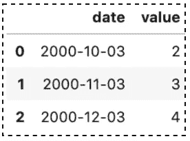
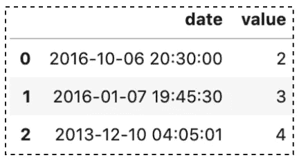
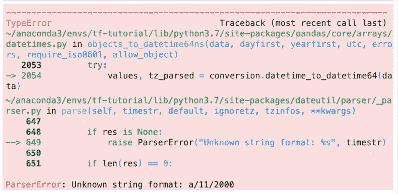
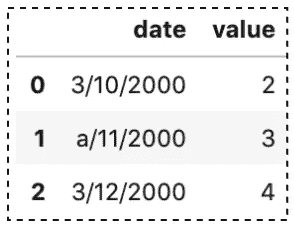
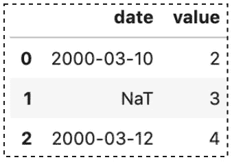
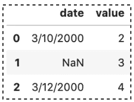
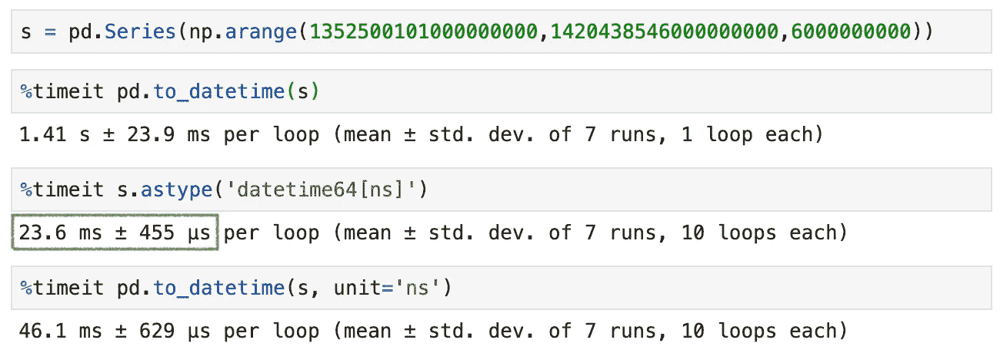

# 在 Pandas 中将数字和字符串转换为日期时间的 10 个技巧

> 原文：<https://towardsdatascience.com/10-tricks-for-converting-numbers-and-strings-to-datetime-in-pandas-82a4645fc23d?source=collection_archive---------3----------------------->

## 熊猫帮助你开始数据分析的提示和技巧


Sanah Suvarna 在 [Unsplash](https://unsplash.com/s/photos/time?utm_source=unsplash&utm_medium=referral&utm_content=creditCopyText) 上拍摄的照片

在进行数据分析时，确保正确的数据类型非常重要。否则，您可能会得到意外的结果或错误。Datetime 是数据科学项目中常见的数据类型，数据通常保存为数字或字符串。在数据分析过程中，您可能需要将它们显式转换为 datetime 类型。

本文将讨论如何将数字和字符串转换为日期时间类型。更具体地说，您将学习如何使用 Pandas 内置方法`to_datetime()`和`astype()`来处理以下常见问题:

1.  将数字转换为日期时间
2.  将字符串转换为日期时间
3.  处理第一天格式
4.  处理自定义日期时间格式
5.  处理分析错误
6.  处理缺失值
7.  从多个列组装日期时间
8.  一次转换多列
9.  读取 CSV 文件时解析日期列
10.  `astype()`和`to_datetime()`的区别

源代码请查看[笔记本](https://github.com/BindiChen/machine-learning/blob/master/data-analysis/037-pandas-change-data-to-datetime/change-data-to-datetime.ipynb)。

# 1.将数字转换为日期时间

Pandas 有两个内置方法`astype()`和`to_datetime()`，可以用来将数字转换成日期时间。例如，要将表示秒的数字转换为日期时间:

```
df = pd.DataFrame({**'date': [1470195805, 1480195805, 1490195805]**,
                   'value': [2, 3, 4]})
```

使用`to_datetime()`时，我们需要从 Pandas 调用它，并设置参数`unit='s'`:

```
>>> **pd.to_datetime(df['date'], unit='s')**0   2016-08-03 03:43:25
1   2016-11-26 21:30:05
2   2017-03-22 15:16:45
Name: date, dtype: datetime64[ns]
```

使用`astype()`时，我们需要从一个序列中调用它(**日期**列)并传入`'datetime[s]'`:

```
>>> df['date'].astype(**'datetime64[s]'**)0   2016-08-03 03:43:25
1   2016-11-26 21:30:05
2   2017-03-22 15:16:45
Name: date, dtype: datetime64[ns]
```

同样，我们可以将表示其他单位的数字(`D`、`s`、`ms`、`us`、`ns`)转换为日期时间，例如，数字表示日期

```
df = pd.DataFrame({**'date': [1470, 1480, 1490],**
                   'value': [2, 3, 4]})>>> pd.to_datetime(df['date'], **unit='D'**)0   1974-01-10
1   1974-01-20
2   1974-01-30
Name: date, dtype: datetime64[ns]>>> df['date'].astype(**'datetime64[D]'**)0   1974-01-10
1   1974-01-20
2   1974-01-30
Name: date, dtype: datetime64[ns]
```

# 2.将字符串转换为日期时间

通常，您会发现日期被表示为字符串。在熊猫中，字符串显示为**对象**，这是熊猫内部的行话，表示**字符串**。

```
>>> df = pd.DataFrame({**'date':['3/10/2015','3/11/2015','3/12/2015']**,
                       'value': [2, 3, 4]})
>>> df.dtypes**date     object**
value     int64
dtype: object
```

`to_datetime()`和`astype()`都可以用来将字符串转换成日期时间。

```
>>> pd.**to_datetime(df['date'])**0   2015-03-10
1   2015-03-11
2   2015-03-12
Name: date, dtype: datetime64[ns]>>> df['date'].**astype('datetime64')**0   2015-03-10
1   2015-03-11
2   2015-03-12
Name: date, dtype: datetime64[ns]
```

# 3.处理第一天格式

默认情况下，`to_datetime()`会先解析月( **MM/DD** 、 **MM DD、**或 **MM-DD** )格式的字符串，这种安排在美国是比较独特的。

在世界上大多数其他地方，首先写的是日期( **DD/MM** 、 **DD MM** 或 **DD-MM** )。如果你想让熊猫先考虑日子而不是月份，你可以将参数`dayfirst`设置为`True`。

```
df = pd.DataFrame({**'date': ['3/10/2000', '3/11/2000', '3/12/2000']**,
                   'value': [2, 3, 4]})df['date'] = pd.to_datetime(df['date'], **dayfirst=True**)
```



作者图片

或者，您可以将自定义格式传递给参数`format`。

# 4.处理自定义日期时间格式

默认情况下，使用来自`dateutil.parser.parse`的 Pandas 内置解析器解析字符串。有时，您的字符串可能是自定义格式，例如， **YYYY-d-m HH:MM:SS** 。Pandas `to_datetime()`有一个名为`format`的参数，允许您传递自定义格式:

```
df = pd.DataFrame({**'date': ['2016-6-10 20:30:0', 
                            '2016-7-1 19:45:30', 
                            '2013-10-12 4:5:1']**,
                   'value': [2, 3, 4]})df['date'] = pd.to_datetime(df['date'], **format="%Y-%d-%m %H:%M:%S"**)
```



作者图片

# 4.处理分析错误

如果一个日期不符合[时间戳限制](https://pandas.pydata.org/pandas-docs/stable/user_guide/timeseries.html#timeseries-timestamp-limits)，我们将在转换时得到一个 **ParseError** 。例如，一个无效的字符串`a/11/2000`:

```
df = pd.DataFrame({'date': ['3/10/2000', **'a/11/2000'**, '3/12/2000'],
                   'value': [2, 3, 4]})# Getting ParseError
df['date'] = pd.to_datetime(df['date'])
```



作者图片

`to_datetime()`有一个名为`errors`的参数，允许您忽略错误或将无效值强制给`NaT`。

```
df['date'] = pd.to_datetime(df['date'], **errors='ignore'**)
df
```



作者图片

并将无效值强制到`NaT`:

```
df['date'] = pd.to_datetime(df['date'], **errors='coerce'**)
```



作者图片

# 6.处理缺失值

在 Pandas 中，缺失值被赋予值`NaN`，这是“不是一个数字”的缩写。

```
df = pd.DataFrame({'date': ['3/10/2000', **np.nan**, '3/12/2000'],
                   'value': [2, 3, 4]})
```



当将缺少值的列转换为日期时间时，to_datetime()和 astype()都将 Numpy 的`NaN`更改为 Pandas 的`NaT`，这允许它成为日期时间。

```
>>> df['date']**.astype('datetime64')**0   2000-03-10
1          **NaT**
2   2000-03-12
Name: date, dtype: datetime64[ns]>>> pd.**to_datetime(df['date'])**0   2000-03-10
1          **NaT**
2   2000-03-12
Name: date, dtype: datetime64[ns]
```

或者，我们可以用另一个值替换 Numpy `NaN`(例如用 `'3/11/2000'`替换`NaN`)

```
df = pd.DataFrame({'date': ['3/10/2000', np.nan, '3/12/2000'],
                   'value': [2, 3, 4]})df['date'] = df['date'].fillna('3/11/2000').astype('datetime64[ns]')
```

了解有关使用缺失值的更多信息

[](/working-with-missing-values-in-pandas-5da45d16e74) [## 处理熊猫中缺失的值

### 关于 Pandas 中缺失值以及如何使用内置方法处理它们的教程

towardsdatascience.com](/working-with-missing-values-in-pandas-5da45d16e74) 

# 7.从多个列组合日期时间

`to_datetime()`也可以用于从多个列组合一个日期时间。键(列标签)可以是常见的缩写，如 **['年'，'月'，'日'，'分钟'，'秒'，'毫秒'，'美国'，' ns'])** 或相同的复数。

```
df = pd.DataFrame({'year': [2015, 2016],
                   'month': [2, 3],
                   'day': [4, 5],
                   'hour': [10,11]
                  })
```

从列的子集创建日期时间列

```
>>> pd.to_datetime(**df[['month','day','year']]**)0   2015-02-04
1   2016-03-05
dtype: datetime64[ns]
```

从整个数据帧创建日期时间列

```
>>> pd.**to_datetime(df)**0   2015-02-04 10:00:00
1   2016-03-05 11:00:00
dtype: datetime64[ns]
```

# 8.一次转换多列

到目前为止，我们一直在一次一列地转换数据类型。有一个 DataFrame 方法也叫做`astype()`，它允许我们一次转换多个列数据类型。当您有一大堆要更改的列时，这样可以节省时间。

```
df = df.astype({
    **'date_start': 'datetime64',
    'date_end': 'datetime64'**
})
```

# 9.读取 CSV 文件时解析日期列

如果您想在读取 CSV 文件时设置每一列的数据类型，您可以在使用`read_csv()`加载数据时使用参数`parse_date`:

注意数据类型`datetime64`不被`dtype`支持，我们应该使用`parse_dates`参数。

```
df = pd.read_csv(
    'dataset.csv',
    dtype={
        **# datetime64[ns] is not supported**
        'value': 'float16'
    },
    **parse_dates=['date']**
)
```

要了解更多关于用 Pandas `read_csv()`解析日期列的信息:

[](/4-tricks-you-should-know-to-parse-date-columns-with-pandas-read-csv-27355bb2ad0e) [## 您应该知道的用 Pandas read_csv()解析日期列的 4 个技巧

### 一些最有用的熊猫把戏

towardsdatascience.com](/4-tricks-you-should-know-to-parse-date-columns-with-pandas-read-csv-27355bb2ad0e) 

# 10.`astype('datetime64')`和`to_datetime()`的区别

`astype()`是将数据类型从一种转换到另一种的常用方法。Pandas DataFrame 和 Series 都支持该方法。如果您需要转换一组列，那么`astype()`应该是首选，因为它:

*   可以一次转换多列
*   具有最佳性能(如下图所示)



然而，`astype()`对于包含无效数据的列不起作用。例如，无效的日期字符串`a/11/2000`。如果我们尝试使用`astype()`，我们会得到一个 **ParseError** 。从 Pandas 0.20.0 开始，这个错误可以通过设置参数`errors='ignore',`来抑制，但是您的原始数据将原封不动地返回。

Pandas `to_datetime()`函数可以更好地处理这些值。与其失败，我们可以设置参数`errors='coerce'`来强制无效值为`NaT`。

此外，在处理自定义日期时间格式时，使用`astype()`可能会非常困难。熊猫`to_datetime()`有一个叫`format`的说法，在习俗转换的方式上提供了更多的可能性。

# 结论

我们已经看到了如何使用`astype()`和`to_datetime()`将 Pandas 数据列转换为 datetime 类型。`to_datetime()`是最简单的方法，在自定义转换的方式中提供了错误处理和更多的可能性，而`astype()`具有更好的性能，可以一次转换多个列。

我希望这篇文章能帮助你节省学习熊猫的时间。我建议您查看一下`astypes()`和`to_datetime()` API 的文档，并了解您可以做的其他事情。

感谢阅读。请查看[笔记本](https://github.com/BindiChen/machine-learning/blob/master/data-analysis/037-pandas-change-data-to-datetime/change-data-to-datetime.ipynb)获取源代码，如果您对机器学习的实用方面感兴趣，请继续关注。

## 你可能会对我的其他一些熊猫文章感兴趣:

*   [在 Pandas 中把数据转换成数字类型的 10 个技巧](/converting-data-to-a-numeric-type-in-pandas-db9415caab0b)
*   [熊猫 json_normalize()你应该知道的扁平化 JSON](/all-pandas-json-normalize-you-should-know-for-flattening-json-13eae1dfb7dd)
*   [所有熊猫切()你应该知道把数值数据转换成分类数据](/all-pandas-cut-you-should-know-for-transforming-numerical-data-into-categorical-data-1370cf7f4c4f)
*   [使用熊猫方法链接提高代码可读性](https://medium.com/@bindiatwork/using-pandas-method-chaining-to-improve-code-readability-d8517c5626ac)
*   [如何对熊猫数据帧进行自定义排序](/how-to-do-a-custom-sort-on-pandas-dataframe-ac18e7ea5320)
*   [数据分析你应该知道的所有熊猫移位()](/all-the-pandas-shift-you-should-know-for-data-analysis-791c1692b5e)
*   [何时使用 Pandas transform()函数](/when-to-use-pandas-transform-function-df8861aa0dcf)
*   [你应该知道的熊猫串联()招数](/pandas-concat-tricks-you-should-know-to-speed-up-your-data-analysis-cd3d4fdfe6dd)
*   [所有的熊猫合并()你应该知道](/all-the-pandas-merge-you-should-know-for-combining-datasets-526b9ecaf184)
*   [在熊猫数据帧中处理日期时间](/working-with-datetime-in-pandas-dataframe-663f7af6c587)
*   [熊猫阅读 _csv()你应该知道的招数](https://medium.com/@bindiatwork/all-the-pandas-read-csv-you-should-know-to-speed-up-your-data-analysis-1e16fe1039f3)
*   [用 Pandas read_csv()](/4-tricks-you-should-know-to-parse-date-columns-with-pandas-read-csv-27355bb2ad0e) 解析日期列应该知道的 4 个技巧

更多教程可以在我的 [Github](https://github.com/BindiChen/machine-learning) 上找到