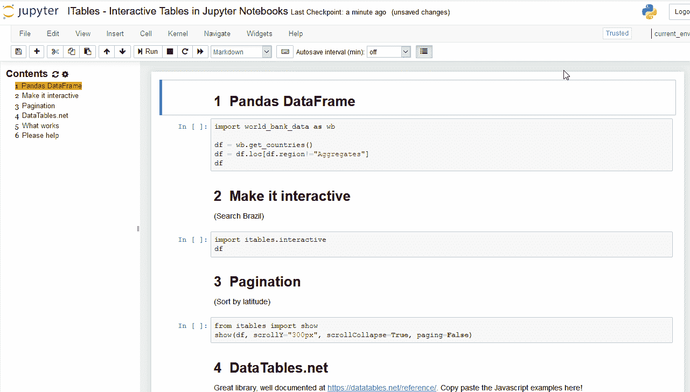
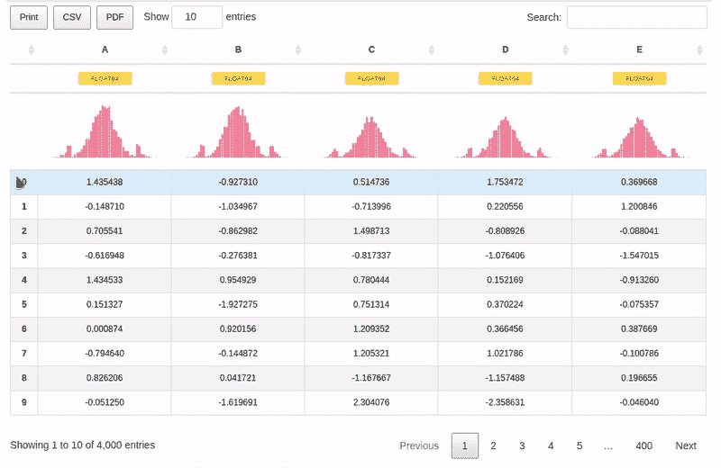
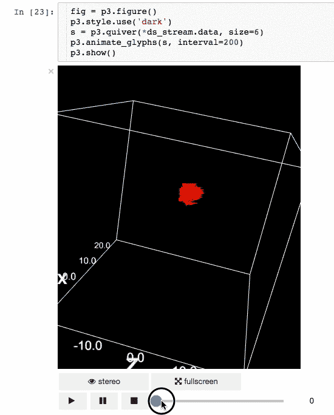
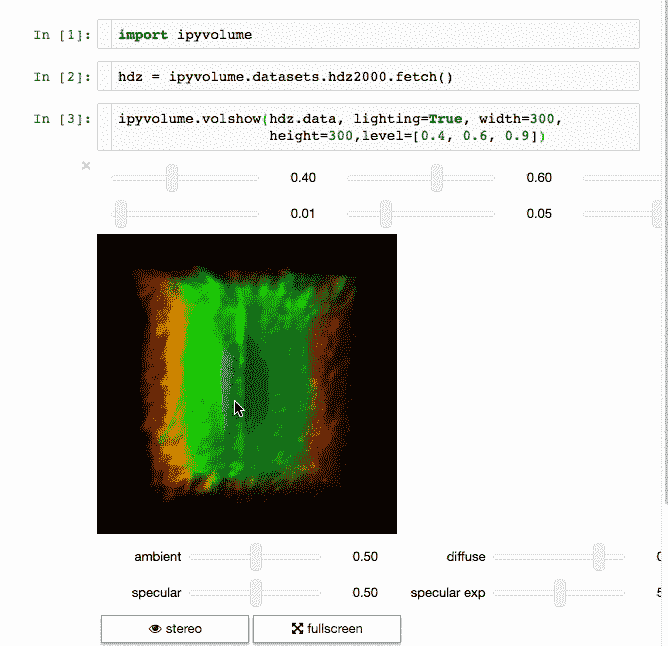
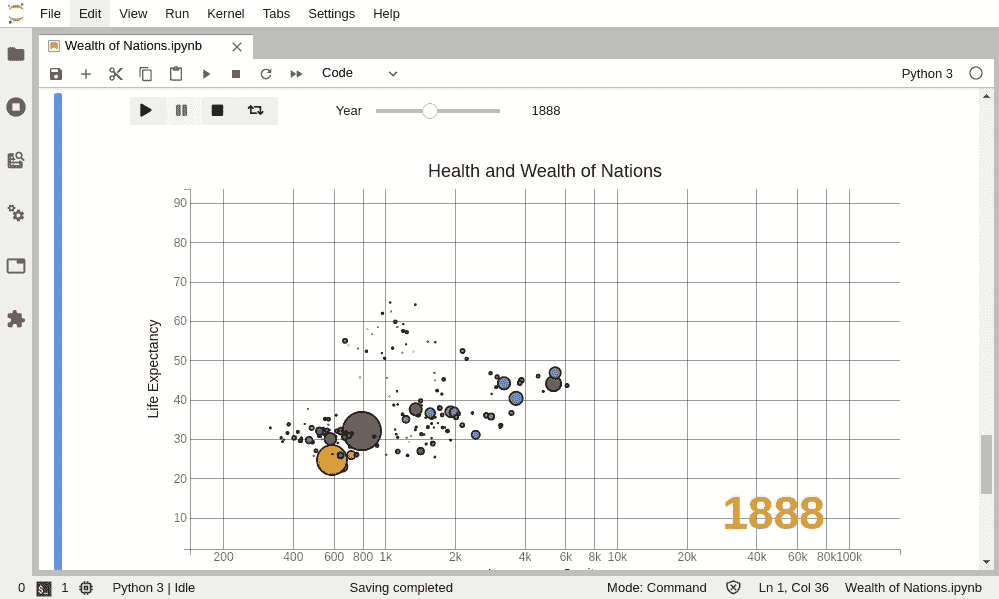
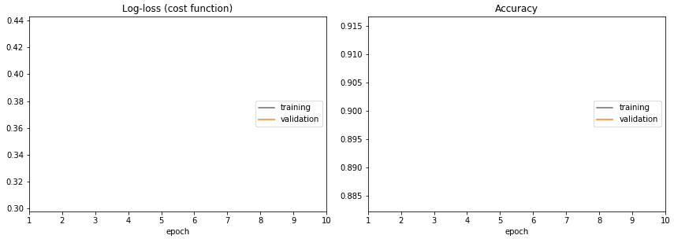
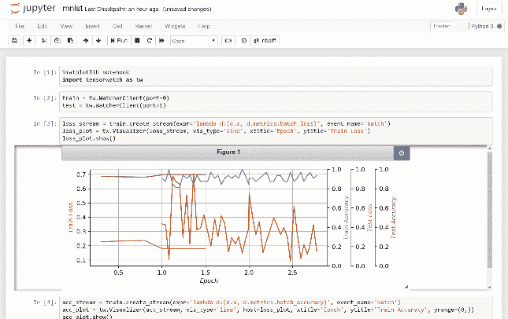
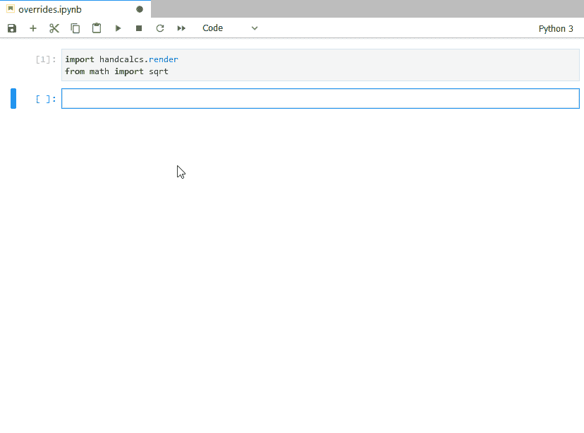
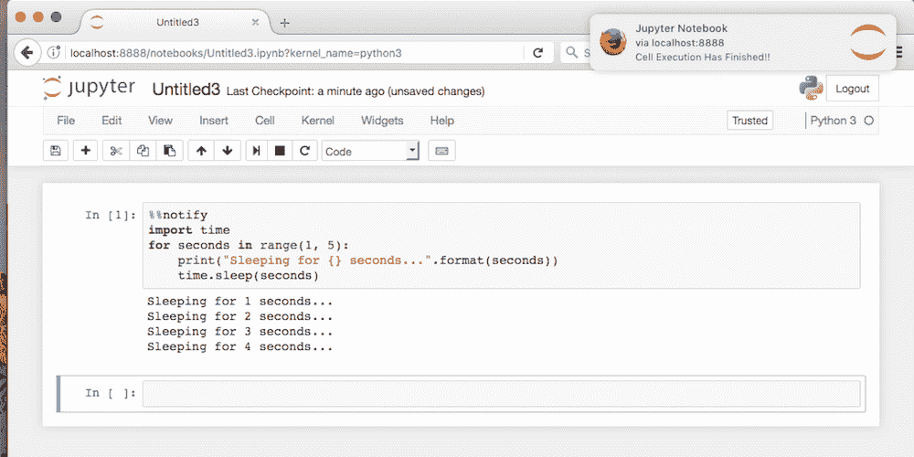

# 数据科学家的 10 个有用的 Jupyter 笔记本扩展

> 原文：<https://towardsdatascience.com/10-useful-jupyter-notebook-extensions-for-a-data-scientist-bd4cb472c25e?source=collection_archive---------1----------------------->

## 这些 Jupyter 笔记本扩展使数据科学家的生活更加轻松


图片来自 [Pixabay](https://pixabay.com/?utm_source=link-attribution&utm_medium=referral&utm_campaign=image&utm_content=736875) 的 [Bessi](https://pixabay.com/users/bessi-909086/?utm_source=link-attribution&utm_medium=referral&utm_campaign=image&utm_content=736875)

每个数据科学家都把大部分时间花在数据可视化、预处理和基于结果的模型调优上。对于每个数据科学家来说，这些都是最困难的情况，因为当你精确地执行所有这三个步骤时，你将得到一个好的模型。在这些情况下，有 10 个非常有用的 jupyter 笔记本扩展可以提供帮助。

# 1.Qgrid

[Qgrid](https://github.com/quantopian/qgrid) 是一个 Jupyter 笔记本小部件，它使用 [SlickGrid](https://github.com/mleibman/SlickGrid) 在 Jupyter 笔记本中呈现熊猫数据帧。这使您可以通过直观的滚动、排序和过滤控件来浏览数据框，并通过双击单元格来编辑数据框。


## 安装:

```
pip install qgrid  #Installing with pipconda install qgrid  #Installing with conda
```

# 2.itables

ITables 将熊猫的数据帧和数据系列转化为你的笔记本和 HTML 格式的交互式数据表。ITables 使用基本的 Javascript，正因为如此，它只能在 Jupyter Notebook 中工作，而不能在 JupyterLab 中工作。



## 安装:

```
pip install itables
```

使用激活所有系列和数据帧的交互模式

```
from itables import init_notebook_mode
init_notebook_mode(all_interactive=True)import world_bank_data as wb

df = wb.get_countries()
df
```

# 3.Jupyter 数据表

数据科学家和实际上许多开发人员每天都在使用 dataframe 来解释和处理数据。常见的工作流程是显示数据帧，查看数据模式，然后绘制多个图来检查数据的分布情况，以便有一个更清晰的图像，也许是在表中搜索一些数据，等等...

如果这些分布图是标准数据框架的一部分，并且我们能够以最小的努力快速搜索整个表，会怎么样？如果这是默认的表示呢？

[jupyter-datatables](https://github.com/CermakM/jupyter-datatables) 使用 [jupyter-require](https://github.com/CermakM/jupyter-require) 来绘制表格。



## 安装:

```
pip install jupyter-datatables
```

## 使用

```
from jupyter_datatables import init_datatables_mode

init_datatables_mode()
```

# 4.ipy 卷

[ipyvolume](https://github.com/maartenbreddels/ipyvolume) 使用 WebGL，基于 IPython 小部件，帮助在 Jupyter 笔记本中进行 Python 的 3d 绘图。

Ipyvolume 当前可以

*   进行(多重)体绘制。
*   创建散点图(最多约 1 百万个字形)。
*   创建箭图(类似散点图，但箭头指向特定方向)。
*   做套索鼠标选择。
*   使用谷歌 Cardboard 渲染虚拟现实的立体效果。
*   例如，如果散点图的 x 坐标或颜色发生变化，则以 d3 风格制作动画。
*   动画/序列，所有散布/颤动图属性可以是数组列表，其可以表示时间快照等。



## 装置

```
$ pip install ipyvolume #Installing with pip$ conda install -c conda-forge ipyvolume  #Installing with conda
```

# 5.bqplot

bqplot 是 Jupyter 的一个二维可视化系统，基于图形语法的构造。



# 目标

*   用 pythonic API 为二维可视化提供统一的框架。
*   为添加用户交互(平移、缩放、选择等)提供一个合理的 API

提供了两个 API

*   用户可以使用内部对象模型构建自定义可视化，该模型受图形语法(图形、标记、轴、比例)的启发，并通过我们的交互层丰富他们的可视化。
*   或者他们可以使用基于上下文的 API，类似于 Matplotlib 的 pyplot，它为大多数参数提供了明智的默认选择。

## 装置

```
$ pip install bqplot #Installing with pip$ conda install -c conda-forge bqplot  #Installing with conda
```

# 6.活线图

不要蒙着眼睛训练深度学习模型！不要急躁，看看你训练的每一个时期！

[livelossplot](https://github.com/stared/livelossplot) 为 Keras、PyTorch 等框架提供了 Jupyter 笔记本中的现场训练损耗图。



## 装置

```
pip install livelossplot
```

## 使用

```
from livelossplot import PlotLossesKeras

model.fit(X_train, Y_train,
          epochs=10,
          validation_data=(X_test, Y_test),
          callbacks=[PlotLossesKeras()],
          verbose=0)
```

# 7.张量手表

[TensorWatch](https://github.com/microsoft/tensorwatch) 是微软研究院为数据科学、深度学习和强化学习设计的调试和可视化工具。它在 Jupyter Notebook 中工作，以显示您的机器学习训练的实时可视化，并对您的模型和数据执行其他几个关键的分析任务。



## 装置

```
pip install tensorwatch
```

# 8.多轴

[Polyaxon](https://github.com/polyaxon/polyaxon) 是一个用于构建、培训和监控大规模深度学习应用的平台。我们正在制作一个系统来解决机器学习应用的可重复性、自动化和可扩展性。Polyaxon 部署到任何数据中心、云提供商，或者可以由 Polyaxon 托管和管理，它支持所有主要的深度学习框架，如 Tensorflow、MXNet、Caffe、Torch 等。


## 装置

```
$ pip install -U polyaxon
```

# 9.手摇计算器

[handcalcs](https://github.com/connorferster/handcalcs) 是一个在 Latex 中自动呈现 Python 计算代码的库，但是它模仿了用铅笔书写计算时的格式:编写符号公式，然后是数字替换，最后是结果。



## 装置

```
pip install handcalcs
```

# 10.jupyternotify

[jupyternotify](https://github.com/ShopRunner/jupyter-notify) 提供了一个 Jupyter 笔记本单元格魔术`%%notify`，它通过浏览器推送通知在潜在的长时间运行的单元格完成时通知用户。用例包括长期运行的机器学习模型、网格搜索或 Spark 计算。这种魔力允许你导航到其他工作，并且当你的单元完成时仍然得到通知。



## 装置

```
pip install jupyternotify
```

# 感谢您的阅读！

非常感谢您的任何反馈和意见！