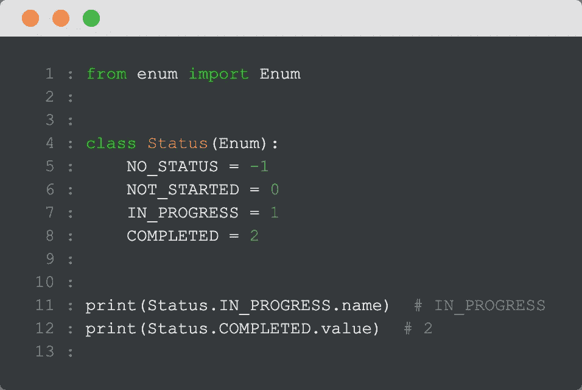
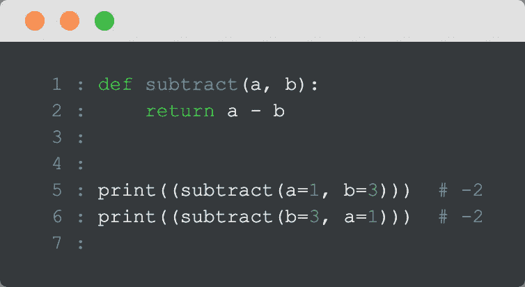
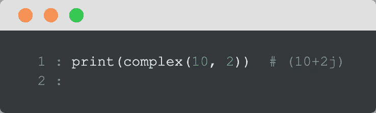
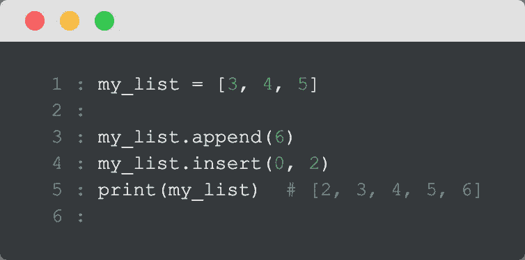
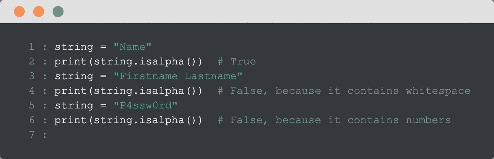
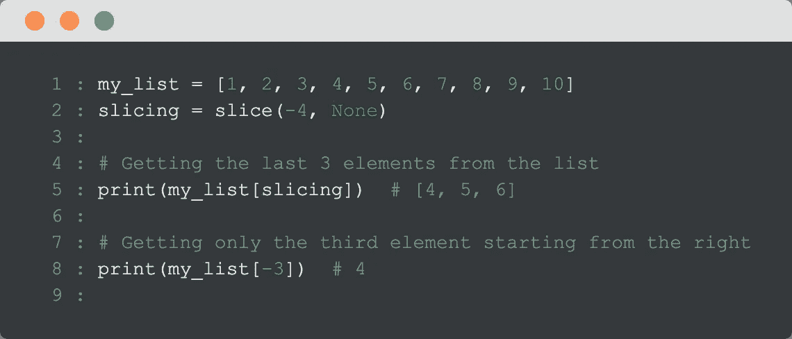
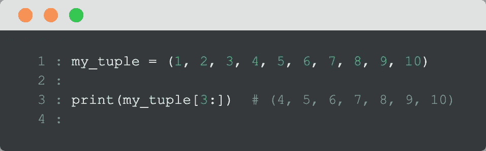

# 在喝完早餐咖啡之前，你可以学习 100 个有用的 Python 技巧

> 原文：<https://towardsdatascience.com/100-helpful-python-tips-you-can-learn-before-finishing-your-morning-coffee-eb9c39e68958?source=collection_archive---------1----------------------->

## 34.字符串和元组是不可变的


[Jexo](https://unsplash.com/@jexo?utm_source=medium&utm_medium=referral) 在 [Unsplash](https://unsplash.com?utm_source=medium&utm_medium=referral) 上的照片

Python 现在很流行，主要是因为它简单易学。

你可以用它来完成各种各样的任务，比如数据科学和机器学习、web 开发、脚本、自动化等等。

既然这是一篇相当长的文章，而且你想在喝完咖啡之前就看完，我们为什么不直接开始呢？

好了，我们开始吧…

# 1.“for”循环中的“Else”条件

尽管到目前为止您已经看到了所有的 Python 代码，但是您可能错过了下面的“for-else ”,这也是我在几周前第一次看到的。

这是一个遍历列表的“for-else”方法，尽管遍历了一个列表，但是还有一个“else”条件，这很不寻常。

这是我在 Java、Ruby 或 JavaScript 等其他编程语言中从未见过的。

让我们来看一个它在实践中的例子。

假设我们试图检查一个列表中是否没有奇数。

让我们迭代一下:


```
numbers = [2, 4, 6, 8, 1]

for number in numbers:
    if number % 2 == 1:
        print(number)
        break
else:
    print("No odd numbers")
```

如果我们发现一个奇数，那么该数字将被打印，因为 ***中断*** 将被执行，而 ***否则*** 分支将被跳过。

否则，如果 ***break*** 从未执行，执行流程将继续 ***else*** 分支。

在这个例子中，我们将打印 1。

# 2.使用命名变量从列表中获取元素


```
my_list = [1, 2, 3, 4, 5]one, two, three, four, five = my_list
```

# 3.使用模块 heapq 获得列表中 n 个最大或 n 个最小的元素


```
import heapq

scores = [51, 33, 64, 87, 91, 75, 15, 49, 33, 82]

print(heapq.nlargest(3, scores))  # [91, 87, 82]
print(heapq.nsmallest(5, scores))  # [15, 33, 33, 49, 51]
```

# 4.将列表中的值作为方法参数传递

我们可以使用“*”提取列表中的所有元素:


```
my_list = [1, 2, 3, 4]print(my_list)  # [1, 2, 3, 4]

print(*my_list)  # 1 2 3 4
```

这在我们希望将列表中的所有元素作为方法参数传递的情况下很有帮助:


```
def sum_of_elements(*arg):
    total = 0
    for i in arg:
        total += i

    return total

result = sum_of_elements(*[1, 2, 3, 4])
print(result)  # 10
```

# **5。获取列表中间的所有元素**


```
_, *elements_in_the_middle, _ = [1, 2, 3, 4, 5, 6, 7, 8]print(elements_in_the_middle)  # [2, 3, 4, 5, 6, 7]
```

# 6.仅在一行中分配多个变量


```
one, two, three, four = 1, 2, 3, 4
```

# 7.列出理解

您可以非常全面地在一行中遍历列表中的元素。

让我们看看下面的例子:


```
numbers = [1, 2, 3, 4, 5, 6, 7, 8]

even_numbers = [number for number in numbers if number % 2 == 0]

print(even_numbers)  # [2, 4, 6, 8]
```

我们可以对字典、集合和生成器做同样的事情。

让我们看另一个例子，但现在是字典。


```
dictionary = {'first_element': 1, 'second_element': 2,
              'third_element': 3, 'fourth_element': 4}odd_value_elements = {key: num for (key, num) in
                      dictionary.items() if num % 2 == 1}print(odd_value_elements)  # {'first_element': 1, 'third_element': 3}
```

*这个例子的灵感来自于这篇* [*文章*](https://betterprogramming.pub/10-useful-python-snippets-to-code-like-a-pro-e3d9a34e6145) *。*

# 8.通过 Enum 枚举相同概念的相关项目

来自[文档](https://docs.python.org/3.10/howto/enum.html):

```
An Enum is a set of symbolic names bound to unique values. They are similar to global variables, but they offer a more useful repr(), grouping, type-safety, and a few other features.
```

这里有一个例子:



```
from enum import Enum

class Status(Enum):
    NO_STATUS = -1
    NOT_STARTED = 0
    IN_PROGRESS = 1
    COMPLETED = 2

print(Status.IN_PROGRESS.name)  # IN_PROGRESS
print(Status.COMPLETED.value)  # 2
```

# 9.不循环地重复字符串


```
string = "Abc"

print(string * 5)  # AbcAbcAbcAbcAbc
```

# 10.像数学一样比较 3 个数字

如果你有一个值，你想比较它是否在其他两个值之间，有一个简单的数学表达式:

*1 < x < 10*

那是我们小学学的代数表达式。但是，您也可以在 Python 中使用相同的表达式。

是的，你没听错。到目前为止，您可能已经对这种形式进行了比较:

*1 < x 和 x < 10*

为此，您只需在 Python 中使用以下代码:

```
1 < x < 10
```


这在 Ruby 中是行不通的，Ruby 是一种为了让程序员开心而开发的编程语言。这在 JavaScript 中也同样有效。

看到这样一个简单的表达没有被更广泛地谈论，我真的印象深刻。至少，我没见过它被提到那么多。

# 11.将字典合并成一行

这从 Python 3.9 开始可用:


```
first_dictionary = {'name': 'Fatos', 'location': 'Munich'}
second_dictionary = {'name': 'Fatos', 'surname': 'Morina',
                     'location': 'Bavaria, Munich'}
result = first_dictionary | second_dictionary
print(result)  
# {'name': 'Fatos', 'location': 'Bavaria, Munich', 'surname': 'Morina'}
```

# 12.查找元组中元素的索引


```
books = ('Atomic habits', 'Ego is the enemy', 'Outliers', 'Mastery')

print(books.index('Mastery'))   # 3
```

# 13.将字符串转换成字符串列表

假设您在一个函数中获得的输入是一个字符串，但它应该是一个列表:

```
input = "[1,2,3]"
```

你不需要那种格式的。你需要它是一个列表:

```
input = [1,2,3]
```

或者，您可能会从 API 调用中得到以下响应:

```
input = [[1, 2, 3], [4, 5, 6]]
```

您不必为复杂的正则表达式而烦恼，您所要做的就是导入模块 ***ast*** ，然后调用它的方法 ***literal_eval*** :


```
import ast

def string_to_list(string):
    return ast.literal_eval(string)
```

这就是你需要做的。

现在你将得到一个列表或列表列表，如下所示:


```
import ast

def string_to_list(string):
    return ast.literal_eval(string)

string = "[[1, 2, 3],[4, 5, 6]]"
my_list = string_to_list(string)
print(my_list)  # [[1, 2, 3], [4, 5, 6]]
```

# 14.通过使用命名参数来避免“琐碎”的错误

让我们假设你想找出两个数的区别。这种差异是不可交换的:

```
a - b != b -a
```

然而，我们可能会忘记参数的排序，这会导致“微不足道”的错误:


```
def subtract(a, b):
    return a - b

print((subtract(1, 3)))  # -2
print((subtract(3, 1)))  # 2
```

为了避免这种潜在的错误，我们可以简单地使用命名参数，参数的顺序不再重要:



```
def subtract(a, b):
    return a - b

print((subtract(a=1, b=3)))  # -2
print((subtract(b=3, a=1)))  # -2
```

# 15.用一个 Print()语句打印多个元素


```
print(1, 2, 3, "a", "z", "this is here", "here is something else")
```

# 16.在同一行打印多个元素


```
print("Hello", end="")
print("World")  # HelloWorld
print("Hello", end=" ")
print("World")  # Hello World
print('words',   'with', 'commas', 'in', 'between', sep=', ')
# words, with, commas, in, between
```

# 17.打印多个值，每个值之间使用自定义分隔符

您可以非常轻松地进行高级打印:


```
print("29", "01", "2022", sep="/")  # 29/01/2022print("name", "domain.com", sep="@")  # name@domain.com
```

# 18.变量名称的开头不能使用数字


```
four_letters = “abcd” # this works4_letters = “abcd” # this doesn’t work
```

# 19.不能在变量名的开头使用运算符


```
+variable = “abcd”  # this doesn’t work
```

# 20.数字的第一个数字不能是 0


```
number = 0110 # this doesn't work
```

# 21.您可以在变量名称的任何地方使用下划线字符

这意味着，在任何你想要的地方，在一个变量的名字里，你想要多少次就有多少次:


```
a______b = "abcd"  # this works
_a_b_c_d = "abcd"  # this also works
```

我并不鼓励你使用它，但是如果你看到一个像那样奇怪的变量命名，要知道它实际上是一个有效的变量名称。

# 22.您可以用下划线分隔大数字

这样可以更容易阅读它们。


```
print(1_000_000_000)  # 1000000000
print(1_234_567)  # 1234567
```

# 23.颠倒列表的顺序


```
my_list = ['a', 'b', 'c', 'd']

my_list.reverse()

print(my_list)  # ['d', 'c', 'b', 'a']
```

# 24.使用阶跃函数对字符串进行切片


```
my_string = "This is just a sentence"
print(my_string[0:5])  # This

# Take three steps forward
print(my_string[0:10:3])  # Tsse
```

# 25.反向切片


```
my_string = "This is just a sentence"
print(my_string[10:0:-1])  # suj si sih

# Take two steps forward
print(my_string[10:0:-2])  # sjs i
```

# 26.仅具有开始或结束索引的部分切片

指示切片的*开始*和*结束*的索引可以是可选的。


```
my_string = "This is just a sentence"
print(my_string[4:])  # is just a sentence

print(my_string[:3])  # Thi
```

# 27.楼层划分


```
print(3/2)  # 1.5
print(3//2)  # 1
```

# 28.==和“是”的区别

“is”检查两个变量是否指向内存中的同一个对象。

" == "比较这两个对象拥有的值是否相等。


```
first_list = [1, 2, 3]
second_list = [1, 2, 3]

# Is their actual value the same?
print(first_list == second_list)  # True

# Are they pointing to the same object in memory
print(first_list is second_list)  
# False, since they have same values, but in different objects in memory

third_list = first_list

print(third_list is first_list)  
# True, since both point to the same object in memory
```

# 29.快速合并 2 本词典


```
dictionary_one = {"a": 1, "b": 2}
dictionary_two = {"c": 3, "d": 4}

merged = {**dictionary_one, **dictionary_two}

print(merged)  # {'a': 1, 'b': 2, 'c': 3, 'd': 4}
```

# 30.检查一个字符串是否大于另一个字符串


```
first = "abc"
second = "def"
print(first < second)  # True
second = "ab"
print(first < second)  # False
```

# 31.检查字符串是否以特定字符开头，而不使用索引 0


```
my_string = "abcdef"
print(my_string.startswith("b"))  # False
```

# 32.使用 id()查找变量的唯一 id


```
print(id(1))  # 4325776624
print(id(2))  # 4325776656
print(id("string"))  # 4327978288
```

# 33.整数、浮点、字符串、布尔和元组是不可变的

当我们把一个变量赋给一个不可变的类型，比如整型、浮点型、字符串型、布尔型和元组型，那么这个变量就指向内存中的一个对象。

如果我们给这个变量赋另一个值，原始对象仍然在内存中，但是指向它的变量丢失了:


```
number = 1
print(id(number))  # 4325215472
print(id(1))  # 4325215472

number = 3
print(id(number))  # 4325215536
print(id(1))  # 4325215472
```

# 34.字符串和元组是不可变的

这一点在前一点中已经提到过了，但我想强调一下，因为这非常重要。


```
name = "Fatos"
print(id(name))  # 4422282544name = "fatos"
print(id(name))  # 4422346608
```


```
my_tuple = (1, 2, 3, 4)
print(id(my_tuple))  # 4499290128

my_tuple = ('a', 'b')
print(id(my_tuple))  # 4498867584
```

# 35.列表、集合和字典是可变的

这意味着我们可以改变对象而不会失去对它的绑定:


```
cities = ["Munich", "Zurich", "London"]
print(id(cities))  # 4482699712

cities.append("Berlin")
print(id(cities))  # 4482699712
```

这是另一个集合的例子:


```
my_set = {1, 2, 3, 4}
print(id(my_set))  # 4352726176my_set.add(5)
print(id(my_set))  # 4352726176
```

# 36.你可以把一个集合变成一个不可变的集合

这样，您就不能再修改它了:


```
my_set = frozenset(['a', 'b', 'c', 'd'])

my_set.add("a")
```

如果这样做，将会引发一个错误:

```
AttributeError: 'frozenset' object has no attribute 'add'
```

# 37.“if-elif”块可以在末尾没有 else 块的情况下存在

然而，如果前面没有“如果”步骤，“elif”就不能独立存在:


```
def check_number(number):
    if number > 0:
        return "Positive"
    elif number == 0:
        return "Zero"

    return "Negative"

print(check_number(1))  # Positive
```

# 38.使用 *sorted()* 检查两个字符串是否是变位词


```
def check_if_anagram(first_word, second_word):
    first_word = first_word.lower()
    second_word = second_word.lower()
    return sorted(first_word) == sorted(second_word)print(check_if_anagram("testinG", "Testing"))  # True
print(check_if_anagram("Here", "Rehe"))  # True
print(check_if_anagram("Know", "Now"))  # False
```

# 39.获取 Unicode 中字符的值


```
print(ord("A"))  # 65
print(ord("B"))  # 66
print(ord("C"))  # 66
print(ord("a"))  # 97
```

# 40.在一行中获取字典的键


```
dictionary = {"a": 1, "b": 2, "c": 3}

keys = dictionary.keys()

print(list(keys))  # ['a', 'b', 'c']
```

# 41.在一行中获取字典的值


```
dictionary = {"a": 1, "b": 2, "c": 3}

values = dictionary.values()

print(list(values))  # [1, 2, 3]
```

# 42.交换字典的键和值


```
dictionary = {"a": 1, "b": 2, "c": 3}

reversed_dictionary = {j: i for i, j in dictionary.items()}

print(reversed)  # {1: 'a', 2: 'b', 3: 'c'}
```

# 43.您可以将布尔值转换为数字


```
print(int(False))  # 0
print(float(True))  # 1.0
```

# 44.您可以在算术运算中使用布尔值

“假”是 0，而“真”是 1。


```
x = 10
y = 12
result = (x - False)/(y * True)
print(result)  # 0.8333333333333334
```

# 45.您可以将任何数据类型转换为布尔值


```
print(bool(.0))  # False
print(bool(3))  # True
print(bool("-"))  # True
print(bool("string"))  # True
print(bool(" "))  # True
```

# 46.将数值转换成复数



```
print(complex(10, 2))  # (10+2j)
```

您也可以将一个数字转换成十六进制数字:


```
print(hex(11))  # 0xb
```

# 47.在列表的第一个位置添加一个值

如果您使用 *append()* ，您将从右边插入新值。

我们也可以使用 *insert()* 来指定索引和我们想要插入这个新元素的元素。在我们的例子中，我们希望将它插入第一个位置，所以我们使用 0 作为索引:



```
my_list = [3, 4, 5]

my_list.append(6)
my_list.insert(0, 2)
print(my_list)  # [2, 3, 4, 5, 6]
```

# 48.Lambda 函数只能在一行中

lambdas 不能出现在多行中。

让我们试试下面的方法:


```
comparison = lambda x: if x > 3:
                    print("x > 3")
                else:
                    print("x is not greater than 3")
```

将会引发以下错误:

```
result = lambda x: if x > 3:
 ^
SyntaxError: invalid syntax
```

# 49.lambda 中的条件语句应该总是包含“else”部分

让我们试试下面的方法:


```
comparison = lambda x: "x > 3" if x > 3
```

我们将得到以下错误:

```
comparison = lambda x: "x > 3" if x > 3
                                          ^
SyntaxError: invalid syntax
```

注意，这是条件表达式的一个特性，而不是λ本身的一个特性。

# 50.filter()返回一个新对象


```
my_list = [1, 2, 3, 4]

odd = filter(lambda x: x % 2 == 1, my_list)

print(list(odd))   # [1, 3]
print(my_list)  # [1, 2, 3, 4]
```

# 51.map()返回一个新对象


```
my_list = [1, 2, 3, 4]

squared = map(lambda x: x ** 2, my_list)

print(list(squared))   # [1, 4, 9, 16]
print(my_list)  # [1, 2, 3, 4]
```

# 52.range()包含一个可能不太为人所知的步长参数


```
for number in range(1, 10, 3):
    print(number, end=" ")
# 1 4 7
```

# 53.默认情况下，range()从 0 开始

所以完全不需要包含。


```
def range_with_zero(number):
    for i in range(0, number):
        print(i, end=' ')

def range_with_no_zero(number):
    for i in range(number):
        print(i, end=' ')

range_with_zero(3)  # 0 1 2
range_with_no_zero(3)  # 0 1 2
```

# 54.不需要和 0 比较长度

如果长度大于 0，则默认为真，所以实际上不需要与 0 进行比较:


```
def get_element_with_comparison(my_list):
    if len(my_list) > 0:
        return my_list[0]

def get_first_element(my_list):
    if len(my_list):
        return my_list[0]

elements = [1, 2, 3, 4]
first_result = get_element_with_comparison(elements)
second_result = get_element_with_comparison(elements)

print(first_result == second_result)  # True
```

# 55.您可以在同一范围内多次定义同一方法

然而，只有最后一个被调用，因为它覆盖了前面的。


```
def get_address():
    return "First address"

def get_address():
    return "Second address"

def get_address():
    return "Third address"

print(get_address())  # Third address
```

# 56.您甚至可以在私有属性的预期范围之外访问私有属性


```
class Engineer:
    def __init__(self, name):
        self.name = name
        self.__starting_salary = 62000

dain = Engineer('Dain')
print(dain._Engineer__starting_salary)  # 62000
```

# 57.检查对象的内存使用情况


```
import sys

print(sys.getsizeof("bitcoin"))  # 56
```

# 58.您可以定义一个方法，使用任意多个参数调用该方法


```
def get_sum(*arguments):
    result = 0
    for i in arguments:
        result += i
    return result

print(get_sum(1, 2, 3))  # 6
print(get_sum(1, 2, 3, 4, 5))  # 15
print(get_sum(1, 2, 3, 4, 5, 6, 7))  # 28
```

# 59.你可以使用 super()或者父类的名字来调用父类的初始化器

使用 *super()* 调用父类初始化器:


```
class Parent:
    def __init__(self, city, address):
        self.city = city
        self.address = address

class Child(Parent):
    def __init__(self, city, address, university):
        super().__init__(city, address)
        self.university = university

child = Child('Zürich', 'Rämistrasse 101', 'ETH Zürich')
print(child.university)  # ETH Zürich
```

使用父类的名称调用父类:


```
class Parent:
    def __init__(self, city, address):
        self.city = city
        self.address = address

class Child(Parent):
    def __init__(self, city, address, university):
        Parent.__init__(self, city, address)
        self.university = university

child = Child('Zürich', 'Rämistrasse 101', 'ETH Zürich')
print(child.university)  # ETH Zürich
```

注意，使用 **__init__()** 和 **super()** 对父初始化器的调用只能在子类的初始化器内部使用。

# 60.您可以在自己的类中重新定义“+”运算符

每当您在两个 **int** 数据类型之间使用 **+** 运算符时，您将会找到它们的和。

然而，当您在两个**字符串**数据类型之间使用它时，您将合并它们:


```
print(10 + 1)  # Adding two integers using '+'
print('first' + 'second')  # Merging two strings '+'
```

这表示**操作符过载**。

您也可以在自己的类中使用它:


```
class Expenses:
    def __init__(self, rent, groceries):
        self.rent = rent
        self.groceries = groceries

    def __add__(self, other):
        return Expenses(self.rent + other.rent,
                        self.groceries + other.groceries)

april_expenses = Expenses(1000, 200)
may_expenses = Expenses(1000, 300)

total_expenses = april_expenses + may_expenses
print(total_expenses.rent)  # 2000
print(total_expenses.groceries)  # 500
```

# 61.您也可以根据自己的需要重新定义“

Here is another example of an operation overloadding that you can define yourself:


```
class Game:
    def __init__(self, score):
        self.score = score

    def __lt__(self, other):
        return self.score < other.score

first = Game(1)
second = Game(2)

print(first < second)  # True
```

Similarly, like the two previous cases, we can override the *__eq__()* 函数:


```
class Journey:
    def __init__(self, location, destination, duration):
        self.location = location
        self.destination = destination
        self.duration = duration

    def __eq__(self, other):
        return ((self.location == other.location) and
                (self.destination == other.destination) and
                (self.duration == other.duration))

first = Journey('Location A', 'Destination A', '30min')
second = Journey('Location B', 'Destination B', '30min')

print(first == second)
```

您也可以类似地定义:

*   __sub__()用于 **-**
*   __mul__()为 *****
*   __truediv__() for **/**
*   __ne__() for **！=**
*   __ge__() for >=
*   __gt__() for >

# ***62。您可以为*** 类的对象定义自定义的可打印版本


```
class Rectangle:
    def __init__(self, a, b):
        self.a = a
        self.b = b

    def __repr__(self):
        return repr('Rectangle with area=' + str(self.a * self.b))

print(Rectangle(3, 4))  # 'Rectangle with area=12'
```

# 63.交换字符串中字符的大小写


```
string = "This is just a sentence."
result = string.swapcase()print(result)  # *tHIS IS JUST A SENTENCE.*
```

# 64.检查字符串中的所有字符是否都是空格


```
string = "  "
result = string.isspace()print(result)  *# True*
```

# 65.检查字符串中的所有字符是字母还是数字


```
name = "Password"
print(name.isalnum())  # True, because all characters are alphabetsname = "Secure Password "
print(name.isalnum())  # False, because it contains whitespacesname = "S3cur3P4ssw0rd"
print(name.isalnum())  # Truename = "133"
print(name.isalnum())  # True, because all characters are numbers
```

# 66.检查字符串中的所有字符是否都是字母



```
string = "Name"
print(string.isalpha())  *# True*string = "Firstname Lastname"
print(string.isalpha())  *# False, because it contains whitespace*string = “P4ssw0rd”
print(string.isalpha())  *# False, because it contains numbers*
```

# 67.根据参数从右侧删除字符


```
string = "This is a sentence with       "*# Remove trailing spaces from the right* print(string.rstrip())  *# "This is a sentence with"*string = "this here is a sentence…..,,,,aaaaasd"print(string.rstrip(“.,dsa”))  # "this here is a sentence"
```

同样，您可以根据参数从左侧删除字符:


```
string = "ffffffffFirst"print(string.lstrip(“f”))  *# First*
```

# 68.检查字符串是否代表数字


```
string = "seven"
print(string.isdigit())  *# False*string = "1337"
print(string.isdigit())  *# True*string = "5a"
print(string.isdigit())  *# False, because it contains the character 'a'*string = "2**5"
print(string.isdigit())  *# False*
```

# 69.检查一个字符串是否代表一个中文数字


```
# 42673 in Arabic numerals
string = "四二六七三"

print(string.isdigit())  # False
print(string.isnumeric())  # True
```

# 70.检查字符串中的所有单词是否都以大写字符开头


```
string = "This is a sentence"
print(string.istitle())  # False

string = "10 Python Tips"
print(string.istitle())  # True

string = "How to Print A String in Python"
# False, because of the first characters being lowercase in "to" and "in"
print(string.istitle())

string = "PYTHON"
print(string.istitle())  # False. It's titlelized version is "Python"
```

# 71.我们也可以在元组中使用负索引


```
numbers = (1, 2, 3, 4)

print(numbers[-1])  # 4
print(numbers[-4])  # 1
```

# 72.将列表和元组嵌套在元组中


```
mixed_tuple = (("a"*10, 3, 4), ['first', 'second', 'third'])

print(mixed_tuple[1])  # ['first', 'second', 'third']
print(mixed_tuple[0])  # ('aaaaaaaaaa', 3, 4)
```

# 73.快速计算满足条件的元素在列表中出现的次数


```
names = ["Besim", "Albert", "Besim", "Fisnik", "Meriton"]

print(names.count("Besim"))  # 2
```

# 74.使用 slice()可以很容易地获得最后 n 个元素



```
my_list = [1, 2, 3, 4, 5, 6, 7, 8, 9, 10]
slicing = slice(-4, None)# Getting the last 3 elements from the list
print(my_list[slicing])  # [4, 5, 6]# Getting only the third element starting from the right
print(my_list[-3])  # 4
```

您还可以使用 *slice()* 执行其他常规切片任务，例如:


```
string = "Data Science"# start = 1, stop = None (don't stop anywhere), step = 1
# contains 1, 3 and 5 indices
slice_object = slice(5, None)print(string[slice_object])   # Science
```

# 75.计算元素在元组中出现的次数


```
my_tuple = ('a', 1, 'f', 'a', 5, 'a')

print(my_tuple.count('a'))  # 3
```

# 76.获取元组中元素的索引


```
my_tuple = ('a', 1, 'f', 'a', 5, 'a')print(my_tuple.index('f'))  *#* 2
```

# 77.通过跳转获得子元组


```
my_tuple = (1, 2, 3, 4, 5, 6, 7, 8, 9, 10)print(my_tuple[::3])  # (1, 4, 7, 10)
```

# 78.从索引开始获取子元组



```
my_tuple = (1, 2, 3, 4, 5, 6, 7, 8, 9, 10)print(my_tuple[3:])  # *(4, 5, 6, 7, 8, 9, 10)*
```

# 79.从列表、集合或词典中删除所有元素


```
my_list = [1, 2, 3, 4]
my_list.clear()
print(my_list)  # []

my_set = {1, 2, 3}
my_set.clear()
print(my_set)  # set()

my_dict = {"a": 1, "b": 2}
my_dict.clear()
print(my_dict)  # {}
```

# 80.连接两个集合

一种方法是使用方法 *union()* ，该方法返回一个新集合作为连接的结果:


```
first_set = {4, 5, 6}
second_set = {1, 2, 3}

print(first_set.union(second_set))  # {1, 2, 3, 4, 5, 6}
```

另一个是方法更新，将第二个集合的元素插入到第一个集合中:


```
first_set = {4, 5, 6}
second_set = {1, 2, 3}

first_set.update(second_set)

print(first_set)  # {1, 2, 3, 4, 5, 6}
```

# 81.打印函数内部的条件


```
def is_positive(number):
    print("Positive" if number > 0 else "Negative")  # Positive

is_positive(-3)
```

# 82.单个 if 语句中的多个条件


```
math_points = 51
biology_points = 78
physics_points = 56
history_points = 72

my_conditions = [math_points > 50, biology_points > 50,
                 physics_points > 50, history_points > 50]

if all(my_conditions):
    print("Congratulations! You have passed all of the exams.")
else:
    print("I am sorry, but it seems that you have to repeat at least one exam.")
# Congratulations! You have passed all of the exams.
```

# 83.在单个 if 语句中，至少满足许多条件中的一个条件


```
math_points = 51
biology_points = 78
physics_points = 56
history_points = 72

my_conditions = [math_points > 50, biology_points > 50,
                 physics_points > 50, history_points > 50]

if any(my_conditions):
    print("Congratulations! You have passed all of the exams.")
else:
    print("I am sorry, but it seems that you have to repeat at least one exam.")
# Congratulations! You have passed all of the exams.
```

# 84.任何非空字符串都被计算为 True


```
print(bool("Non empty"))  # Trueprint(bool(""))  # False
```

# 85.任何非空列表、元组或字典都被评估为真


```
print(bool([]))  # False
print(bool(set([])))  # False

print(bool({}))  # False
print(bool({"a": 1}))  # True
```

# 86.其他计算结果为 False 的值有“无”、“False”和数字 0


```
print(bool(False))  # False
print(bool(None))  # False
print(bool(0))  # False
```

# 87.你不能仅仅通过在函数中提到一个全局变量来改变它的值


```
string = "string"

def do_nothing():
  string = "inside a method"

do_nothing()

print(string)  # string
```

您还需要使用访问修饰符*全局*:


```
string = "string"

def do_nothing():
    global string
    string = "inside a method"

do_nothing()

print(string)  # inside a method
```

# 88.使用“集合”中的计数器计算字符串或列表中元素的数量


```
from collections import Counter

result = Counter("Banana")
print(result)  # Counter({'a': 3, 'n': 2, 'B': 1})

result = Counter([1, 2, 1, 3, 1, 4, 1, 5, 1, 6])
print(result)  # Counter({1: 5, 2: 1, 3: 1, 4: 1, 5: 1, 6: 1})
```

# 89.使用计数器检查两个字符串是否是变位词


```
from collections import Counter

def check_if_anagram(first_string, second_string):
    first_string = first_string.lower()
    second_string = second_string.lower()
    return Counter(first_string) == Counter(second_string)

print(check_if_anagram('testinG', 'Testing'))  # True
print(check_if_anagram('Here', 'Rehe'))  # True
print(check_if_anagram('Know', 'Now'))  # False
```

您还可以使用*“排序()”*检查两个字符串是否是变位词:


```
def check_if_anagram(first_word, second_word):
    first_word = first_word.lower()
    second_word = second_word.lower()
    return sorted(first_word) == sorted(second_word) print(check_if_anagram("testinG", "Testing"))  # True
print(check_if_anagram("Here", "Rehe"))  # True
print(check_if_anagram("Know", "Now"))  # False
```

# 90.使用“itertools”中的“Count”计算元素的数量


```
from itertools import count

my_vowels = ['a', 'e', 'i', 'o', 'u', 'A', 'E', 'I', 'O', 'U']

current_counter = count()

string = "This is just a sentence."

for i in string:
    if i in my_vowels:
        print(f"Current vowel: {i}")
        print(f"Number of vowels found so far: {next(current_counter)}")
```

这是控制台中的结果:

```
Current vowel: i
Number of vowels found so far: 0
Current vowel: i
Number of vowels found so far: 1
Current vowel: u
Number of vowels found so far: 2
Current vowel: a
Number of vowels found so far: 3
Current vowel: e
Number of vowels found so far: 4
Current vowel: e
Number of vowels found so far: 5
Current vowel: e
Number of vowels found so far: 6
```

# 91.根据频率对字符串或列表中的元素进行排序

默认情况下，来自*集合*模块的*计数器*不会根据元素的频率对其进行排序。


```
from collections import Counter

result = Counter([1, 2, 3, 2, 2, 2, 2])
print(result)  # Counter({2: 5, 1: 1, 3: 1})
print(result.most_common())  # [(2, 5), (1, 1), (3, 1)]
```

# 92.在一行中找到列表中最频繁出现的元素


```
my_list = ['1', 1, 0, 'a', 'b', 2, 'a', 'c', 'a']

print(max(set(my_list), key=my_list.count))  # a
```

# 93.copy()和 deepcopy()之间的区别

以下是来自文档的[解释](https://docs.python.org/3/library/copy.html#:~:text=A%20shallow%20copy%20constructs%20a,objects%20found%20in%20the%20original.):

```
A *shallow copy* constructs a new compound object and then (to the extent possible) inserts *references* into it to the objects found in the original.A *deep copy* constructs a new compound object and then, recursively, inserts *copies* into it of the objects found in the original.
```

也许，更全面的描述可以在这里找到:

```
A shallow copy means constructing a new collection object and then populating it with references to the child objects found in the original. In essence, a shallow copy is only one level deep. The copying process does not recurse and therefore won’t create copies of the child objects themselves.A deep copy makes the copying process recursive. It means first constructing a new collection object and then recursively populating it with copies of the child objects found in the original. Copying an object this way walks the whole object tree to create a fully independent clone of the original object and all of its children.
```

以下是 copy()的示例:


```
first_list = [[1, 2, 3], ['a', 'b', 'c']]

second_list = first_list.copy()

first_list[0][2] = 831

print(first_list)  # [[1, 2, 831], ['a', 'b', 'c']]
print(second_list)  # [[1, 2, 831], ['a', 'b', 'c']]
```

下面是 deepcopy()的一个例子:


```
import copy

first_list = [[1, 2, 3], ['a', 'b', 'c']]

second_list = copy.deepcopy(first_list)

first_list[0][2] = 831

print(first_list)  # [[1, 2, 831], ['a', 'b', 'c']]
print(second_list)  # [[1, 2, 3], ['a', 'b', 'c']]
```

# 94.当试图访问字典中不存在的键时，可以避免抛出错误

如果您使用一个*普通的*字典并试图访问一个不存在的键，那么您将得到一个错误:


```
my_dictonary = {"name": "Name", "surname": "Surname"}print(my_dictonary["age"]) 
```

这里是抛出的错误:

```
KeyError: 'age'
```

我们可以使用 *defaultdict():* 来避免这样的错误


```
from collections import defaultdict

my_dictonary = defaultdict(str)
my_dictonary['name'] = "Name"
my_dictonary['surname'] = "Surname"

print(my_dictonary["age"]) 
```

# 95.您可以构建自己的迭代器


```
class OddNumbers:
    def __iter__(self):
        self.a = 1
        return self

    def __next__(self):
        x = self.a
        self.a += 2
        return x

odd_numbers_object = OddNumbers()
iterator = iter(odd_numbers_object)

print(next(iterator))  # 1
print(next(iterator))  # 3
print(next(iterator))  # 5
```

# 96.您可以在一行中删除列表中的重复项


```
my_set = set([1, 2, 1, 2, 3, 4, 5])
print(list(my_set))  # [1, 2, 3, 4, 5]
```

# 97.打印模块所在的位置


```
import torch

print(torch)  # <module 'torch' from '/Users/...'
```

# 98.您可以使用“不在”来检查值是否不是列表的一部分


```
odd_numbers = [1, 3, 5, 7, 9]
even_numbers = []

for i in range(9):
    if i not in odd_numbers:
        even_numbers.append(i)

print(even_numbers)  # [0, 2, 4, 6, 8]
```

# 99.sort()和 sorted()的区别

**sort()** 对原始列表进行排序。

**sorted()** 返回一个新的排序列表。


```
groceries = ['milk', 'bread', 'tea']

new_groceries = sorted(groceries)
# new_groceries = ['bread', 'milk', 'tea']

print(new_groceries)

# groceries = ['milk', 'bread', 'tea']
print(groceries)

groceries.sort()

# groceries = ['bread', 'milk', 'tea']
print(groceries)
```

# 100.使用 uuid 模块生成唯一的 id

UUID 代表通用唯一标识符。


```
import uuid

# Generate a UUID from a host ID, sequence number, and the current time
print(uuid.uuid1())  # 308490b6-afe4-11eb-95f7-0c4de9a0c5af

# Generate a random UUID
print(uuid.uuid4())  # 93bc700b-253e-4081-a358-24b60591076a
```

# 奖金:101。字符串是 Python 中的一种原始数据类型

如果你来自 Java 背景，你就知道 Java 中的 String 是非原语数据类型，因为它引用的是一个对象。

在 Python 中，字符串是一种原始数据类型。

我希望你至少从这篇文章中学到了一些东西。

编码快乐！