# Python 中的 100%堆积图

> 原文：<https://towardsdatascience.com/100-stacked-charts-in-python-6ca3e1962d2b?source=collection_archive---------1----------------------->

## 使用 Matplotlib 绘制百分比堆积条形图和柱形图

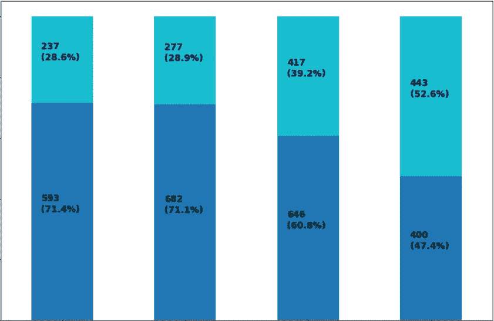

作者图片

在本文中，我们将讨论如何使用 Matplotlib 在 Python 中绘制 100%堆积条形图和柱形图。我们将使用从 **Tableau 公共样本数据集(**并转到样本数据**)下载的**网飞电影和电视节目**数据集。**该数据集由截至 2019 年网飞可用的电视节目和电影组成，由 Tableau 从 [**Kaggle**](https://www.kaggle.com/shivamb/netflix-shows) 获取，数据集的更新版本可在 Kaggle 上找到。然而，对于本文，我们将使用在 **Tableau 样本数据集**中可用的旧版本。下面是数据集的快照(为了更好地显示，进行了调换)。

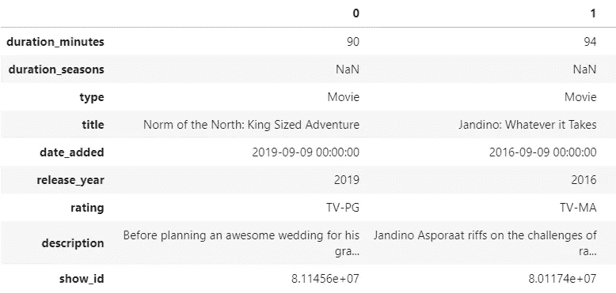

转置数据集的快照(图片由作者提供)

在本文中，我们将绘制堆积条形图和柱形图，显示 2016 年至 2019 年各 ***release_year*** 上映的*类型剧集的比例。在下面的代码中，我们将选择 2016 年到 2019 年之间带有 ***release_year*** 的记录/行，并对数据进行预处理。*

*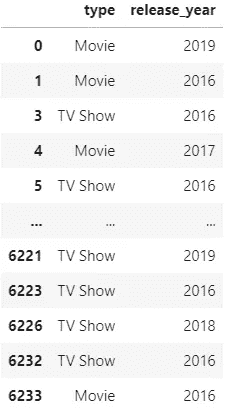*

*作者图片*

*我们将创建一个交叉表格，显示每年 ***类型*** 节目的比例。我们将在索引中包含 ***发布 _ 年份*** 和在列中显示 ***类型*** 。使用 **normalize=True** 参数给出了数据的索引比例。*

*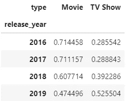*

*节目类型的年度比例(作者图片)*

*我们将创建一个与上面类似的交叉列表，但这次我们将保留计数，而不将它们转换成比例。这个交叉制表用于显示图上的数据标签，我们将在本文后面看到。*

*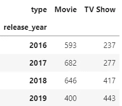*

*节目类型的年度统计(按作者分类的图片)*

# *百分比堆积柱形图*

*现在，我们将创建一个堆积柱形图，显示每年节目类型的比例。我们将使用具有比例的交叉列表(我们之前创建的)来绘制图表。*

*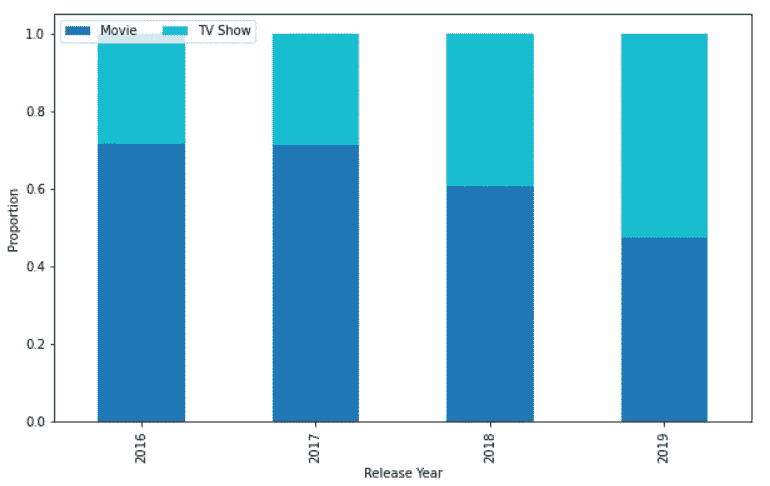*

*作者图片*

*现在我们将比例数据标签添加到我们的绘图中。我们将创建一个嵌套循环，其中第一个循环遍历具有比例的交叉列表的索引。第二个循环遍历每个索引的值。在深入研究之前，我们将查看代码及其输出。*

*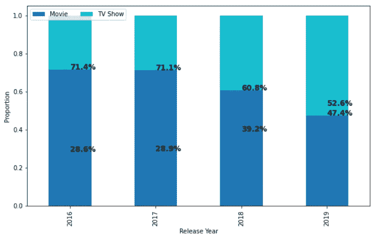*

*作者图片*

*在上面的代码中，第一个循环枚举并遍历具有比例的交叉列表的索引。我们将使用枚举的值(0，1，2，3)作为数据标签的 x 位置。让我们看看第一个循环返回了什么。*

**

*作者图片*

*在第二个循环中，我们将遍历交叉列表中每个有比例的索引值。让我们看看第二个循环返回了什么。*

*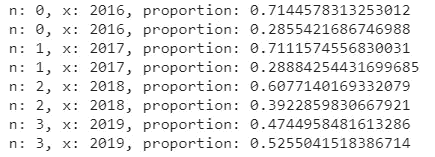*

*作者图片*

*我们可以看到内循环逐个迭代每个指标的比例。变量 ***比例*** 是我们之前创建的交叉制表中的比例。我们还将它用作数据标签的 y 轴位置(这在绘制计数时很好，但在绘制比例时不正确)。*

*在上图中，我们看到数据标签没有对齐，没有显示在正确的位置。我们可以通过从 x 位置减去一个值(在本例中为 0.17)来修正标签的 x 位置，这样标签就会向左移动。我们将在内循环中添加一个 ***y_loc*** 变量，它只不过是一个指数中比例的累积和。这充当数据标签的正确 y 位置，并将标签放置在其各自条的最顶端。我们将在下面看到代码和输出。*

*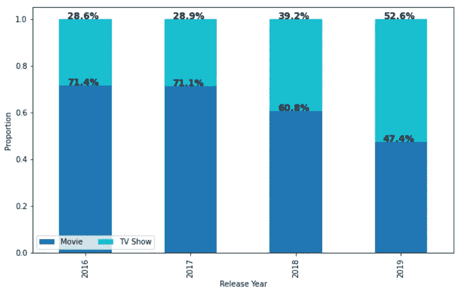*

*作者图片*

*我们可以通过在 plt.text()函数中修改数据标签的 y 位置来对齐数据标签，使它们出现在每个条形的中心，如下面的代码所示。*

*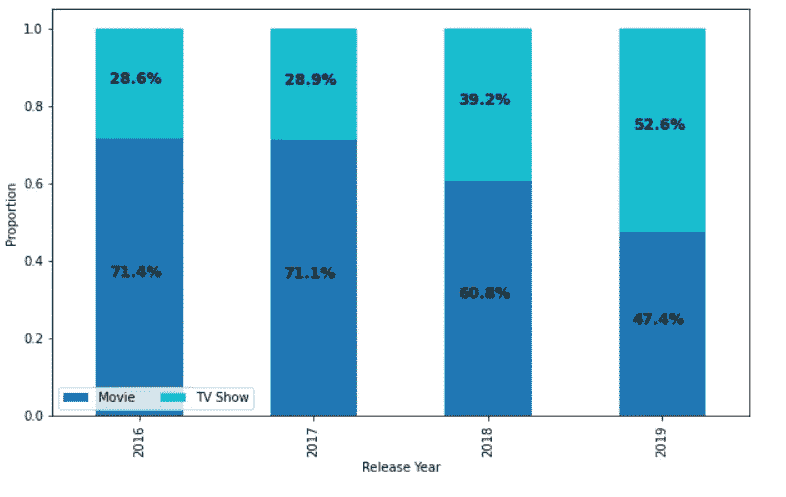*

*作者图片*

*我们还可以通过将每个条形的计数包含在内循环中并修改 plt.text()函数中的字符串参数( ***s*** )来添加它们，如下所示。*

*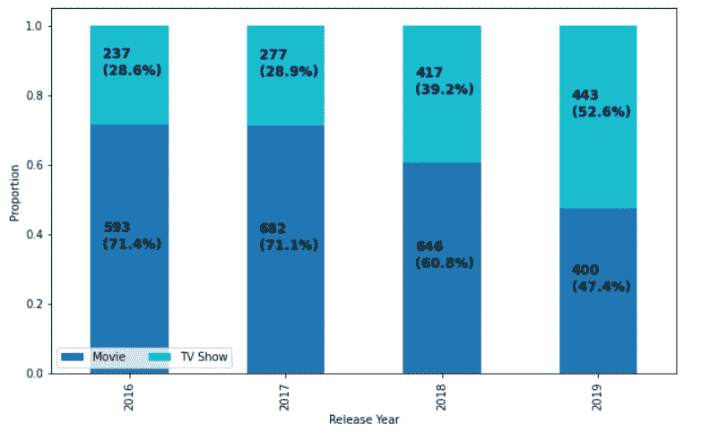*

*作者图片*

# *百分比堆积条形图*

*通过稍微修改我们之前创建的代码，我们可以创建一个 100%堆积条形图。我们必须将剧情类型从 ***【条形】*** 改为 ***【条形】*** 。然后交换 x 和 y 标签，在 plt.text()函数中交换数据标签的 x 和 y 位置。其他一切保持不变。我们来看看下面的代码。*

*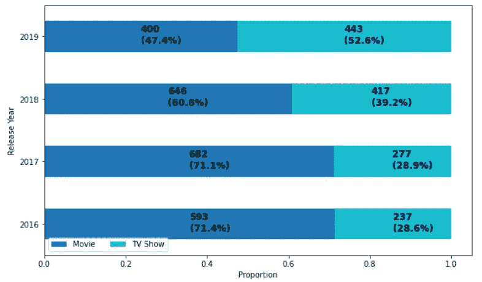*

*作者图片*

*文章到此结束。我们已经讨论了如何创建 100%堆积条形图和柱形图，添加数据标签，正确对齐和格式化这些数据标签。由于数据以比例/相对频率的形式表示，而不仅仅是计数/频率(这有时可能会产生误导)，100%堆积图提供了更可靠的数据视图，尤其是在进行组间比较时。*