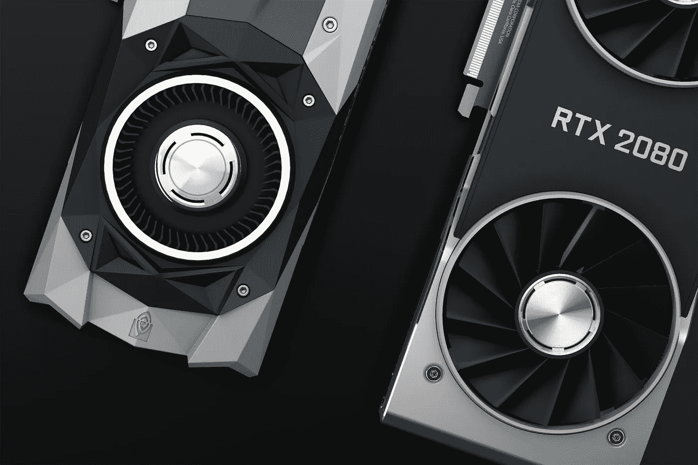
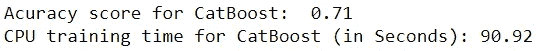
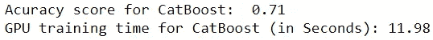
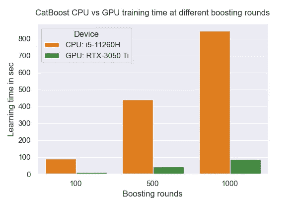

# 借助 NVIDIA GPU，CatBoost 训练速度提高 10 倍

> 原文：<https://towardsdatascience.com/10x-times-fast-catboost-training-speed-with-an-nvidia-gpu-5ffefd9b57a6?source=collection_archive---------17----------------------->

## 使用 10M 行数据集比较 CatBoost CPU 和 GPU 的训练时间



在 [Unsplash](https://unsplash.com/?utm_source=unsplash&utm_medium=referral&utm_content=creditCopyText) 上由[娜娜杜瓦](https://unsplash.com/@nanadua11?utm_source=unsplash&utm_medium=referral&utm_content=creditCopyText)拍摄的照片

***我不属于这些公司中的任何一家。这是一项独立审查。***

大家好！欢迎再来一次对比！你已经知道它是什么了，因为标题说得很清楚。

在我的“[数据科学和机器学习任务的完美笔记本电脑的 20 个必要要求](/20-necessary-requirements-of-a-perfect-laptop-for-data-science-and-machine-learning-tasks-7d0c59c3cb63)”帖子中，我提到了购买配备 NVIDIA GPU 的笔记本电脑对于数据科学和机器学习任务的重要性。你读过吗？

此外，在我的“[CatBoost 的 5 个可爱特性](/5-cute-features-of-catboost-61532c260f69)”帖子中，我已经解释了 CatBoost 库支持 CPU 和 GPU 训练。你读过吗？

现在，是时候使用你的 NVIDIA GPU(除了游戏)在一个拥有超过 1000 万训练样本(7.8 GB)的巨大数据集上训练 CatBoost 模型了！

# 关于 GPU 训练数据集的大小说几句

在 CatBoost 中，可以使用任意大小的数据集进行 CPU 和 GPU 训练。但是，如果数据集不够大，即数据集包含的训练样本少于 10，000 个或包含的要素少于 10 个，则 CPU 和 GPU 训练时间不会有太大差异，或者有时会看到 GPU 训练时间更长。

为了通过 GPU 训练获得更好的加速(例如 10 倍)，您的数据集应该有数百万个训练样本或数千个特征。数据集越大，GPU 的训练速度就越高。

为了今天的比较，我决定使用希格斯数据集[](https://archive.ics.uci.edu/ml/datasets/HIGGS)****(***来源:*** *丹尼尔·怀特森丹尼尔' @ ' uci.edu，加州大学欧文分校物理学助理教授&天文学*。见底部引文)共有 11M 个样本(10.5M 训练样本，0.5M 测试样本)，28 个特征。该数据集适用于二元分类。通过运行以下命令，可以直接从 CatBoost 包中下载它。此外，确保您已经安装了 CatBoost 包。如果没有，阅读[该](/how-do-you-use-categorical-features-directly-with-catboost-947b211c2923)以获取说明。****

```
**from catboost.datasets import higgstrain, test = higgs()**
```

****整个数据集约为 7.8 GB。因此，您需要再等几分钟，直到它下载完毕。为此，您还应该有一个活动的互联网连接。****

****下载后，两个“tsv”文件将直接保存在您的工作中。您可以随时重复使用它们，而无需再次下载。当你需要的时候，只要运行上面两行代码，数据就会被加载到工作区。****

****这些数据可以作为熊猫数据帧来访问。****

```
**# Get the first few rows
train.head()
test.head()# Get the size of the data
train.shape #(10,500,000, 29)
test.shape  #(500,000, 29)**
```

# ****测试环境****

****由于模型训练(学习)速度高度依赖于测试硬件和软件，我想提一下我将用于比较的测试环境的规格。****

*   ******笔记本电脑:**华硕 TUF F17 2021 型号****
*   ******CPU:** 英特尔酷睿 i5–11260h(6 核)****
*   ******GPU:**NVIDIA GeForce RTX 3050 Ti(4gb，2560 CUDA 核心)****
*   ******NVIDIA 驱动程序版本:** 462.42****
*   ****内存: 8GB，3200MHz****
*   ******存储类型:** NVME 固态硬盘 PCIe 3.0****
*   ******操作系统:**64 位 Windows 10 专业版****
*   ******IDE:** Anaconda 个人版(64 位，Python 3.8)****
*   ******库:** CatBoost v1.0.3 (Python)****
*   ******其他:**插上充电器，开启涡轮模式以获得更好的性能****

****只是提一下，对于 CatBoost 中的 GPU 训练，你只需要在电脑中安装 NVIDIA GPU 和一个驱动，不需要任何其他专门的软件进行 GPU 配置。****

# ****CPU 培训****

****我们将首先在 CPU 上训练我们的 CatBoost 模型。我们将测量模型训练时间，并获得测试数据的准确性分数。在 CPU 和 GPU 培训中，我们将使用以下参数设置:****

*   ******助推轮次(迭代次数):** 100****
*   ******学习率:** 0.1****
*   ******树深:** 3****

****稍后，我将使用 500 轮和 1000 轮助推，并测量 CPU 和 GPU 的训练时间。在本文末尾，你会在一个漂亮的条形图中看到所有的比较。****

****现在让我们用 100 轮助推来做比较。****

****CPU 上的 CatBoost 训练****

********

****(图片由作者提供)****

****CatBoost 在 CPU 上训练大约需要 91 秒。对于一个 10M 行的数据集来说，这是一个令人难以置信的快速度！****

# ****关于 GPU 的培训****

****现在，我们将在 GPU 上训练相同的 CatBoost 模型，并测量模型训练时间，获得测试数据的准确性分数。我们也将使用上述相同的参数设置。****

****基于 GPU 的 CatBoost 训练****

********

****(图片由作者提供)****

****哇！CatBoost 在 GPU 上训练只需要 12 秒。所以，****

> ******CatBoost GPU 训练比其 CPU 训练**快 7.6 倍，针对希格斯数据集，采用上述参数设置和软硬件配置。****

# ****不同强化轮次的训练****

****我还通过改变 boosting 轮次(迭代)的数量，在 CPU 和 GPU 上训练了不同的 CatBoost 模型。这是结果。****

********

****(图片由作者提供)****

*   ****在 **100 次迭代**时，CatBoost GPU 训练比其 CPU 训练快**7.6 倍**。****
*   ****在 **500 次迭代**时，CatBoost GPU 训练比其 CPU 训练快**9.8 倍**。****
*   ****在 **1000 次迭代**时，CatBoost GPU 训练比其 CPU 训练快**9.7 倍**。****

> ******增加 boosting 轮次时，CatBoost GPU 训练比其 CPU 训练快得多**。****

****我还创建了一个漂亮的条形图来展示上述结果。这是:****

********

****(图片由作者提供)****

****你觉得这个条形图怎么样？****

# ****摘要****

*   ****CatBoost GPU 训练适用于具有数百万个样本或数千个特征的非常大的数据集。****
*   ****在小数据集的情况下，CPU 和 GPU 的训练时间不会有太大的差别。****
*   ****当你增加助推轮数时，CatBoost GPU 训练比它的 CPU 训练快得多。****
*   ****在进行这种类型的比较之前，最好指定硬件和软件配置。****
*   ****进行比较时，最好每次使用相同的参数设置。****
*   ****模型的性能不受 CPU 或 GPU 训练的影响。在 100 次迭代中，我们两次都得到了相同的准确度分数 0.71。****

## ****阅读下一条(推荐):****

****了解 CatBoost 的特殊功能！****

****[](/5-cute-features-of-catboost-61532c260f69) [## CatBoost 的 5 个可爱特性

### 其他升压算法没有这些功能

towardsdatascience.com](/5-cute-features-of-catboost-61532c260f69) 

学习在 CatBoost 中直接使用分类特性！

[](/how-do-you-use-categorical-features-directly-with-catboost-947b211c2923) [## 如何在 CatBoost 中直接使用分类特征？

### 机器学习中的助推算法——第六部分

towardsdatascience.com](/how-do-you-use-categorical-features-directly-with-catboost-947b211c2923) 

## 阅读下一条(可选):

为数据科学和机器学习任务选择合适的笔记本电脑！

[](/20-necessary-requirements-of-a-perfect-laptop-for-data-science-and-machine-learning-tasks-7d0c59c3cb63) [## 数据科学和机器学习任务对完美笔记本电脑的 20 项必要要求

towardsdatascience.com](/20-necessary-requirements-of-a-perfect-laptop-for-data-science-and-machine-learning-tasks-7d0c59c3cb63) 

今天的帖子到此结束。我总是尽我所能以一种你能从中获得最大收益的方式来写和组织我的内容。应该有很多方法来进一步改善我的内容，你可能有很好的想法。所以，

如果您有任何反馈，请告诉我。

同时，你可以 [**注册成为会员**](https://rukshanpramoditha.medium.com/membership) 来获得我写的每一个故事，我会收到你的一部分会员费。

非常感谢你一直以来的支持！下一个故事再见。祝大家学习愉快！

特别感谢 Unsplash 上的 **Nana Dua** ，她为我提供了这篇文章的漂亮封面图片。

**希格斯数据集引用:**

[巴尔迪、p .萨多夫斯基和 d .怀特森。(2014).UCI 机器学习知识库(http://archive.ics.uci.edu/ml)。加州欧文:加州大学信息与计算机科学学院]

[巴尔迪、p .萨多夫斯基和 d .怀特森。"用深度学习在高能物理中寻找奇异粒子."《自然通讯》第 5 期(2014 年 7 月 2 日)]

[鲁克山普拉莫迪塔](https://medium.com/u/f90a3bb1d400?source=post_page-----5ffefd9b57a6--------------------------------)
**2021–11–17******