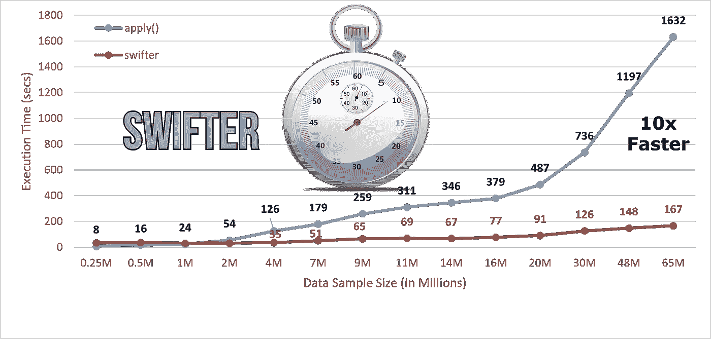
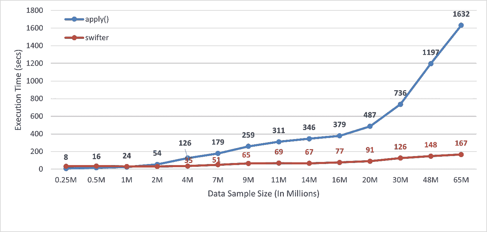

# 速度快 10 倍熊猫应用在一行代码的变化

> 原文：<https://towardsdatascience.com/10x-times-faster-pandas-apply-in-a-single-line-change-of-code-c42cb5e82f6d?source=collection_archive---------11----------------------->

## 用更快的包裹加速熊猫处理工作流程



(图片由作者提供)

Pandas 是数据科学社区中流行的 Python 包之一，因为它为数据探索和可视化提供了巨大的 API 和灵活的数据结构。当处理大规模数据集时，它失败了。

人们可以分块加载和处理大规模数据集，或者使用分布式并行计算库，如 Dask、Pandarallel、Vaex 等。可以使用 Modin 库或多处理包来并行执行 Python 函数，并加快工作流程。在我以前的文章中，我已经讨论了 Dask、Vaex、Modin、多处理库的实际实现。

有时我们不愿意使用 Dask 或 Vaex 库来代替 Pandas，或者我们不希望仅仅为了并行执行几个函数而编写所有那些无关的代码。

***我们能在不做太多代码改动的情况下并行执行 Python 函数吗？***——**肯定是**

熊猫库中的函数允许开发者传递一个函数，并将其应用于系列中的每一个值。函数的执行`**apply()**`带来了巨大的改进，因为它根据所需的条件分离数据。

对于 Pandas 系列，最好使用 apply()函数，而不是自定义调用该函数。在本文中，我们将讨论如何进一步并行执行`***apply()***`函数，并使用 **Swifter** 包优化时间约束。

# 更快:

**Swifter** 是一个开源包，可以加速函数的执行。为了方便使用，它可以与熊猫对象集成在一起。通过集成 swifter 包，用一行代码就可以并行执行 Python 中的任何函数。

## 它是如何工作的？

Swifter 通过矢量化或在后端使用 Dask 实现来并行化执行，自动选择实现`**apply()**`功能的最佳方式。对于小规模数据集，Swifter 可以选择执行 Pandas apply()函数。

## 安装:

可以使用`**pip install swifter**` 从 PyPl 安装 swifter 包，并使用`**import swifter**` **导入它。**

## 实施和使用:

我创建了一个函数，对熊猫系列执行一些随机操作。首先，我们将使用 apply()执行函数:

```
# Call random_function for col1 and col2 columns using apply()**df['new_col'] = df.apply(lambda x: random_func(x['col1'], x['col2']))**
```

现在，为了并行执行函数，我们可以将 swifter 包与 Pandas 数据框对象相集成:

```
# Call random_function for col1 and col2 columns for parallel execution**df['new_col'] = df.swifter.apply(lambda x: random_func(x['col1'], x['col2']))**
```

只要集成关键字 swifter，就可以并行执行该函数。

# 基准测试:

我比较了使用 apply()和通过将 swifter 包与 Pandas 数据帧对象集成然后调用 apply()来执行函数的基准时间数。现在让我们观察一下执行速度的提高。

> *性能记录在一个带有****RAM:64GB*******10 个 CPU 核心*** *的系统上。**

**

*(图片由作者提供)，执行 apply()的基准测试时间和速度*

*从上面的图中我们可以观察到，在使用更快的并行包后，对于**6500 万**个数据样本，工作流的速度几乎提高了**10 倍**。*

# *结论:*

*Swifter 是并行执行 Python 函数的一个很好的工具。它会自动选择最快的方式来执行您的函数，通过矢量化或在后端使用 Dask。*

*对于 6500 万条记录，我们的执行速度提高了 10 倍，随着样本量的增加，这一速度还会进一步提高。*

*它是一个方便的工具，只需修改一次代码就可以优化函数的执行。您也可以使用 Python 多处理库来并行执行您的定制，但是它只需要对代码进行几行修改。*

> ***阅读我之前的一篇关于代码优化并行化的文章:***

*   *4 个可以并行处理现有熊猫生态系统的库*
*   *[用摩丁](/speed-up-your-pandas-workflow-by-changing-a-single-line-of-code-11dfd85efcfb)加速你的熊猫工作流程*
*   *[借助多处理模块，Python 函数执行速度提高 30 倍](/25x-times-faster-python-function-execution-in-a-few-lines-of-code-4c82bdd0f64c)*
*   *[熊猫数据帧迭代速度快 400 倍](/400x-time-faster-pandas-data-frame-iteration-16fb47871a0a)*
*   *[速度快 3 倍的大熊猫带着 pypolar](/3x-times-faster-pandas-with-pypolars-7550e605805e)*
*   *[为大型数据集优化 Pandas 内存使用](/optimize-pandas-memory-usage-while-reading-large-datasets-1b047c762c9b)*
*   *[网格搜索交叉验证速度提高 20 倍](/20x-times-faster-grid-search-cross-validation-19ef01409b7c)*

# *参考资料:*

*[1]更迅捷的 GitHub 库:【https://github.com/jmcarpenter2/swifter *

> *感谢您的阅读*