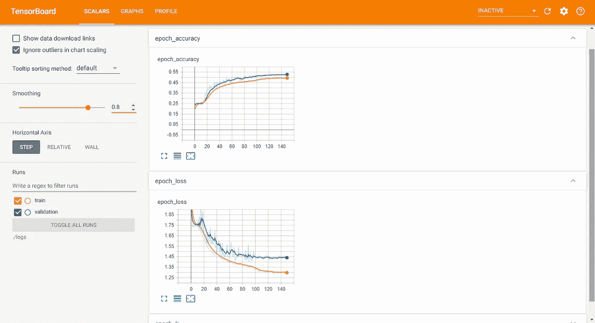

# 作为数据科学家要避免的 11 个关键错误！

> 原文：<https://towardsdatascience.com/11-crucial-mistakes-to-avoid-as-a-data-scientist-71c29aef028?source=collection_archive---------15----------------------->

## 意见

## 初学数据科学的爱好者会犯的十一个关键性错误是什么？避免这些以获得更好的结果和更高的生产率！

在 [Unsplash](https://unsplash.com?utm_source=medium&utm_medium=referral) 上 [Magnet.me](https://unsplash.com/@magnetme?utm_source=medium&utm_medium=referral) 拍照

> **“每个人都会犯错误。真正的辩护是在可预见的未来战胜它们。”**

近年来，数据科学获得了极大的普及。这种炒作将持续到未来几年。这个领域注意到越来越多的渴望者和爱好者试图拾起这个主题。

在当代，数据科学被认为是 21 世纪最性感的工作，因此，这一新兴趋势不应令人感到惊讶。几乎每个人都想赶时髦，获得数据科学方面的专业知识。

然而，获得正确的知识和经验可能比预期的更困难。数据科学领域的初学者总是会犯一些严重的错误。有时，即使是专家也容易犯错误。

没有人想在生活的任何方面犯错误或不断重复错误。尽管如此，数据科学最棒的地方在于，随着你犯下的每一个错误，你都有机会反思并从这些错误中学到更多。

有时候，分析为什么会出现这些错误变得极其重要。重新考虑和回顾客观错误，无论是实践的、理论的还是心理的，都有助于在数据科学领域取得成功。

在本文中，我们旨在寻找答案，并理解为什么会出现如此重大的错误的潜在原因。我们将关注在使用数据科学时可能发生的实践和技术错误。本文将提供总共 11 个包含技术和实践方面的陈述。

然而，值得一提的是，数据科学是一个广阔的领域，这个主题的爱好者可能会犯更多的错误。这只是 11 个这样的例子，我觉得是数据科学爱好者犯下的最常见的例子。

如果你很想知道这些潜在的错误是什么，以及你自己犯了多少错误，那么请坚持在这篇文章中获得全面深入的分析和分解，并一直坚持到最后。

我们将详细讨论为什么会发生这些错误，以及如何修复它们！那么，事不宜迟，让我们开始吧。

# 1.对数据科学毫无兴趣

让我们从一开始就解决明显的非技术方面的问题。数据科学和人工智能都需要兴趣激情来学习新思想，获取更多知识。

为了理解几个棘手的话题，你需要把注意力集中在这些概念上。掌握更难的概念需要大量的时间和精力，作为数据科学爱好者的学习曲线有时会令人毛骨悚然。

好的一面是，上面的陈述可以从两个方面来理解。要么你们都不感兴趣，你去做生活中其他更好的事情。或者第二个有趣的选项，你可以选择享受旅程，在享受乐趣的同时克服抛向你的各种障碍。

如果你真的对数据科学领域充满热情，那么即使某些复杂的主题对你来说也不会是太大的负担。最终，通过一点点的奉献和努力获得解决方案。

但是，如果您缺乏兴趣，并且出于错误的原因追求数据科学，那么您很有可能无法实现您想要达到的预期结果。

我已经在另一篇文章中讨论了成为数据科学家的十个错误理由。在继续阅读本文的其他部分之前，我强烈建议您通过下面提供的链接查看一下。

 [## 成为数据科学家的 10 个错误理由

### 分析追求数据科学成为数据科学家的 10 个错误原因

towardsdatascience.com](/10-wrong-reasons-to-become-a-data-scientist-319531bb874e) 

简单总结一下，如果你真的喜欢处理复杂的机器学习和深度学习问题，并且你真的喜欢投入时间学习数据科学的新概念和主题，请追求数据科学。

如果没有，那也完全没问题，因为世界上有那么多更好的选择供你去努力实现你的目标。对于文章中接下来的几个要点，我们将重点关注数据科学爱好者所犯错误的更多技术方面。

# 2.不当的数据集分析和无效的数据可视化:

作者图片

几乎每个任务都包含大量数据。有许多有用的数据集可用于解决简单或复杂的数据科学问题。

虽然开始构建机器学习或深度学习管道以完成任务的兴奋感可能很有趣，但在完成这项工作之前，必须经历几个步骤。

其中一个步骤是真正理解您的数据集以及该数据集的继承内容。手头任务背后的正确知识和理论直觉会让你提出一个清晰的思维过程和解决问题的思路。

为了获得对问题的直观理解，每个数据科学项目的一个基本步骤是探索性数据分析(EDA)。探索性数据分析是可视化数据集的最佳方法之一，有助于您清楚地了解数据集所代表的内容。

探索性数据分析是端到端数据科学项目的第一步，也可能是最重要的一步。

它有助于您理解数据集和可用数据的特征。它用于理解数据在正式建模或假设检验任务之外还能告诉我们什么。

不正确地分析数据集和无效的数据分析会导致数据集清理、数据准备、构建训练模型和构建机器学习模型时的其他重要步骤中的几个问题。

因此，对您来说，尝试各种可视化技术并清楚地了解数据集和有用的数据以解决复杂的问题或复杂的任务是非常重要的。

因此，将大部分时间花在可视化和理解数据上是至关重要的，这样您在后面的步骤中就不会那么紧张。

# 3.数据清理不够干脆

顾名思义，数据科学处理大量数据。

在继续进行训练和建立机器学习模型之前，要成功完成的最无聊的部分之一是确保你的数据是有效和高效的。

您不能有效地清理和准备您的数据的一个主要原因可能是由于您缺乏对数据的整体理解，并且您不知道如何实现清理过程。

另一个原因是由于执行不适当的探索性数据分析，这导致了有问题的问题，因为您不知道哪些特性和特征对于要实现的任务更重要。

因此，您更有可能保留问题不需要的无用和不必要的数据，而不是有用和必要的数据。

在研究和处理数据集以及特定任务时，您需要研究数据集的重要组成部分和特征，这将有助于遇到任务时提供令人满意的结果。

例如，如果您试图执行自然语言处理任务，如情绪分析，它提供了快乐、中立或悲伤的有效评级，您可以使用 EDA 计算出有许多不必要的单词，这些单词对完成特定任务没有帮助。

您可以删除某些停用词，如 is、an、or、a、the 等。，以及其他许多工具，用于生成更干净的数据集，并帮助您建立机器学习或深度学习模型，以更快地解决此类任务。

# 4.问题背后缺乏数学直觉

图片由[皮克斯拜](https://pixabay.com/?utm_source=link-attribution&utm_medium=referral&utm_campaign=image&utm_content=1044090)的 Gerd Altmann 提供

数学在数据科学中发挥着巨大的作用，特别是在机器学习、深度学习和计算机视觉领域。

线性代数、概率统计、微积分的概念对于理解建模的直观理解和构造机器学习模型的图形结构具有重要意义。

大部分数据科学取决于你如何利用你的数学技能来解决问题。如果您能够使用编程技能将数学知识转化为代码，那么大多数任务都可以轻松完成。

要理解机器学习算法和数据科学的其他基本概念到底是如何工作的详细结构，数学是最重要的。

我经常发现人们对数学的兴趣并不一致。虽然数学有它的粉丝和许多崇拜它的人，但有一部分观众绝对讨厌数学。

无论你处于哪个领域，数学对于数据科学都是必不可少的，不能被忽略。因此，你需要在一段时间内练习和发展这些技能。

学习和理解数学的最好方法是练习大量的问题。通过尝试自己从零开始推导理论，确保你了解每个概念。

数学是数据科学的核心概念。因此，请确保您能够通过不断提高您的数学技能和解决各种任务，将您的数学知识有效地应用到您的机器学习模型中。

# 5.程序错误

正如数学对于数据科学和机器学习一样重要，不可否认的是，编程技能对于确保模型的完美运行至关重要。

当你打算成为一名数据科学家时，你应该关注的第一步是提高你的编码技能，因为这是数据科学项目不可或缺的一部分。

在开发编程技能的同时，您至少能够避免数据科学项目中的语法错误。语法错误应该仅限于编程软件项目，并在数据科学项目中避免。

在数据科学项目中，您会在运行时遇到更多的错误或其他一些与模块相关的错误或导入错误。因此，应该掌握编程语言，以便能够更快地解决这些问题。

规划你们各自掌握数据科学的路线图，以及你们计划学习的各自的编程语言。如果你读过我的文章，你就会知道我为初学数据科学的爱好者推荐的编程语言是 Python。

我强烈推荐阅读我以前的一篇文章，这是一篇关于在 12 个月内掌握数据科学的简明指南，也就是说，在一年的时间框架内。你可以从下面的链接中找到这篇文章。

 [## 12 个月内数据科学从初学者到专业人士的 12 个步骤！

### 每月遵循一步，到第二年年底掌握数据科学！

towardsdatascience.com](/12-steps-for-beginner-to-pro-in-data-science-in-12-months-c6f6ba01f96e) 

编程技能是无限的，可以通过时间获得。专注于核心概念，不断学习和练习。有了坚持和兴趣，你将能够轻松解决你的大部分错误。

通过不断的练习，您甚至可以成为一名编码专家，轻松地从头开始编写难度较低的数据科学项目，而无需任何额外的要求。

# 6.缺乏研究和深入了解

威廉·艾文在 [Unsplash](https://unsplash.com?utm_source=medium&utm_medium=referral) 上的照片

研究是数据科学不可或缺的一部分。

在遇到复杂的任务之前，第一步必须利用互联网上的各种参考资料和资源。

在数据科学中，确保你知道自己在做什么是至关重要的。否则不久你就会迷失在黑暗的森林深处。只有深入了解你的基础知识和初学者概念，你才能跳出去，逃离这种令人厌恶的东西。

虽然上面的陈述有点吸引人，但这几行的主要目的是说明您必须对您正在处理的各种主题有清晰的概念、理论和实践理解，因为很容易迷失方向和犯错误。

如果你发现数据科学中某个特定的概念或主题很有趣，就把它捡起来，尽可能深入地思考。探索这个主题的每个组成部分，并反思各种可能性和实现。

你从持续的研究中获得的理解越深刻，你对数据科学这门学科的兴趣就会增长得越高。在这个奇妙的领域里，有数十亿难以置信的想法，你可以用来改善世界和社会。

为了让你自己和你的大脑能够处理更多有思想的想法和愿景，你必须不断研究并深入理解你在整个学习过程中遇到的各种概念。

这个过程将帮助你掌握这些话题背后的艺术，并最终取得成功！

# 7.放弃或失去激情

照片由[埃里克·沃德](https://unsplash.com/@ericjamesward?utm_source=medium&utm_medium=referral)在 [Unsplash](https://unsplash.com?utm_source=medium&utm_medium=referral) 拍摄

有时候，数据科学可能很难。

你可能会一遍又一遍地尝试，但你不会得到你想要的结果。事实上，这是一次令人沮丧的经历。

但是，数据科学最好的部分是，随着你犯下的每一个错误或大错，你都在学习一种全新的体验。在一定程度上，你能够找出多种方法。

随着时间的推移，你遇到的错误可以通过有效的研究和分析来解决。一旦你知道了为什么会发生下面的错误的准确原因，那么你成功的机会就会变得更高。

您可以轻松地完成任务，并且减少了在未来的场景中重复同样错误的机会。

然而，如果你每次都放弃，对数据科学领域失去热情，那么，不幸的是，这不是正确的方法。这只会降低你的信心和对这门学科的兴趣。

相反，把它当成解决手头任务的挑战吧！每个人都可以完成他们设定的目标和指定的指标。如果你在一个特定的问题上多次反复失败，那么就休息一下，因为这样做完全没问题。

在数据科学领域，每个人都容易犯错误。但是不要担心，因为你可以通过重温你没有正确理解的话题来克服它们，并且带着清晰的愿景和绝对的信心来解决这个复杂的问题！

# 8.过度拟合和欠拟合

作者图片

老实说，这一点可以归类到更广泛的表现领域，并被称为 ***“机器学习算法和模型实现的各种问题。”***

在构建机器或深度学习管道的过程中，可能会出现一些错误、失误和失误。这些错误可能是由于缺乏对概念的正确理解、疏忽或真正的错误造成的。

不管在构建您的机器学习项目时为什么或如何出现这些错误，我们的首要任务是修复它们并开发这些问题的有效解决方案。

这些问题中的大部分可以通过修改你的想法或手头的数据集来解决。此外，谷歌搜索和查找错误的解决方案是了解错误和针对特定问题的各种修复的好方法。

我们这一节的重点是过度拟合和欠拟合。

过度拟合是指您开发的模型在训练过程中拟合得非常好，甚至将不必要和不需要的训练点(如离群点或噪声点)拟合到您的解决方案中。这个问题导致训练模型持续改进，但是在测试期间是一个有害的问题。

欠拟合是指你的模型完全不适合，导致几个问题。在训练期间，模型无法拟合特定的数据集，导致尽管运行了多个时期，训练和测试数据集的改进几乎为零。

修复过度拟合和欠拟合期间出现的这些问题的一些最有效的方法是使用更平衡的数据集，使用丢弃或批量归一化图层，增加或减少可训练参数的数量，更好的超参数调整等等。

这个话题非常广泛。我们将在以后的文章中更详细地讨论这些概念。所以，敬请关注！

# 9.没有有效地查找或寻求额外的帮助

安妮·斯普拉特在 [Unsplash](https://unsplash.com/?utm_source=medium&utm_medium=referral) 上的照片

由于数据科学是一个非常庞大且有时非常复杂的领域，因此很容易陷入困境，找不到特定问题的解决方案。

你觉得你已经尝试了你能尝试的一切，你正处于失望的边缘，因为你已经完全没有主意了。反思和检查各种场景并不能为您的复杂问题提供富有成效的解决方案。

在这种情况下，最好的办法就是寻求帮助！数据科学界足智多谋，乐于助人。这是一个健康的社区，引导爱好者和初学者达到最佳效果。

如果你长时间陷入一个问题，不要过度劳累或给自己太大压力。确保你得到了一些关于如何解决手头特殊任务的帮助，在这些帮助下，你从你提到的各种资源中获得，构建你的解决方案。

不过，不要对考虑帮助有错误的想法。最终目标仍然必须是获得所需的知识，并在众多的可能性上教育自己。坚持学习和练习！

当你确实得到了所需的帮助时，一定要重温这个话题，理解具体的解决方案及其成功的原因，并分析你的解决方案在以前的场景中不起作用的原因。

提几个有帮助的资源，我主要推荐的是 Stack Overflow、discord channels、YouTube 视频、免费在线代码营、GitHub、走向数据科学等。都是有用的资源，可供我们所有人利用和提高我们的技能。

要了解更多关于如何成为成功的数据科学家的信息，并客观地从数据科学领域了解更多信息，我强烈建议通过下面提供的链接查看我以前的一篇关于该做什么和不该做什么的文章。

 [## 在数据科学领域取得成功的三个要做和三个不要做

### 我希望开始时就知道的黄金法则。深入了解如何转变为一个…

towardsdatascience.com](/3-dos-and-3-don-ts-to-become-successful-in-data-science-c49e2c293a56) 

# 10.而不是尝试一堆机器学习算法来完成特定的任务

好吧！所以，你最终通过建立一个工作并服务于你的问题目的的机器学习模型，成功地完成了你的任务或项目。

然而，你能接受仅仅获得一个满意的结果吗？你对下面这个问题的回答应该是严厉的 ***【不】***

尽管建立了一个机器学习或深度学习模型来帮助你获得想要的结果，但你可以对你的模型进行持续不断的测量、改进和进步。

因此，确保为部署目的创建最好的产品变得至关重要。老实说，没有好的方法来找出哪个是最有效的。所以，尽情享受，探索你在有限的时间内可以建立的各种想法和模型。

为了讨论这个主题的一个例子，让我们考虑我做的一个关于人类情感和手势识别的项目。你可以从下面提供的链接中找到关于这个项目的必要和有用的资源。

 [## 使用深度学习的人类情感和手势检测器:第 1 部分

### 了解如何从零开始构建具有深度学习的人类情感和手势检测器。

towardsdatascience.com](/human-emotion-and-gesture-detector-using-deep-learning-part-1-d0023008d0eb)  [## 使用深度学习的人类情感和手势检测器:第 2 部分

### 深入探究人类情感和手势识别

towardsdatascience.com](/human-emotion-and-gesture-detector-using-deep-learning-part-2-471724f7a023) 

在很多情况下，我可能已经停止了项目的各种实现，因为我已经收到了这个特定项目的预期结果。

然而，这样做并没有帮助我了解更多，也没有帮助我理解有更好的方法和创新的模式来创造更出色的结果。

我试了大约 15-20 种型号，直到找到最适合我的任务的型号。但是你猜怎么着？我可以尝试更多的方法，看看是否有更好的方法适用于期望的任务和数据集。

我强烈建议你们所有人探索各种方法和技术，来改进你们的模型。不要因为你得到了一个好的解决方案就停止尝试，因为你可以找到一个更好的解决方案！

# 11.不保持更新

听说过 ***“时不我待”这句话吗*** ？

嗯，数据科学和技术也差不多。它们是当代发展最快、增长最快的领域，并将在未来产生巨大影响。

当今世界数据科学的热门方面在未来可能不尽如人意。在数据科学领域有一个连续的进化谱。

今天在数据科学中流行的技术或想法可能在未来一年或未来几个月内不再流行。一个简单的例子就是机器学习中架构、结构和模型的不断发展。

如果你渴望走在时代的前沿，那么就要确保每个月都能看到最新的各种研究论文和计划。数据科学有一个陡峭和持续的学习路径。

数据科学的方法、思想、哲学、理论、概念和假设会定期改变。事实上，这就是我们所热爱的主题的真正美。它在不断更新，创造一个更美好的世界。

我强烈建议所有数据科学爱好者和有志之士提出新想法，并继续关注这个我们都热爱和喜欢的壮观领域的所有新兴趋势。

为了保持更新和学习模式，建议你不断阅读各种文章、研究论文和书籍。还有大量的 YouTube 视频，让你不断了解所有最新的方案和技术。

每当你阅读一篇研究论文或发现一种新的算法时，试着从头开始自己实现那些项目的内容。这个习惯会让你从概念上、直观上理解题目。这也有助于你更长久地记住它们。

# 结论:

马文·迈耶在 [Unsplash](https://unsplash.com?utm_source=medium&utm_medium=referral) 上的照片

> **征服和克服你的错误会把你带到成功的顶峰。但是，记住要继续努力，因为天空不是极限！**

数据科学是一个巨大而广阔的领域。有如此多的想法，还有如此多的想法有待发现。在如此广泛的主题、概念和话题中，错误可能有意或无意地发生。

作为一名数据科学的追求者或爱好者，犯错误、失误或失误是完全没有问题的。你犯的错误越多，你学到的就越多。你可以通过我纠正和修正你的错误来巩固你自己。

在本文中，我们讨论了数据科学爱好者犯下的 11 个常见错误，以及如何通过对该主题的一些概念、理论和实践理解来纠正这些错误。

让我们简要地总结一下我们从阅读这篇文章中获得的众多思想意识。我们已经讨论了大多数常见错误的技术和非技术细节，让我们简要了解一下每一个错误。

数据科学初学者犯的第一个常见错误是在对该领域没有任何实际兴趣的情况下追求该主题。确保你培养了一个兴趣或者选择了一个你喜欢的不同的选择。

数据清理、数据可视化和数据分析(尤其是 EDA)在项目的开发阶段起着关键作用。确保它们的正确使用，以准备将在项目的其余部分使用的完美、干净和平衡的数据集。

数学和编程技能对于开发中级和高级项目以及解决任何复杂的问题或复杂的任务都是必不可少的。继续致力于改善这些方面。

研究各种概念，深入理解项目的所有基本主题。无论如何都不要放弃，努力达到最好的结果。

如果你陷入了一个棘手的问题，你无法解决这个问题，那么从互联网或专家那里获得一些帮助对你最有利。其他问题，如过度拟合或欠拟合，可以很容易地克服适当的研究和实施的想法。

最后，不断尝试各种创新的想法，不要在建立一个成功的解决方案后停下来。了解数据科学领域不断出现的各种研究论文和创新。

如果你对这篇文章中提到的各点有任何疑问，请在下面的评论中告诉我。我会尽快给你回复。

看看我的其他一些文章，你可能会喜欢读！

 [## 当今时代的 8 项革命性人工智能技术！

### 探索和分析即将或已经对世界产生巨大影响的 8 项人工智能技术！

towardsdatascience.com](/8-revolutionary-artificial-intelligence-technologies-of-the-modern-era-f8f22a4127d0)  [## 掌握 Python 中的字典和集合！

### 通过代码和示例理解 Python 中的字典和集合的概念

towardsdatascience.com](/mastering-dictionaries-and-sets-in-python-6e30b0e2011f)  [## 从数据科学中赚取收入的 5 种最佳方式！

### 探索作为数据科学爱好者或数据科学家的五种最佳创收方式！

towardsdatascience.com](/5-best-ways-to-earn-income-from-data-science-a9c8fed1eee6)  [## 数据科学的 10 大最佳工具和技术！

### 每个数据科学家都必须考虑探索的 10 种最佳工具和技术，以获得更好的曝光率和更高的…

towardsdatascience.com](/10-best-tools-and-technologies-for-data-science-e335fb99c2f2)  [## 2021 年及以后的 15 个令人敬畏的 Python 和数据科学项目！

### 15 个很酷的 Python 和数据科学项目，提供有用的链接和资源，为 2021 年构建您的投资组合…

towardsdatascience.com](/15-awesome-python-and-data-science-projects-for-2021-and-beyond-64acf7930c20)  [## 学数据科学需要付费吗？

### 钱是学习数据科学的必备条件吗？分析最好的免费资源和有用的链接，以获得…

towardsdatascience.com](/do-you-need-to-pay-to-learn-data-science-e71f75493e5a) 

谢谢你们坚持到最后。我希望你们喜欢阅读这篇文章。我希望你们都有美好的一天！