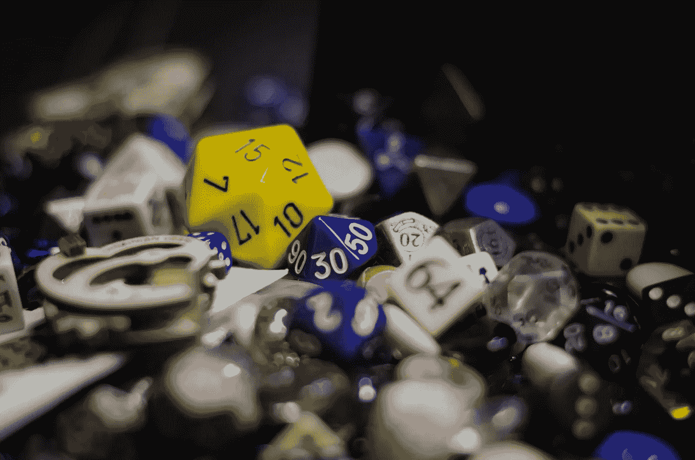
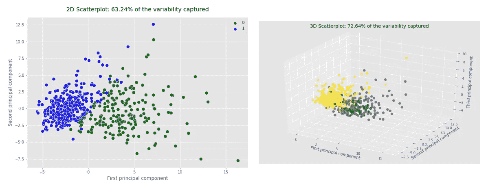
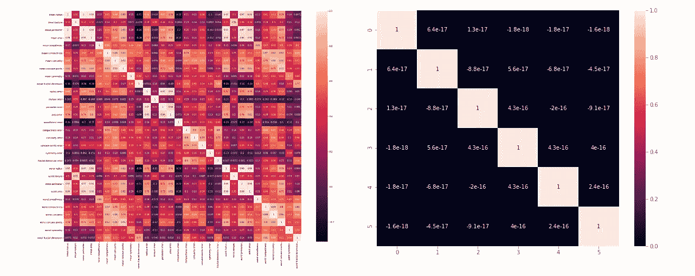
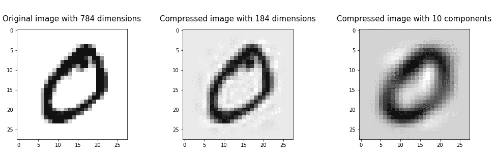
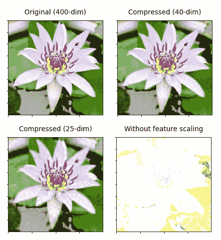
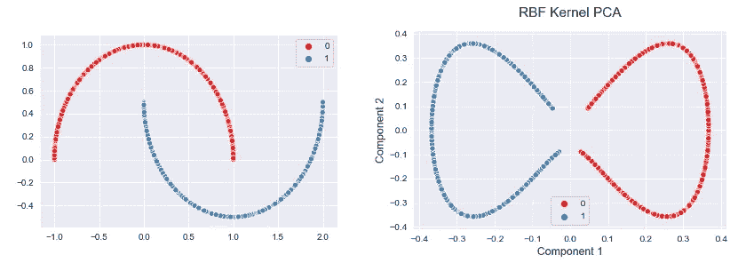
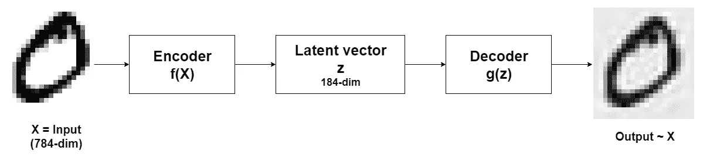

# 降维的 11 种不同用途

> 原文：<https://towardsdatascience.com/11-different-uses-of-dimensionality-reduction-4325d62b4fa6?source=collection_archive---------12----------------------->

## 整个 ML 都是降维及其应用。让我们看看他们的行动吧！

由[卡尼·贝内迪克托娃](https://unsplash.com/@nika_benedictova?utm_source=unsplash&utm_medium=referral&utm_content=creditCopyText)在 [Unsplash](https://unsplash.com/?utm_source=unsplash&utm_medium=referral&utm_content=creditCopyText) 拍摄的照片

“D**维度还原”**是谷歌搜索引擎中的热门关键词。这是因为整个机器学习充满了降维及其应用。是时候用实例来看看他们的行动了！

降维是一种无监督的机器学习技术，可以应用于您的输入数据，而无需标签列。用专业术语来说，你的数据中变量(也称为特征或属性)的数量称为数据的*。如果你的数据有 3 个变量，你的数据的维数是 3。这意味着数据中的任何一点都可以在三维空间中绘制出来。*

*真实世界的数据有许多变量，这意味着它的维数非常高。通常，这种数据被称为 n 维数据。“n”等于变量的数量，它可以是 10、100、1000 或甚至超过 10，000。*

*随着数据集中变量数量的增加，我们需要减少变量数量，以获得本文即将讨论的优势。这是降维发生的地方。但是请记住，当您减少数据集中的变量数量时，您将丢失原始数据中的某些百分比的可变性。*

*因此，降维的有效定义是:*

> *降维是减少高维数据中变量的数量，同时尽可能保留原始数据中的可变性的过程。它或者找到少于原始变量数的一组新变量，或者只保留少于原始变量数的最重要的变量。我们应该在要保留的变量数量和原始数据集中的可变性损失之间进行权衡。*

*降维的技术有很多。我不打算详细讨论它们，因为我在以前的帖子中已经讨论了 11 种这样的技术。如今，更多地强调降维的不同用途或优势。*

# *降维的用途*

*降维的最终用途是获得更少的变量。这间接影响了降维的其他用途。*

*让我们用实例逐一讨论。*

## *高维数据的可视化可以通过降维来实现*

*在 EDA(探索性数据分析)中，数据可视化扮演着重要的角色。但是我们经常很难可视化高维数据。这是因为我们只熟悉 2D 图或三维图，它们分别只适用于二维或三维数据。我们无法想象更高维度的情节，如 4D 或 5D 情节！*

*我们可以应用降维方法(通常是 PCA)将高维数据转换成可以在 2D 或 3D 图中绘制的 2 维或 3 维数据。*

*作为一个例子，考虑有 30 个变量的*乳腺癌*数据集。所以，数据的维数是 30。在 EDA 中，您需要绘制这些数据，以找到一些重要的模式。你怎么能这样做？显然，您不能在 30D 绘图中绘制数据！您需要将原始数据转换为二维或三维数据，然后制作 2D 和三维图，如下图所示。*

**

*(图片由作者提供)*

*当您将原始数据转换为二维数据时，仅捕获了原始数据中 63.24%的可变性。当您将原始数据转换为三维数据时，仅捕获了原始数据中 72.64%的可变性。但是，您能够绘制出近似捕捉原始数据的图，并在数据中找到一些模式。*

*这个应用的详细指南可以在[这里](/principal-component-analysis-pca-with-scikit-learn-1e84a0c731b0)(我写的)。*

## *可以应用维数减少来减轻过度拟合的问题*

*过度拟合是数据科学家在建模时面临的最糟糕的问题。降维是可用于减轻机器学习模型中过拟合的技术之一。*

*现在，你可能会想它是如何工作的。降维会找到较少数量的变量，或者从模型中删除最不重要的变量。这将降低模型的复杂性，并消除数据中的一些噪声。这样，维数减少有助于减轻过度拟合。*

*这个应用的详细指南可以在[这里](/how-to-mitigate-overfitting-with-dimensionality-reduction-555b755b3d66)找到(我写的)。*

## *降维会自动消除多重共线性*

*并非数据中的所有变量都是独立的。一些输入变量可能与数据集中的其他输入变量相关。这被称为 ***多重共线性*** ，它会对回归和分类模型的性能产生负面影响。*

*当我们应用降维时，它利用了变量之间存在的多重共线性。例如，PCA 将高度相关的变量组合成一组新的不相关变量。主成分分析可以自动消除数据中的多重共线性！*

*现在，看下面两张热图。*

**

*(图片由作者提供)*

*左边的热图显示了有 30 个变量的*乳腺癌*数据集中变量的相关系数。您可以看到数据集中有高度相关的变量。在对数据集应用 PCA 后，我们将变量的数量减少到 6 个，同时保持原始数据集中 88.76%的可变性。这 6 个变量的相关系数由右图的热图显示。你可以看到那些变量现在是*而不是*相关。因此，这意味着我们已经通过应用 PCA(一种降维技术)成功地消除了多重共线性。*

*这个应用的详细指南可以在[这里](/how-do-you-apply-pca-to-logistic-regression-to-remove-multicollinearity-10b7f8e89f9b)找到(我写的)。*

## *降维用于因子分析*

*因子分析是一种降维技术。这使用主成分方法，除了一个显著的例外，几乎与 PCA 相同。因子分析发现一些重要的变量，称为*因子*，它们不在原始数据集中。这些因素是通过分析主成分得出的。这也需要领域知识。*

*这个应用的详细指南可以在[这里](/factor-analysis-on-women-track-records-data-with-r-and-python-6731a73cd2e0)找到(我写的)。*

## *降维可以用于图像压缩*

*降维减少了数据集的大小，同时尽可能保持原始数据的可变性。一种类似的方法可以用于图像压缩。因此，在图像压缩中，我们减少图像的像素数量，同时尽可能保持原始图像的质量。*

*这里，我们将图像中的总像素视为该图像的维数。现在，看下面三张图片。*

**

*(图片由作者提供)*

*左图是 784 维的原图。另外两个图像是压缩图像。中间的图像有 184 个维度。维数从 784 减少到 184，同时保持 96%的图像质量。右图只有 10 个维度。该图像中仅捕获了 40%的数据。*

*这个应用的详细指南可以在[这里](/image-compression-using-principal-component-analysis-pca-253f26740a9f)找到(我写的)。*

*上面的例子是为了压缩灰度图像。我们还可以使用降维来压缩 RGB 彩色图像。这里有一个例子。*

**

*花意象比较(作者图片)*

*   ***左上:**400 维的原始花卉图像。*
*   ***右上:**只有 40 维的压缩花图像。维数减少了 10 倍，同时保持了原始图像 91.24%的质量！我们仍然可以识别图像中的重要部分。*
*   ***左下:**只有 25 维的压缩花图像。维数减少了 16 倍，同时保持了原始图像 83.41%的质量！我们仍然可以识别图像中的重要部分。*
*   ***右下:**不做特征缩放应用 PCA 后的花朵图像输出。转换后的数据不能代表原始数据。我在这里向您展示了在应用 PCA 之前进行特征缩放的重要性。*

*这个应用的详细指南可以在[这里](/rgb-color-image-compression-using-principal-component-analysis-fce3f48dfdd0)找到(我写的)。*

## *降维减少了模型的训练时间*

*高维空间中的数据点更有可能彼此远离。这是因为高维空间中有大量的可用空间。训练时，算法会对这些数据点进行计算。当维数很高，数据点之间距离很远时，计算会极其缓慢。因此，机器学习和深度学习算法将无法在高维数据上高效地训练模型。因此，在我们将数据输入算法之前，应该对数据应用降维技术。*

## *在训练模型时，降维节省了大量的计算资源*

*这很简单！由于降维通过简化计算减少了模型的训练时间，因此训练这些模型所需的计算资源将非常少。因此，降维在训练模型时自动节省了大量的计算资源。*

## *降维降低了模型的复杂性*

*只要简单模型足够强大，能够做出准确的预测，简单模型就比复杂模型好。它们也很容易解读。通过只保留数据中最重要的变量或减少变量的数量，降维降低了模型的复杂性。*

## *降维提高了模型的准确性*

*数据的噪声去除可以发生在降维中，因为它去除了相关变量和最不重要的变量。这将进一步提高模型的准确性。*

## *降维将非线性数据转换成线性可分的形式*

*大多数真实世界的数据不是线性可分的。在这种情况下，线性超平面(2d 空间中的直线或 3d 或更高维空间中的适当平面)无法对非线性数据进行分类。为了使线性超平面能够对非线性数据进行分类，我们应该将非线性数据转换成线性形式。*

*一种称为**核 PCA** (也称为正常 PCA 的非线性形式)的降维方法可用于将非线性数据转换为线性可分离形式。内核 PCA 分两步运行。*

*   *输入数据被馈送到算法中的核函数(通常是“rbf”核),并被投影到一个新的高维空间中，在该空间中，非线性数据变得可线性分离。*
*   *然后，将普通 PCA 应用于从上一步骤投影的较高维数据，以将数据恢复到原始的较低维空间中。*

*现在，看下面的情节。*

**

*(图片由作者提供)*

*原始数据绘制在左侧的图像中。你可以清楚地看到，原始数据是非线性的，不能用一个线性超平面(本例中是直线)来分隔。应用核主成分分析后的数据绘制在右图中。此时，转换后的数据是线性可分的。*

## *降维可用于压缩神经网络结构*

*这可以通过使用一种称为 ***自动编码器*** 的特殊神经网络架构来实现，该架构将高维输入数据压缩到较低的维度。换句话说，它找到输入数据的压缩表示。*

*自动编码器有两个功能，也称为运算符:*

*   ***编码器:**这是一个非线性函数，它将输入数据转换成一个叫做*潜在向量*的低维形式。*
*   ***解码器:**这也是一个非线性函数，以潜向量为输入，构造另一个与原始输入非常相似的输出。目标是最小化*重建误差*。*

*现在，请看下图中的自动编码器。*

**

*(图片由作者提供)*

*编码器将 X (784-dim)作为输入，并将其转换为较低维的潜在向量(184-dim ),解码器将其作为输入。解码器的输出与原始输入 X 非常相似，但并不完全相同。输入和输出之间的不相似性由应该尽可能保持最小的*重构误差*或*损失函数*来测量。*

# *摘要*

*整个 ML 充满了具有极其有用的优点的降维。有许多降维技术。你在这篇文章中已经听到了一些。PCA 是最常用的，它是一种线性方法。因子分析是 PCA 的一个特例。核 PCA 是一种可以应用于非线性数据的非线性方法。自动编码器的工作方式类似于 PCA，但应该用于非常大的数据集和神经网络应用程序。*

*降维方法的详细解释可以在[这里](/11-dimensionality-reduction-techniques-you-should-know-in-2021-dcb9500d388b)(我写的)。*

*今天的帖子到此结束。*

> *你以为整个 ML 都是降维及其应用？*

***如果你有任何反馈请告诉我**。*

**我希望你喜欢阅读这篇文章。如果你愿意支持我成为一名作家，请考虑* [***注册会员***](https://rukshanpramoditha.medium.com/membership) *以获得无限制的媒体访问权限。它只需要每月 5 美元，我会收到你的会员费的一部分。**

*<https://rukshanpramoditha.medium.com/membership>  

非常感谢你一直以来的支持！下一个故事再见。祝大家学习愉快！* 

## *接下来阅读(推荐)——我写的！*

*寻找不同的方法来减少数据集的大小，同时尽可能地保持变化。*

*</11-dimensionality-reduction-techniques-you-should-know-in-2021-dcb9500d388b>  

了解主成分分析(PCA)的幕后工作原理。

<https://rukshanpramoditha.medium.com/eigendecomposition-of-a-covariance-matrix-with-numpy-c953334c965d>  

一站式解决您关于 PCA 的大部分问题。

<https://rukshanpramoditha.medium.com/principal-component-analysis-18-questions-answered-4abd72041ccd>  

特别感谢 Unsplash 上的[卡尼·贝内迪克托娃](https://unsplash.com/@nika_benedictova?utm_source=unsplash&utm_medium=referral&utm_content=creditCopyText) ，为我提供了这篇文章的精美封面图片。

[鲁克山·普拉莫迪塔](https://medium.com/u/f90a3bb1d400?source=post_page-----4325d62b4fa6--------------------------------)
**2021–12–08** (最后编辑时间:2022–04–26)*