# 2021 年你应该知道的 11 种降维技术

> 原文：<https://towardsdatascience.com/11-dimensionality-reduction-techniques-you-should-know-in-2021-dcb9500d388b?source=collection_archive---------0----------------------->

## 减少数据集的大小，同时尽可能保留变化


由[卡尼·贝内迪克托娃](https://unsplash.com/@nika_benedictova?utm_source=unsplash&utm_medium=referral&utm_content=creditCopyText)在 [Unsplash](https://unsplash.com/?utm_source=unsplash&utm_medium=referral&utm_content=creditCopyText) 拍摄的照片

在统计学和机器学习中，数据集的属性、特征或输入变量的数量被称为其**维度**。例如，让我们来看一个非常简单的数据集，它包含两个属性，分别叫做*高度*和*重量*。这是一个二维数据集，该数据集的任何观察值都可以绘制成 2D 图。

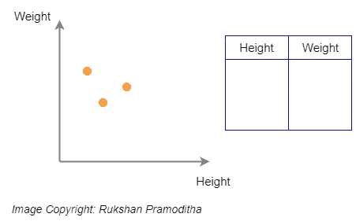

(图片由作者提供)

如果我们将另一个称为*年龄*的维度添加到同一个数据集，它就成为一个三维数据集，任何观察都位于三维空间中。

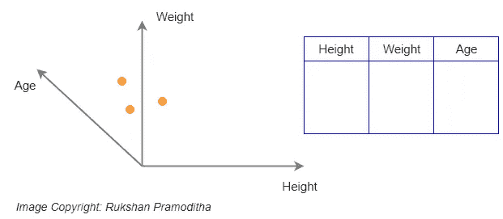

(图片由作者提供)

同样，真实世界的数据集也有许多属性。这些数据集的观测值位于难以想象的高维空间中。以下是数据科学家、统计学家和机器学习工程师对与维度相关的数据集的一般几何解释。

> 在包含行和列的表格数据集中，列表示 n 维特征空间的维度，行是位于该空间中的数据点。

***降维*** 简单来说就是减少数据集中的属性数量，同时尽可能保留原始数据集中的变异的过程。这是一个数据预处理步骤，意味着我们在训练模型之前执行降维。在本文中，我们将讨论 11 种这样的降维技术，并使用 Python 和 Scikit-learn 库在真实世界的数据集上实现它们。

# 降维的重要性

当我们降低数据集的维度时，我们会丢失原始数据中一定百分比(通常为 1%-15%，具体取决于我们保留的组件或特征的数量)的可变性。但是，不要担心丢失原始数据中那么多的可变性，因为维度减少将带来以下优势。

*   **数据中更低的维度数量意味着更少的训练时间和更少的计算资源，并提高了机器学习算法的整体性能** —涉及许多特征的机器学习问题使得训练极其缓慢。高维空间中的大多数数据点都非常接近该空间的边界。这是因为在高维空间中有足够的空间。在高维数据集中，大多数数据点可能彼此相距很远。因此，这些算法不能有效地在高维数据上训练。在机器学习中，这种问题被称为 ***维数灾难***——这只是一个你不需要担心的技术术语！
*   **降维避免了** ***过拟合*** 的问题——当数据中有很多特征时，模型变得更加复杂，往往会对训练数据过拟合。要了解这一点，请阅读我的文章*[*如何通过降维来减轻过度拟合*](/how-to-mitigate-overfitting-with-dimensionality-reduction-555b755b3d66)*。**
*   ****降维对于*数据可视化*** 非常有用——当我们将高维数据降维为两个或三个分量时，数据可以很容易地绘制在 2D 或 3D 图上。要看到这一点，请阅读我的*[*主成分分析(PCA)与 Scikit-learn*](/principal-component-analysis-pca-with-scikit-learn-1e84a0c731b0)*文章。****
*   *****降维处理*多重共线性*** —在回归中，当一个自变量与一个或多个其他自变量高度相关时，就会出现多重共线性。降维利用了这一点，将那些高度相关的变量组合成一组不相关的变量。这将解决多重共线性问题。要看到这一点，请阅读我的*[*如何将 PCA 应用于逻辑回归以消除多重共线性？*](/how-do-you-apply-pca-to-logistic-regression-to-remove-multicollinearity-10b7f8e89f9b)*文章。*****
*   *****降维对于*因子分析*** 非常有用——这是一种发现潜在变量的有用方法，这些变量不是在单个变量中直接测量的，而是从数据集中的其他变量中推断出来的。这些潜在变量被称为 ***因素*** 。要了解这一点，请阅读我的*[*关于女性跟踪记录数据的因素分析与 R 和 Python*](/factor-analysis-on-women-track-records-data-with-r-and-python-6731a73cd2e0)*文章。*****
*   *****降维去除数据中的噪声**——通过只保留最重要的特征并去除冗余特征，降维去除了数据中的噪声。这将提高模型精度。***
*   *****降维可用于图像压缩** — *图像压缩*是一种在尽可能保持图像质量的同时最小化图像字节大小的技术。构成图像的像素可以被认为是图像数据的维度(列/变量)。我们执行 PCA 以保持最佳数量的组件，从而平衡图像数据和图像质量中解释的可变性。要看到这一点，请阅读我的*[*使用主成分分析(PCA)进行图像压缩*](/image-compression-using-principal-component-analysis-pca-253f26740a9f)*文章。*****
*   *****降维可用于将非线性数据转换成线性可分的形式** — 阅读本文的*内核 PCA* 部分，了解实际操作！***

# **降维方法**

**有几种降维方法可用于不同类型的数据，以满足不同的需求。下图总结了这些降维方法。**

**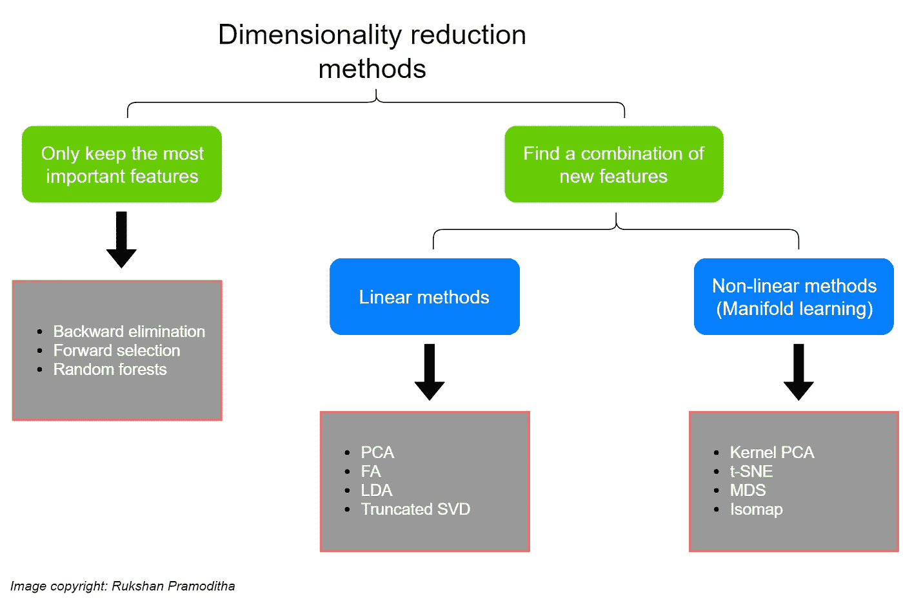**

**(图片由作者提供)**

**主要有两种类型的降维方法。这两种方法都减少了维数，但方式不同。区分这两种方法非常重要。一种方法仅保留数据集中最重要的特征，并移除冗余特征。没有应用于特征集的变换。向后淘汰、向前选择和随机森林就是这种方法的例子。另一种方法是寻找新特征的组合。对该组特征应用适当的变换。新的要素集包含不同的值，而不是原始值。这种方法可以进一步分为线性方法和非线性方法。非线性方法是众所周知的流形学习。主成分分析(PCA)、因子分析(FA)、线性判别分析(LDA)和截断奇异值分解(SVD)是线性降维方法的例子。核主成分分析、t 分布随机邻居嵌入(t-SNE)、多维标度(MDS)和等距映射(Isomap)是非线性降维方法的例子。**

**让我们详细讨论每种方法。请注意，对于 PCA 和 FA，我包含了我以前工作内容的链接，这些内容最好地描述了这两种方法的理论和实现。对于所有其他方法，我将在本文中包括理论、Python 代码和可视化。**

# **线性方法**

**线性方法包括 ***线性*** 将原始数据投影到低维空间。我们将在线性方法下讨论 PCA、FA、LDA 和截断 SVD。这些方法可以应用于线性数据，但不适用于非线性数据。**

## **主成分分析**

**PCA 是我最喜欢的机器学习算法之一。PCA 是一种线性降维技术(算法)，它将一组相关变量(p)转换成较小的 k (k**

***主成分* ，同时尽可能多地保留原始数据集中的变化。在机器学习(ML)的背景下，PCA 是一种用于降维的无监督机器学习算法。**

**由于这是我最喜欢的算法之一，我以前为 PCA 写过几个内容。如果你有兴趣了解 PCA 背后的理论及其 Scikit-learn 实现，你可以阅读我写的以下内容。**

*   **[使用 Scikit-learn 进行主成分分析(PCA)](/principal-component-analysis-pca-with-scikit-learn-1e84a0c731b0)**
*   **[PCA 背后的统计和数学概念](https://medium.com/data-science-365/statistical-and-mathematical-concepts-behind-pca-a2cb25940cd4)**
*   **[用 R 和 Python 对乳腺癌数据进行主成分分析](/principal-component-analysis-for-breast-cancer-data-with-r-and-python-b312d28e911f)**
*   **[使用主成分分析的图像压缩](/image-compression-using-principal-component-analysis-pca-253f26740a9f)**

## **因素分析**

****因子分析**和**主成分分析**都是降维技术。因子分析的主要目的不仅仅是降低数据的维度。因子分析是发现潜在变量的有用方法，这些潜在变量不是直接在单个变量中测量的，而是从数据集中的其他变量中推断出来的。这些潜在变量被称为 ***因素*** 。**

**如果你有兴趣了解 FA 背后的理论和它的 Scikit-learn 实现，你可以阅读我写的以下内容。**

*   **[用 R 和 Python 对“女子跟踪记录”数据进行因子分析](/factor-analysis-on-women-track-records-data-with-r-and-python-6731a73cd2e0)**

## **线性判别分析(LDA)**

**LDA 通常用于多类分类。它也可以用作降维技术。LDA 最好按类别分离或区分(因此得名 LDA)训练实例。LDA 和 PCA 之间的主要区别在于，LDA 查找优化类可分性的输入特征的线性组合，而 PCA 试图在数据集中查找一组方差最大的不相关分量。两者之间的另一个关键区别是，PCA 是一种非监督算法，而 LDA 是一种监督算法，它将类别标签考虑在内。**

**LDA 有一些局限性。要应用 LDA，数据应该是正态分布的。数据集还应该包含已知的类标签。LDA 可以找到的最大组件数是类数减 1。如果数据集中只有 3 个类别标签，LDA 在降维中只能找到 2(3–1)个分量。不需要执行特征缩放来应用 LDA。另一方面，PCA 需要缩放的数据。但是，PCA 不需要类别标签。PCA 可以找到的最大分量数是原始数据集中输入要素的数量。**

**不应将用于降维的 LDA 与用于多类分类的 LDA 相混淆。这两种情况都可以使用 Scikit-learn**LinearDiscriminantAnalysis()**函数来实现。在使用 **fit(X，y)** 拟合模型之后，我们使用 **predict(X)** 方法对 LDA 对象进行多类分类。这将为原始数据集中的类分配新的实例。我们可以使用 LDA 对象的 **transform(X)** 方法进行降维。这将找到优化类可分性的新特征的线性组合。**

**以下 Python 代码描述了对 Iris 数据集实施 LDA 和 PCA 技术，并展示了两者之间的差异。原始虹膜数据集有四个特征。LDA 和 PCA 将特征数量减少为两个，并实现 2D 可视化。**

**等到加载 python 代码！**

**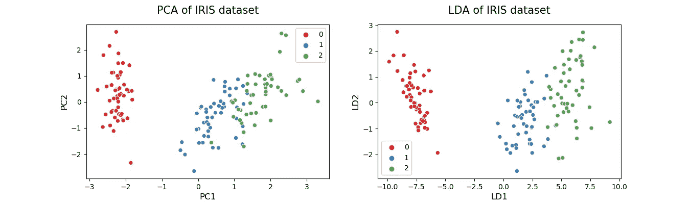**

**(图片由作者提供)**

## **截断奇异值分解**

**该方法通过截断奇异值分解(SVD)进行线性降维。它适用于许多行值为零的稀疏数据。相比之下，PCA 在处理密集数据时效果很好。截断 SVD 也可以用于密集数据。截断 SVD 和 PCA 之间的另一个关键区别是，SVD 的因子分解是在数据矩阵上进行的，而 PCA 的因子分解是在协方差矩阵上进行的。**

**截断 SVD 的 Scikit-learn 实现要容易得多。这可以通过使用 **TruncatedSVD()** 函数来完成。以下 Python 代码描述了对 Iris 数据集实施截断 SVD 和 PCA 技术。**

**等到加载 python 代码！**

**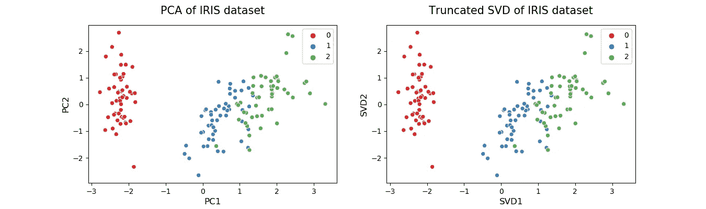**

**(图片由作者提供)**

# **非线性方法(流形学习)**

**如果我们处理的是现实应用中经常使用的非线性数据，那么到目前为止讨论的线性方法在降维方面表现不佳。在本节中，我们将讨论四种可用于非线性数据的非线性降维方法。**

## **核主成分分析**

**核 PCA 是一种使用 ***核*** 的非线性降维技术。它也可以被认为是正常 PCA 的非线性形式。核主成分分析可以很好地处理非线性数据集，而正常的主成分分析不能有效地使用。**

**内核 PCA 背后的直觉很有趣。数据首先通过一个核函数运行，并将它们临时投影到一个新的高维特征空间中，在该空间中，类变得线性可分(可以通过画一条直线来划分类)。然后，该算法使用正常的 PCA 将数据投影回低维空间。通过这种方式，核 PCA 将非线性数据转换成可以与线性分类器一起使用的低维数据空间。**

**在内核 PCA 中，我们需要指定 3 个重要的超参数——我们想要保留的组件数量、内核类型和内核系数(也称为 *gamma* )。对于核的类型，我们可以用 ***【线性】【poly】【RBF】【sigmoid】【余弦】*** 。被称为**径向基函数核**的 ***rbf*** ***核*** 是最流行的一种。**

**现在，我们将对使用 Scikit-learn**make _ moons()**函数生成的非线性数据实现一个 RBF 内核 PCA。**

**等到加载 python 代码！**

**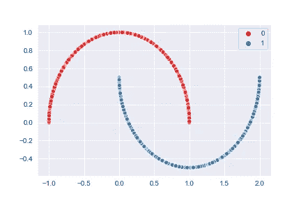**

**非线性数据(图片由作者提供)**

**我们可以清楚地看到，上述两类非线性数据无法通过画一条直线来区分。**

**让我们对上述数据同时执行 PCA 和内核 PCA，看看会发生什么！**

**等到加载 python 代码！**

**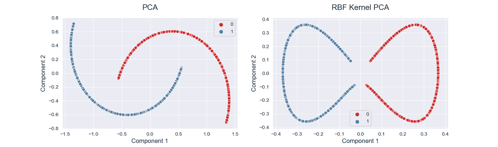**

**(图片由作者提供)**

**从上图可以看出，普通的 PCA 无法将非线性数据转换成线性形式。对相同的数据应用核主成分分析后，两个类线性分离得很好(现在，可以通过画一条垂直的直线来划分类)。**

**这里，原始数据的维数为 2，绘制的数据的维数也为 2。那么，核 PCA 真的降低了数据的维数吗？答案是**“是”**因为 RBF 核函数临时将二维数据投影到一个新的高维特征空间中，在该空间中，类变得可线性分离，然后算法将该高维数据投影回二维数据中，该二维数据可绘制成 2D 图。当类变得线性可分时，降维过程在幕后发生。**

**使用核 PCA 进行维数缩减的一个限制是，我们必须在运行算法之前为**超参数指定一个值。这需要实现超参数调谐技术，例如网格搜索，以找到 ***伽马*** 的最佳值。这超出了本文的范围。但是你可以通过阅读我的**[**用通俗易懂的英语解释的 k 重交叉验证**](/k-fold-cross-validation-explained-in-plain-english-659e33c0bc0)**来获得超参数调优过程的帮助。********

## ******t 分布随机邻居嵌入(t-SNE)******

******这也是一种主要用于数据可视化的非线性降维方法。除此之外，它还广泛应用于图像处理和自然语言处理。如果数据集中的要素数量超过 50，Scikit-learn 文档建议您在 t-SNE 之前使用 PCA 或截断奇异值分解。以下是在 PCA 之后执行 t-SNE 的一般语法。此外，请注意，在 PCA 之前需要进行特征缩放。******

```
******from sklearn.decomposition import PCA
from sklearn.manifold import TSNE
from sklearn.preprocessing import StandardScalersc = StandardScaler()
X_scaled = sc.fit_transform(X)pca = PCA()
X_pca = pca.fit_transform(X_scaled)tsne = TSNE()
X_tsne = tsne.fit_transform(X_pca)******
```

******使用 Scikit-learn 管道可以简化上述代码。******

```
******from sklearn.pipeline import Pipeline
from sklearn.decomposition import PCA
from sklearn.manifold import TSNE
from sklearn.preprocessing import StandardScalersc = StandardScaler()
pca = PCA()
tsne = TSNE()tsne_after_pca = Pipeline([
    ('std_scaler', sc),
    ('pca', pca),
    ('tsne', tsne)
])X_tsne = tsne_after_pca.fit_transform(X)******
```

******现在，我们将 t-SNE 应用于虹膜数据集。它只有 4 个特点。因此，我们不需要在 SNE 霸王龙之前运行 PCA。******

******等到加载 python 代码！******

******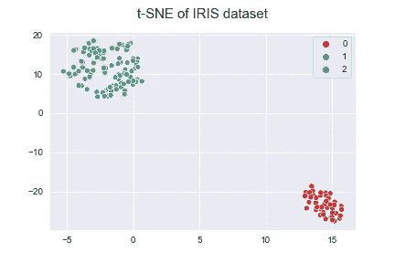******

******(图片由作者提供)******

## ******多维标度(MDS)******

******MDA 是另一种非线性降维技术，它试图保留实例之间的距离，同时降低非线性数据的维度。有两种类型的 MDS 算法:公制和非公制。Scikit-learn 中的 **MDS()** 类通过将 ***公制*** 超参数设置为 True(对于公制类型)或 False(对于非公制类型)来实现这两者。******

******以下代码实现了对 Iris 数据集的 MDS。******

******等到加载 python 代码！******

******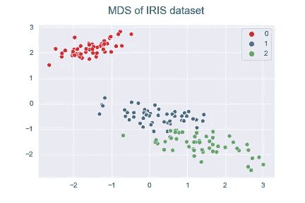******

******(图片由作者提供)******

## ******等距映射******

******该方法通过等距映射进行非线性降维。它是 MDS 或内核 PCA 的扩展。它通过计算*曲线*或*测地线*到其最近邻居的距离来连接每个实例，并减少维度。可以通过实现 Scikit-learn 中 Isomap 算法的 **Isomap()** 类的 **n_neighbors** 超参数来指定每个点要考虑的邻居数量。******

******下面的代码实现了 Iris 数据集的 Isomap。******

******等到加载 python 代码！******

******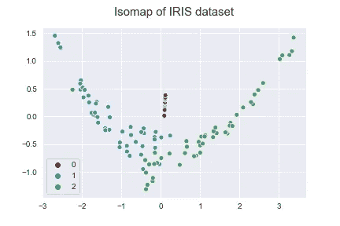******

******(图片由作者提供)******

# ******其他方法******

******在这一类别下，我们将讨论 3 种方法。这些方法仅保留数据集中最重要的特征，并移除冗余特征。因此，它们主要用于特征选择。但是，在选择最佳特征时，降维会自动发生！因此，它们也可以被认为是降维方法。这些方法将提高模型的精度分数，或提升高维数据集的性能。******

## ******反向消除******

******该方法通过递归要素消除(RFE)过程从数据集中消除(移除)要素。该算法首先尝试在数据集中的初始要素集上训练模型，并计算模型的性能(通常，分类模型的精度得分和回归模型的 RMSE)。然后，该算法一次丢弃一个特征(变量)，在剩余的特征上训练模型，并计算性能分数。该算法重复消除特征，直到它检测到模型的性能分数有小的(或没有)变化，并停止在那里！******

******在 Scikit-learn 中，可以通过使用**sk learn . feature _ selection**模块中的 **RFE()** 类来实现反向消除。该类的第一个参数应该是具有 **fit()** 方法和 **coef_** 或 **feature_importances_** 属性的 ***监督的*** ***学习估计器*** 。第二个应该是要选择的特性的数量。根据 Scikit-learn 文档，如果我们不指定要选择的特征数量，则选择一半的特征( **n_features_to_select** 参数)。这种方法的一个主要限制是我们不知道要选择的特征的数量。在这些情况下，最好通过为 **n_features_to_select** 指定不同的值来多次运行该算法。******

******现在，我们在虹膜数据上训练逻辑回归模型，并通过反向特征消除来识别最重要的特征。******

******等到加载 python 代码！******

******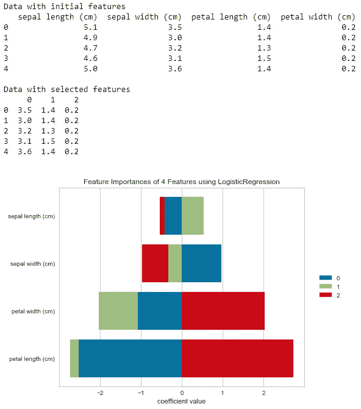******

******(图片由作者提供)******

******从输出中，我们可以看到递归特征消除(RFE)算法已经从逻辑回归模型中消除了**萼片长度(cm)** 。**萼片长度(cm)** 是最不重要的特征。其余要素包含初始数据集中的原始值。如图所示，最好保留模型中的其他 3 个特征。******

## ******预选******

******这种方法可以认为是逆向淘汰的相反过程。该算法不是递归地消除要素，而是尝试针对数据集中的单个要素训练模型，并计算模型的性能(通常，分类模型的精度得分和回归模型的 RMSE)。然后，该算法一次添加(选择)一个特征(变量)，根据这些特征训练模型，并计算性能分数。该算法重复添加特征，直到它检测到模型的性能分数有小的(或没有)变化，并停止在那里！******

******在 Scikit-learn 中，没有用于前进特征选择的直接功能。相反，我们可以将 **f_regression** (用于回归任务)和 **f_classif** (用于分类任务)类与 **SelectKBest** 类一起使用。 **f_regression** 返回回归任务的标签/特征之间的 F 值。 **f_classif** 返回分类任务的标签/特征之间的方差分析 F 值。这些 F 值可用于特征选择过程。**选择测试**根据基于要素 F 值的最高分数自动选择要素。 **SelectKBest** 的 **score_func** 参数应指定为 ***f_classif*** 或 ***f_regression*** 。 **k** 参数定义了要选择的顶部特征的数量。******

******让我们对虹膜数据执行前向特征选择，并识别最重要的特征。******

******等到加载 python 代码！******

******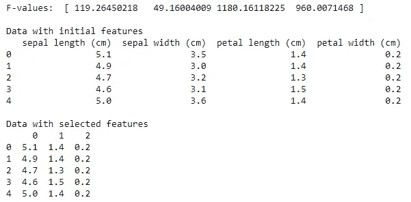******

******(图片由作者提供)******

******从输出中，我们可以看到正向特征选择过程选择了具有较高 F 值的**萼片长度(cm)** 、**花瓣长度(cm)** 和**花瓣宽度(cm)** 。******

******为了基于截止 F 值定义 **k** 参数的值，我们可以使用下面两行代码。******

```
******F_values = f_classif(X,y)[0]
k = len([num for num in F_values if num > 50])******
```

******这将计算大于 50 的 F 值的数量，并将其分配给 **k** 。这与上面的实现完全相同。******

## ******随机森林******

******随机森林是一种基于树的模型，广泛用于非线性数据的回归和分类任务。它还可以通过其内置的 **feature_importances_** 属性用于特征选择，该属性在训练模型时根据**‘Gini’**标准(内部节点分割质量的度量)计算每个特征的特征重要性分数。如果你有兴趣了解更多关于随机森林是如何进行预测的，你可以阅读我的“[随机森林——决策树的集合](/random-forests-an-ensemble-of-decision-trees-37a003084c6c)”文章。******

******以下 Python 代码实现了 Iris 数据的随机森林分类器，计算并可视化了要素重要性。******

******等到加载 python 代码！******

******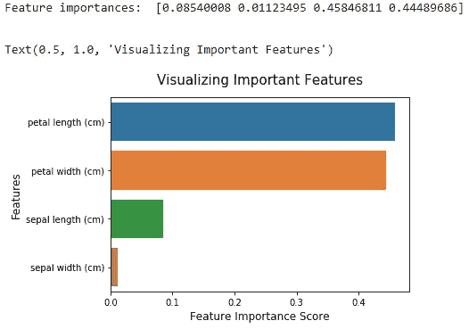******

******(图片由作者提供)******

******通过查看特征重要性，我们可以决定放弃**萼片宽度(cm)** 特征，因为它对制作模型的贡献不足。让我们看看如何！******

******等到加载 python 代码！******

******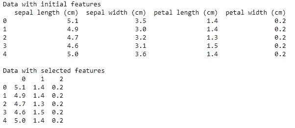******

******(图片由作者提供)******

******sci kit-learn**SelectFromModel**仅选择重要性大于或等于指定阈值的特征。由 **SelectFromModel** 返回的值可以用作随机森林分类器的新输入 X，该分类器现在仅在所选特征上被训练！******

```
******rf = RandomForestClassifier(n_estimators=100, max_depth=3,
                            bootstrap=True, n_jobs=-1,
                            random_state=0)rf.fit(features_important, y)******
```

******今天的帖子到此结束。我的读者可以通过下面的链接注册成为会员，以获得我写的每个故事的全部信息，我将收到你的一部分会员费。******

******【https://rukshanpramoditha.medium.com/membership】报名链接:******

******非常感谢你一直以来的支持！下一个故事再见。祝大家学习愉快！******

******特别感谢 Unsplash 上的**卡尼·贝内迪克托娃**，为我提供了这篇文章的精美封面图片。******

******[鲁克山普拉莫迪塔](https://medium.com/u/f90a3bb1d400?source=post_page-----dcb9500d388b--------------------------------)
**2021–04–14********