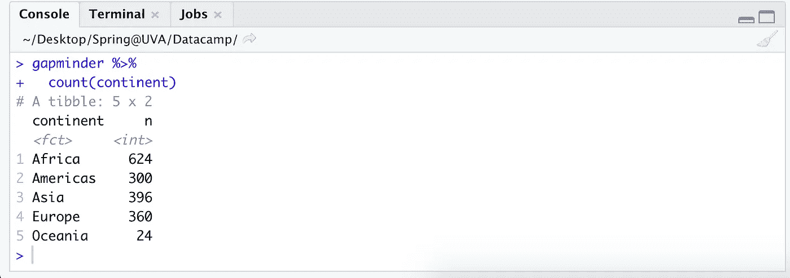
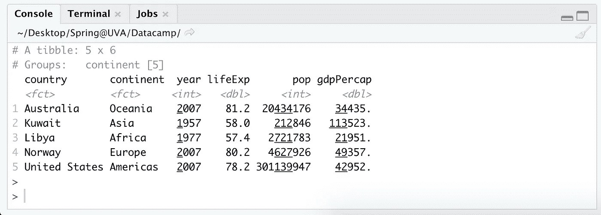

# 11 Dplyr 函数，现在就开始在 R

> 原文：<https://towardsdatascience.com/11-dplyr-functions-to-start-using-right-now-in-r-b3d83dd538e4?source=collection_archive---------20----------------------->

## 大幅提高您的数据处理效率


沃克·芬顿在 Unsplash[拍摄的照片](https://unsplash.com/s/photos/jumping?utm_source=unsplash&utm_medium=referral&utm_content=creditCopyText)

作为一名大学新生，当我的人生目标仍然是成为一名炙手可热的外交官或联合国大使时，我和一个穿着我们学校颜色的技术人员一起乘坐优步回到了我的大学，他碰巧住在离我宿舍几个街区的地方。我尽可能地和他闲聊，询问了他的生活，发现他是一名刚刚从工程专业毕业的多米诺骨牌公司的数据科学家。

“哦，太酷了……你最常用的是什么，呃，包裹？”我说，我为自己记住了暗语中的“包裹”而感到自豪。

“大部分是 Dplyr。”

“听起来……很有趣。”我说，点点头，低头看着我的手。在那之后，我试图想出一些问题来问他关于比萨饼的事情，比如他是否会终身免费获得比萨饼，以及他是否相信对奶酪上瘾是可能的，但相反，他只是看着窗外，继续用手玩了三十分钟。最后，我给了他我的号码，这样他就可以问我要我的那一半，但就像那个拼车的震耳欲聋的沉默一样，我再也没有收到他的后续短信(希望他不要在工作时看 TDS，哈哈)。

所以现在我在这里，仍然害怕四年前和一个不知名的陌生人一起坐车。但是也许，仅仅是也许，如果你和一个认识 Dplyr 的陌生人卡在一辆车里，你可以用这篇文章的内容进行对话。然后，我亲爱的读者，你将不会花四年的时间去想 Dplyr 是什么，实现你的旧梦想不再，自学如何编码，在全球疫情毕业，在研究生院探索一个全新的领域，最终成为一名数据科学家，并以 TDS 文章的形式重温最初的尴尬对话。

好吧，但说真的，Dplyr 非常酷(独一无二的[哈德利·威克姆](https://www.rstudio.com/speakers/hadley-wickham/)的又一项伟大发明)。就范围而言，Dplyr 是 R，就像 Pandas 是 Python 一样，但是这两种语言也与 SQL 有很强的相似性。如果你发现自己非常依赖 base R，那么 Dplyr 的`%>%`可能会更有效、更直观地为你解决许多日常数据争论任务。

在我开始讨论您现在需要开始实施的顶级功能之前，我们应该先讨论一下房间里的一头大象…

# **%>%**操作员

*本文的替代名称:* ***什么是$@ & %是% > %操作符？***


作者插图

%>% ( **读作:“管道”**)是 R 中的一个操作符，它将之前的内容输入到之后的内容中。这一点很重要，因为管道操作符可以按顺序用于将许多层命令链接在一起。因此，总是从他们希望修改的数据集开始，接着是另一个管道，然后是修改器。可以添加无限数量的修改器，但是必须用管道将它们分开才能工作。对我来说，我喜欢把 Dplyr 中的`%>%`想象成类似于熊猫中的`.`。或者，如果 *x* 表示基础数据集，那么一个`%>%`就好比把 *x* 放入函数 *f(x)* ，两层是 *g(f(x))* ，三层是*h(g(f(x))*，以此类推。

*像食人魔和洋葱一样，管道也有层次。【GIPHY 的 GIF*

下面是 Pandas vs. Dplyr 重命名两个列的例子。依我拙见，Dplyr 实际上在可读性方面领先一点:

```
# pandas
df.rename(columns={'old_name1': 'new_name1', 
                   'old_name2': 'new_name2'}, inplace=True)
--------------------------------------------------------------------
# dplyr 
df %>%
  rename(new_name1 = old_name1, 
         new_name2 = old_name2)
```

这里有一些将多个管道链接在一起的例子，可以进行无限次:

```
# in order to follow along, run these: 
library(tidyverse) 
library(gapminder)# one pipe 
gapminder %>%
  select(country, continent, year, pop)# two pipes
gapminder %>%
  select(country, continent, year, pop) %>%
  rename(population = pop)# three pipes
gapminder %>%
  select(country, continent, year, pop) %>%
  rename(population = pop) %>%
  filter(year > 1985)# four pipes
gapminder %>%
  select(country, continent, year, pop) %>%
  rename(population = pop) %>%
  filter(year > 1985) %>%
  arrange(desc(population)) # for the last, notice that we say "arrange(desc(population))" because in step two it was renamed from "pop". 
```

现在我们已经解决了这个问题，我们可以开始深入函数本身了！

# #1:描述数据

**glimpse():** 返回 1) # rows，2) # cols，3)每列的数据类型，以及 4)前 10 个左右的条目(取决于屏幕上的空间)。相应的熊猫功能我会把它等同于`df.describe()`。

```
library(tidyverse) 
library(gapminder)gapminder %>%
  glimpse()
```

# #2:按一列或多列排序

**arrange():** 关注数据有时会非常有益，所以我们使用`arrange()`来按升序或降序排列各个列。这与 SQL 中的`ORDER BY`子句或 Pandas 中的`df.sort_values()`非常相似。

```
# sort ascending (default)
gapminder %>% 
  arrange(lifeExp)# sort descending 
gapminder %>% 
  arrange(desc(lifeExp))# sort on multiple columns
gapminder %>% 
  arrange(lifeExp, pop, country)
```

# #3 和 4:数据选择

**select()，transforme():**`select()`函数只对原始数据集的指定列进行快照。类似地，`transmute()`以同样的方式工作，并具有同时创建新列的额外能力。这两个函数的工作方式与 SQL 中的`SELECT`子句非常相似。

如果您只是希望从数据框架中拉出未动过的列，我会坚持使用 select，而如果您要进行转换，则使用 transmute。在下面的例子中，我们有变量`gdpPercap`和`pop`，我们正在创建一个新的`gdp`列。

```
gapminder %>%
  select(country, continent, year, pop)gapminder %>%
  transmute(country, continent, gdp = gdpPercap * pop)
```

select 还有一些更高级的选项，可以帮助您准确地获得所需的列，包括一串连接的列或所有包含、开始或结束于某些字符的列:

```
# advanced select() tools# 1\. rename variables with select() 
gapminder %>%
  select(country, continent, population = pop)# 2\. Include a string of columns at once with ':'
gapminder %>%
  select(country, year, lifeExp:gdpPercap)# 3\. Include any column with a given string 
gapminder %>%
  select(country, year, contains("gdp"))# 4\. Include any column starting with a given string 
gapminder %>%
  select(country, year, starts_with("co"))# 5\. Include any column ending with a given string
gapminder %>%
  select(country, year, ends_with("Exp"))# Keep the last column, by any name
gapminder %>%
  select(country, year, last_col())
```

# #4 和 5:重命名/修改单个列

**rename()，mutate():** 这些函数修改一个或多个列，并将它们保存回文件。顾名思义，`rename()`用于重命名，而`mutate()`则完全通过转换创建一个新函数。

有了`rename()`和`mutate()`，我们可以用逗号一次表示多个修改。Dplyr 中的重命名类似于使用`df.rename()`，变异类似于 Python 中使用的`df[new_col] = df[old_col1] * df[old_col2]`。

```
# rename a column to be called something else
gapminder %>%
  rename(population = pop,       #ex. 'pop' turns into 'population'
         countries  = country, 
         life_expectancy = lifeExp)# add a new calculated field
gapminder %>%
  mutate(gdp = gdpPercap * pop)  #ex. 'gdp' is created as a new var
```

# #6:根据条件过滤数据

**filter():** 类似于 SQL 中的 WHERE 子句或者 Python 中的条件表达式(`df[df['country'] == 'France']`)。与其他 Dplyr 函数类似，可以通过用`,`、`&`或`|`符号分隔每个参数来指定多个过滤器。对于字符串，建议使用`%in%`而不是`==`。

```
# filter for France
gapminder %>% 
  filter(country %in% "France")# filter for a subset of countries (c stands for 'concat')
gapminder %>% 
  select(pop, country, year) %>%      
  filter(country %in% c('France','Spain','Portugal'))# "or" operator function
gapminder %>% 
  select(pop, country, year) %>%        
  filter(pop > 50000 | pop < 100000)# "and" operator function 1 
gapminder %>% 
  select(pop, country, year) %>%        
  filter(pop > 50000, pop < 100000)# "and" operator function 2
gapminder %>% 
  select(pop, country, year) %>%        
  filter(pop > 50000 & pop < 100000)
```

# #7-9:取最大值、最小值、平均值、计数&任何中间值

**count()、summarize()和 top_n(k，)**

`count()`函数遍历数据集，并计算一个值在给定的一列或多列中出现的次数。我经常使用它一次查看一列，例如了解我正在查看的每个洲有多少个国家，或者一个城市中有多少人开车、骑自行车或乘公交车上班。

```
gapminder %>%
  count(continent)
```



使用 summarize，我们可以查看聚合函数，如列的 sum、median、mean、standard deviation、variance、min 和 max，并为其命名。当与类似`group_by()`的函数混合使用时，这些函数在理解数据集中的子群体时会变得非常有用。

```
# summarize 
# sum(), mean(), median(), min(), max(), sd(), var()gapminder %>%
  summarize(total_gdp = sum(gdpPercap))gapminder %>%
  summarize(avg_gdp = mean(gdpPercap))gapminder %>%
  summarize(gdp_standard_dev = sd(gdpPercap))gapminder %>%
  summarize(gdp_variance = var(gdpPercap))# we can also create many columns at oncegapminder %>%
  summarize(max_gdp = max(gdpPercap),
            total_pop = sum(pop), 
            min_lifeExp = min(lifeExp))# I use __ = __ in order to give a name to the new summary columns, # but it is not required.
```

最后，我们可以使用`top_n(k, )`只保留数据帧或组中的前 *k* 值。例如，我们可以看看下面每个大陆人均 GDP 最高的国家。如果我们没有首先包含`group_by()`函数，那么结果将是世界上人均 GDP 最高的国家，即科威特。类似地，如果我们指定了 *k=4* ，那么它会显示出每个大洲预期寿命最高的前四个国家。

```
# top_n(k, )gapminder %>% 
  group_by(continent) %>% 
  top_n(1, gdpPercap)
```



# #10 和 11:分组依据

**group _ by()&ungroup():**和所有的编程语言一样，如果没有一个好的 group by 函数，我们会怎样？与列出的其他函数结合使用，我们可以得出关于数据集中存在的子群体的有趣结论。该功能与 Pandas `df.group_by()`或 SQL 的`GROUP BY`中的功能相同，除了这些组将保持不变，直到您再次手动断开它们与`ungroup()`的连接。

```
# Using group_by
gapminder %>%      
  group_by(year) %>%                    
  mutate(year_total = sum(pop))# Grouping and then ungrouping again with ungroup()
gapminder %>%      
  group_by(year) %>%                    
  mutate(year_total = sum(pop)) %>%      
  ungroup() %>%                          
  mutate(fraction = pop / year_total)
```

# 结论

总之，我希望这篇介绍能让你明白 Dplyr 与 SQL 和 Pandas 有很强的相似性。如果关于数据转换的某些东西让你犯了错误，Dplyr 在效率和可读性方面很强——并且在互联网上有大量的[备忘单](https://www.rstudio.com/resources/cheatsheets/)和[教程](https://learn.datacamp.com/courses/data-manipulation-with-dplyr)为你提供！

如果你喜欢这篇关于与 Dplyr 的数据争论的文章，请鼓掌或评论让我知道——如果有足够的兴趣，那么我将做第 2 部分，在那里我将回顾 Dplyr 中更复杂的命令，并可能在这个过程中发现我过去更尴尬的故事。🙃

敬哈雷·韦翰，万物的创造者。说真的，我们什么时候让他成为我们的最高统治者了？

* *编辑:基地 R 终究是要拿烟斗的！链接:[https://www.youtube.com/watch?v=wmvjxb6Gdm8](https://www.youtube.com/watch?v=wmvjxb6Gdm8)

# 我喜欢的推荐信

1.  [https://learn . data camp . com/courses/data-manipulation-with-dplyr](https://learn.datacamp.com/courses/data-manipulation-with-dplyr)
2.  [https://www.rstudio.com/resources/cheatsheets/](https://www.rstudio.com/resources/cheatsheets/)
3.  【https://appsilon.com/pandas-vs-dplyr/】
4.  [https://analyticsindiamag . com/python-pandas-vs-RS-tidy verse-who-wins/](https://analyticsindiamag.com/pythons-pandas-vs-rs-tidyverse-who-wins/)
5.  [https://www . Reddit . com/r/data science/comments/d9qom 4/whats _ pandas _ missing _ that _ tidy verse _ provides/](https://www.reddit.com/r/datascience/comments/d9qom4/whats_pandas_missing_that_tidyverse_provides/)