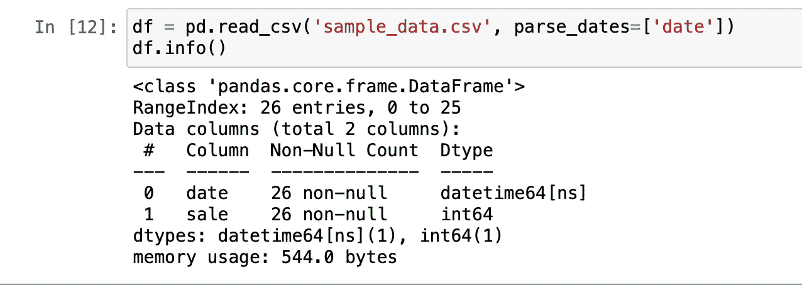

# 揭开熊猫约会神秘面纱的 11 个基本技巧

> 原文：<https://towardsdatascience.com/11-essential-tricks-to-demystify-dates-in-pandas-8644ec591cf1?source=collection_archive---------19----------------------->

## 使用 Python 简化日期处理的简易指南，包括 csv 文件内外。


双关:p .照片由 [Raissa Lara Lütolf (-Fasel)](https://unsplash.com/@etvoilaraissa?utm_source=medium&utm_medium=referral) 在 [Unsplash](https://unsplash.com?utm_source=medium&utm_medium=referral) 上拍摄

管理日期时间特性在几乎所有的数据科学中都很常见。幸运的是，熊猫通过无数有用的功能广泛地支持它。

在从我们的 csv 文件导入数据时解析和驯服日期列是一项有趣而又令人畏惧的任务，我打算在一个简单易懂的教程中向您介绍这个解决方案。

那就别磨蹭了。我们开始吧👇

# 日期格式基础

日期和时间的表示法是国际标准中被表示为*格式的 ISO 8601。在这里，日期，例如 2021 年 12 月 25 日，将被写成:`“2021–12–25”`。*

*一般来说，用 pandas 解析日期列的最简单和最普通的方法是在读取文件时通过**指定它。***

```
*df = pd.read_csv('sample_data.csv')
df.head()*
```

**

*样本数据的前五行*

*使用默认的`read_csv()`函数将 ***日期*** 列读取为**对象**数据类型:*

**

*日期的对象数据类型，不是我们想要的，是吗？*

*指定`**parse_dates**`参数有助于我们对所需的列进行日期解析:*

```
*df = pd.read_csv('sample_data.csv', parse_dates=['date'])*
```

**

*解析日期！*

*让我们感受一下日期是如何被解析的，好吗？*

**

*看看现在 ISO 格式的日期！*

*这是非常方便的！*

*但是直接这么做也有不好的一面。*

***请记住，只有当日期已经以 ISO 格式显示时，这才有效，***

***或***

***如果日期格式为:年/月/日或年/月/日。***

*然而，在某个特定国家以外的地方，情况并不总是如此。因此，我们在这里需要更加小心。*

*我们继续下一节，了解更多其他情况。*

# *用指定格式解析日期*

*大多数时候，我们从数据中导入的日期与熊猫的首选格式有很大不同。所以我们强制它在解析日期列时遵守一个规则。*

*首先导入数据:*

**

*然后，给出您知道的数据格式:*

**

*在这里，我指定了格式: `“%d/%m/%Y”`，因为我知道文件中的日期是这种格式。`“%m/%d/%Y”`月初将去，以此类推。*

*你可以在 Python 网站的这里阅读所有类型的格式符号[。](https://docs.python.org/3/library/datetime.html#strftime-and-strptime-format-codes)*

# *使用 dayfirst 符号快捷方式*

*我认为这是一种捷径，因为它是前一种方法的简化版本。*

*如果我们想让熊猫先考虑**天而不是**，我们可以将参数`dayfirst`设置为`True`。这通常在那个国家之外是有效的，但是确保首先检查你的数据。*

**

*世界其他地方的 dayfirst 通常是正确的。*

# *使用日期作为更好的选择、聚合和分组的索引*

```
*df = df.set_index(['date'])*
```

**

## *从今以后，选择一个日期范围将会非常方便。*

```
*df.loc[start_date:end_date]*
```

**

*通过索引选择日期比使用列更容易*

*比较函数也以同样的方式运行:*

```
*df.loc[df.index < '03-05-2019']*
```

*选择一年并获取汇总:*

```
*df.loc['2019'].sum()*
```

*如果您的索引没有排序，请使用以下方法进行排序:*

```
*df.sort_index()*
```

*诸如此类。应用函数的可能性只和你的想象力一样有限(当然还有熊猫文档:)！*

# *分解日期，反之亦然*

*到目前为止，我们已经看到了如何使用日期来选择行，将它们用作索引，并以特定的格式解析它。现在，我们可以看到如何从一个日期以及相反的日期获得年、月和日的信息。*

***例如，**如果你有这样一个数据:*

```
 *year month day0   2019    1   11   2019    1   22   2019    1   3*
```

*您可以轻松地将这三列合并为一列:*

```
*df = pd.read_csv('sample_data.csv', parse_dates= {"date" : ["year","month","day"]}, keep_date_col=True)*
```

*其中，年、月和日是文件中单独的列名。如果您想要一个自定义名称，而不仅仅是' *date* '，您可以在这里指定它。*

***因此，作为反例**，如果我们想获得*日、月、年*的单独列，我们可以这样做:*

```
*df['year']= df['date'].dt.year
df['month']= df['date'].dt.month
df['day']= df['date'].dt.day*
```

**

# *使用日期范围*

*通常，您需要生成一组新的日期，以便以后制作系列或数据帧。使用`**pd.date_range()**`功能可以轻松实现:*

**

*您还可以指定**周期**，这意味着要生成的实例数量以及生成日期的**频率**。*

*举个例子，*

```
*pd.date_range(start='1/1/2019', end='2/01/2019', freq='W')*
```

*将生成从开始日期到结束日期的每周日期:*

**

*每周日期生成*

# *进行日期偏移*

*你曾经需要给日期加上或减去几周/几天/几个月来得到新的日期吗？*

*嗯，熊猫也有这样的功能。*

**

*你也可以在那里使用**天、周或年**，还有许多其他的。完整列表见文档。*

# *日期转换*

*您可能希望*移动*或*滞后*时间序列中的值。这个用例的功能是`**shift()**`。*

**

*你可以看到，正如我们所希望的那样，日期推迟了两周。*

*你可以很好地结合使用**偏移**和**移位**函数，用你的时间序列做一些巧妙的事情！*

# *日期重采样*

*数据科学中最重要的数据操作之一是不同日期频率之间的转换。*

***让我们举一个例子。**假设我们有一个商店的*日期索引**日销售额的时间序列数据:**

```
**range = pd.date_range("1/1/2019", periods=28, freq="D")df = pd.Series(np.random.randint(0, 500, len(range)), index=range)**
```

****

**我们的日常时间序列是这样的！**

**现在，我们想对此进行重新采样，以获得每周的总销售数据。这可以通过**重采样**功能轻松实现。**

```
**df.resample('W').sum()**
```

****

**重新取样为每周**

**我们已经成功地将每日数据转换为每周数据！**

**但是，请注意它是如何通过将一周的第一天作为周日来自动重新采样的？您可能希望今天是**星期一**(这在大多数真实世界的数据中是正常的)，所以执行这个小修正:**

```
**df.resample('W-MON').sum()**
```

****

**以星期一为一周的开始！**

**类似地，你也可以根据需要使用一周中的其他日子——W-TUE、W-星期五等等。**

**唷。有太多要理解的了。**

**我希望你仍然和我在一起。:)我保证我们快到终点了。**

# **寻找丢失的日期**

**通常，我们需要在表中找到缺失的数据行。即使对于日期索引，这也很简单:**

**如果我们的数据帧看起来像这样:**

****

**正常 df**

**我们可以像这样搜索丢失的日期:**

```
**missing_dates = df.index[~df.index.isin(range)]
missing_dates**
```

**其中，我们的**范围** =开始日期和结束日期之间的索引的日期范围。例如，它可以这样定义，考虑到您的数据在您自己的用例中的表现:**

```
**range = pd.date_range("1/4/2019", "4/1/2019", freq="W")**
```

# **最后——找到最近的日期**

```
**df.index.get_loc(dt, method=“nearest”)**
```

**它返回最近日期的索引号到 **dt:****

****

**离“dt”最近的日期**

**你也可以这样得到确切的日期:**

****

**返回准确的最近日期**

# **结束…**

**这些是熊猫的日期/时间序列操作，我总是觉得有用，并在工作中不断查找。我希望这篇文章对你也有用。**

> **你可以把它作为参考，或者像我一样，作为处理熊猫日期的一个小备忘单。**

**接下来，这里是了解熊猫日期时间功能的最佳来源。这是最全面的指南，也是最好的，因为它直接来自原始资料。**

**我每周都写关于数据科学的文章，并努力让我的读者也觉得有趣！[在 Medium 上关注我](https://medium.com/@ipom),在你的 feed 中直接获得新文章。:)**

***或者更好的是，你还可以订阅* [*我的每月/双周简讯*](https://yashprakash.substack.com) *让自己随时掌握最新动态！***

**本文中的代码都打包在一个 Jupyter 笔记本中。这里是我所有文章的代码和资源。快乐学习！⭐️**

**我的其他文章也可能对你有用:**

**</26-datasets-for-your-data-science-projects-658601590a4c>  </how-to-use-bash-to-automate-the-boring-stuff-for-data-science-d447cd23fffe> **