# 你应该知道的 11 个熊猫内置函数

> 原文：<https://towardsdatascience.com/11-pandas-built-in-functions-you-should-know-1cf1783c2b9?source=collection_archive---------13----------------------->

## 不需要编写额外的代码—只需使用它们


[理查德·克拉克](https://unsplash.com/@clarky_523?utm_source=medium&utm_medium=referral)在 [Unsplash](https://unsplash.com?utm_source=medium&utm_medium=referral) 上拍照

我用熊猫已经有几年了，每次我觉得我打字太多，我就谷歌一下这个操作，我通常会找到一个更短的方法来做这件事——**一个新的熊猫技巧！**

我最近了解了这些功能，我认为它们很重要，因为它们很容易使用。

通过阅读这篇文章，你将学会:

1.  如何从数据帧中检索列值
2.  如何更改数据框架中的列值
3.  向数据框架添加新列的正确方法
4.  如何检索系列或数据帧
5.  如何从熊猫系列创建数据框架
6.  带 between 函数的过滤器
7.  使用 reindex 函数修复行的顺序
8.  描述函数的高级用法
9.  使用正则表达式进行文本搜索
10.  比熊猫的记忆数据集还要大
11.  如何节省磁盘空间

# 我们开始吧


[布拉登·科拉姆](https://unsplash.com/@bradencollum?utm_source=medium&utm_medium=referral)在 [Unsplash](https://unsplash.com?utm_source=medium&utm_medium=referral) 上拍摄的照片

让我们创建一个简单的数据框架来展示这些技巧:

```
import pandas as pddf = pd.DataFrame({"col1": ["A0", "A1", "A0", "A2", "A0", "A1"]})
```

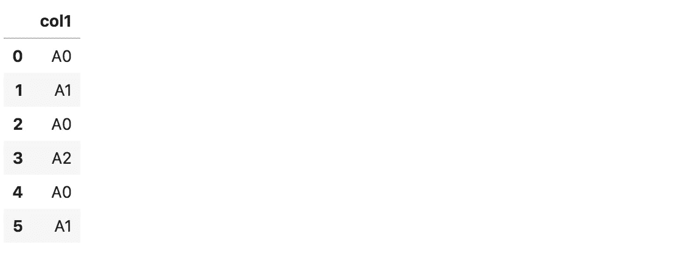

样本数据框(图片由作者制作)

# 1.如何从数据帧中检索列值

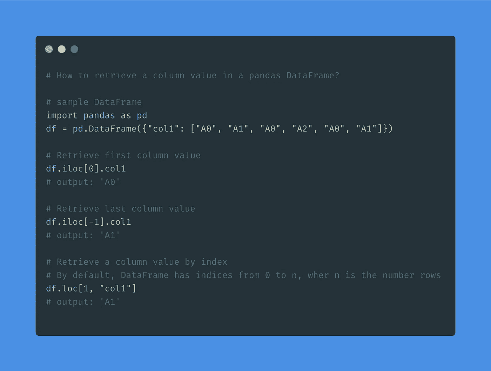

如何从 Dataframe(作者制作的图片)中获取列值

从数据帧中检索列值有两种方法:

*   基于整数位置索引(iloc)，
*   基于标签索引(loc)。

要检索 col1 列的第一列值(整数位置索引):

```
df.iloc[0].col1# output: 'A0'
```

要检索最后一列值:

```
df.iloc[-1].col1# output: ‘A1’
```

您也可以使用标签检索列值。默认情况下，pandas 数据帧具有从 0 到 n 的索引，其中 n 是数据帧中的行数。

```
df.loc[1, “col1”]# output: ‘A1’
```

参见 pandas 文档以了解更多关于 [loc](https://pandas.pydata.org/pandas-docs/stable/reference/api/pandas.DataFrame.loc.html) 和 [iloc](https://pandas.pydata.org/pandas-docs/stable/reference/api/pandas.DataFrame.iloc.html) 功能的信息。

# 2.如何更改数据框架中的列值

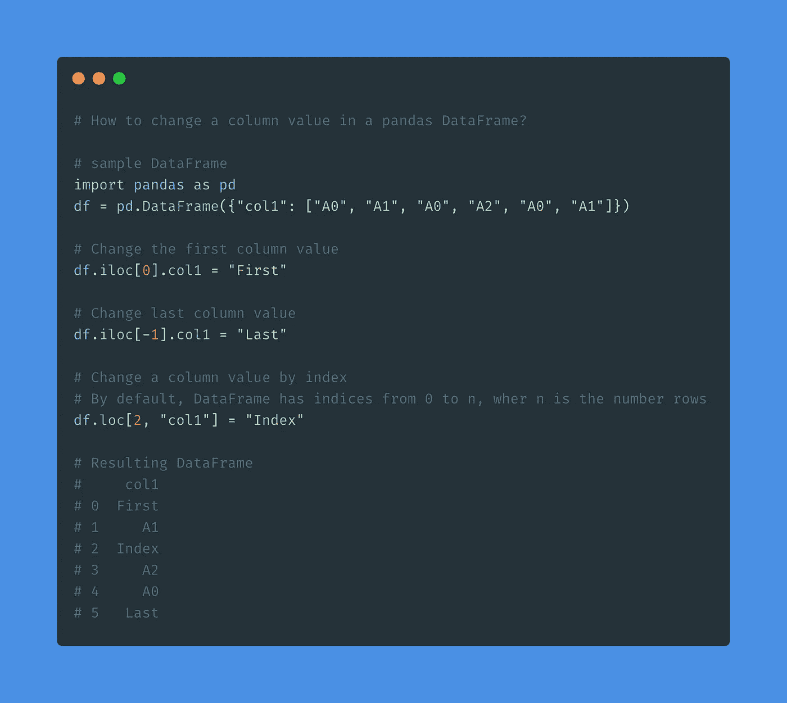

如何更改 Dataframe 中的列值(图片由作者制作)

与上面的示例类似，您可以使用 loc 和 iloc 函数更改列的值。您使用哪一个取决于您是否有行的整数位置(iloc)或行的标签(loc)。

要根据整数位置更改第一列的值:

```
df.iloc[0].col1 = “First”
```

要根据整数位置更改最后一列的值:

```
df.iloc[-1].col1 = “Last”
```

要按标签更改列值:

```
df.loc[2, “col1”] = “Index”
```

通过应用这些更改，我们得到以下数据帧:

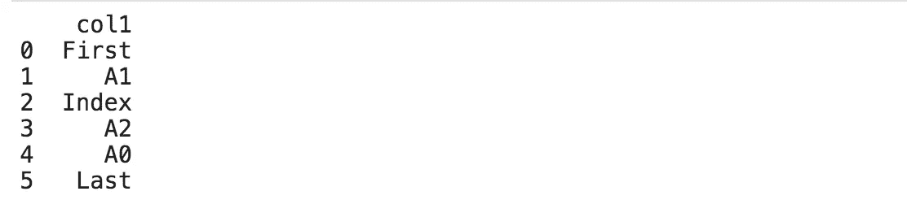

输出数据帧(图片由作者制作)

# 3.向数据框架添加新列的正确方法

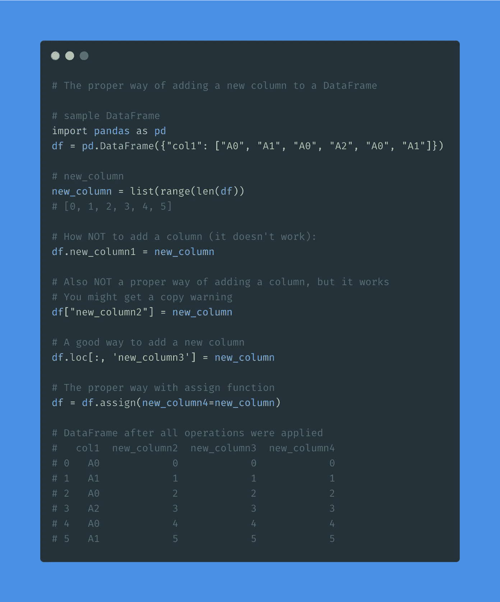

向数据框添加新列的正确方法(图片由作者制作)

假设我们想将一个整数列表作为一列添加到我们的数据帧中。

```
new_column = list(range(len(df))
new_column# output: [0, 1, 2, 3, 4, 5]
```

如何不添加列(不起作用):

```
df.new_column1 = new_column
```

这也不是添加列的正确方式，但它是有效的。您可能会收到复制警告。

```
df["new_column2"] = new_column
```

添加新列的好方法是:

```
df.loc[:, ‘new_column3’] = new_column
```

正确的方式:

```
df = df.assign(new_column4=new_column)
```

assign 函数还将一个索引作为参数，我们可以用它来定义列中行的顺序。

您可能想在 assign 函数中添加 inplace=True 参数，以便在适当的位置添加一个新列，但这是行不通的。赋值函数也将添加就地列。

```
# This will add two columns
df.assign(new_column4=new_column, inplace=True)
```

这实际上是赋值函数的另一个好处。您可以同时添加多个列。

参见 pandas 文档，了解更多关于[分配](https://pandas.pydata.org/pandas-docs/stable/reference/api/pandas.DataFrame.assign.html)功能的信息。

# 4.如何检索系列或数据帧

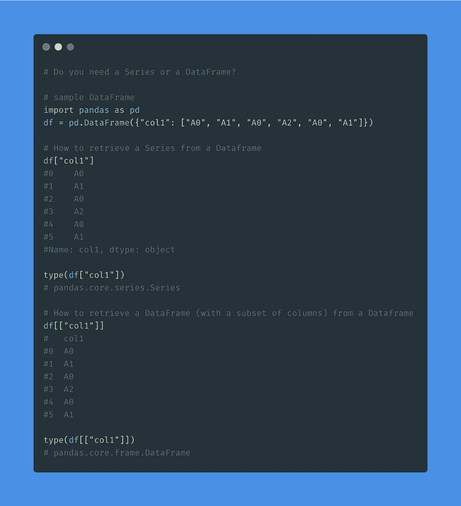

你需要一个系列还是一个数据框架？(图片由作者制作)

在 pandas 数据帧中使用方括号时，它返回:

*   如果使用单方括号，则为一个系列
*   如果使用双方括号，则为数据帧。

让我们看一个例子。

**如何从数据帧中检索系列？**

```
df["col1"]
```

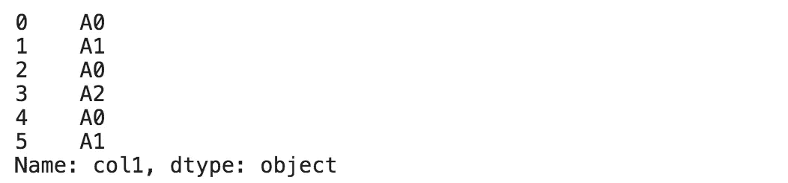

这是一个熊猫系列(图片由作者制作)

```
type(df["col1"])# pandas.core.series.Series
```

**如何从数据帧中检索数据帧(包含列的子集)？**

```
df[["col1"]]
```

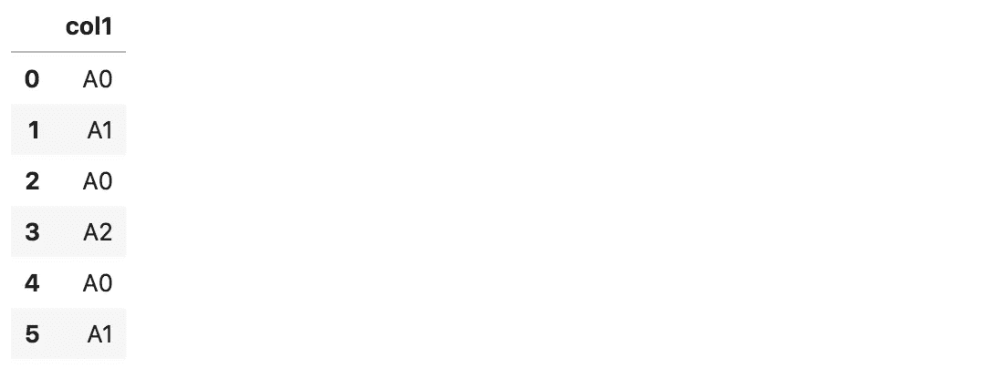

这是一个熊猫的数据框(图片由作者制作)

```
type(df[["col1"]])# pandas.core.frame.DataFrame
```

# 5.如何从熊猫系列创建数据框架

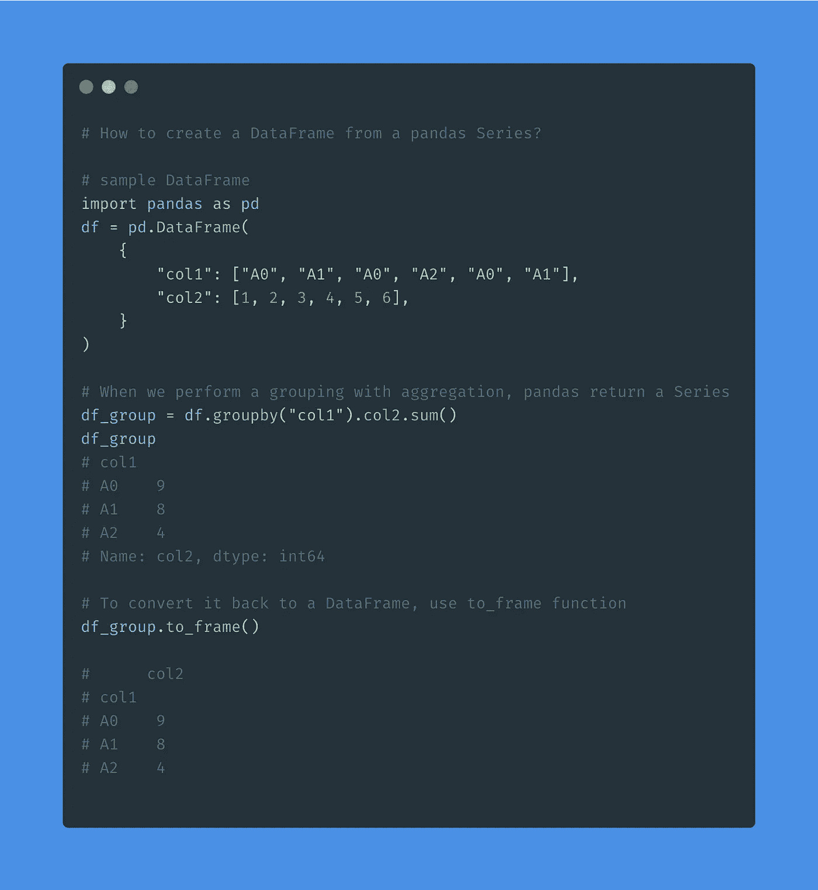

熊猫系列数据框(图片由作者制作)

当执行带有聚合的分组时，pandas 返回一个序列。将序列转换回数据帧的最简单方法是什么？

让我们看一个例子:

```
df = pd.DataFrame(
    {
        "col1": ["A0", "A1", "A0", "A2", "A0", "A1"],
        "col2": [1, 2, 3, 4, 5, 6],
    }
)df_group = df.groupby("col1").col2.sum()
df_group
```

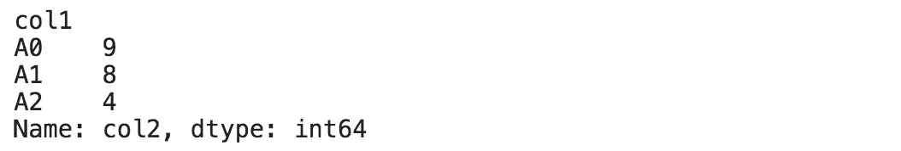

df_group 是一个系列。

系列具有 to_frame 功能，可将系列转换回数据帧:

```
df_group.to_frame()
```

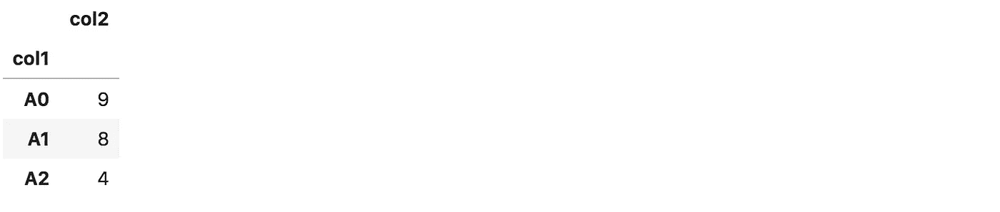

参见 pandas 文档，了解更多关于 [to_frame](https://pandas.pydata.org/pandas-docs/stable/reference/api/pandas.Series.to_frame.html) 函数的信息。

# 6.带 between 函数的过滤器


照片由[马太·亨利](https://unsplash.com/@matthewhenry?utm_source=medium&utm_medium=referral)在 [Unsplash](https://unsplash.com?utm_source=medium&utm_medium=referral) 上拍摄

我在 SQL 中使用“between”函数已经很多年了，但是我最近才在 pandas 中发现它。

假设我们有一个包含价格的数据框架，我们想过滤 2 到 4 之间的价格。

```
df = pd.DataFrame({'price': [1.99, 3, 5, 0.5, 3.5, 5.5, 3.9]})
```

使用 between 函数，您可以减少这种过滤:

```
df[(df.price >= 2) & (df.price <= 4)]
```

对此:

```
df[df.price.between(2, 4)]
```

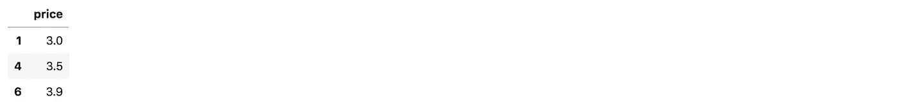

用 between 函数过滤数据帧(图片由作者制作)

这可能看起来不多，但在编写许多过滤器时，这些括号很烦人。带有 between 函数的过滤器可读性也更好。

> 功能组之间的间隔在功能之间的左侧<= series <= right.

See pandas, documentation to learn more about [。](https://pandas.pydata.org/pandas-docs/stable/reference/api/pandas.Series.between.html)

# 7.使用 reindex 函数修复行的顺序


[NeONBRAND](https://unsplash.com/@neonbrand?utm_source=medium&utm_medium=referral) 在 [Unsplash](https://unsplash.com?utm_source=medium&utm_medium=referral) 上的照片

reindex 函数使系列或数据帧符合新的索引。当生成包含具有预定义顺序的列的报表时，我求助于 reindex 函数。

让我们将 T 恤衫的尺寸添加到我们的数据框架中。分析的目标是计算每个尺码的平均价格:

```
df = pd.DataFrame({'price': [1.99, 3, 5], 'size': ['medium', 'large', 'small']})df_avg = df.groupby('size').price.mean()
df_avg
```

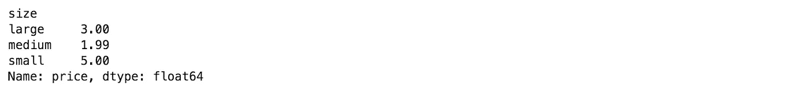

每个尺寸的平均价格(图片由作者制作)

上表中的尺寸随机排列。应该是这样排序的:小号，中号，大号。因为大小是字符串，所以我们不能使用 sort_values 函数。重新索引功能来拯救我们了:

```
df_avg.reindex(['small', 'medium', 'large'])
```

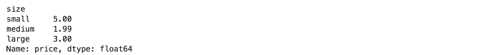

重新索引一个数据帧(图片由作者制作)

> 通过在 reindex 函数中指定大小的顺序，使得结果表更容易解释。

参见 pandas，文档以了解更多关于 [reindex 函数](https://pandas.pydata.org/pandas-docs/stable/reference/api/pandas.DataFrame.reindex.html)的信息。

# 8.描述类固醇


托马斯·凯利在 [Unsplash](https://unsplash.com?utm_source=medium&utm_medium=referral) 上拍摄的照片

描述函数是进行探索性数据分析的基本工具。它显示数据帧中所有列的基本汇总统计信息。

```
df.price.describe()
```

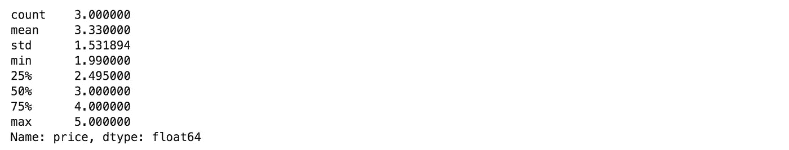

describe 的基本用法(图片由作者制作)

如果我们想计算 10 个分位数而不是 3 个分位数呢？

```
df.price.describe(percentiles=np.arange(0, 1, 0.1))
```

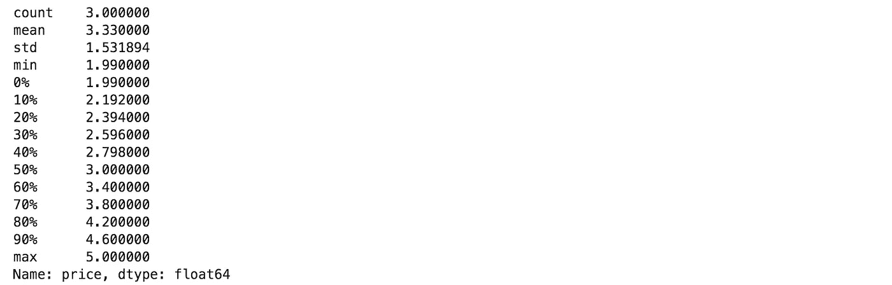

用百分位数描述(图片由作者制作)

描述函数采用百分位数参数。我们可以用 NumPy 的 arange 函数指定百分位数，以避免手工输入每个百分位数。

当与 group by 函数结合使用时，此功能变得非常有用:

```
df.groupby('size').describe(percentiles=np.arange(0, 1, 0.1))
```

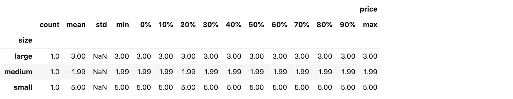

用 Group by(图片由作者制作)描述

参见 pandas，文档以了解更多关于[描述功能](https://pandas.pydata.org/pandas-docs/stable/reference/api/pandas.DataFrame.describe.html)的信息。

# 9.使用正则表达式进行文本搜索


马库斯·温克勒在 [Unsplash](https://unsplash.com?utm_source=medium&utm_medium=referral) 上的照片

我们的 t 恤数据集有 3 个尺寸。假设我们想要过滤中小型尺寸。一种繁琐的过滤方式是:

```
df[(df['size'] == 'small') | (df['size'] == 'medium')]
```

这很糟糕，因为我们通常将它与其他过滤器结合在一起，这使得表达式不可读。有没有更好的办法？

pandas 字符串列有一个“str”访问器，它实现了许多简化字符串操作的功能。其中一个是“包含”函数，支持正则表达式搜索。

```
df[df['size'].str.contains('small|medium')]
```

> 具有“包含”功能的过滤器可读性更强，更易于扩展和与其他过滤器结合。

看熊猫，文档了解更多[包含功能](https://pandas.pydata.org/pandas-docs/stable/reference/api/pandas.Series.str.contains.html)。

# 10.比熊猫的记忆数据集还要大


由[马库斯·斯皮斯克](https://unsplash.com/@markusspiske?utm_source=medium&utm_medium=referral)在 [Unsplash](https://unsplash.com?utm_source=medium&utm_medium=referral) 上拍摄

熊猫甚至不能读取比主内存数据集更大的数据。它抛出一个内存错误或 Jupyter 内核崩溃。但是要处理一个大数据集，你不需要 Dask 或 Vaex。你只需要一些独创性。听起来好得难以置信？

如果您错过了我关于 Dask 和 Vaex 使用大于主内存数据集的文章:

</are-you-still-using-pandas-to-process-big-data-in-2021-850ab26ad919>  

进行分析时，通常不需要数据集中的所有行或所有列。

在一种情况下，您不需要所有行，您可以分块读取数据集并过滤不必要的行以减少内存使用:

```
iter_csv = pd.read_csv('dataset.csv', iterator=True, chunksize=1000)
df = pd.concat([chunk[chunk['field'] > constant] for chunk in iter_csv])
```

> 分块读取数据集比一次全部读取要慢。我建议只对大于内存的数据集使用这种方法。

在一种情况下，您不需要所有的列，您可以在读取数据集时使用“usecols”参数指定必需的列:

```
df = pd.read_csv('file.csv', u*secols=['col1', 'col2'])*
```

> 这两种方法的伟大之处在于，您可以将它们结合起来。

# 11.如何节省磁盘空间


帕特里克·林登伯格在 [Unsplash](https://unsplash.com?utm_source=medium&utm_medium=referral) 上拍摄的照片

当处理多个数据科学项目时，您通常会从不同的实验中获得许多预处理数据集。笔记本电脑上的小型固态硬盘很快就会变得杂乱无章。

Pandas 使我们能够在保存数据集时对其进行压缩，然后以压缩格式读回。

让我们用随机数创建一个大熊猫数据框架。

```
import numpy as npdf **=** pd**.**DataFrame(np**.**random**.**randn(50000,300))
```

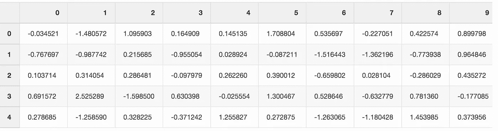

带有随机数的数据框(图片由作者制作)

当我们将这个文件保存为 CSV 格式时，它会占用硬盘上将近 300 MB 的空间。

```
df**.**to_csv('random_data.csv', index**=**False)
```

我们可以通过使用 gz 扩展名而不是 csv 将文件大小减少到 136 MB。

```
df**.**to_csv('random_data.gz', index**=**False)
```

我们不会失去任何功能，因为将 gzipped 数据读入 DataFrame 也很容易。

```
df **=** pd**.**read_csv('random_data.gz')
```

# 摘要


[Zoltan·塔斯](https://unsplash.com/@zoltantasi?utm_source=medium&utm_medium=referral)在 [Unsplash](https://unsplash.com?utm_source=medium&utm_medium=referral) 上的照片

在本文中，我列出了 11 个我每天用来处理数据和执行分析的 pandas 函数。

我相信你已经见过其中的一些了，但是也许你用错了方法。一个很好的例子是在 DataFrame 中设置一个新列。

熊猫有多种方式来实现同一个目标——一些比另一些更正确。从长远来看，使用熊猫偏好的方法会给你带来更少的问题。

> 以防万一总是好的

# 在你走之前

```
- [Correlation Analysis 101 in Python](https://dataanalysis.substack.com/p/correlation-analysis-101-in-python) [Article]- [50% Off All AI Nanodegree Programs!](https://imp.i115008.net/c/2402645/998478/11298) [Course]- [Data Science for Business Leaders](https://imp.i115008.net/c/2402645/880006/11298) [Course]- [Free skill tests for Data Scientists & Machine Learning Engineers](https://aigents.co/skills)
```

*上面的一些链接是附属链接，如果你通过它们进行购买，我会赚取佣金。请记住，我链接课程是因为它们的质量，而不是因为我从你的购买中获得的佣金。*

在 [Twitter](https://twitter.com/romanorac) 上关注我，在那里我定期[发布关于数据科学和机器学习的](https://twitter.com/romanorac/status/1328952374447267843)消息。


照片由[Courtney hedge](https://unsplash.com/@cmhedger?utm_source=medium&utm_medium=referral)在 [Unsplash](https://unsplash.com/?utm_source=medium&utm_medium=referral) 拍摄